# Design Document: Enterprise Agent Framework

## Overview

The Enterprise Agent Framework is a multi-tenant, horizontally scalable agentic platform. It draws on production context-engineering lessons (Manus) and the enterprise MCP gateway topology, and is intended to grow along **two independent scaling axes**:

1. **Tenant scale** — serving many customers on shared infrastructure with strict isolation, per-tenant policy, quotas, and cost accounting.
2. **Capability scale** — adding more agents, tools, and task classifications without the combinatorial blow-up that a single flat orchestration graph produces.

The platform does **not** abandon LangGraph. Instead of one giant graph where every node is an agent and a central router touches every classification, LangGraph is used as the **per-sub-agent execution substrate** — each sub-agent is a small, self-contained graph. Scaling is solved with **architectural layering** (Gateway → Orchestrator → Tool Pools) and **context isolation** (each sub-agent gets a clean, minimal context window), not by growing one monolithic graph.

The design is deliberately opinionated. It records architecture **decisions** as ADR-style entries so the team can "stick to the principles" as the system evolves. The governing principles are drawn from the research grounding below and are treated as invariants of the platform.

### Guiding Principles (Invariants)

These principles are referenced throughout the document and MUST hold across all future changes:

- **P1 — KV-cache hit rate is the north-star cost metric.** Cached vs uncached input tokens differ by roughly an order of magnitude. Every prompt-assembly decision optimizes for cache reuse.
- **P2 — Append-only, stable-prefix context.** The stable prefix (system prompt, tool definitions, few-shot) never mutates within a session; volatile content is appended at the tail. No per-second timestamps in the prefix. Deterministic JSON key ordering.
- **P3 — Tools are stable; capability is gated by masking, not mutation.** Never dynamically add/remove tool definitions at runtime. Use logit/allowlist masking per state. Consistent tool-name prefixes (`browser_*`, `db_*`, `file_*`) so a family masks with one prefix. Core toolset stays small (~<20 atomic tools).
- **P4 — External memory over lossy summarization.** Large tool outputs are offloaded to an object store / filesystem; context keeps only a restorable reference (path/URL). The agent re-fetches on demand.
- **P5 — Context isolation is why multi-agent works.** Sub-agents receive clean context windows and minimal handoffs; results return through a structured submit-results tool with constrained decoding.
- **P6 — Failures are always durably recorded; only a distilled lesson is carried into a retry context.** Three scopes, three behaviours: retrying the *same step* keeps the error **verbatim** in context (the model needs the exact failure to fix the call); re-attempting the *task* spawns a fresh executor with a clean context carrying a **distilled failure lesson**, not accumulated failed trajectories; re-*planning* gives the planner a failure **summary**, never the raw trajectory. Failures are never silently swallowed — they are always preserved in the durable trajectory record for evals, audit, and RL — but "keep errors in context" is not a licence to accumulate wreckage across attempts (§2.13). PII is still masked at every scope.
- **P7 — Guardrails are a pipeline, not a detector.** Input rails run pre-LLM; output rails run post-LLM; retrieved content is also scanned. PII is redacted before data leaves the corporate boundary.
- **P8 — Observability is the substrate for everything.** Trajectory logging, token accounting, KV-cache hit rate, and distributed tracing are first-class. RL and evaluation are built on top of this data.
- **P9 — Loop first, graph last.** The default unit of work is one agentic loop with a goal and a quality bar. A declarative graph is added only when the work forces it (distinct specialties, per-step model/toolset differences, fan-out/fan-in, auditable routing, failure isolation, read-only review). Many thin nodes that could collapse into one loop is an anti-pattern.
- **P10 — No self-modifying behaviour without an eval gate.** Automated prompt/behaviour optimization is versioned, threshold-gated, canaried, and rollback-able. Nothing auto-applies to production.
- **P11 — Working memory and knowledge retrieval are different subsystems.** The sandbox filesystem/object store is agent *working memory*; RAG/GraphRAG is *enterprise knowledge retrieval*. They are never conflated or merged into one abstraction.
- **P12 — Capability is added by skills and tools, not by arbitrary pipeline configuration.** A new *procedure* over existing tools is a **skill** — a versioned artifact with a manifest, a body, and its own eval cases, and no platform code. A new way to *touch the outside world* is a **tool**, shipped as an MCP server; the only code is inside that server. Infrastructure (vector store, graph store, buckets, indexes) is owned by whatever declaratively owns resource lifecycle in the environment — **Docker Compose locally, Terraform in cloud** (ADR-019, §2.11) — never by config files. The narrow typed config surface that remains covers chunking and embeddings only. Everything else is code.
- **P15 — Extension follows a strict ladder: skill → tool → sub-graph.** Try them in that order and stop at the first that works. Skills cost a folder; tools cost code in one MCP server; a sub-graph costs code plus a justification against the ADR-012 forcing functions. A sub-graph is invoked by the parent **as a tool**, so capability scale never grows the parent's topology (§2.12).
- **P13 — Storage is tiered by access pattern.** POSIX scratch, session-durable objects, cheap archive, and hot state are four different jobs and four different stores. No single store is asked to do all four.
- **P14 — Delivery is phased.** Every capability carries a phase assignment (§8). A thin vertical slice through all layers precedes a complete build of any layer.
- **P16 — Local first; the environment is a config choice, never a code path.** The platform develops on Docker Compose with pinned images for every backing service, and cloud infrastructure is earned at an explicit checkpoint rather than assumed (ADR-019, §4). **One exemption, and only one: the model provider.** All model calls go to AWS Bedrock in every environment including local, because CPU inference on a laptop distorts latency measurement and no frontier-class model runs locally anyway (ADR-011). The *interface* rule still holds — code calls the model proxy, never a provider SDK — so this exempts the deployment rule, not the seam. Application code never knows which environment it is in: every backing service sits behind an interface whose implementation is selected by config, so swapping a local image for a managed service is **a config change and never a code change**. Anything reachable only through one vendor's API is a migration cliff and needs its own ADR accepting the lock-in.

### Where the Platform Actually Runs Today

**Local, on Docker Compose. There is no cloud *deployment* — but there are cloud *dependencies* (ADR-019).** Most backing services are pinned container images on a developer machine; a small named set is consumed as real AWS services even locally, starting with Bedrock for every model call (ADR-011). So local development needs an AWS account, credentials, and a spend budget, and it does not work offline. CI is three gates — lint/format and vulnerability scanning — and nothing more. The AWS design in §5 is the **eventual** target and is **not built**; it activates only when the **cloud readiness checkpoint** in §8 passes, reviewed after every three features with **stay local** as the default answer.

This is a sequencing decision, not an architectural one. Every ADR below describes the platform's *shape* — layering, context engineering, skills, retry scoping, classification, storage tiering — and none of them is a statement about hosting. What the local-first decision adds is a hard portability rule (P16): the environment is a config choice, never a code path.

P16 holds with one honest amendment: for the services we **consume** from AWS locally, the portability seam is a **credential and endpoint config**, not an image swap — there is no local substitute to swap to. The interface rule is intact (application code calls the model proxy, never Bedrock directly); what is exempted is the "runs as a local container" rule. The set of such services is named in ADR-019 and capped by a stated test, so it does not grow silently.

### Document Structure

This document is organized around the required deliverables plus three closing sections:

1. **Architecture Decisions** — ADR-style records (decision, context, rationale, consequences, alternatives).
2. **High-Level Architecture** — component and flow diagrams (framework components only), human-in-the-loop, failures/escalations, guardrails, PII.
3. **Low-Level Architecture** — data contracts between components, the access-policy model (user authn at L1, agent authn plus tool authz plus user RBAC at L3), interaction mechanics, and an end-to-end single-request walkthrough.
4. **Service Selection and Local-First Development** — *current state*: every service with its rationale and accepted tradeoff, the known local/cloud gap table, the local Compose topology and profiles, and the three CI gates that are actually wired up.
5. **AWS Deployment & Evaluation** — ***future state, not built***: deployment topology, LangSmith evaluation, DeepEval automated testing, the target CI/CD pipeline, and the scaling model. Gated by the checkpoint in §8. (LangSmith and DeepEval are the exception — both work from local development today.)
6. **Correcting the Current LangGraph Architecture** — a direct assessment of the existing mega-graph approach and the migration path.
7. **Honest Tradeoffs & Counterarguments** — where this design is overkill, where the industry framing is marketing, where the recommended techniques can regress, and what local-first costs.
8. **Phased Delivery Plan** — Phase 0 (local foundation and service selection) plus six phases, exit criteria per phase, the **cloud readiness checkpoint**, and a capability → phase matrix covering every capability in this document.

Closing reference sections consolidate the material for reviewers: **Components and Interfaces**, **Data Models**, **Correctness Properties**, **Error Handling**, **Testing Strategy**, **Dependencies**, and **References**.

Operational standards live in steering rules rather than being duplicated here: `.kiro/steering/local-development.md` (portability rules, Compose conventions, known gaps), `.kiro/steering/git-workflow.md` (branching, commits, and the CI gate-growth path), and `.kiro/steering/kubernetes-operations.md` (**future state** — not an active review gate while the platform runs on Compose).

### Research Grounding and Attribution

The design is grounded in published production write-ups and papers rather than first-principles guesswork. Primary sources: the [Manus context-engineering lessons](https://manus.im/blog/Context-Engineering-for-AI-Agents-Lessons-from-Building-Manus), [Anthropic prompt caching](https://docs.anthropic.com/en/docs/build-with-claude/prompt-caching), the [Anthropic Agent Skills loading-system specification](https://anthropics-skills.mintlify.app/spec/loading-system), the [OpenClaw session-management and compaction internals](https://github.com/openclaw/openclaw/blob/main/docs/reference/session-management-compaction.md), [Microsoft GraphRAG](https://microsoft.github.io/graphrag/), [GEPA (reflective prompt evolution)](https://arxiv.org/abs/2507.19457), [NVIDIA NeMo Guardrails](https://docs.nvidia.com/nemo/guardrails/latest/index.html), [Microsoft Presidio](https://microsoft.github.io/presidio/), [Agent Lightning](https://www.microsoft.com/en-us/research/project/agent-lightning/), [LangSmith](https://docs.smith.langchain.com/), and [DeepEval](https://deepeval.com/docs/getting-started). Numbers quoted in this document come from those sources and are cited inline at the point of use.

> Content was rephrased for compliance with licensing restrictions.

### Terminology Hygiene (read this before §6)

Two similarly-named ideas appear in this document and must not be conflated:

| Term | Layer | What it means here |
| --- | --- | --- |
| **Graph engineering** | Execution topology | Declaring valid *paths* between agent steps and the checks between them (LangGraph `StateGraph`, AutoGen `GraphFlow`, Google ADK, A2A). Concerned with control flow. |
| **GraphRAG** | Data modeling | Extracting an entity/relationship knowledge graph from a corpus and building community summaries to answer multi-hop and global questions. Concerned with retrieval. |

They are orthogonal. A system can use a single agentic loop (no execution graph) and still use GraphRAG, and vice versa. Whenever "graph" appears below, it is qualified.

### The Five-Layer Cumulative Stack

Capability is added in this order, and each layer is only reached after the one below it is exhausted:

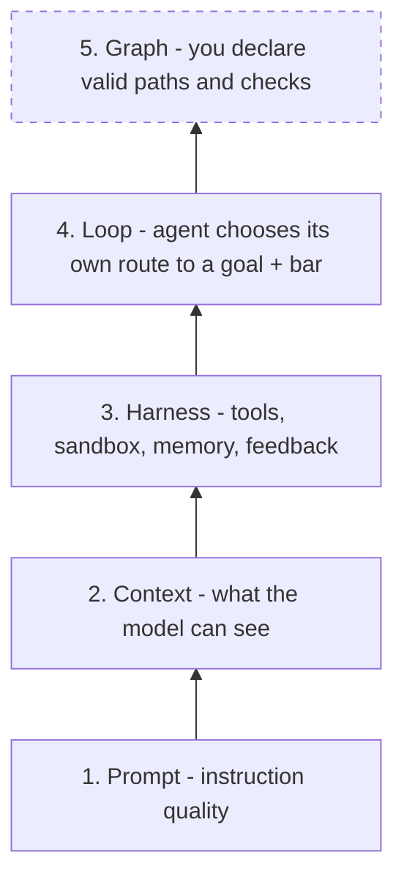

The graph layer is the **outermost** layer and the **last** one to reach for (P9). Most scaling pain that looks like "we need a bigger graph" is actually a harness or context problem one or two layers down. A useful diagnostic from the Manus write-up: swap in a stronger model — if results do not improve, the bottleneck is the harness, not the model or the topology.

### The Anchor Use Case: Legislation and Compliance Research Chatbot

Every capability in this document is justified against **one concrete scenario**, recorded here so that "is this feature needed" has an answer other than opinion. A design with no anchor use case produces infrastructure nobody asked for, and eval cases that measure nothing in particular.

**The scenario.** A compliance analyst holds a **conversation** with the platform: *"What are our director duties under the Companies Act? … and how did that change after the 2023 amendments? … does our internal delegation policy actually satisfy s.172?"* Multi-turn, each turn potentially pulling entire Acts and internal policy documents into play, and every answer required to cite the exact provision **and the version of it that was in force**.

**Three defining properties, and all three were chosen deliberately.**

1. **Tool outputs exceed the context window by design, on the first call.** Fetching a full Act is megabytes of structured XML. Not an edge case to degrade gracefully on — the normal case.
2. **The documents must be read whole, not merely searched.** "Does our policy satisfy this duty" is not a snippet-retrieval question. It requires the provision, its amendments, and the internal policy side by side.
3. **It is a chatbot.** Multi-turn conversation is what exercises session state, freshness, compaction across turns, cross-session memory, streaming, and the clarification exit — none of which a single-shot task touches.

**The data source is real, public, and free.** [legislation.gov.uk](https://www.legislation.gov.uk/) is operated by The National Archives with a **RESTful API using content negotiation**, giving access to the statute book *at various levels and for various times*. The base content format is **CLML XML**, with **Akoma Ntoso** available by appending `/data.akn`, plus HTML fragments and RDF. URIs are structured and predictable — `/{type}/{year}/{number}[/{section}]`. Official documentation is published at [legislation/data-documentation](https://github.com/legislation/data-documentation).

**Why this beats the alternatives considered.** Two earlier anchors were written and retired: a support-desk entitlement triage case (**too small a payload** — it left the entire external-memory and compaction stack unexercised) and a cloud cost investigation case (**good on payload size, but the data only becomes interesting as our own bill grows, and it needed credentialed access**). Legislation wins on four counts:

| Advantage | Detail |
| --- | --- |
| **Massive from request one** | No account to grow, no spend to accumulate, no credentials. A single Act is enormous immediately |
| **Zero privacy surface** | Public legislation under open licence. **No PII of any kind**, so ADR-009's regulated-data precondition is satisfied without contortion rather than by careful avoidance |
| **A genuine graph, not a contrived one** | Legislation is a citation and amendment network: an Act is amended by Statutory Instruments, each with commencement dates, some **prospective** ("changes that may be brought into force at a future date"). Answering "as at date X" is inherently multi-hop. This makes **GraphRAG (ADR-007) justified rather than aspirational** |
| **Groundedness is deterministically checkable** | A cited provision either exists and says that, or it does not. Eval cases become hard assertions instead of judgement calls — the single biggest weakness of most agent evaluation |

**What it exercises, claim by claim:**

| Architectural claim | What this use case makes real |
| --- | --- |
| **External memory over lossy summarization** (P4, ADR-006, ADR-016) | **Load-bearing on turn one.** An Act cannot be inlined, so offload to T1 with a restorable `Reference` is the only path by which the request completes. Property 9 stops being a nicety |
| **Level-3 skill scripts at zero context cost** (ADR-002b) | The strongest possible case for scripts over prose. Parsing CLML, resolving an amendment chain, extracting a provision at a date — all exact work, done by a script the model never reads |
| **Chunking as the one configurable surface** (ADR-015) | **CLML and Akoma Ntoso are deeply nested, and character-count chunking destroys provision boundaries.** Chunking must follow the document's own structure. This is the concrete justification for chunking being configurable while everything else is code |
| **Mid-turn precheck** (ADR-006 rule 6) | Fires constantly: a document lands and the prompt no longer fits before the next call |
| **Compaction tiers + memory flush** (ADR-006c) | A long research conversation accumulates conclusions across many turns. This is the long-horizon behaviour the design has so far only reasoned about |
| **Cross-session user memory** (ADR-020) | "I always work in the Scottish jurisdiction, cite OSCR guidance" is a durable user preference, which is exactly what `USER_PREFERENCE` is good at and what nothing else in the design covers |
| **The three freshness timestamps** (§2.10, Property 31) | A chatbot has idle sessions, resumed sessions, and background activity. The distinction between real interaction and system events becomes observable rather than theoretical |
| **Streaming vs output rails** | A chatbot must feel responsive while answers are still guardrail-checked. The buffered-answers, streamed-progress tension is forced into the open |
| **The `ask` exit** (§2.2) | **Legislative answers are date-dependent and jurisdiction-dependent.** "What does s.172 say" has no single correct answer without a date and a jurisdiction. A correct agent asks; a plausible-sounding one guesses |
| **Fan-out via sub-graph as a tool** (§2.12.1) | "Check each of the fourteen SIs that amended this Act" is natural fan-out, and the parent branch grows large enough that the **fork size cap actually triggers** (Property 30) |
| **Delegated user RBAC** (Property 32) | Public legislation is public — but the **tenant's internal policy corpus is not.** HR policy, board papers, and finance procedures are reachable by different roles. Same agent, same `search_policy` tool, different corpora per user |
| **HITL approval** (§2.4) | The write action is **publishing an entry to the tenant's obligation register** — a real compliance artifact that a firm does not let an agent write unreviewed |
| **`REROUTE`** (ADR-013) | A question about case law or about HMRC practice is not a statute question and belongs elsewhere |
| **Multi-tenancy** (ADR-010) | Several client organisations, each with their own internal policy corpus, their own jurisdiction defaults, and their own identity provider |

#### The data source in detail, and the constraints it imposes

Collected from the official [data documentation](https://legislation.github.io/data-documentation/), because several of these facts change the design rather than merely informing it.

**Scale, from the authoritative source.** The site holds **over 300,000 documents**, with "often many hundreds of ways users can view (sections of) each one" — and, decisively for this design, **some individual documents contain more than 10,000 pages worth of text** ([fair use policy](https://legislation.github.io/data-documentation/fair-use.html)). That is the offload justification stated by the publisher, not estimated by us.

**URI scheme.** Predictable and constructable, which means most lookups need no search step:

```
https://www.legislation.gov.uk/{type}/{year}/{number}[/{section}][/{authority}][/{extent}][/{version}]
https://www.legislation.gov.uk/id/{type}/{year}/{number}[/{section}]     # abstract identifier
https://www.legislation.gov.uk/id?title={title}                          # when the number is unknown
https://www.legislation.gov.uk/eur/2019/2013/2021-03-01/data.xml         # POINT IN TIME as a path segment
```

**The point-in-time date is part of the URI.** This is the single most useful fact for this use case: a revised version "as at" a date is directly addressable. So a citation can be a URI that **pins the version**, temporal answers are cacheable by construction, and Property 34 below is implementable rather than aspirational.

**Formats** ([overview](https://legislation.github.io/data-documentation/formats/overview.html)):

| Format | Suffix | Use here |
| --- | --- | --- |
| **CLML** — Crown Legislation Markup Language, against a published [schema](https://www.legislation.gov.uk/schema/legislation.xsd) | `data.xml` | Primary ingestion format. A published schema means a **Level-3 script can parse it deterministically** rather than a model interpreting it |
| **Akoma Ntoso** | `data.akn` | Alternative, less complex; the international standard |
| XHTML snippet / HTML5 | `data.htm`, `data.xht` / `data.html` | Not used for ingestion — presentational |
| PDF | `data.pdf` | Only where XML does not exist |
| **Atom** (feeds only) | `data.feed` | Listings, search results, effects, and the Publication Log |
| RDF/XML | `data.rdf` | Metadata graph |

**Fair use, which is a hard constraint and not a courtesy.** Four rules, each with a design consequence:

| Rule | Consequence for us |
| --- | --- |
| **3,000 requests per 5 minutes**, and **the limit applies to the user, not the IP address** — multiple IPs collectively exceeding it still counts as exceeding it | **This is a single global budget shared across every tenant.** A per-replica rate limiter is not merely insufficient, it is non-compliant: scaling out pods multiplies IPs against one shared allowance. Requires a **centrally shared token bucket** plus **per-tenant fair-share allocation**, or one tenant's research session starves all others. This is exactly the "rate limits in two places" argument in §3.2.4, with a third place added: a shared *upstream* budget |
| A **`User-Agent` identifying the bot with contact details** is mandatory; **anonymous user agents are grounds for blocking** | A compliance value in tool-pool configuration, asserted at startup. A deploy that drops it does not degrade — it gets the platform blocked |
| **`robots.txt` must be followed**, including `crawl-delay`; absent one, roughly 10 requests per 5–10 seconds | The conservative rate is ~1–2 req/s, far below the ceiling. Design for the *recommended* rate, not the limit |
| For bulk or one-off crawls, **use the feeds instead of crawling**, and contact them first | Backfill is a planned operation, not something to attempt casually |

**The Publication Log is the ingestion watermark, and this is a strong fit rather than a coincidence.** The [Publication Log](https://legislation.github.io/data-documentation/api/publication-log.html) is an Atom feed with one entry per publication, republication, or withdrawal, covering legislation, associated documents, Impact Assessments, and **changes to legislation (effects)**. It is filterable by date path segment, content type, document type, year, and number, and by query parameters including `event`, `format`, `language`, and `republished`.

That maps **directly** onto `sync_documents(config, since)` in §3.6.1: the feed *is* the `since` source, so the incremental sync design already has the right shape. Three traps in it, though:

1. **Pagination is fixed at 20 entries per page.** Combined with a ~1–2 req/s recommended rate, catch-up throughput is bounded. Incremental sync is comfortable; initial backfill is not, and must be planned.
2. **The `published` field may be absent** for resources first published before 5 July 2023, and `Republished: false` means only "not previously published on or after 5 July 2023." **A watermark keyed on `published` will silently skip older material.** Use `updated`.
3. **Effects are only ever "published", never "withdrawn" — but a publication of changes may delete existing effects.** So an idempotent upsert-on-publish sync **leaves deleted effects behind**, and stale amendments are the worst possible defect in this domain: they produce a confidently wrong legal answer. A changes publication must be treated as a **replace-set for that item**, not an upsert. This is Property 35.

**Two further shape facts that affect configuration.** Welsh legislation is **dual-language** (`en`/`cy`), with titles that can carry both languages in one XHTML element — so the corpus is multilingual and the embedding choice must cope. And CLML and Akoma Ntoso are **deeply nested**: character-count chunking severs provisions from their context, which is why chunking must follow the document's own structural boundaries (ADR-015).

**Unverified, to check before Phase 3.** A [community MCP server for legislation.gov.uk](https://lobehub.com/mcp/legislation-legislation-mcp-ts) appears to exist. If it is maintained and its provenance is sound, registering it as an AgentCore Gateway target is cheaper than writing our own tools — but it must be assessed for whether it honours the fair-use rules above, since a third-party server that crawls carelessly gets **our** user agent blocked.

#### The amendment graph is published data, not something we infer

**The question this answers:** bills are amended over decades — can we build a metadata graph and have the agent traverse it, then go and read only the documents that matter?

**Yes, and the important part is that we do not have to extract it.** legislation.gov.uk publishes an **[effects](https://legislation.github.io/data-documentation/model/effects.html)** model: when a provision amends another, editors record it as a structured effect. Each effect carries:

| Field | Why it matters here |
| --- | --- |
| **Effect type** | `inserted`, `words substituted`, `repealed`, `applied`, `modified` — a typed edge, not a generic "related to" |
| **Affecting provisions** / **Affected provisions** | The edge endpoints, at **provision** level rather than whole-Act level |
| **In force dates** | An amendment may come **wholly into force once, or partly into force many times** for specific geographic extents or purposes. So the edge is not a single date — it is a set of date-and-scope pairs |
| **Commencement authority** | The provision that determines *when* it commences, which is frequently a different instrument. This is why the graph is genuinely multi-hop |
| **Savings** | Provisions that qualify the effect's meaning, usually preserving prior meaning in some contexts. An answer that ignores savings can be textually right and legally wrong |
| **Extent and territorial application** | Of the affecting *and* the affected provision, **which may differ** |
| **Applied / requires-applied status** | See the trap below. Also tracked separately for Welsh text |
| **Effect ID and URI** | `/id/effect/{id}`, with `EffectId` on `<Effect>` and `<UnappliedEffect>` elements — so every edge is individually addressable and citable |

Effects are retrievable as Atom, including pairwise: `/changes/affected/{affected}/affecting/{affecting}/data.feed`.

**The consequence for ADR-007, stated sharply: where an authoritative graph exists, LLM extraction is a downgrade.** GraphRAG's entity-and-relationship extraction earns its place on corpora that have no published structure. Using it to *infer* amendment edges that the publisher already states would replace citable editorial fact with model output — in a domain where a hallucinated repeal is the worst thing the system could produce. So the platform runs **two graph layers with different provenance and different trust**:

| Layer | Source | Edges are | Used for |
| --- | --- | --- | --- |
| **Legislative graph** | Published effects data | **Authoritative.** Ingested, never inferred | Amendment chains, commencement, point-in-time reconstruction |
| **Tenant policy graph** | The tenant's internal policy corpus | **Inferred** by LLM extraction (ADR-007), because no published graph exists | Linking internal obligations to the provisions they implement |

**Ingestion strategy: lazy on first query, then stored permanently and kept fresh.** Three options were considered and the middle one wins on the rate limit alone:

| Strategy | Verdict |
| --- | --- |
| **Eager full ingest** — pull the whole effects graph up front | **Rejected.** Over 300,000 documents against a shared ~1–2 req/s recommended rate is a multi-day backfill before anything works at all, and the publisher explicitly asks to be contacted before large one-off crawls. It also front-loads work for a statute book that real questions barely touch |
| **Lazy on first query, stored permanently, kept fresh** | **Chosen.** The graph grows along the paths real questions take. Time-to-first-value is immediate, and the effects API is queryable *per affected item* (`/changes/affected/{item}/data.feed`), so inbound amendment edges for a provision are directly retrievable without having crawled whatever amended it |
| **Pure per-query fetch, nothing stored** | **Rejected.** Amendment data changes rarely and is consulted repeatedly; re-fetching it burns the shared rate budget on data that was already correct, and makes every conversation pay a latency tax the second user does not need to pay |

**What "stored permanently" must mean here, because the naive version is unsafe.** Effects can be **retracted** by a later publication (Property 35), so permanent storage without ongoing freshness is permanently *wrong* storage. Three requirements:

1. **Three-state provenance per item**, not two. Every item is `never_fetched`, `fetched_with_effects`, or `fetched_and_confirmed_empty` — with a timestamp. Collapsing the last two into "no rows" is the defect described in Property 36.
2. **Feed-driven invalidation for held items.** The Publication Log `changes` feed is watched, and any entry for an item we hold triggers a replace-set refresh. Volume is low, so the whole feed can be watched and irrelevant entries discarded.
3. **A staleness bound as a backstop.** If freshness for an item has not been confirmed within a defined window, it is stale — refresh before answering, or disclose. A missed poll must not turn into silently outdated law.

**How a query then runs — stored graph, on-the-fly projection, targeted fetch:**

1. **Resolve the seed** provision from the question.
2. **Depth-limited expansion** over the stored effects graph, filtered to the as-at date and extent — producing a small subgraph of *metadata only*. A frontier node that is `never_fetched` triggers a fetch **within the shared rate budget**.
3. **If the budget or depth limit stops the traversal, the answer says so.** A truncated traversal presented as complete is the worst outcome available here (Property 36).
4. **Fetch text for just the provisions the traversal identified**, at their point-in-time URIs, offloading each to T1 with a `Reference` (P4).
5. Answer from those, citing version-pinned URIs and the effect IDs relied on.

The ordering is what makes 10,000-page documents tractable: **the agent never scans documents to discover amendments** — it traverses cheap metadata to decide which few documents are worth reading. Large payloads are pulled deliberately and narrowly, not speculatively.

**The cost of choosing lazy, stated plainly.** Coverage becomes a function of query history rather than a known quantity, so "have we got everything about this Act" has no answer from the schema alone — it has to be asked of the provenance records. That is the price of not doing a multi-day backfill, and Property 36 is what stops it becoming a correctness problem rather than merely an operational one.

**Prior art — the answer to "has anyone proved this".** Yes, and on all three of the pieces this design depends on:

- **The pattern of a depth-limited subgraph around a seed Act is published and validated.** [Computational and Graph-Theoretic Analysis of Legislative Networks](https://www.mdpi.com/2078-2489/17/2/161/xml) builds focal legislative citation networks using exactly this depth-limited expansion, and reports a reason for it we would not otherwise have anticipated: it **avoids the global hub dominance** that swamps whole-corpus analysis. Widely-referenced Acts otherwise drown the signal, so seed-and-expand is not just cheaper, it is more informative.
- **Graph RAG adapted to legal norms with temporal versioning is an established approach.** [Graph RAG for Legal Norms: A Hierarchical, Temporal and Deterministic Approach](https://arxiv.org/abs/2505.00039) targets precisely this problem — hierarchical structure, dense cross-references, and continuous evolution through temporal versions — and concludes that the temporal dynamism **demands a deterministic representation of the law at a given point in time**. That is an independent statement of Property 34.
- **Point-in-time reconstruction from an event-centric amendment graph has been demonstrated end to end.** [An LRMoo-Based, Component-Level, Event-Centric Approach to Legal Knowledge Graphs](https://arxiv.org/html/2506.07853) formalizes amendments as events and demonstrates **exact reconstruction of any part of a legal text as it existed on a specific date**, using the Brazilian Constitution.
- Broader network-analytic work over statutes across time and jurisdictions ([Measuring Law Over Time](https://www.frontiersin.org/journals/physics/articles/10.3389/fphy.2021.658463/full)) and large-scale automatic citation-graph extraction at the scale of hundreds of millions of documents ([Ukrainian court decisions](https://arxiv.org/html/2605.15362v1)) establish that both the modelling and the scale are tractable.

> Sources were paraphrased; content was rephrased for compliance with licensing restrictions.

**The trap that this research does not save us from, and it is the sharpest one in the whole use case.** An effect carries an **"applied" / "requires applied"** status — meaning **an amendment can be in force but not yet applied to the published text**, which is why `<UnappliedEffect>` exists as a distinct element. Two consequences:

1. **The point-in-time text is not guaranteed to be the law as at that date.** Fetching `/2021-03-01/data.xml` gives the text as editorially revised, which may omit in-force amendments still awaiting application.
2. **Therefore a version-pinned citation is necessary but not sufficient.** An answer must also disclose outstanding unapplied effects for the provisions it relied on. Silence here produces the exact failure this domain punishes hardest: a fluent, correctly-cited, version-pinned answer that is nonetheless not the current law. This is clause 4 of Property 34.

Also note that the effects data deliberately **does not contain the amending text**, nor machine-readable instructions for applying it — it links to the amending provision so that a human can work it out. So the graph is for **navigation and disclosure**, never for synthesising amended text ourselves. Reconstructing provision text by applying effects with a model would be inventing law, and it is out of scope by design.

#### Actors and the permission matrix

The read/act asymmetry is the load-bearing part. Cognito groups map to `UserPrincipal.roles`, which resolve to `data_scopes` in the tenant policy bundle (ADR-020).

| User | Cognito group | Read cost data | Act on resources | Proves |
| --- | --- | --- | --- | --- |
| `alice.finops` | `finops-analyst` | **All** linked accounts | **Nothing** — read-only by role | Property 32 clause 3 in its most realistic form: the agent holds the remediation tool, this user does not hold the scope. Broad read plus zero write is the single most common real enterprise shape |
| `bob.owner` | `platform-owner` | Only their own accounts | Yes, **with approval**, within a cost ceiling | Happy path, and the approval gate on a financially committing action |
| `carol.other-tenant` | `tenant-b-analyst` | Only tenant B | No | Property 1 with a genuinely valid token |
| `svc.nightly` | `service-principal` | Read only | No | Property 32 clause 2 — no human behind the turn, explicit service principal rather than a null |

Note that `alice` has **wider read access and less write access** than `bob`. Access is not a single scalar level, so an implementation that collapses roles into a rank will pass a naive test and fail this one.

#### Tool inventory — real third-party systems, not stand-ins

**No stubbed services and no invented domain model.** The tools call real third-party APIs over the network, against accounts we own. This is a stronger choice than a seeded local database, and the reason is not idealism: a local stand-in cannot produce OAuth token expiry, real rate-limit responses, cursor pagination, provider-specific error taxonomies, idempotency semantics, partial failures, or latency variance — and those are the conditions the circuit breakers (ADR-003), retry scoping (§2.13), and the secrets resolver seam (ADR-019) exist to handle. Building against a stand-in means designing against conditions that do not occur.

| Tool | Real system behind it | Kind |
| --- | --- | --- |
| `billing_get_subscription` | **Stripe** — `Customer`, `Subscription`, `Price`, `Product` | Read |
| `billing_list_entitlements` | **Stripe** — [Active Entitlements API](https://docs.stripe.com/billing/entitlements) | Read |
| `entitlement_set_feature` | **Stripe** — attach/detach a [`product_feature`](https://docs.stripe.com/api/product-feature/attach) | **Write**, approval-gated |
| `ticket_get` / `ticket_add_note` | **A real issue tracker** (GitHub Issues, or Jira Service Management) | Read / Write |
| `search_policy` | Our corpus, ingested from **real published vendor pricing, plan, and terms pages** | Read |

**Stripe Billing Entitlements is not an analogue of this use case — it *is* this use case.** Features are created in Stripe, attached to products, and a customer subscribing to a product is entitled to that product's features. So "does this customer's plan include CSV export?" is a real API question with a real answer, and "enable it" is a real mutation. The domain model does not have to be invented, which also means we are not designing against a model of our own construction that flatters our assumptions.

Stripe **test mode is the real API** — same endpoints, same objects, same error semantics, same idempotency behaviour, with `sk_test_` credentials. That is the right level of real: genuine integration surface, no real money moving.

`entitlement_set_feature` must genuinely mutate the Stripe account. If the write is a no-op, neither the approval gate nor the Tier-1 denial proves anything — the test would pass against a system that silently does nothing.

#### Data provenance: what is real, and the one thing that cannot be

Being precise about this matters, because "use real data" and "use real systems" are different requests and only one of them is fully satisfiable.

| Layer | Provenance | Real? |
| --- | --- | --- |
| **APIs and integration surface** | Live Stripe and a live issue tracker, over the network, with real credentials | **Real** |
| **Plan and policy documents** | Real published pricing, plan-comparison, and terms pages from actual SaaS vendors, ingested through the real sync pipeline | **Real** — and genuinely ambiguous, which is the point |
| **Ticket text** | Real user-written issues from public trackers | **Real** — real typos, real wrong terminology, real multi-question tickets |
| **Customer and subscription records** | Created by us, in **our own** real Stripe account | Real objects in a real system; the *businesses* they describe are ours |

**The one thing that cannot be real is another company's customer list**, and that is a legal and privacy limit rather than a technical one. We have no tenant yet, so there is no production customer data we are entitled to hold — and ADR-009's binding precondition forbids regulated PII in the platform before Phase 6 regardless. Anyone reading this as a shortcut should note that using a real business's customer records here would be the single fastest way to turn a design decision into a compliance incident.

**Why real published policy documents matter more than the account records.** The hardest part of this use case is not looking up a subscription — it is deciding what a plan document actually entitles a customer to. Real pricing pages hedge, use inconsistent feature names between the comparison table and the terms, and leave cases genuinely uncovered. That ambiguity is what makes the `ask` exit necessary rather than decorative, and it is exactly what an invented policy document would have smoothed away.

**The account records still need specific shapes**, and they are created in Stripe rather than seeded into a table:

| Shape to create in Stripe | Exists to test |
| --- | --- |
| Customer on a product **with** the feature attached, provisioning not reflected | The in-plan defect path — enable it |
| Customer on a product **without** the feature | The upgrade path — do not enable, explain |
| Customer whose eligibility turns on **the policy document, not the API** | The conditional path |
| A case the published policy leaves **genuinely uncovered** | The `ask` exit |
| Two tenants with **different product catalogs and different vendor policy wording** | Tenant isolation, and why plan normalization cannot be hardcoded |
| A customer with a long subscription and invoice history | Offload to T1 and reference-based context (P4) |

Contact details on these customers are synthetic (`example.com`) — real systems do not require real people.

#### The cost of real integrations, and how CI survives it

This is the honest tradeoff, and it needs a decision rather than discovery:

- **Evals become network-dependent and non-deterministic.** Running every pull request against live Stripe and a live tracker makes CI slow, flaky, dependent on third-party uptime, and rate-limited.
- **The resolution: record once, replay in CI, and run live on a schedule.** Real interactions are captured and replayed deterministically in the per-PR gates; a scheduled job runs the same suite against the live APIs and fails loudly when reality has drifted from the recordings.
- **A recorded real response is not a mock**, and the distinction is worth holding onto: a mock encodes what we *assumed* the API returns, while a recording contains what it *did* return, including the fields and error shapes we did not anticipate. But recordings do go stale, which is precisely what the scheduled live run exists to catch — without it, replay quietly becomes a mock with extra steps.
- **Secrets, rate limits, and egress allowlists become real on day one.** This is a benefit rather than a cost: the secrets resolver seam, the per-pool egress allowlist, and the circuit breakers get exercised from the first feature instead of being designed on paper and validated after the cloud move.

#### The first skill

`entitlement_discrepancy_triage` — the first capability added to the platform, and it is added **as a skill, with no platform code**:

> Read the ticket. Identify the customer and the feature in question; if either is ambiguous, **ask**. Look up the subscription and current entitlements. Retrieve the plan policy for that plan. Decide between: in-plan defect, requires upgrade, trial-eligible, or out of scope for entitlement triage. State the policy clause relied upon. If a change is warranted and permitted, propose it for approval. Write a resolution note recording plan, entitlement state, decision, and the clause.

Deterministic sub-steps belong in a **Level-3 script** rather than prose — comparing an entitlement list against a plan's feature list is exact work, and a script does it at zero context cost and cannot be half-followed by a model.

#### Eval cases — the definition of done

These are the skill's own eval cases, and it cannot be promoted without passing them (ADR-002b, §5.5):

1. **Correct classification** across all four decision paths.
2. **Groundedness** — the cited clause actually supports the decision. A confident answer citing an unrelated clause is a failure, not a partial credit.
3. **Tier-1 denial** — `bob.narrow` triggers no entitlement write, and the denial arrives from the gateway rather than from the model declining.
4. **Approval enforced** — `alice.broad`'s billing-relevant change suspends for approval and applies **only** after it, with the database unchanged in the interim.
5. **Ambiguity is asked about, not guessed at** — the silent-policy fixture produces a question.
6. **Cross-tenant containment** — `carol.other-tenant` cannot read tenant A, with a valid token.
7. **Resolution note completeness** — plan, entitlement state, decision, clause. Deterministically checkable.

#### What this use case does not cover

Recorded because the gap should not be discovered later. Support tickets are **short**, so this scenario leaves the long-horizon machinery — full compaction tiers, the pre-compaction memory flush, silent turns, sub-graph delegation — **largely unexercised**. It also does not stress multi-hop graph traversal, since policy lookup is mostly single-hop.

That is an argument for a **second** use case, not against this one. A **quarterly account review** — one task spanning dozens of customers, accumulating findings — is the natural counterpart and would exercise exactly what this misses. The short case goes first because Phase 1's purpose is a complete vertical slice through every layer, and a short task reaches the end of the slice soonest. The honest consequence: the compaction design in ADR-006 remains a hypothesis for longer than the rest of the platform, which §7.11 already records as the cost of deferred validation.
---

## 1. Architecture Decisions (ADRs)

Each decision follows the format: **Decision → Context → Rationale → Consequences → Alternatives considered**. These are the principles the platform commits to.

### ADR-001: Layered architecture instead of one flat LangGraph graph

**Decision.** Adopt a three-tier topology — **Gateway → Orchestrator → isolated Tool Pools** — and use LangGraph only *inside* individual sub-agents. Do not model the whole platform as a single graph where every agent is a node and a central router edges to all classifications.

**Context.** The current system uses one LangGraph graph: each node is an agent, and a central orchestrator routes everything. As the number of agents and task classifications grows, the router prompt, the edge set, and the shared context grow super-linearly. Routing accuracy degrades, prompts bloat, and the cache-friendly prefix keeps changing.

**Rationale.** Layering decouples the two scaling axes. Tenant scale is handled at the Gateway/Orchestrator tier (stateless, horizontally replicated). Capability scale is handled by adding tool pools and sub-agents behind stable interfaces. A small sub-agent graph keeps each context window clean (P5) and each prompt prefix stable (P2).

**Consequences.**
- (+) Independent scaling and deployment per layer and per tool pool.
- (+) Failures are contained within a pool (circuit breakers) instead of taking down a monolith.
- (+) Router complexity is bounded — the orchestrator routes to a small set of sub-agent *types*, not to every classification.
- (−) More moving parts, network hops, and operational surface than a single process.
- (−) Requires explicit contracts between layers (addressed in §3).

**Alternatives considered.** (a) Keep the flat graph and optimize the router prompt — rejected, does not address prefix instability or context growth. (b) One "mega-agent" with all tools — rejected, violates P3 (large toolset) and P5 (no isolation).

### ADR-002: Hierarchical planner/executor sub-agents with context isolation

**Decision.** Use a **planner sub-agent** that decomposes tasks and maintains a rewritten `todo.md` recited at the context tail, and **executor sub-agents** that run isolated. For simple tasks the planner passes minimal instructions; for complex tasks it shares the trajectory + filesystem handle.

**Context.** Long tasks suffer "lost-in-the-middle"; shared context between agents causes cross-contamination and unbounded growth.

**Rationale.** Goal recitation at the tail keeps the objective salient (P2 append-only). Context isolation (P5) means each executor reasons over a clean window. Minimal-vs-full handoff scales the amount of shared context to task difficulty.

**Consequences.**
- (+) Better long-horizon behavior; smaller, cache-friendly executor contexts.
- (+) Sub-agents are independently testable and model-routable (ADR-011).
- (−) Handoff contract must be explicit and validated (structured submit-results tool).

**Alternatives considered.** Single-agent long-context loop — rejected due to lost-in-the-middle and cost. Fully independent agents with no planner — rejected, loses global task coherence.

### ADR-002b: Capability extension via Skills with progressive disclosure

**Decision.** The primary mechanism for teaching an agent to do something new is a **Skill**: a versioned artifact containing a manifest, a body of procedural instructions, optional bundled scripts and reference files, and **its own eval cases**. Skills are attached to agents by **policy grant plus pointer promotion** — the same path as a prompt artifact (ADR-014) — and are loaded by **progressive disclosure**: only a one-line skill **index** lives in the stable prefix; the full body is pulled into the volatile tail when the skill becomes relevant.

**Context.** This was a genuine gap in the first draft of this design. The question that exposed it: *a developer writes a skill file, it gets evaluated, it gets attached to an agent, and the agent gains a new capability — why isn't that here?* The draft had two extension mechanisms, both expensive: add a tool (code, deploy, new MCP surface) or add a node/sub-graph (code, topology growth — the exact thing ADR-012 exists to prevent). Neither covers the common case, which is *"the agent should follow this procedure"* — a procedure composed entirely of tools that already exist.

The paired worry is equally real: an extensibility story that only works if every addition requires a platform code change is not an extensibility story. Skills are the answer to that worry, and the sharp line below is what makes the answer honest rather than rhetorical.

**The line between a Skill and a Tool.** This distinction is load-bearing; blurring it collapses skills back into either prompt bloat or code.

| | **Skill** | **Tool** |
| --- | --- | --- |
| What it is | Procedural knowledge — *how to do X* | New I/O capability — the ability to *touch* something new |
| Contents | Markdown instructions, optional bundled scripts and reference files | Code implementing an API/DB/system call |
| Composes over | Tools that **already exist** | Nothing — it *is* the primitive |
| Cost to add | A folder plus eval cases | Code in one MCP server |
| Platform code change | **None** | None to the platform; code inside the MCP server (§3.8) |
| Redeploy | **No** — pointer promotion | No platform redeploy; the MCP server ships on its own cadence |

The practical consequence: **most "make the agent do a new thing" requests are procedures, not new I/O.** Handling a refund dispute, running a quarterly variance review, writing a postmortem in the house format, migrating a schema the way this org migrates schemas — all of these are sequences over `db_*`, `search_*`, and `file_*` tools that already exist. Those are skills, and they cost zero code. The concern that extension "won't work unless adding a skill also needs code changes" is true only for the minority of requests that genuinely need a new I/O surface — and for those, the code lives in an MCP server owned by the tool author, not in the platform.

**Progressive disclosure is what makes this compatible with P2/ADR-004.** The first draft of this ADR modelled **two** footprints — an index entry in the prefix and a body in the tail. The [Agent Skills loading-system specification](https://anthropics-skills.mintlify.app/spec/loading-system) defines **three**, and the third one is the interesting one:

| Level | Contents | Size | When loaded |
| --- | --- | --- | --- |
| **1 — Metadata** | `name` + `description`, optional compatibility declarations | ~50–200 words per skill (≈100 tokens) | **Always** — it lives in the stable prefix |
| **2 — SKILL.md body** | Instructions, workflow, examples, pointers to bundled resources | **Under ~500 lines is the target** | On trigger — appended to the volatile tail |
| **3 — Bundled resources** | `scripts/`, `references/`, `assets/` | **Unlimited** | On demand, individually |

**The finding the two-footprint model completely missed: scripts in Level 3 execute without ever entering the context window.** A skill can ship a validation, transformation, or parsing script that does real work at **zero context cost**, because the model invokes it rather than reads it. Reference documents are different — reading one costs tokens like any other tool output. Same directory, same version, radically different economics, and the distinction changes authoring guidance materially.

The three levels map onto three **regions**, and which region a thing lands in is what determines its cost:

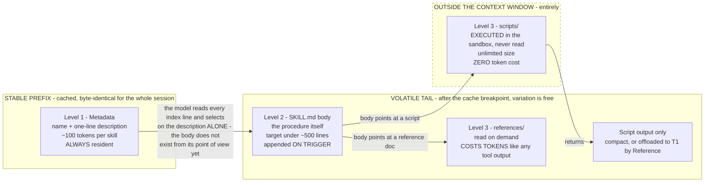

The dashed region is the one that changes authoring guidance: **anything deterministic belongs there**, because that region is free.

**Concrete token budgets, which is the ceiling this design was previously hand-waving.** At roughly 100 tokens of metadata per skill: **50 skills ≈ 5,000 tokens of always-resident index**, against roughly **50,000 tokens if every body were loaded eagerly**. One active skill takes the working total to about **10,000 tokens**. These are the numbers the per-agent skill-count ceiling is set from — not "keep it small," which is not a budget and cannot be enforced in CI. The ceiling is a number, `SkillIndexVersion.entry_count` is validated against it (§3.1.10), and the index token cost is a monitored metric (§5.6).

**Two authoring rules follow directly from the three levels.**

1. **Prefer a script over prose wherever the work is deterministic.** A script is unlimited in size, costs zero context, and cannot be misread, misremembered, or partially followed by a model. Prose instructions telling the model how to validate an IBAN are strictly worse than a script that validates one. Prose is for judgement; scripts are for procedure.
2. **Be explicit and pushy in the description about when the skill should trigger.** The description is the *only* thing the model sees at selection time — the body does not exist yet from its point of view. A description that describes what the skill *is* without saying when to reach for it will not get selected. Trigger conditions belong in the description, stated plainly, even at the cost of sounding blunt.

So N skills cost almost nothing until they are used. Adding a skill changes the prefix **only at a version boundary**, never mid-session: a session pins a skill-index version at session start, exactly as it pins a tool catalog version (§3.8). Within a session the index is byte-stable and the cache stays warm; the body arrives after the cache breakpoint where variation is free, and Level-3 resources arrive there too — or, for scripts, not at all.

**What happens to a loaded skill when the next request is about something else.** Recorded because it is the question the model of "loading" invites, and the intuitive answer is wrong. There is **no unload step**. A skill body is an appended block of text in the tail; nothing evicts it, nothing swaps it out. It stops being *relevant*, not *present*, and what eventually removes it is compaction (ADR-006) — the same mechanism that removes any other cold tail content.

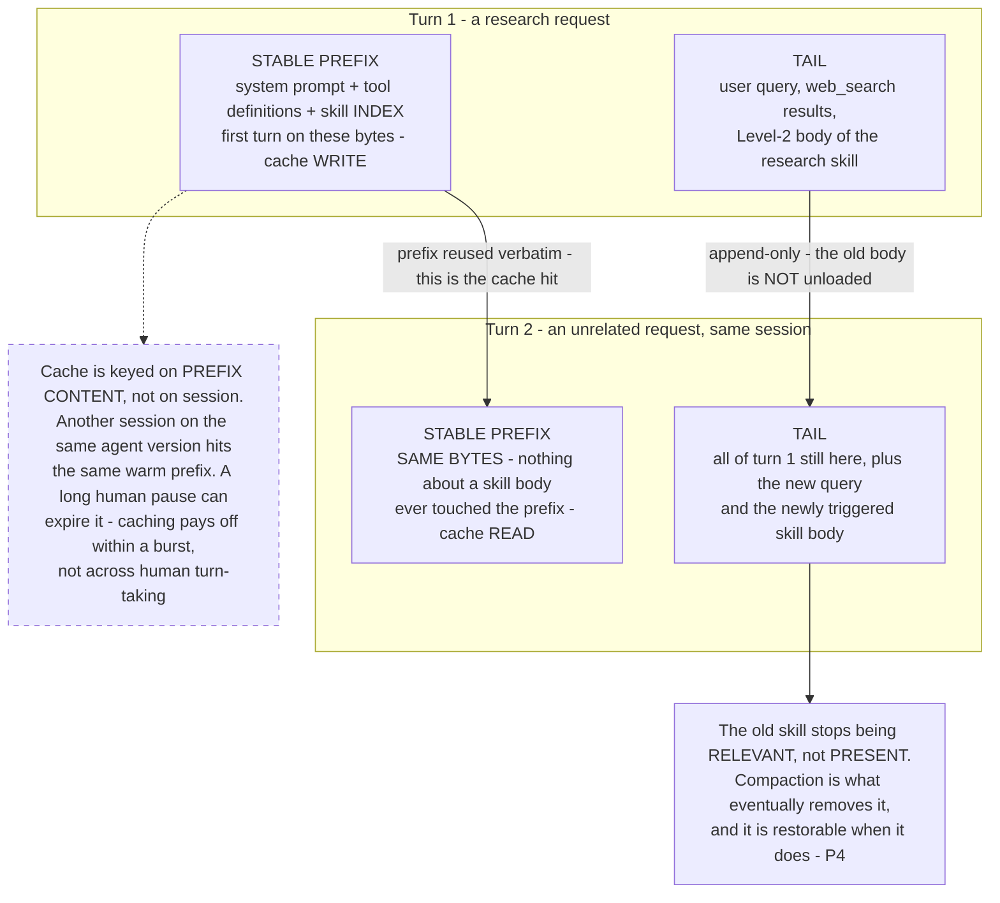

Two consequences worth stating plainly, because both were mis-stated in an earlier draft of this design:

- **Skill selection is not a semantic retrieval step by default.** The model sees every Level-1 index line in the prefix and picks from them the way it picks a tool. There is no embedding lookup in the common path. `skill_search` is the exception that arrives only past the index ceiling (§7.9), and it exists because the flat index stopped being affordable, not because search is better.

  **Why skills resist retrieval where tools accept it, which is not a symmetry this design assumed at first.** Semantic tool search was adopted deliberately (ADR-021) on evidence that large static catalogs degrade selection accuracy. That reasoning does *not* transfer to skills, for three reasons:

  1. **The cost is already gone.** A tool spec is a JSON schema and cannot be compressed to one line; a skill's resident footprint is already one line at ≈100 tokens. Progressive disclosure did the work retrieval would be doing. Searching the index optimises the cheap half — 5,000 tokens at 50 skills — while the expensive half is already deferred.
  2. **The failure is silent rather than loud.** A missed tool announces itself: the model reports it cannot do the thing, or calls the wrong tool and gets a wrong-shaped result. A missed skill produces a fluent answer from general knowledge with the procedure simply absent. Retrieval is acceptable where recall misses are visible and dangerous where they are not.
  3. **It would put a probabilistic step in front of enforcement.** The gate checks the obligations of **triggered** skills only — correctly, since a skill whose guidance never entered the prompt has no business blocking an answer (§3.1.10). But that means if retrieval decides which skills are even *candidates*, a recall miss does not raise a violation: the obligation was never evaluated, and nothing records that it wasn't. With a flat index the model can still fail to *select* a skill, but the candidate set is complete and the miss is detectable in eval. With retrieval the skill was never in the room. An unenforced obligation nobody can detect is the same failure the loader refuses files to prevent.

  **The lever to reach for before retrieval is deterministic partition.** Skills are granted per agent, tenant and role by policy, which already filters the index — the same token reduction with zero recall risk and a prefix that stays byte-stable per agent. Prefer a partition that can be proven over a ranking that can only be measured.

  **If the ceiling is genuinely reached, `skill_search` is two-tier, not all-or-nothing.** A skill declares whether it is retrievable. Compliance-critical skills — the ones whose absence fails silently — stay resident in the index unconditionally; only the long tail becomes searchable. The flag is validated at load like every other manifest field, so "this skill must always be visible" is enforced rather than remembered.
- **The cache is a property of the bytes, not of the conversation.** A busy agent stays warm because many sessions share one prefix; an idle session goes cold on provider TTL regardless of how important it is. Cost models built on "the session is cached" are wrong; the right unit is the prefix.

**Structure of a skill.**

```pascal
STRUCTURE SkillManifest                  // skills/{name}/skill.yaml — the Level-1 metadata
  name: String                           // stable identifier, e.g. "refund_dispute_resolution"
  description: String                     // ONE line; the ONLY thing visible at selection time.
                                          // MUST state trigger conditions, not just purpose.
  version: String                         // content hash of manifest + body + resources
  required_tools: List<String>            // must all exist in the pinned tool catalog
  required_scopes: List<String>           // must be a SUBSET of the agent's policy grants
  bundled_resources: BundledResources     // Level 3; three kinds, three cost profiles
  eval_case_ref: Reference                // REQUIRED; promotion is impossible without it
END STRUCTURE

STRUCTURE BundledResources               // the undifferentiated list this replaces was a mistake
  scripts: List<Reference>               // EXECUTED, never read into context. ZERO context cost.
                                          // Unlimited size. Prefer these for deterministic work.
  references: List<Reference>            // READ on demand. Costs tokens like any tool output.
  assets: List<Reference>                // templates, fixtures, files the skill emits or fills in
END STRUCTURE

STRUCTURE Skill
  manifest: SkillManifest                 // Level 1 — stable prefix
  body: String                            // Level 2 — markdown procedure, volatile tail, ~<500 lines
END STRUCTURE
```

**The three-level invariant, stated as a rule the loader enforces:** a Level-2 body never appears in the stable prefix, and a Level-3 script never enters the context window at all — it is dispatched for execution and only its output (compact, or offloaded per ADR-006) comes back. Violating either collapses progressive disclosure into ordinary prompt bloat. This is Property 25.

> Content from the Agent Skills loading-system specification was rephrased for compliance with licensing restrictions.

**Two components, not one: the Skills Engine and the Skill Registry.** Recorded because an earlier draft used one name for both and the ambiguity reached the code, where the package holding the machinery and the directory holding the artifacts were both called `skills`. They are separate concerns with **different lifetimes**, and the split is the reason the name is now explicit in both places.

| | **Skills Engine** | **Skill Registry** |
| --- | --- | --- |
| What it is | In-process machinery: parse, validate, build the index, refuse the unenforceable, hand obligations to the gate | Storage and promotion pipeline: where versioned skill artifacts live and how they reach an agent |
| Lives at | `agent/skills_engine/` — code | `skills/**` as source of truth, promoted artifacts under ADR-014 |
| Operations | `load_skill`, `load_skillset`, `build_skill_index`, `validate_against_catalog`, `validate_scopes`, `load_skill_body`, `run_skill_script` | version, canary, grant by policy, eval-gate, roll back by pointer, `skill_search` past the ceiling |
| Runs | **Every session** — at start to build the pinned index, and on every trigger to load a body | **At a promotion boundary** — never in the request path |
| Fails by | Refusing to load. A skill that cannot be enforced never reaches an agent | Refusing to promote. A skill whose eval cases regress does not ship |
| Built | Yes — the loader, the obligation checks, and the gate exist | Not yet; Phase 3–4 |

The boundary is worth holding because the failure modes are different and land on different people. An Engine defect is a **runtime** fault in the request path — a skill silently not enforced, which is the one outcome this whole ADR exists to prevent. A Registry defect is a **release** fault — the wrong version of a correct skill reaching an agent, caught by canary and undone by pointer rollback (ADR-014). Collapsing them into one component means one blast radius, one on-call story, and one version number for two things that change at wildly different rates.

**Validation at load (fail closed).** Two checks are non-negotiable, and both are the **Engine's** job, not the Registry's — they must hold at load in the request path, not merely at promotion time, because the pinned tool catalog can change underneath a skill that was valid when it shipped:
1. Every `required_tools` entry resolves in the pinned tool catalog version. A skill referencing a tool that does not exist never loads.
2. Every `required_scopes` entry is within the agent's effective policy grants. **A skill can never widen access** — it can only narrow or use what the agent already has. This mirrors the policy-containment guarantee (Property 18) and is enforced at the same place, so a skill is not a side door around §3.2.

**Every skill ships its own eval cases, and cannot be promoted without passing them.** This is enforced in CI (§5.5), not left to author discipline. A skill without eval cases fails validation; a skill whose eval cases regress fails promotion. That makes "there should be evaluations for the skill" a property of the system rather than a convention.

**Consequences.**
- (+) **Capability scale decouples from topology scale.** The graph does not grow when the agent learns a procedure. This is the same decoupling sub-graphs-as-tools gives at the execution layer (§2.12).
- (+) Skills are ordinary artifacts under ADR-014 — content-hashed, canaried, rolled back by pointer, attributable in the trajectory record. **No redeploy** is required to attach or detach one.
- (+) A domain expert can author a skill. It is markdown plus eval cases, not Python.
- (+) **Level-3 scripts buy deterministic capability at zero context cost.** This is the cheapest rung on the whole extension ladder — cheaper than a tool, because there is no MCP server, and cheaper than prose, because there are no tokens.
- (−) **The skill index must stay small, and now there is a number.** One line per skill (hard description-length limit) at ≈100 tokens of metadata each, with a per-agent skill-count ceiling derived from that figure; past the ceiling the index itself is prefix bloat, which is the failure mode this ADR was supposed to avoid (§7.9).
- (−) **A bundled script is code, and code needs the same containment as a tool.** Zero context cost is not zero risk: scripts execute in the sandbox under the same dropped-capability, read-only-root, no-egress-by-default posture as any model-authored code (§2.10, ADR-016), and a skill's scripts cannot reach anything its `required_scopes` do not already cover (Property 18).
- (−) A large skill library needs a **`skill_search`** discovery mechanism — the same progressive-disclosure move a large tool catalog needs (§3.8). Below the ceiling, the flat index is cheaper and more reliable; above it, search is mandatory.
- (−) Skill sprawl is real: two skills that overlap ambiguously produce worse selection than one skill that is clearly scoped. Skill review is a real review, not a rubber stamp.

**Alternatives considered.**
- **(a) Bake procedures into the system prompt** — rejected. Unbounded prefix growth (directly against P2/ADR-004), no independent versioning, no independent eval, and every procedure change becomes a prompt change that invalidates the cache for every session on that agent.
- **(b) One sub-graph node per procedure** — rejected. This is precisely the topology explosion ADR-012 exists to correct: a node per procedure recreates the mega-graph with extra steps.
- **(c) Fine-tune a model per procedure** — rejected as wildly disproportionate. The cost and latency of a training cycle to encode "follow these eight steps" is not defensible when a markdown file with eval cases does the same job reversibly.

### ADR-003: MCP gateway fronting isolated tool-server pools

**Decision.** All tool execution goes through an **MCP Gateway**. Tools are grouped into **domain pools** (e.g., `browser`, `db`, `file`, `search`), each a separately deployed MCP server with 3+ replicas, a **circuit breaker**, and a **per-pool network policy**. A **tool registry** maps `tool → pool`.

**Context.** Capability scale means many tools across many domains with different reliability, security, and scaling profiles.

**Rationale.** Isolation limits blast radius and lets each domain scale and fail independently. The registry keeps `tool → pool` resolution out of prompts, preserving prefix stability (P2). Mutual TLS and per-pool NetworkPolicy enforce least privilege.

**Consequences.**
- (+) Independent scaling, independent failure domains, per-domain security posture.
- (+) New tool domains are added as new pools without touching existing pools.
- (−) Registry and gateway become critical infrastructure needing HA.

**Alternatives considered.** Direct tool calls from the orchestrator — rejected (no isolation, no uniform authz). One shared tool server — rejected (single failure domain, coarse security).

### ADR-004: KV-cache-first prompt assembly

**Decision.** Assemble every prompt as **[stable prefix] + [append-only volatile tail]** with an explicit cache breakpoint after the stable prefix. Stable prefix = system prompt + full tool definitions (fixed order) + few-shot exemplars. Volatile tail = task state, recited `todo.md`, appended observations/tool results (references, not blobs).

**Context.** Cached and uncached input tokens can differ by roughly an order of magnitude in price, and a typical agent task runs on the order of 50 tool calls with an input:output token ratio near 100:1 — so input cost dominates almost entirely ([Manus](https://manus.im/blog/Context-Engineering-for-AI-Agents-Lessons-from-Building-Manus)). Provider prompt caching works on **prefix match**: stable content first, a cache breakpoint, then volatile content ([Anthropic prompt caching](https://docs.anthropic.com/en/docs/build-with-claude/prompt-caching)). P1/P2.

**Rationale.** Maximizing the invariant prefix maximizes cache reuse across turns and across requests within a tenant/session. No per-second timestamps in the prefix; deterministic JSON key ordering; append-only tail.

**Consequences.**
- (+) Reported production impact of correct prefix caching on long-horizon agentic work is roughly a 45–80% API cost reduction and a 13–31% improvement in time-to-first-token ([Anthropic](https://docs.anthropic.com/en/docs/build-with-claude/prompt-caching)).
- (+) KV-cache hit rate becomes a measurable, optimizable metric (surfaced in §5.4).
- (−) Misuse is worse than not caching: a cache write carries a premium, so a prefix that keeps changing means paying the write premium and never collecting the discount.
- (−) Discipline required: any code that mutates the prefix is a defect. Enforced in review and via a `prefix_hash` observability check.

**Alternatives considered.** Rebuild prompt each turn for "freshness" — rejected, destroys cache. Putting volatile data early for recency — rejected, breaks the cacheable prefix.

### ADR-005: Tool masking (logit/allowlist) instead of dynamic add/remove

**Decision.** Keep the **full tool definition set stable and always present** in the prefix. Constrain which tools are callable *per state* using **logit masking / allowlists** (constrained decoding), keyed by consistent name prefixes.

**Context.** Tool compaction is widely misread as "remove tools the agent should not use right now." Removing or reordering definitions does two bad things at once: it invalidates the KV-cache from the point of change onward, and it creates a contradiction where the conversation history references a tool that is no longer defined ([Manus](https://manus.im/blog/Context-Engineering-for-AI-Agents-Lessons-from-Building-Manus)). Capability scale multiplies both problems.

**Rationale.** Masking preserves the stable prefix (P3, P2) while still restricting behavior. Prefix-based names (`browser_*`, `db_*`) let an entire family be masked with a single prefix rule. The core toolset stays small — Manus reports keeping under roughly 20 atomic tools, because selection quality degrades as the toolset grows.

**Three masking modes** are supported at decode time:

| Mode | Constraint | Typical use |
| --- | --- | --- |
| `auto` | Model may call a tool or answer directly | Default conversational turns |
| `required` | Model must call *some* tool | Steps where a bare answer is invalid (e.g., must retrieve before answering) |
| `specified` | Prefilled token prefix constrains to one family (`db_`, `browser_`) | Policy-scoped or plan-scoped steps |

**Consequences.**
- (+) Cache stays warm; behavior still gated by state and policy.
- (+) The mask is how access policy is *reflected into the model* (§3.2) so it does not waste turns on calls that would be denied. The **MCP gateway remains the place the decision is actually made** — the mask is a hint, never the boundary (Property 2).
- (−) Requires a decoding/provider layer that supports allowlist or logit masking; providers without it fall back to gateway-side rejection only.

**Alternatives considered.** Add/remove tools per state — rejected (cache invalidation + history contradiction). Prompt-only instructions "don't use X" — rejected (unreliable, not enforceable, not auditable).

### ADR-006: Restorable compression with filesystem/object store as external memory

**Decision.** Large tool outputs are written to an **object store / sandbox filesystem**; the context retains only a **restorable reference** (path/URL + compact summary). Compaction is **restorable**, preferred over lossy summarization. A persistent **anchored summary** is updated incrementally for long sessions.

**Context.** Tool outputs (web pages, query results, files) blow up context and cost; naive summarization loses information needed later. The governing rule from the Manus write-up: **never drop information that has no path back**. Restorable offload beats lossy summarization because it defers the "what matters" judgement to the agent at the moment of need instead of guessing earlier.

**Rationale.** External memory (P4) keeps the context small and cache-friendly while preserving full fidelity for re-fetch. The strategy is **tiered**, cheapest and safest first:

| Tier | Technique | Reported effect |
| --- | --- | --- |
| 1 | Cache-stable prefix (ADR-004) | Largest cost lever; nothing is lost |
| 2 | Structurally lossless trimming — strip raw tool outputs, base64 images, metadata; keep user/assistant messages verbatim | ~20% mean token reduction, up to ~86% on bloated sessions |
| 3 | Restorable offload to object store, reference in context | Bounded growth, fully recoverable |
| 4 | Async anchored summarization of cold segments (persistent structured summary, incrementally updated as segments roll off) | Agent-decided ("active") compaction reports ~22.7% token reduction at equal accuracy, up to ~57% on individual tasks; ACON-style compression reports 26–54% peak reduction with largely preserved task performance |
| 5 | Semantic/exact response caching for repeated queries | Avoids the call entirely |

**Two hard rules.**
1. **Never compress the cached prefix.** Compression that rewrites the prefix can cost more than it saves. The decision must be driven by a two-tier cost model (cache-read price vs standard input price), not by token count alone.
2. **Never block inference on summarization.** Blocking LLM-based summarization stalls a turn for tens of seconds; compaction runs asynchronously, off the critical path, and its output is swapped in at the next natural turn boundary.

The mechanics below are corrected against the [OpenClaw session-management and compaction internals](https://github.com/openclaw/openclaw/blob/main/docs/reference/session-management-compaction.md). Their *mechanics* transfer directly; their *state topology* does not, and §7.12 records why so a future reader does not simplify toward it.

> Content from the OpenClaw session-management documentation was rephrased for compliance with licensing restrictions.

**Rule 3 — compaction is an appended ENTRY, not a payload replacement.** The first draft described compaction as swapping payloads for references in place, which made "append-only" true with an asterisk. The cleaner mechanism: **append a `compaction` entry** to the transcript carrying the summary plus `first_kept_entry_id` and `tokens_before` (§3.1.11). Future turns read that entry's summary plus every entry after the cut point, and ignore everything before it. Nothing is edited. Three things follow:

- **Append-only becomes literally true**, not true-modulo-compaction. Property 6 stops needing a carve-out.
- **The cut point is inspectable and auditable.** "What did the agent stop being able to see, and when" is a field lookup rather than a reconstruction.
- **Compaction is idempotent and stackable.** A second compaction appends a second entry with a later cut point; the history of compactions is itself history.

**Rule 4 — the transcript is a TREE, not a list.** Every entry carries `id` and `parent_id`. This is not bookkeeping for its own sake — it is what makes **forking** native, and forking is exactly what two existing parts of this design need:

- **Sub-graph spawn (§2.12.1)** is a branch from the parent entry at the point of invocation, not an unrelated record that has to be correlated back afterwards.
- **Scope-2 re-attempt (§2.13)** is a branch from the last good entry. The failed attempt stays on its own branch — durable, addressable, and *not* in the new context. The tree is the structure that makes Property 12's two clauses coexist without effort.

A flat list forces branching to be simulated with correlation identifiers and copies. A tree makes it a parent pointer. Two constraints come with it, both adopted: **a fork is refused while the parent has an active run** (forking a moving target produces a child whose parent state is indeterminate), and **a forked child starts with fresh token counters** rather than inheriting the parent's, so a child's budget is its own and a deep chain does not inherit a spent ledger.

**Rule 5 — a compaction boundary must never split a tool call from its result.** This is a silent correctness bug, not a tuning concern. If a token-share split lands between an assistant tool call and its matching tool result, the surviving context contains a call with no result — the model sees itself having asked for something and never learning the answer, and reasons accordingly. Three sub-rules:

1. **Shift, do not separate.** If a proportional split would land between a tool call and its result, move the boundary **back to the assistant tool-call message** so the pair travels together.
2. **Preserve a trailing pending block.** If a trailing tool-result block would push the chunk over target, keep it — leave the unsummarized tail intact rather than splitting the pair to hit a size number.
3. **Aborted and errored tool-call blocks do not hold a split open.** There is no result to pair with and no comprehension to protect, so they split freely. Without this exception a long run of aborted calls can make a chunk unsplittable.

This is Property 27 and it is tested deterministically. It is cheap to implement and expensive to discover in production, which is why it is Phase 1 (§8).

**Rule 6 — the mid-turn precheck SIGNALS; it never compacts inline.** Rule 2 is hardest to honour in one specific place: after a tool result has been appended and before the next model call, mid-turn. That is precisely where the temptation to "just compact quickly" is strongest and where doing so stalls a live turn. The mechanism that makes rule 2 honourable rather than aspirational:

- After a tool result lands and **before** the next model call, estimate prompt pressure using the **same budget logic used at turn start** — one estimator, not a second approximate one that can disagree with the first.
- If the prompt no longer fits, **do not compact inline.** Raise a **structured signal**, stop the current prompt submission, and hand recovery to the **outer run loop** — which truncates oversized tool results if that is sufficient, and otherwise triggers compaction and retries the turn.

The division of labour is the point: the inner path *detects*, the outer loop *decides*. Nothing blocks on a summarizer.

**Rule 7 — overflow recovery reads the provider's numbers rather than re-guessing them.** The existing overflow trigger (§2.10) is strengthened with four specifics:

- **Recognize the error family, not one string.** Providers report context overflow through a variety of differently-worded errors; matching one vendor's phrasing means the recovery path silently stops working when another provider is added or a message is reworded.
- **Forward the provider's attempted token count into compaction** when it reports one. It is an observed number from the party that actually did the counting; re-estimating it locally throws away better information than we have.
- **When overflow is confirmed but no count is parseable, pass a minimally over-budget synthetic count** so compaction and diagnostics still have a number to work with. A missing number must not turn into a zero or a silent skip.
- **If overflow recovery still fails, surface explicit guidance and preserve the session mapping.** Never silently rotate to a fresh session — that discards the user's context and disguises a platform failure as amnesia.

**Rule 8 — the summarization step is a pluggable provider with a built-in fallback.** Summarization is the one part of compaction with a genuine quality dimension, so it sits behind an interface and can be swapped (a different model, a different prompt strategy, a tenant-supplied summarizer). Two behaviours are mandatory: **if a provider fails or returns empty, fall back automatically to built-in summarization** — a compaction cycle must not fail because a pluggable component did — and **genuine abort or timeout signals are re-thrown, never swallowed by the fallback**, so cancellation is always respected. Swallowing an abort into a fallback is how a cancelled request keeps spending money.

**Consequences.**
- (+) Bounded context growth; full recoverability; cheaper long tasks.
- (+) Offloaded artifacts are natural trajectory/eval assets (§5.3).
- (+) Compaction-as-entry makes the append-only property unconditional and the cut point auditable.
- (+) The tree transcript gives sub-graph spawn and scope-2 re-attempt a native representation instead of a correlation convention.
- (−) Requires a durable store and a re-fetch tool; references must be tenant-scoped and access-controlled.
- (−) Async compaction introduces eventual consistency in the session record; the session store must tolerate a compaction landing after a turn started.
- (−) A tree transcript is a data-model decision that is **expensive to retrofit** — every reader, replayer, and eval consumer assumes the shape. This is why it is Phase 1 despite full compaction being Phase 4.
- (−) The pairing rule means chunk sizes are approximate by design. Code that assumes exact token-share splits will be wrong.

**Alternatives considered.** Aggressive LLM summarization only — rejected (lossy, unrecoverable, and blocking). Unbounded context — rejected (cost, lost-in-the-middle). **In-place payload replacement** — rejected in this revision in favour of rule 3; it works, but it makes append-only conditional and the cut point implicit. **Flat transcript with correlation IDs for branches** — rejected; it reimplements a parent pointer badly and every consumer has to agree on the convention.

### ADR-006b: Observation variation is allowed only after the cache breakpoint

**Decision.** On long runs of structurally identical observations, apply mild serialization variation (field order in the *rendered* view, phrasing of wrappers, alternate compact templates) — but **only** in the volatile tail, never in the stable prefix.

**Context.** Two of our own principles pull against each other. P2 wants byte-identical structure for cache reuse; the Manus lessons note that when a model sees a long run of near-identical observations it over-generalizes the pattern and starts producing rote actions.

**Rationale.** Making the tension explicit and resolving it by *region* keeps both properties: the prefix stays byte-stable (cache intact), while the appended tail — which is uncached anyway — can vary enough to break rote pattern-matching.

**Consequences.** (+) Reduces drift on long horizons without a cache cost. (−) Variation must be bounded and deterministic per session seed, otherwise trajectories become hard to diff in evaluation.

**Alternatives considered.** Vary everything — rejected (destroys cache). Vary nothing — rejected (accepts known drift behaviour).

### ADR-006c: Pre-compaction memory flush — let the agent save what matters before you compact

**Decision.** Immediately **before** compaction runs, trigger a **silent agentic turn** (ADR-006d) in which the agent writes its own durable state to the session workspace — conclusions reached, working hypotheses, what has been ruled out, what it intends to do next. Compaction then proceeds. The flush fires at a **soft threshold below the compaction threshold**, runs **once per compaction cycle**, is invisible to the user, may be **routed to a cheaper model**, and is **skipped when the workspace is read-only**.

**Context.** This closes a gap the rest of ADR-006 does not touch, and it is the most valuable finding in this revision. Restorable compression protects **tool outputs** — the artifacts. It does nothing whatsoever to protect the agent's own **reasoning state**: the conclusion it drew three turns ago, the hypothesis it is currently testing, the four approaches it has already eliminated. None of that is an artifact with a `Reference`. It exists only as text in the volatile tail, and when the tail is summarized, a summarizer *guesses* at which of it mattered.

That guess is the weakest link in the whole compaction design. A summarizer optimizes for a readable précis of what happened; an agent mid-task needs the specific, unglamorous facts that let it continue — *"the staging credentials are the ones that work"*, *"the ID format is prefixed, not bare"*, *"do not try the bulk endpoint, it 413s above 200 rows"*.

**Rationale.** The agent knows which of its own conclusions are load-bearing. Nothing else does. So ask it, on the record, while it still has the context — the same argument that justifies the self-compaction trigger in §2.10, applied one step earlier. Framed as a principle: **let the agent save what matters before you compact, rather than trusting a summarizer to guess.**

**Mechanism, with the specifics that make it work.**

| Aspect | Decision | Why this way |
| --- | --- | --- |
| Trigger point | A **soft threshold a configurable token gap below** the compaction threshold (a 4,000-token gap is a reasonable default) | The flush is itself a turn and costs tokens. Firing it *at* the compaction threshold means the flush can trip the very overflow it exists to survive. |
| Frequency | **Once per compaction cycle**, tracked in the session record via `memory_flush_compaction_count` (§2.10) | Without a counter, a session hovering around the threshold flushes repeatedly and pays for it every time. |
| Visibility | **None.** Uses the silent-turn mechanism (ADR-006d) | Housekeeping is not a message. A user watching an agent narrate its own filing is worse than a user seeing nothing. |
| Destination | A dated memory file in the session workspace (T0, promoted to T1 like any artifact) | Disk survives compaction. Context does not. |
| Model route | **May be routed to a different, cheaper model** than the conversation, via the model proxy (ADR-011) | Otherwise local housekeeping silently bills at the conversation model's rate, which is the kind of cost leak nobody notices until the invoice. |
| Read-only workspace | **Skipped entirely** | A flush that cannot write is a turn spent producing nothing. Skip it and record the skip. |

**Consequences.**
- (+) Reasoning state survives compaction as **the agent's own words**, not a summarizer's paraphrase. Post-compaction continuity improves for exactly the facts that are hardest to summarize and most expensive to lose.
- (+) The flushed file is durable, greppable with ordinary `file_*` tools, and inspectable by a human debugging the session. It is also an unusually good eval artifact: it is the agent stating what it believed at a point in time.
- (+) Cheap-model routing keeps a per-cycle overhead from scaling with conversation model cost.
- (−) It is **an extra turn with an extra cost**, on a cadence tied to compaction. The soft-threshold gap and the once-per-cycle counter are what bound it; both are configurable and both need to be set deliberately.
- (−) The flush is only as good as the agent's own judgement about what matters. A poor flush is a plausible-looking file that omits the load-bearing fact.
- (−) Another ordering constraint in the compaction path: flush, *then* compact. Getting it backwards produces a memory file written from an already-compacted context, which is the failure this ADR exists to prevent and is worth a deterministic test (Property 28).

**Alternatives considered.** **(a) Trust the summarizer with reasoning state** — rejected; that is the status quo this ADR corrects, and the summarizer has neither the agent's intent nor its sense of what is still open. **(b) Auto-extract reasoning state with a separate heuristic pass** — rejected; a heuristic guessing at conclusions is the same guess with an extra component to maintain. **(c) Flush on every turn** — rejected; the cost is unbounded and most turns change nothing worth persisting. **(d) Make it a visible turn** — rejected; it trains users to ignore agent output, and there is a purpose-built silent path (ADR-006d).

### ADR-006d: Silent turns — agent turns whose output is never delivered

**Decision.** Support **silent turns**: an agentic turn whose output is deliberately **not delivered** to the user. The assistant output begins with an exact sentinel token; the delivery layer strips it and suppresses the message. **Streamed partial chunks beginning with the sentinel are suppressed on the streaming path as well as the buffered one.** Silent turns are restricted to genuine background work.

**Context.** Two places in this design need an agent turn with no user-facing output. The pre-compaction memory flush (ADR-006c) is one — a user should never watch an agent file its own notes. Progress emission during a long sub-graph is the other: §2.12.1's fan-out can leave a user staring at nothing for tens of seconds, and the clean fix is a turn that updates internal state without producing a message.

**Rationale.** Suppression at the **delivery layer** rather than at generation keeps the turn ordinary everywhere else — it appears in the transcript, in the trajectory record, in token accounting, and in evals like any other turn. Only delivery differs. That is the property that matters: silent does not mean unlogged.

**The part that is easy to get wrong, called out because it is a leak and not a bug.** Suppressing the buffered response is the obvious half. **A streaming path that emits chunks as they arrive will leak the first chunk of a silent turn before anything checks the sentinel** — the user sees a fragment of the agent's private housekeeping appear and vanish. Both paths must check, and the streaming check must happen on the **first partial chunk**, before it is flushed to the client. This is Property 29, and it is tested on **both** paths precisely because passing on one and failing on the other is the realistic defect.

**Constrained deliberately.** Silent turns are for **genuine background or no-delivery work** — housekeeping, internal state updates, progress bookkeeping. They are **not** a mechanism for handling ordinary actionable requests quietly. An agent that answers a real question on a silent turn has not been discreet, it has dropped the response, and the user has no way to tell the difference between that and a hang. Review treats an actionable silent turn as a defect.

**Consequences.**
- (+) Makes ADR-006c possible at all, and gives the §2.12.1 silence problem a mechanism rather than a workaround.
- (+) Silent turns remain fully observable — logged, costed, and evaluable — because only delivery is suppressed.
- (−) A sentinel-token protocol is a string contract, and string contracts rot. It needs an exact-match test on both delivery paths and a test that a *non*-silent turn beginning with similar text is still delivered.
- (−) The mechanism is abusable in exactly the way described above, and the constraint against it is a review rule rather than something the type system enforces.

**Alternatives considered.** **(a) A boolean flag on the turn record instead of a sentinel** — rejected in this design only because the sentinel survives the model boundary: the flag has to be set by whatever *requested* the turn, and the memory flush is requested by the compaction path while the output is produced by the model, so the marker has to travel with the output. **(b) Run housekeeping outside the agentic loop entirely** — rejected for the flush specifically, because the whole value of ADR-006c is that **the agent** decides what to save; a non-agentic writer is back to guessing.

### ADR-007: Hybrid RAG + GraphRAG retrieval

**Decision.** Provide **baseline vector RAG** for semantic recall and **GraphRAG** (LLM-extracted entity/relationship graph + community summaries) for multi-hop and global-corpus questions. Retrieval is **hybrid**: vector search + graph traversal, with a router selecting strategy per query.

**Context.** Vector RAG is strong for local semantic lookup but weak on multi-hop reasoning and "global" questions about a corpus.

**Rationale.** GraphRAG reports the semantic structure of a corpus and supports multi-hop traversal; vector RAG is cheaper for direct recall. A hybrid maximizes answer quality across query types.

In practice this means three retrieval modes behind one interface: **vector** similarity, **fulltext/BM25** for exact terms and identifiers, and **graph traversal** (Cypher-style expansion over an entity graph). [Microsoft GraphRAG](https://microsoft.github.io/graphrag/) uses an LLM to extract entities and relationships from documents and then builds community summaries, which is what enables global "what is in this corpus" questions and multi-hop causal chains that pure vector similarity misses.

**Resolving the apparent contradiction with Manus.** The Manus write-up argues *against* RAG for agents, in favour of a filesystem with `grep`/`glob`. That is not a conflict with this ADR because the two solve different problems, and we keep them as separate subsystems (P11):

| Concern | Mechanism | Lifetime | Owner |
| --- | --- | --- | --- |
| Agent **working memory** — intermediate artifacts, fetched pages, scratch files, tool outputs | Sandbox filesystem + object store, navigated with `file_*` tools | Session / task | Executor sub-agent |
| Enterprise **knowledge retrieval** — tenant corpora, policies, tickets, docs | Vector + fulltext + GraphRAG behind `search_*` tools | Long-lived, indexed | Knowledge layer |

Collapsing these into one abstraction is the mistake: indexing scratch files pollutes the knowledge base, and routing working memory through a retrieval ranker loses the exact-path addressing that restorable compression (ADR-006) depends on.

**Consequences.**
- (+) Handles both local recall and global/multi-hop reasoning.
- (+) Working memory stays exact-addressable and cheap; knowledge stays curated and governed.
- (−) Graph construction/maintenance cost; indexing pipeline plus two retrieval systems to operate.
- (−) GraphRAG indexing is LLM-heavy and therefore a real per-corpus cost; it is enabled per tenant/corpus, not globally by default.

**Alternatives considered.** Vector-only — rejected (weak multi-hop/global). Graph-only — rejected (overkill and slower for simple recall). Filesystem-only (strict Manus position) — rejected for the enterprise knowledge case, where corpora are shared across sessions and need governance, versioning, and access control that a scratch filesystem does not provide.

### ADR-008: Continuous improvement as two distinct tracks — behaviour tuning now, weight training later

**Decision.** Split agent improvement into **two tracks that are never conflated**, and ship them in order:

- **Track B — Production behaviour optimization, no weight updates (build this first).** Evolve the *text artifacts* the agent runs on — system prompts, tool descriptions, planner instructions, few-shot exemplars — using reflective optimization over captured trajectories. Every candidate is versioned, eval-gated, canaried, and rollback-able.
- **Track A — Weight training (later, narrow scope only).** Reinforcement fine-tuning on model weights for narrow, high-volume, verifiably-scored sub-policies, once Track B has plateaued and the ROI is provable.

> **Naming map, to avoid confusion later.** The two *tracks* describe the mechanism (text artifacts vs weights). The three *RL phases* below describe delivery order: **Phase A** and **Phase B** are both Track B (no weight updates — prompts, then learned routing/judging policies), and **Phase C** is Track A (weights). Elsewhere in this document, "Track B" and "RL Phase A/B" refer to the same body of work, and "Track A" and "RL Phase C" likewise. §8 sequences all three under Phase 5 of delivery.

**Context.** A common and important question: does "agent RL" mean retraining a model, or can agent behaviour be tuned in production? Both exist, they have wildly different cost and risk profiles, and treating them as one thing leads teams to attempt fine-tuning before they have the trace data or eval gates that make it meaningful.

**Rationale — Track B.** [GEPA (Genetic-Pareto, ICLR 2026)](https://arxiv.org/abs/2507.19457) samples system-level trajectories (reasoning, tool calls, tool outputs), reflects on them in natural language to diagnose what failed, proposes and tests prompt updates, and merges complementary lessons drawn from a Pareto frontier of its own attempts. Reported results: it outperforms GRPO by about 10% on average and up to 20%, using up to 35x fewer rollouts, and beats MIPROv2 by more than 10%. It is built on [DSPy](https://dspy.ai/). The underlying thesis is that when the parameters being optimized are natural-language artifacts, natural-language reflection over full traces carries far more signal than a sparse scalar reward.

**Rationale — Track A.** RLVR extends verifiable-reward RL to multi-turn tool use (e.g. VerlTool). Checklist rewards (CM2-style) decompose each turn into fine-grained binary criteria with evidence grounding, which converts open-ended judging into a stabler classification-style decision. For this platform, [Microsoft Agent Lightning](https://www.microsoft.com/en-us/research/project/agent-lightning/) is the best fit because it adds RL to an *existing* LangChain/LangGraph/AutoGen stack without rewriting the agent; [NVIDIA Polar](https://developer.nvidia.com/blog/) similarly turns an existing harness into an RL-ready rollout environment. Other viable options if requirements change: OpenPipe ART (agent-first GRPO), verl-agent (long-horizon, PPO/GRPO/DAPO/RLOO), OpenRLHF (distributed Ray + vLLM + DeepSpeed), SkyRL (full stack with Gymnasium envs), RAGEN (failure diagnostics for reasoning collapse and reward quality), Marti (multi-agent/graph workflows), Unsloth (consumer-GPU LoRA/GRPO).

**The ladder we commit to** (each rung is a prerequisite for the next):

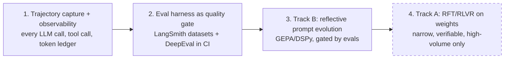

**The three RL phases, stated concretely.** "Agent RL" is used loosely in the industry; this is what each phase actually means here, what it needs, and when it is allowed to start.

| Phase | What is optimized | Mechanism | Prerequisite | Feasible on API-served frontier models? |
| --- | --- | --- | --- | --- |
| **A — Behaviour, no training** | Prompts, tool descriptions, planner instructions, few-shot sets | Trajectory capture → evals → reflective prompt optimization ([GEPA](https://arxiv.org/html/2507.19457v1) over [DSPy](https://dspy.ai/)) | Trajectory store + eval harness | **Yes** — this is where production agent RL actually lives |
| **B — Policy, still no weight updates** | Routing decisions, model selection, escalation thresholds, verifier/judge scoring | Learned router over logged outcomes; **contextual bandits** for model selection and escalation (context = task features, arms = model/route/escalate, reward = eval score minus cost); a separate **read-only verifier model** scoring candidate answers | Phase A running, enough logged outcomes per arm to beat a fixed policy | **Yes** — the learned components are small models we own; the frontier model stays untouched |
| **C — Weights, narrow scope only** | One high-volume, verifiably-scored sub-policy. **No candidate exists in the platform today** — the router was the natural one, and ADR-013 removed it | RLVR / GRPO fine-tuning of a **small open model** | Phase B plateaued, **and** some component is actually self-hosted to train | **No for the frontier model**, and currently **not applicable at all** — Bedrock-only means we host no weights |

**Be explicit about the constraint:** weight-level RL is not available on API-served frontier models. You cannot backpropagate into a vendor's hosted weights. So in practice, "we're doing RL on our agent" in production means Phase A and Phase B for almost everyone, and Phase C only where a narrow node has enough volume to host and train a small model of your own. Framing Phase C as the goal is how teams end up with a training cluster and no measurable improvement.

**Phase C currently has no candidate, and that is a direct consequence of ADR-013.** A router *would* be the ideal Phase C target: high-volume, latency-sensitive, cheap to serve as a small open model, and — rarest of all — **verifiably scoreable**, because downstream task success is a ground-truth label for whether the route was right. But ADR-013 was simplified to a single Bedrock call, and **you cannot weight-train a model you do not host.** So Phase C is not merely gated on Phase B plateauing; it is gated on first restoring a self-hosted classifier. Recorded plainly because it would otherwise look like Phase C is one step away when it is two, and the first step has been deliberately deferred.

**Reward design references** for Phase C, if it is ever reached: [VerlTool / RLVR for multi-turn tool use](https://arxiv.org/abs/2509.01055) for verifiable rewards over tool trajectories, and CM2-style **checklist rewards** which decompose a turn into fine-grained binary, evidence-grounded criteria — converting open-ended judging into a stabler classification decision than a single scalar score.

**Framework landscape** ([survey](https://www.turingpost.com/p/agent-rl-training-tools)), with the selection reasoning attached rather than a bare list:

| Framework | Fit here |
| --- | --- |
| [Agent Lightning](https://www.microsoft.com/en-us/research/project/agent-lightning/) | **First choice.** Adds RL to an existing LangChain / LangGraph / AutoGen / CrewAI stack without rewriting the agent — decisive for us, since the agent already exists |
| NVIDIA Polar | Turns an existing harness into an RL-ready rollout environment; same "don't rewrite the agent" property |
| verl / verl-agent | Long-horizon multi-turn agent RL (PPO, GRPO, DAPO, RLOO); the reference implementation if we need full control |
| OpenPipe ART | Agent-first GRPO with a lower operational bar |
| OpenRLHF | Distributed scale (Ray + vLLM + DeepSpeed) — relevant only well past our expected Phase C volume |
| SkyRL | Full stack with Gymnasium-style environments |
| Agent-R1, RAGEN | Failure diagnostics — reasoning collapse and reward-quality analysis; useful even if we never train, as a lens on why a policy is bad |

**Consequences.**
- (+) Measurable improvement is available in weeks (Phase A / Track B) rather than after a training-infrastructure project.
- (+) Both tracks consume the same `TrajectoryRecord` (§3.1.7), so the observability investment pays for both.
- (−) **Reflective optimization can regress.** The "Reflection in the Dark" analysis reports GEPA degrading accuracy on some seeds, including a case falling from roughly 23.81% to 13.50%. Therefore candidates are **never auto-applied**: promotion requires clearing an eval threshold on a held-out set, passing a canary at limited traffic, and retaining a one-click rollback to the prior prompt version. Prompt versions are immutable artifacts, not editable config.
- (−) Track A needs verifiable environments and a reward-authoring discipline; without them it will optimize the wrong thing confidently.

**Alternatives considered.** RLHF with scalar human preferences — kept as a complementary signal, rejected as the primary signal for multi-turn tool use (noisy and expensive per sample). Manual prompt iteration only — rejected as unscalable across many agents and tenants, though it remains the fallback when eval coverage for an agent is thin. Weight training first — rejected outright: without trajectory capture and eval gates there is no reward to train against and no way to detect regression.

#### ADR-008a: The agent tuning loop — reference design adopted with three additions and two constraints

A reference diagram for how the agent is auto-tuned was provided as input to this ADR and analyzed in full at [`docs/vault/architecture/agent-tuning-loop.md`](../../../docs/vault/architecture/agent-tuning-loop.md). Its substance is folded in here so the corrections live in the design rather than only in a vault note.

**The reference loop as given.** Base Prompt + Labeled Samples → **Target Agent** (a routing/alignment agent) → Predictions → **Eval Engine** (fed a separate held-out set of Unseen Eval Samples) → matched and mismatched samples → **Prompt Optimizer** (*Reflect*: diagnose the disagreements → *Synthesize*: rewrite the framing and guidelines) → **Benchmarking** → **Agent Config Store** (register the updated agent version) → Updated Prompt → back to the Target Agent.

**What it gets right, recorded as validation of this ADR rather than as new information.**

| Element | Why it is correct |
| --- | --- |
| **Reflect → Synthesize** | Exactly the reflective-optimization mechanism this ADR commits to: diagnose failures in natural language, then rewrite the instruction. When the parameter being optimized *is* text, natural-language reflection over full traces carries far more signal than a scalar reward. |
| **A held-out unseen set, kept separate** | Correct eval discipline. It is what makes "did this candidate improve" a real question rather than a restatement of the training data. |
| **Benchmarking precedes registration** | The eval gate comes before promotion, not after it. |
| **The config store registers a *version*** | Matches ADR-014 — every behavioural change is attributable to an immutable, content-hashed version. |
| **The target is a routing/alignment agent** | Independently the same conclusion this ADR reaches about the right first target: routing is high-volume, latency-sensitive, and **verifiably scoreable**, because downstream task success is a free ground-truth label for whether the route was right (ADR-013). |

**Three gaps that must be added.**

1. **No canary, no rollback — the one that will bite.** As drawn, benchmarking passes and the updated prompt goes **straight to the live agent**. Given the documented seed sensitivity of reflective optimization — a reported drop from roughly **23.81% to 13.50%** in one case — a benchmark-then-live loop is precisely the shape that ships a regression. Required: a **canary stage at limited traffic** between the config store and the live agent, watched over a defined window, plus an explicit **rollback edge** to the prior version.
2. **No human gate.** The loop is fully automatic. Our position, per P10: the optimizer **opens a PR with eval scores attached and never writes to production**. The same review and the same gates apply to a machine-proposed prompt as to a human-written one.
3. **A static hand-labeled dataset with no production feedback edge.** There is no edge from production back into the labeled set, which makes the dataset a fixed cost that stops improving the moment someone stops labeling. Production already yields labels for free — the routing decision, the tier that produced it, the confidence, the downstream outcome, and the **`REROUTE` signal** when an executor reports it was handed the wrong task (§3.1.3). Feeding that back turns a one-off tuning exercise into a **flywheel that improves with traffic rather than with labeling budget**.

**Two constraints.**

1. **Cost belongs in the gate.** Accuracy alone is the wrong pass/fail criterion. **Tokens per task and KV-cache hit rate are pass/fail criteria alongside accuracy**, because a more accurate but longer prompt loses on prefix economics (P1). A quality-neutral cost regression fails the gate.
2. **"Updated Prompt" cannot be a live write.** A rewritten prompt changes the **stable prefix** and therefore invalidates the cache for every session running on that agent (P2, ADR-004). The resolution already exists in this design: a session **pins an artifact version at session start** (ADR-014, §3.8), so a newly promoted prompt affects only sessions started **after** promotion and in-flight sessions complete on the version they pinned.

**The adopted loop** — dashed nodes are the additions to the reference design:

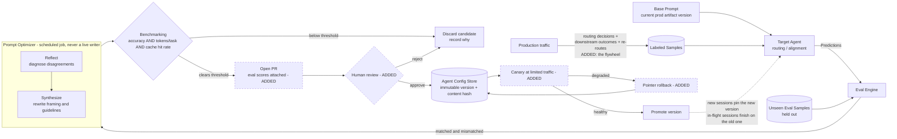

**The honest precondition.** **If eval coverage for an agent is thin, this loop is not safe to enable for that agent.** The gate is only as good as the dataset behind it, and an optimizer pointed at a weak eval set will confidently make things worse. That is a per-agent enablement decision, not a platform-wide switch.

### ADR-009: Guardrail pipeline + PII strategy, delivered in two stages

**Decision.** Implement a **guardrail pipeline**: **input rails** (PII redaction, jailbreak/topic detection) run pre-LLM; **output rails** (moderation, PII scan, RAG grounding check) run post-LLM; **retrieved content** is also scanned. Use policy-driven guardrails (Colang-style policies). **No raw PII leaves the corporate boundary**, and that guarantee is a deterministic CI gate from Phase 1 onward.

PII detection itself is delivered in **two stages**, because the full stack is expensive to build and the deterministic part carries most of the regulatory weight:

| Stage | Mechanism | Phase | Covers |
| --- | --- | --- | --- |
| **Interim — deterministic gate** | Pattern/regex matching for high-confidence **structured** entities only: credit card (with Luhn), SSN, email, phone. Optionally a **managed** detection service (e.g. Amazon Comprehend PII) as a stopgap. Plus the deterministic "no raw PII in an outbound provider payload" test as a **hard, non-negotiable** CI gate. | **1** | Structured identifiers, which are the highest-frequency and highest-consequence leak class |
| **Final — self-hosted stack** | Local NER (Presidio + a GLiNER-PII-class model), the tenant-scoped **PII vault**, reversible tokenization, and authorized re-hydration — the design in §2.7 | **6 (final)** | Unstructured entities: names, addresses, free-text identifiers, contextual PII |

**Context.** Enterprise deployment demands regulatory compliance, jailbreak resistance, and grounded outputs. The self-hosted NER + vault + tokenization stack is genuinely valuable and genuinely a project; the deterministic structured-entity gate is a week of work and blocks the leaks that regulators care most about.

**Rationale.** A single detector is insufficient; layered rails cover distinct threat classes at distinct points (P7). Structured entities are exactly where deterministic matching is *better* than a model — a regex plus Luhn does not have a false-negative rate that varies with phrasing. Unstructured entity coverage needs NER, and NER we host ourselves needs the vault and tokenization plumbing around it to be useful, which is why it lands as one coherent final-phase deliverable rather than half-built early.

**The gating condition, stated as a decision and not an omission.** Until the final-phase stack lands, **the platform MUST NOT onboard tenants with regulated data (PHI, PCI cardholder data, or regulated PII)**. This is a hard precondition on Phases 1–5, recorded as an accepted risk with its mitigation in §7.10, and it is the deferral in this document with actual regulatory teeth. A managed detection service narrows the gap but does not close it, because the vault and reversible tokenization — not just detection — are what make the guarantee auditable.

**Consequences.**
- (+) Defense-in-depth; auditable policy; the highest-consequence leak class is closed in Phase 1.
- (+) The hard CI gate exists from the first phase, so the guarantee is never retrofitted onto a system that has been leaking.
- (−) Unstructured PII (names, addresses, free-text identifiers) is **not** covered until the final phase. That directly constrains which tenants can be onboarded, and it must be visible in sales and onboarding, not just in this document.
- (−) Added latency at interception points; requires tuning to control false positives.

**Alternatives considered.** Single moderation call — rejected (no PII, no grounding, no jailbreak coverage). Post-hoc only — rejected (PII would already have egressed). **Building the full self-hosted stack in Phase 1** — rejected on sequencing: it is a large project that would delay the vertical slice, and the deterministic gate plus an onboarding restriction gets the same safety outcome for the tenants we can actually serve early. **Shipping without any PII gate and adding it later** — rejected outright; a leak in Phase 1 is not recoverable by a Phase 6 fix.

### ADR-010: Multi-tenancy, and a three-check authorization model split across two gateways

**Decision.** Authentication and authorization are **two different jobs at two different boundaries**, and conflating them was a real error in an earlier draft of this design.

| Boundary | Authenticates | Decides | Does **not** decide |
| --- | --- | --- | --- |
| **L1 — API / Auth Gateway** (user boundary) | The **end user** (OAuth/JWT), server-side | May this user talk to the platform at all? Which tenant are they? Are they within quota? | Anything about agents or tools — neither is known yet |
| **L3 — MCP Gateway** (agent boundary) | The **agent** (its own credential/identity) | (1) Is this a valid agent identity? (2) Is this agent granted this tool? (3) Does the **delegated user** have rights to this action and data? | User login — already established upstream |

All three L3 checks are derived from **one OPA policy bundle** per tenant, versioned as an artifact (ADR-014), and all three **fail closed**. Per-tenant isolation of data, memory, and registry entries is enforced at every hop.

**The contract requirement this creates.** Check 3 is only possible if the **delegated user principal travels with the tool call**. The MCP Gateway cannot evaluate a user's rights from an agent identity alone. So `ToolCall`/`TenantContext` carry both the **acting agent** and the **on-behalf-of user** (§3.1, §3.2), and the policy input includes both. This is Property 32.

**Context.** The earlier version described an "Agent Gateway (L1)" that authenticated the user *and* held per-agent tool allowlists. Two problems. First, the name was wrong — L1 is a conventional user-facing auth server, nothing about it is agent-aware. Second, and more seriously, it placed tool authorization at a point where **the tool is not yet known**, which means the check either happens too early to be meaningful or silently degenerates into a coarse per-agent grant that ignores arguments. The MCP Gateway is the only place where agent, tool, arguments, and delegated user are all in hand simultaneously, which makes it the only place a real decision can be made.

The related risk this reframing surfaces is the **confused deputy**: an agent authenticates correctly and is then used as a lever to reach data the requesting user was never entitled to. Agent authentication alone does not prevent it; user RBAC at the point of tool invocation is what prevents it.

**Rationale.** Centralizing authz in OPA keeps policy declarative and testable; enforcing at both gateway and pool provides defense-in-depth. Tenant-scoped memory/registry prevents cross-tenant leakage.

**Consequences.**
- (+) Declarative, auditable, least-privilege access; clean tenant isolation.
- (−) Policy management overhead; OPA becomes part of the request path (cached decisions mitigate latency).

**Alternatives considered.** Hard-coded checks in services — rejected (not auditable/uniform). Network isolation only — rejected (does not express per-agent tool scope).

### ADR-011: One provider (AWS Bedrock) behind a model proxy; task routing is a later config change

**Decision.** **All model calls go to AWS Bedrock, in every environment including local development.** They go through a **model proxy** that owns provider routing, prompt caching behaviour, and PII redaction. Routing *by task type* — a cheaper model for classification, a stronger one for reasoning — is a **config change behind that proxy and is not built now**. Start with one model for everything.

**Context.** Two questions were previously answered as one. "Which provider?" and "how many models, chosen how?" are separate, and collapsing them produced a design that needed a routing policy before it needed a working request.

**Bedrock is used locally too, and that is a deliberate exemption from local-first (ADR-019).** The rest of the stack runs as pinned container images on a developer machine; the model does not. Reasons, in order of weight:

1. **Local inference is not a smaller version of the real thing, it is a different thing.** CPU inference on a laptop distorts latency measurement badly enough that any number measured against it is misleading — and latency is one of the things this platform is being designed around.
2. **A frontier-class model cannot be run locally at all.** Substituting a small local model means the harness is being developed against different behaviour than it will ship on, which is the one kind of local/cloud gap that produces rework rather than surprises.
3. **It removes a whole service class from the local stack** — no model runtime, no GPU question, no model-weight downloads in developer setup.

This is the **only** exemption to P16 in the platform, and the seam is still honoured: application code calls the model proxy, never Bedrock directly, so swapping or adding a provider stays a config change. What is exempted is the *deployment* rule, not the *interface* rule.

**Consequences.**
- (+) One provider, one credential path, one set of quotas. Local and cloud behaviour are identical where it matters most.
- (+) No local model-serving runtime, no GPU dependency for development.
- (+) The proxy seam means adding a second provider or per-task routing later is config, not a refactor.
- (−) **Local development now requires AWS credentials and incurs real spend.** Previously the local stack was free to run; it is not any more. Per-developer cost needs a budget and an alert, not an assumption.
- (−) **No offline development.** No network, no agent. This is a real developer-experience cost.
- (−) A single-provider dependency is a concentration risk, accepted deliberately. The proxy is what keeps it reversible.
- (−) The proxy is on the hot path and must be cache-aware.

**Alternatives considered.**
- **Task-type routing across several providers from day one (the previous decision)** — rejected as premature. It requires a routing policy, per-task quality baselines, and multi-provider credentials before there is a single measured task.
- **A local model for development, Bedrock in cloud** — rejected, and this is the substantive one. It is the cheapest option and it silently develops the harness against the wrong behaviour and the wrong latency profile. The gap would surface as rework at exactly the point it is most expensive.
- **Per-sub-agent hard-coded provider clients** — rejected; no central caching or redaction, and it destroys the seam that makes this decision reversible.

### ADR-012: One agentic loop is the default unit; declarative graphs require justification

**Decision.** The default implementation of any capability is **a single agentic loop** — an agent with a goal, a quality bar, a small toolset, and permission to choose its own route. A declarative execution graph is introduced only when a specific forcing function applies, and each new node must be justified against the list below in the PR that adds it.

**Context.** The existing system models every agent as a node in one flat LangGraph graph with central orchestrators routing between them, and it stops scaling as node count and classification branches grow. This is the single most important correction in this design; §6 covers the migration in detail.

**Rationale.** The real discriminator between a loop and a graph is **who decides the path** — the agent, or you. A loop is a graph with one node. Choosing a graph means choosing to declare valid paths and the checks between them, which is worth it only when you actually need that declaration. Legitimate forcing functions:

1. Genuinely distinct specialties that need different system prompts.
2. A different model or toolset per step (cheap classifier vs frontier reasoner).
3. Fan-out/fan-in over independent subtasks.
4. Routing that must be **auditable** (regulated decisions, approval chains).
5. Failure isolation, where one step's blast radius must not reach another.
6. A dedicated **read-only reviewer** node that cannot mutate state.

If none of these apply, the node should be collapsed into the loop. Prior art for when a graph *is* warranted: [LangGraph `StateGraph`](https://langchain-ai.github.io/langgraph/), [AutoGen `GraphFlow`](https://microsoft.github.io/autogen/stable/), [Google ADK](https://google.github.io/adk-docs/), and the [A2A protocol](https://a2a-protocol.org/) for cross-agent interop.

**Apply the ladder before applying this list.** The forcing functions above answer "does this need a graph?" — but that is the *third* question, not the first. §2.12 defines the mechanical decision ladder (**skill → tool → sub-graph**) that a reviewer applies in order. Most requests that arrive framed as "we need another node" are a skill (a procedure over existing tools, ADR-002b) or at most a tool (§3.8). A sub-graph is reached only when one of the six forcing functions genuinely applies, and when it is reached it is **invoked by the parent as a tool** with its own isolated context and its own stable prefix — so the parent's graph still does not grow (§2.12).

**Consequences.**
- (+) Router prompts stay small because the orchestrator routes to a handful of sub-agent *types*, not to every classification branch.
- (+) Fewer, stronger loops means fewer context handoffs and fewer cache-busting prefix variants.
- (−) Requires review discipline; "add a node" is the path of least resistance and must be actively resisted.
- (−) Some existing classification nodes will be deleted, which is migration work with behavioural risk (§6.3).

**Alternatives considered.** Keep expanding the flat graph — rejected, this is the reported failure mode. Go fully graph-free with one mega-agent — rejected, it violates P3 (toolset size) and P5 (context isolation) and gives up the auditable routing that enterprise tenants require.

### ADR-013: Classification is one Bedrock model call, made safe by recoverability rather than accuracy

**Decision.** Classification is **a single Bedrock model call**. If the caller already declared intent — the API path, the channel, an explicit intent field — use it and skip the call; that is a short-circuit, not a tier. There is **no confidence cascade, no self-hosted embedding classifier, no locally trained classifier, and no per-tier thresholds**. What makes this safe is not classifier accuracy but the **`REROUTE`** escape hatch: an executor that receives the wrong task hands it back, and the orchestrator re-dispatches.

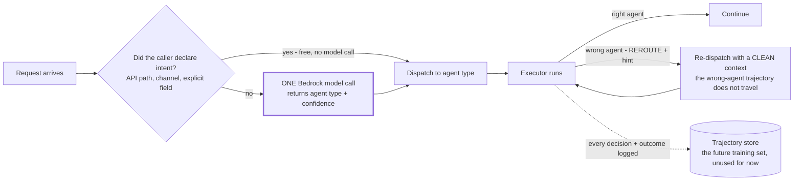

**Context — this ADR was deliberately cut down.** The previous version specified a five-tier confidence-gated cascade whose workhorse was a self-hosted embedding classifier, with a small locally fine-tuned classifier above it and an LLM only for the ambiguous residual. That design is defensible on cost and on data egress, and it is **too much machinery to build before there is a single working request path.** It required: two owned models, two retraining loops, labeled data per tenant, drift monitoring, per-tier confidence thresholds, and a local model-serving runtime — all to answer "which agent handles this?" on traffic that does not exist yet.

The decision is to spend that complexity later, if the numbers justify it, and to spend nothing on it now.

**Rationale.** The reframe that survived the cut is the one that was load-bearing all along: **the router does not need to be right, it needs to be recoverable.** With a working `REROUTE` path, a router that is roughly 90% accurate is fine — the 10% costs one wasted hop, is detected, and is logged. Given that, the marginal value of a bespoke classifier over one Bedrock call is a cost and latency optimization, not a correctness requirement. Optimizations get built when they are measured, not when they are imagined.

Concretely, what stays:

- `SubAgentResult.status` includes **`REROUTE`** with a `reroute_hint` (§3.1.3).
- Re-route is a **first-class outcome, not a failure**: re-dispatch to the suggested agent type with a **clean context** (§2.13, scope 2).
- **Re-route rate is a monitored metric** (§5.6) — now the *only* quality signal for routing, which makes it more important rather than less.
- The re-route path appears in the failure/escalation flow (§2.5).
- Every routing decision and its downstream outcome are still **logged** (P8). Nothing consumes that log yet, and that is fine: it costs one column and it is the precondition for ever revisiting this decision with evidence.

**The trade being accepted, stated plainly because it reverses the previous rationale.** Routing now sends request text to a model provider **purely to decide where to send it**. The old ADR called that "a data-egress surface created for a routing decision, which is a bad trade," and that argument has not become wrong — it has been **outranked by wanting a working system first**. Two consequences follow and both are binding:

1. **The regulated-data precondition now covers routing too.** The existing gate (ADR-009, §7.10) already forbids onboarding tenants with PHI, PCI cardholder data, or regulated PII before Phase 6. That gate is now doing more work than it was: classification text crosses the provider boundary on every undeclared-intent request. Input rails and structured-PII redaction still run **before** the classification call, not after (§2.6, P7).
2. **This is the first thing to revisit when a regulated tenant appears.** Not a nice-to-have. A tenant that cannot send text to a provider cannot use undeclared-intent routing at all, and the answer at that point is to restore a self-hosted classifier — which is why the rejected design is recorded below rather than deleted.

**Consequences.**
- (+) **Nothing to train, serve, monitor, or version.** No owned models, no labeled data requirement, no local model runtime, no cold-start problem.
- (+) Handles free-text intent from day one, including cases no rule set resolves.
- (+) Re-route keeps routing errors bounded and observable instead of silently poisoning a trajectory.
- (+) The decision is cheap to reverse: swap the implementation behind `classify()` (§3.7). Nothing else in the platform knows how classification happens.
- (−) **A provider call and a data egress on the hot path of every undeclared-intent request.** Cost, latency, and a privacy surface, all three.
- (−) **Routing does not improve with traffic.** The log accumulates and nothing learns from it. Accuracy is whatever the model and the prompt give you.
- (−) The classification prompt is a **prefix to keep stable** (P2/ADR-004) — one more artifact under the versioning discipline that the embedding classifier would not have needed.
- (−) Re-route rate is now the *only* routing quality signal, so if it is not instrumented, routing quality is unmeasured.

**Alternatives considered.**
- **The five-tier cascade with a self-hosted embedding workhorse** — *rejected for now, recorded for later.* Correct on cost and egress; disproportionate before a working request path exists. Restore it when a regulated tenant appears, when routing cost becomes a measurable share of spend, or when re-route rate shows accuracy is genuinely limiting. Shape, if restored: embed the query with a small local embedding model, then a lightweight head (centroid, kNN, or logistic regression) trained on the logged decisions and outcomes.
- **Pure deterministic rules** — rejected. Free-text intent is not a lookup, and a rule table that pretends otherwise rots silently.
- **Chasing a near-perfect classifier of any kind** — rejected on principle. A cheap classifier plus a re-route path beats an expensive classifier with no escape hatch, and that argument is what makes the simplification safe.

### ADR-014: Prompt and policy artifacts are versioned, immutable, and canaried

**Decision.** System prompts, tool descriptions, few-shot sets, guardrail policies, and access policies are **immutable versioned artifacts** with a content hash, promoted through `dev → canary → prod` by reference. Runtime resolves `(tenant_id, agent_id) → artifact_version`. Rollback is a pointer change.

**Context.** Track B optimization (ADR-008) mutates prompts automatically, and reflective optimization is known to regress on some seeds. Guardrail and access policies carry the same blast radius.

**Rationale.** Immutability makes every behavioural change attributable to a specific artifact version in the trajectory record, which is what makes regression detection and rollback possible at all. Canary traffic bounds the damage of a bad candidate.

**Consequences.** (+) Deterministic rollback, per-tenant pinning, clean A/B comparison, and an audit trail. (−) Artifact registry becomes hot-path infrastructure (cached aggressively, since a lookup miss must not stall a turn).

**Alternatives considered.** Prompts in code — rejected, ties behaviour changes to deploys and blocks per-tenant pinning. Prompts in mutable config — rejected, no attribution, no rollback, no canary.

### ADR-015: Terraform owns infrastructure; a narrow typed config owns only chunking and embeddings; everything else is code

**Decision.** Three distinct ownership boundaries, and nothing crosses them:

| Concern | Owner | Change mechanism |
| --- | --- | --- |
| Vector store, graph store, buckets, indexes, IAM, network — **all cloud resources** | **Terraform** | A Terraform PR and an apply |
| Source location, **chunking strategy + parameters**, **embedding model + dimensions**, target index name, optionally retrieval mode + `top_k` | **A narrow typed config** (a small Pydantic model, not a DSL) | A config PR, validated at load |
| Ingestion pipeline, retrieval strategy, fusion, reranking, GraphRAG extraction, agent definitions | **Code** | An ordinary code PR, versioned as an artifact |

The ingestion pipeline is **code that syncs documents into resources that already exist** — created and owned by Terraform. It never creates a store, an index, or a bucket. Retrieval strategy is code, versioned as an artifact (ADR-014), and paired with an **accuracy evaluation harness** that scores strategies against a labeled set so "did this change help" is a measured answer rather than an opinion.

**Agents are defined in code. Skills are the configuration surface for capability** (ADR-002b, P12). There is no agent-graph YAML.

**Context.** The previous version of this ADR proposed full declarative YAML for both knowledge pipelines and agent graphs, modeled on a general pipeline-serialization format. That was wrong on two counts, and the review that killed it was right on both. First, **Terraform already owns resource lifecycle** — every cloud team has it, it has state, drift detection, and a plan/apply review model that a bespoke config loader will never match. A config format that also creates stores and indexes duplicates that ownership and creates two sources of truth for the same resource. Second, the honest answer to "how flexible is configuring these pipelines through YAML?" is: **only chunking and embeddings genuinely want to be configurable.** Those are the knobs a domain expert actually turns per corpus. Everything else in the pipeline — how documents are fetched, how they are transformed, how retrieval fuses and reranks — is code that changes for engineering reasons, and expressing it as config buys nothing while costing a great deal.

**Rationale.** Narrowing the configurable surface to a typed Pydantic model with about six fields makes it *actually* reviewable by a non-engineer, which the general DSL never was — a 90-line component graph with named socket connections is not more accessible than Python, it is Python with worse tooling. Meanwhile the things that genuinely need to be swappable per corpus (chunking strategy, embedding model and dimensions) are exactly the things with narrow, typed, enumerable options.

Making retrieval strategy **code with an accuracy harness** is the other half of the correction. A retrieval change is only meaningful if it is measurable, so the harness is a first-class component (§3.6) with real metrics: **recall@k**, **MRR / nDCG**, and **answer-level groundedness**. That answers "calculate accuracy metrics against the retrieval strategy" with a number rather than a config diff.

**Why the full pipeline-as-YAML was rejected — recorded so it is not re-proposed.**
1. **It is a framework-building project, not a platform feature.** Component registries, socket type systems, connection validators, migration machinery — that is a product in itself, and it is not the product we are building.
2. **It moves defects from compile time to load time.** A type error caught by `mypy` in CI becomes a schema error discovered when a config loads, and the validator becomes critical-path code with its own bug surface.
3. **Expressiveness ceilings are unavoidable.** Anything genuinely novel needs a new component type registered in code — so config composes existing components and never invents them. You pay the whole framework cost and still write code for the interesting cases.
4. **Terraform already owns resource lifecycle.** Config that also creates resources duplicates that ownership and produces drift between two systems that both believe they own the index.

**Consequences.**
- (+) One source of truth per concern: infrastructure in Terraform state, behaviour in code artifacts, per-corpus knobs in a typed config.
- (+) The remaining config is small enough to validate exhaustively and small enough for a domain expert to own genuinely rather than nominally.
- (+) Retrieval quality becomes a measured, gated property (recall@k, MRR/nDCG, groundedness) with a CI regression gate (§5.5) instead of a vibe.
- (+) No YAML loader, no component registry, no schema-migration machinery to build, test, or operate. That is a substantial amount of work removed from Phase 3.
- (−) Changing anything outside chunking/embeddings/index-target is a code deploy. That is the intended trade: fewer knobs, sharper tools, defects caught by the type checker.
- (−) Two review paths for one logical change — a new corpus may need a Terraform PR (create the index) *and* a config PR (point ingestion at it). The ordering must be documented so the config PR does not land first against a nonexistent index.

**Alternatives considered.**
- **(a) Full pipeline-as-YAML with a component registry (the previous decision)** — rejected for the four reasons above.
- **(b) Agent-graph YAML** — rejected. Agents are code; skills are the configuration surface for capability (ADR-002b). Declaring agents in YAML recreates the topology-growth pressure ADR-012 exists to resist, and it competes with skills for the same job while being strictly worse at it.
- **(c) Config creates its own infrastructure** — rejected. Two owners for one resource is drift by construction.
- **(d) Everything in code, no config at all** — rejected. Chunking strategy and embedding model genuinely vary per corpus and are tuned by people who should not need a deploy to try `split_length: 8`.
- **(e) Database-stored config edited through a UI** — rejected, loses git review, diffing, and artifact immutability.

### ADR-016: Tiered session storage — sandbox NVMe, S3 Express One Zone, S3 Standard, Redis

**Decision.** The per-session agent filesystem is **four tiers with distinct jobs**, not one store:

| Tier | Technology | Semantics | Job | Lifetime |
| --- | --- | --- | --- | --- |
| T0 — scratch | Sandbox-local NVMe instance store | Full POSIX (`ls`, `grep`, `glob`, `cat`, `sed`) | Working set the agent reads/writes while running code or shell | Session, ephemeral |
| T1 — session artifacts | S3 Express One Zone | Object, single-digit-ms, single-AZ | Durable store for offloaded tool outputs and handoff artifacts read many times within a session | Session + short tail |
| T2 — trajectory archive | S3 Standard | Object, cheap, multi-AZ | Replay, evals, Track B/C training data, audit | Retention-bounded (months) |
| T3 — hot state | ElastiCache Redis | Key/value + structures | Session manifest, plan/`todo.md` pointer, budgets, locks, breaker state | Session, evictable |

Promotion is one-directional and explicit: an agent writes to T0, the offload path copies to T1 and records a `Reference` (ADR-006), and the trajectory writer lands the durable record in T2. T3 holds the **manifest** — the index of what exists in T0/T1 for this session — never the payloads.

**Local mapping (ADR-019).** The **tier boundaries are what this ADR decides**, and they hold in both environments; only the backing service differs. Locally: T0 is a sandbox container volume, T1 and T2 are both **MinIO** buckets behind the S3 API, and T3 is the **Redis** container. **The one thing that does not carry over is latency.** MinIO on a local disk has a completely different profile from a managed low-latency tier, so **T1's single-digit-ms characterization and the cost model built on it are unverified until measured in cloud** (§4.1, §4.2). The single-AZ tradeoff below has no local analogue at all.

**Context.** Context engineering was the highest-priority requirement, and the concrete need is that tool outputs go to a *filesystem the agent can navigate with ordinary shell tools*, while the platform still needs durability across orchestrator restarts and a durable trajectory record for evaluation. One store cannot do all three: POSIX semantics, single-digit-ms shared durability, and cheap long retention are different products.

**Rationale.** Splitting by access pattern is what keeps this cheap. T0 gives the agent real `grep`/`glob` over a real filesystem, which is the thing that makes filesystem-as-context work at all — a retrieval ranker cannot substitute for exact-path addressing (P11). T1 gives cross-restart durability at latency low enough to sit on the agent's critical path. T2 is priced for volume, and it is the tier both improvement tracks read from. T3 is what makes the orchestrator genuinely stateless: because the session manifest lives in Redis rather than in orchestrator memory, an orchestrator pod can be killed mid-task and a replacement pod resumes from the manifest plus T1/T2 (§2.8).

**Single-AZ is a deliberate acceptance, not an oversight.** T1's single-AZ durability profile is acceptable *because* T1 is session-scoped and the authoritative record is T2. A lost AZ costs in-flight sessions, which are recoverable by replay from T2, not customer data.

**Consequences.**
- (+) Agent-visible POSIX semantics without paying network-filesystem latency on every `cat`.
- (+) Orchestrator restarts do not drop sessions; the manifest is external.
- (+) The archive tier doubles as the eval and RL corpus, so observability spend is not duplicated.
- (−) Four tiers means a promotion path to get right, and a `Reference` must encode its tier so resolution is unambiguous.
- (−) T0 is ephemeral by construction: anything not promoted to T1 before the sandbox dies is gone. The offload path must be synchronous with respect to the artifact becoming referenceable.

**Alternatives considered and rejected.**
- **A single stateful process owning all session state, with per-agent local storage** — rejected, and worth naming explicitly because it is the topology of a well-regarded reference implementation whose *compaction mechanics* this design adopts wholesale (ADR-006, ADR-006c, ADR-006d). It is a single point of failure and it does not partition by tenant. See **§7.12** for the full reasoning; it is recorded there so a future reader does not "simplify" toward it.
- **Amazon EFS as the session filesystem** — rejected. It offers POSIX across nodes, but at meaningfully higher per-operation latency than local NVMe, and the POSIX requirement is already satisfied by T0 where the agent actually runs. Paying network-filesystem latency for every `ls` in an agent loop is the wrong trade, and EFS's cross-AZ durability is a property T2 already provides more cheaply.
- **FSx for Lustre** — rejected. It is built for high-throughput parallel HPC and ML training I/O. Session scratch for an agent is small-file, low-concurrency, bursty, and short-lived — the opposite of the profile Lustre is priced and tuned for. It would be both overkill and mispriced.
- **Everything in S3 Standard** — rejected. Latency is wrong for in-loop reads, and it provides no POSIX surface.
- **Everything in Redis** — rejected. Artifacts are large and binary; using a memory-priced store as an object store is the most expensive possible mistake here.
- **Sandbox NVMe only** — rejected. No durability across restarts, no trajectory record, so no evals and no RL corpus.

### ADR-017: Phased delivery — one thin vertical slice, then widen

**Decision.** Build in **Phase 0 plus six phases** (§8). **Phase 0** settles the service selection, the minimal Compose profile, the three CI gates, and the portability seams (ADR-019). Phase 1 is then a **thin vertical slice**: one tenant, one agent loop, one tool pool, stable-prefix assembly, restorable offload, trajectory capture, and a deterministic PII gate — end to end **on the local stack**. Nothing in later phases starts until the slice below it is running with its metrics visible. Phase 6 is a final **enhancements** phase carrying the self-hosted PII stack (ADR-009), which gates which tenants can be onboarded before it lands.

**Context.** The requirement was explicit: phase-wise development, not everything at once. This design describes a large system, and a large system built breadth-first produces seven half-finished layers and no working request path.

**Rationale.** A thin vertical slice forces every layer boundary to be real on day one — the contracts in §3.1 get exercised rather than reviewed. It also front-loads the cheap high-return work (prefix caching, offload, trajectory capture) that pays off at any scale (§7.1) and defers the expensive optional work (GraphRAG indexing, weight training, dedicated tenant clusters) until there is data to justify it. Every capability in this document carries a phase assignment so scope creep is visible as a phase violation rather than an argument.

**Consequences.** (+) A working, observable path early; each phase is independently valuable and reversible. (+) The eval harness exists before the risky behavioural refactor (§6.3 step 5). (+) With ADR-019, no phase waits on infrastructure — the slice runs on one machine. (−) Phase 1 deliberately ships without multi-tenancy, GraphRAG, HITL, or optimization, which must be communicated so it is not mistaken for the finished platform. (−) Some Phase 1 code is knowingly provisional; the contracts are what carry forward, not every implementation behind them. (−) **Deferring the self-hosted PII stack to Phase 6 is a binding constraint on tenant onboarding, not a soft preference** — Phases 1–5 may not serve regulated data (ADR-009, §7.10).

**Alternatives considered.** Layer-by-layer horizontal build (all of the gateway, then all of the orchestrator) — rejected, nothing works until the last layer lands and integration risk is deferred to the end. Big-bang cutover from the existing mega-graph — rejected, no baseline, no rollback, and behavioural regressions arrive all at once.

### ADR-018: Kubernetes is the eventual deployment target (not yet active)

> **Re-scoped by ADR-019.** Kubernetes is the **eventual** deployment target, **not yet active**. The platform currently runs on Docker Compose on a developer machine (ADR-019), and nothing below is built. Everything in this ADR remains the decided shape of the eventual cloud deployment — the rationale, the consequences, and the rejected alternatives all still hold. What changed is *when*, not *what*. The move is gated by the cloud readiness checkpoint (§8).

**Decision.** Every component of this platform ships as a **container**, and the **eventual** deployment target for those containers is **Kubernetes**, with **Amazon EKS** as the managed control plane. **One namespace per architectural layer** (gateway, orchestrator, executors, mcp, and one per tool-pool domain), each a network and policy boundary rather than a naming convention. **Terraform owns the cluster and the lifecycle of every cloud resource** (ADR-015); application manifests never provision infrastructure. **Helm** packages the workloads. Scaling architecture is §5.7. **None of this is active** — see ADR-019 for the current runtime and the checkpoint that activates this one.

**Context.** EKS was mentioned incidentally in §5.1 from the first draft but was never actually *decided* anywhere, which meant the most consequential infrastructure commitment in the document had no recorded rationale and no rejected alternatives. That is now fixed, because the choice is load-bearing rather than incidental.

The platform has tiers with **genuinely different scaling profiles and genuinely different blast-radius requirements** (ADR-001, ADR-003): a stateless gateway that scales on request rate, an orchestrator that scales on in-flight turns, tool pools whose resource profiles differ by an order of magnitude between domains, and a **sandbox tier that executes model-authored code** and must be isolated more strongly than an ordinary workload. It also needs per-pool deployment and rollback that do not touch neighbouring pools. Namespaces, network policies, per-deployment autoscaling, and pod disruption budgets are precisely the primitives that problem shape calls for.

**Rationale.** The layered topology in this document is only real if the layers can **scale, fail, and deploy independently**. Kubernetes supplies exactly those: per-tier horizontal scaling, per-namespace network isolation, per-workload identity (ServiceAccount → least-privilege IAM), declarative rollout and rollback, and a mature autoscaling story (HPA for metric-driven pod scaling, KEDA where the signal is a queue or event stream, Cluster Autoscaler or Karpenter for node capacity). It also supplies the **strong-isolation escape hatch** the sandbox tier needs — gVisor- or Firecracker-backed node groups — without a separate execution platform bolted onto the side.

**Consequences.**
- (+) Independent scaling and independent deployment per tier and per tool pool, which is what ADR-001 and ADR-003 assume rather than merely hope for.
- (+) Real network isolation as a **policy boundary** — default-deny per namespace with an explicit egress allowlist, so "the `db` pool cannot reach the internet" is enforced rather than documented.
- (+) Declarative rollout and rollback; a bad deploy is reverted by reconciling to the previous manifest, mirroring the pointer-rollback property artifacts already have (ADR-014).
- (+) Portable across clouds if a tenant contract or a regional obligation ever requires it, because the workloads are containers and the cloud coupling is confined to Terraform.
- (−) **Substantial operational surface.** Cluster upgrades, autoscaler tuning, node-group lifecycle, and network-policy debugging are real ongoing work, and they require a team that owns infrastructure. This is the single largest fixed cost the design takes on.
- (−) **Kubernetes autoscaling defaults are wrong for LLM-bound workloads.** CPU is nearly meaningless as a saturation signal when a pod spends its time waiting on a model provider or a tool call, so scaling metrics have to be chosen deliberately per tier rather than inherited from the default HPA template (§5.7.2).
- (−) **Overkill below the scale threshold in §7.1.** Stated plainly: a single team with a handful of tools and modest traffic gets less from this than it pays for, and the honest recommendation there is a single well-instrumented service. §7.1 records that consistently now that Kubernetes is a decision rather than an assumption.

**Alternatives considered.**
- **Serverless (Lambda, or Fargate-only)** — rejected. Agent turns are long-running and hold in-flight tool calls for tens of seconds; the sandbox tier needs **persistent local NVMe scratch** for T0 (ADR-016), which a function runtime does not offer; and cold starts plus execution-duration ceilings fight directly against long-horizon tasks. The economics are attractive for spiky short work, which is not the workload here.
- **ECS** — rejected, though it is genuinely workable and the closest call of the four. It gives weaker per-namespace policy isolation and a less mature autoscaling and policy ecosystem than the per-pool isolation this design leans on, and the isolation story for model-authored code execution is thinner.
- **Plain VMs with a process supervisor** — rejected. It loses rolling deploys, self-healing, and declarative rollback, all of which this design depends on. The gateway/orchestrator/registry/pool pattern is orchestrator-agnostic in principle, but re-implementing scheduling, health management, and rollout primitives to get there is not a good trade.
- **A managed agent platform** — rejected. The context-engineering control this entire design rests on — stable prefix assembly (ADR-004), tool masking rather than mutation (ADR-005), tiered session storage (ADR-016) — requires **owning the harness**. A platform that assembles the prompt for you takes P1 and P2 out of our hands.

### ADR-019: Local-first development on Docker Compose; cloud deferred behind an explicit checkpoint

**Decision.** The platform runs on **Docker Compose on a developer machine**, and there is **no cloud deployment and no cloud CI** — but local development is **not cloud-free**. A deliberately small, explicitly named set of **real AWS services is consumed from local development**, because for those services a container substitute would be measuring the wrong thing. Everything else is a **pinned container image**.

> **Local development is a hybrid, and the expectation is set here rather than discovered later.** "Local-first" in this document means *we do not deploy to the cloud yet*. It does not mean *the stack has no cloud dependencies*. Running locally requires an AWS account, credentials, and a spend budget from day one.

| | Runs as a local container | Consumed as a real AWS service, locally |
| --- | --- | --- |
| **Container** | Object store, Postgres/pgvector, graph store, Redis, OPA, telemetry backend | — |
| **Real AWS, locally** | — | **IAM**, **Bedrock** (ADR-011), **Cognito**, **AgentCore Gateway**, **AgentCore Memory** (`USER_PREFERENCE` strategy only) — the closed set fixed by **ADR-020** |
| **Excluded** | — | **EKS and ECR** (cloud deployment — deferred to the §8 checkpoint), **AgentCore Runtime** (it would own prompt assembly, against P1/P2/ADR-004) |

**Non-AWS external dependencies exist too, and they are deliberate.** The anchor use case calls **real third-party APIs** — Stripe Billing Entitlements and a real issue tracker — from local development. They are not AWS, so ADR-020's closed set does not govern them, but the same honesty applies: local development depends on them, needs credentials for them, and does not work offline without recorded interactions. The reasoning is in the anchor use case: a stand-in cannot produce real rate limits, token expiry, pagination, or provider error taxonomies, so building against one means designing for conditions that never occur.

**The set is closed, and the test for reopening it is stated.** ADR-020 fixes the five. Adding a sixth requires an ADR answering: **would a local substitute cause us to design against different behaviour, rather than merely different latency?** If yes, use the real service and pay for it. If no, use a container. Bedrock qualifies — a small local model is a *different thing*, not a smaller one. Cognito qualifies for a subtler reason: a managed AWS gateway cannot reach a discovery URL on a developer's laptop, so a local IdP would force local dev onto a different identity provider from every other environment. **Nothing is added without recording it**, because an unbounded set of cloud dependencies is cloud deployment arriving one service at a time without a decision. Kubernetes/EKS (ADR-018) is re-scoped from "the deployment target" to "the **eventual** deployment target, not yet active." Moving to cloud requires an explicit **cloud readiness checkpoint** (§8) to pass; until it does, the cloud design in §5 is documentation, not infrastructure. The service-by-service selection, the local topology, and the three CI gates that are actually wired up are §4.

**Context.** Cloud infrastructure is a large fixed cost paid *before* any of it is needed — a cluster to upgrade, IAM to debug, autoscalers to tune, spend accruing while the platform does nothing useful yet — and **none of it validates whether the architecture is right**. Every architectural decision in this document is about platform *shape*: layering (ADR-001), context engineering (ADR-004, ADR-005, ADR-006), skills (ADR-002b), retry scoping (§2.13), classification (ADR-013), storage tiering by access pattern (ADR-016). Not one of those is a statement about hosting, and not one of them is invalidated by running on one machine.

**Rationale.** A full stack on one machine gives a fast feedback loop and low infrastructure spend — **not zero: the real AWS services above are billed from day one** — and it still exercises the layer boundaries — Compose runs one container per layer, so the contracts in §3.1 are crossed over a real network hop rather than in-process. Deferring is **not the same as being unprepared**: the cloud design already exists in §5, so the eventual move is execution against a written design rather than design under deployment pressure.

**The portability rule that makes this cheap.** Stated prominently because everything else in this ADR depends on it:

> **Application code must never know which environment it is in.** Every backing service is reached through an interface whose concrete implementation is selected by **config**. Swapping MinIO for S3, or local Postgres for a managed one, is a **config change and never a code change**.

The specific portability seams, named so they are checkable in review:

| Seam | The rule | Why this specific seam |
| --- | --- | --- |
| Object storage | The **S3 API** — never a MinIO-specific client | The same calls address MinIO locally and S3 later |
| Vector + relational | **Standard Postgres + pgvector** — never a managed-only extension | The extension is byte-identical local and managed |
| Telemetry | **OpenTelemetry** — never a vendor SDK | The backend becomes swappable with no application change |
| Hot state | The **Redis protocol** — never a managed-cache-only feature | Identical protocol local and managed |
| Models | Provider-specific calls confined **behind the model proxy** | A model backend becomes a config entry |
| Secrets | A **resolver interface** — never a direct credential read from the environment | A local `.env` and a secrets manager are two implementations of one seam |

**Anything reachable only via one vendor's API is a migration cliff** and needs its own ADR recording the lock-in as deliberately accepted. Detail on Compose conventions and the seams lives in `.kiro/steering/local-development.md` and is not restated here.

**Consequences.**
- (+) **A fast iteration loop with most of the stack on one machine**, and no cluster, IAM surface, or autoscaler to operate.
- (−) **Not free, and not offline.** The named AWS dependencies bill from day one and require connectivity. Per-developer cost needs a budget and an alert rather than an assumption, and the set is capped by the test above precisely so this cost stays bounded.
- (−) **Two credential paths from day one** — a local `.env` for container services and real AWS credentials for the consumed services. Both go through the secrets resolver seam so there is one interface, but there are genuinely two backends now, and that is more surface for a local-only habit to leak into.
- (+) **Layer boundaries are still exercised** — one container per layer, real network hops, the §2.8 startup ordering enforced by health checks.
- (+) **The cloud design is already done**, so the eventual move is execution rather than design.
- (−) **Several properties are not validatable locally** — object-store latency, sandbox isolation strength, autoscaling, network policy, IAM, multi-AZ, real multi-tenant load. They are enumerated in the gap table (§4.2) and **must be re-validated in cloud**. The honest cost of that deferral is recorded as a tradeoff in §7.11.
- (−) **Compose is not Kubernetes**: no HPA, no PDB, no NetworkPolicy. The §5.7 scaling model therefore remains a **design hypothesis until load-tested on a cluster**, and should be read that way everywhere it appears.
- (−) **Risk of local-only patterns leaking toward production**, most acutely in secrets handling. Mitigated by reading every secret through a **resolver interface from day one**, so the local `.env` and a real secrets manager are two implementations of one seam rather than two code paths.

**Alternatives considered.**
- **(a) Cloud from day one** — rejected. It pays the full fixed infrastructure cost before anything is learned, and the spend accrues against an architecture that has not yet been validated. Being cloud-ready on paper is worth more here than being cloud-deployed in fact.
- **(b) Local Kubernetes (kind / minikube / k3d)** — rejected **as the default**, but noted honestly as the natural intermediate step. It validates manifests, probes, and startup ordering with **no cloud spend**, and it is the **recommended first move if the checkpoint later identifies Kubernetes-specific behaviour as the blocker** (criterion 2 in §8). Compose is chosen now for a materially faster loop and lower cognitive overhead — a developer debugging prompt assembly should not also be debugging a local control plane.
- **(c) A managed dev environment (Codespaces-class, or a shared dev cluster)** — rejected. It costs money and adds a dependency on connectivity, and returns no architectural insight in exchange.

### ADR-020: The initial AWS dependency set — IAM, Bedrock, Cognito, AgentCore Gateway, and AgentCore Memory scoped to user preferences only

**Decision.** Five real AWS services are consumed from local development. The set is closed until an ADR reopens it (ADR-019).

| Service | Role | Scope |
| --- | --- | --- |
| **IAM roles** | Identity and permission boundary for everything below | Full. Least-privilege roles per component from day one |
| **Bedrock** | All model calls | Full (ADR-011) |
| **Cognito** | The **one** identity provider — issues the user JWT that L1 validates *and* that AgentCore Gateway accepts as inbound auth | Full, with seeded test users and groups |
| **AgentCore Gateway** | The MCP tool boundary — inbound auth, outbound auth, endpoint-to-MCP-tool exposure | Adopted, replacing the self-built gateway in ADR-003 |
| **AgentCore Memory** | Cross-session user memory | **`USER_PREFERENCE` strategy only.** Not short-term, not summarization, not semantic |

**Explicitly excluded, and why each exclusion is load-bearing:**

| Excluded | Reason |
| --- | --- |
| **EKS, ECR** | These are cloud *deployment*. Standing them up cancels ADR-019 and retires the §8 checkpoint before one feature ships. Deferred to the checkpoint, unmodified |
| **AgentCore Runtime** | It hosts and drives the agent, which takes **prompt assembly** out of our hands. P1, P2 and ADR-004 are the platform's cost model; a managed runtime that owns the prefix repeals them. This is the "managed agent platform" already rejected in ADR-018, and the rejection stands |
| **AgentCore Memory short-term** | It would replace the compaction, restorability, and prefix-preservation machinery that ADR-006, ADR-006c and ADR-016 exist to provide. See the strategy analysis below |
| **Gateway "no authorization" mode** | The Gateway supports an unauthenticated mode [for development and testing](https://docs.aws.amazon.com/bedrock-agentcore/latest/devguide/gateway-core-concepts.html). **Forbidden in every environment, including local.** A dev-only auth bypass is precisely the thing that survives into production, and we would be testing a path we never intend to ship |

#### Why Cognito, and what the seeded users are for

Cognito is the single identity provider for **both** boundaries in ADR-010: L1 validates the end-user JWT, and AgentCore Gateway accepts the same issuer as [inbound JWT auth](https://docs.aws.amazon.com/bedrock-agentcore/latest/devguide/gateway-inbound-auth.html) via a discovery URL with allowed audience and allowed client IDs. One issuer, two consumers, one set of claims — so the `UserPrincipal` that L1 establishes is the same identity the Gateway authorizes against, rather than two identity models that have to be reconciled.

**The seeded users are a correctness fixture, not convenience.** Property 32 says effective access is the *intersection* of agent grant and user scopes, and that the decision cache is keyed on the user. Neither clause can be tested with a single user, and neither can be tested honestly with hand-built fixture tokens — a fixture proves the checking code runs, not that it runs against real claims. The minimum useful set:

| Test user | Cognito group | Exists to prove |
| --- | --- | --- |
| `alice.broad` | `analyst-full` | The happy path: agent grant and user scope both allow |
| `bob.narrow` | `analyst-restricted` | **Intersection**: the same agent, the same tool, denied because the *user* lacks the data scope (Property 32 clause 3) |
| `carol.other-tenant` | `tenant-b-analyst` | Cross-tenant containment (Property 1) with a genuinely valid token |
| `svc.scheduler` | `service-principal` | A turn with no human behind it carries an explicit service principal, not a null (Property 32 clause 2) |

Cognito **groups map to `UserPrincipal.roles`**, and roles resolve to `data_scopes` in the tenant policy bundle. The `alice`/`bob` pair against one agent is the confused-deputy test, and the `alice`-then-`bob` sequence against a warm decision cache is clause 4.

#### Tenant identity: one federated issuer, not one gateway per tenant

**The question this answers:** a tenant has their own identity provider — possibly a custom server-side API or an internal microservice — and wants the platform to accept *their* auth. How?

**What the Gateway accepts.** Inbound JWT auth is configured with a **discovery URL** (`.well-known/openid-configuration`), plus allowed audience, allowed client IDs, allowed scopes, and optional [custom claim validation](https://docs.aws.amazon.com/bedrock-agentcore/latest/devguide/inbound-jwt-authorizer.html). It trusts an **issuer**, not a product, so any conformant OIDC provider works. Three requirements a tenant's own server must meet:

| Requirement | Fails when |
| --- | --- |
| Publishes an OIDC discovery document **and a JWKS endpoint** | The gateway verifies signatures by fetching public keys; without JWKS there is nothing to verify against |
| Issues **JWTs**, not opaque tokens | A bespoke API returning a random session string cannot be used as inbound auth at all |
| The discovery URL is **publicly reachable by AWS** | **This is the one that bites.** An internal microservice in a private VPC or behind a VPN fails even when it is perfectly OIDC-compliant, because a managed AWS service cannot reach it — and in enterprise, internal IdPs usually are private |

**Decision: federate tenant IdPs behind one Cognito user pool; do not run one gateway per tenant.**

The authorizer is configured **per gateway with a single discovery URL**. Taken naively, "each tenant brings their own IdP" therefore implies one gateway per tenant, which multiplies gateway resources, target registration, tool-catalog wiring, quota, and cost — and fragments the single tool chokepoint that ADR-003 and ADR-010 both assume. Cognito user pools [federate external SAML 2.0 and OIDC providers](https://docs.aws.amazon.com/en_us/cognito/latest/developerguide/cognito-user-pools-identity-federation.html), acting as a bridge and applying **attribute-mapping rules** so downstream systems standardize on one token shape.

That buys four things at once:

1. **One issuer toward the Gateway** — one gateway, one authorizer, one claim shape, regardless of how many tenant IdPs exist.
2. **Claim normalization where it belongs.** Attribute mapping converts each tenant's claim names into the canonical `UserPrincipal` (§3.1). Without this, every tenant's claim shape leaks into policy evaluation, and Property 32's roles → `data_scopes` resolution would need per-tenant parsing code.
3. **A path for private IdPs.** With **SAML** federation the assertion travels through the *user's browser* to the Cognito ACS endpoint, so AWS never needs to reach the tenant's internal IdP — which is the only clean answer to requirement 3 above. **Unverified detail:** that this holds with an uploaded metadata document rather than a metadata URL. Confirm before promising it to a tenant with a private IdP.
4. **Tenant onboarding stays configuration.** Adding a tenant IdP is a Cognito federation entry plus an attribute mapping, not a new gateway and not a code change (P12, P16).

**When a tenant's auth is genuinely custom** — opaque tokens, no OIDC surface at all — something must translate, and there are only two honest options:

- **The tenant exposes an OIDC surface** and federates normally. Preferred; the work sits with the party that owns the identity.
- **We run a token-exchange broker at L1**: validate their token against their API, then mint a token from an issuer the Gateway trusts. Workable, and the cost must be stated plainly rather than discovered: **the broker becomes a trusted issuer, so compromising it compromises every tenant behind it**, and we would be asserting an identity we did not authenticate ourselves. It needs its own threat model and its own ADR before it ships.

**One more unverified gotcha, recorded because it would surface late.** A secondary source reports that Cognito works as the *server-side* issuer for the Gateway but not for the **client** side of the MCP OAuth flow, because Cognito is an OIDC identity provider rather than an MCP-compliant authorization server — the workaround being an API Gateway façade in front of it. If the goal is for arbitrary third-party MCP clients to connect, **verify this before committing**, because it changes the client story rather than the server story.

#### AgentCore Memory: the strategies, and why only one is adopted

Long-term memory runs [extraction strategies](https://docs.aws.amazon.com/bedrock-agentcore/latest/devguide/long-term-memory.html) over raw session events and keeps **only the extracted insights rather than the raw conversation**. Triggered when events are written to short-term memory. Assessed one at a time:

| Strategy | What it produces | Verdict |
| --- | --- | --- |
| **`USER_PREFERENCE`** | Durable per-user preferences across sessions | **Adopt.** This fills a genuine gap — the platform has session working memory and an enterprise corpus, and *nothing* that remembers a user between sessions. Lossy extraction is entirely appropriate for "prefers metric units, wants terse answers" |
| **`SUMMARIZATION`** | Session summaries | **Reject.** This is the direct collision. P4 requires that everything removed from context keeps a `Reference` back to the original; this keeps insights and discards the raw. It also duplicates ADR-006's anchored summary while being *less* recoverable |
| **`SEMANTIC`** | Facts extracted from conversation, semantic search | **Reject for now.** It builds a second knowledge corpus out of chat transcripts, which is a lower-quality corpus than the ingested one and splits retrieval across two systems — against P11. Revisit only if a use case wants conversational facts specifically |
| **`EPISODIC`** | Past interaction episodes | **Defer.** Plausibly useful, no use case demanding it yet |
| **Built-in with overrides** | Your own prompt appended, and your own model choice, for the extraction and consolidation steps | **Use, on `USER_PREFERENCE`.** Two reasons: route extraction to a **cheap model** rather than paying conversation-model rates for background housekeeping (the same argument as ADR-006c), and **constrain what may be extracted** so preferences cannot absorb PII |

**Three findings that constrain how this is wired, all of which matter more than the strategy choice.**

**1 — Tenant isolation is not expressible as a namespace variable.** Namespaces are hierarchical paths, and the documented template placeholders are `{actorId}`, `{sessionId}`, and `{memoryStrategyId}`. There is **no tenant placeholder.** So Property 1 has to be bought some other way, and the two options are not equivalent:

- **One Memory resource per tenant** — a hard resource boundary, isolation by construction, and an IAM-enforceable one. **Recommended.** Open question: the per-account resource quota, which needs checking before we rely on it at tenant scale.
- **Encode the tenant into `actorId`** (`"{tenant_id}:{user_subject}"`) — one resource, but isolation now rests on string-construction discipline in every call site. One malformed `actorId` cross-contaminates tenants, and the failure is silent. Rejected as the default.

**2 — Events written to managed memory must be post-redaction.** Extraction reads raw conversation events, so anything written there is both persisted in a managed store *and* fed to a model. Property 10 (no raw PII crosses the provider boundary) and Property 11 (PII tokenized in every persisted surface) both apply. **Redaction happens before the write, never after** — and since ADR-009's self-hosted PII stack is Phase 6, the regulated-data precondition covers this surface too. This is Property 33.

**3 — Extraction is model work we do not see.** The extraction and consolidation steps consume tokens on our account that never pass through our model proxy, so they are **invisible to the §5.6 token ledger and to the KV-cache accounting**. Cost per task will understate reality by whatever memory extraction costs. Fix: attribute it from billing rather than from the ledger, and record the gap rather than discovering it as a variance.

**Consequences.**
- (+) The three hardest parts of a tool boundary — inbound auth, outbound auth on behalf of a user, and endpoint-to-MCP exposure — are bought rather than built, and the Gateway's on-behalf-of model **matches** the identity design in ADR-010 rather than fighting it.
- (+) Cross-session user memory arrives without building a second storage tier for it.
- (+) One identity provider, real tokens, and a test-user matrix that makes Property 32 genuinely testable instead of fixture-testable.
- (−) **ADR-003's per-pool containment is weakened.** Per-pool circuit breakers, per-pool network policy, and domain-pool isolation were ours; a managed gateway supplies its own isolation model instead. This is a real reduction in blast-radius control and is accepted deliberately.
- (−) **A second memory system exists**, with a different durability model from ours. The boundary must stay sharp: **within-session working memory is ours and restorable; cross-session user preference is AgentCore's and lossy.** Blurring that line reintroduces the summarization collision through the back door.
- (−) **Local development now needs an AWS account with five services, and none of it works offline.** The dependency set is closed for exactly this reason.
- (−) AgentCore is a young service surface. Several details here — resource quotas, and whether extraction cost is attributable per tenant — are **recorded as unverified and must be confirmed before Phase 2**.

**Alternatives considered.**
- **Build our own gateway per ADR-003 as originally designed** — still the stronger containment story, and rejected only on effort: inbound/outbound OAuth on behalf of an end user is a large amount of security-critical code to own before a single feature ships. If the containment loss proves to matter, ADR-003 is restorable — the tool interface is unchanged either way.
- **Adopt all AgentCore Memory strategies** — rejected. `SUMMARIZATION` contradicts P4 outright, and `SEMANTIC` splits retrieval against P11. Taking the whole product because part of it is useful is how the summarization collision would enter unnoticed.
- **Keycloak in a container instead of Cognito** — genuinely viable and cheaper, and rejected for a specific reason: the Gateway needs a discovery URL it can reach, and a local container is not reachable from a managed AWS service. Local dev would then use a different IdP from every other environment, which is exactly the local/cloud divergence P16 exists to prevent.
- **One gateway per tenant, each trusting that tenant's own IdP directly** — rejected. It removes the need for federation, and it pays for that with N gateways to provision, N target registrations, N tool-catalog wirings, and a quota ceiling on tenant count — while fragmenting the single tool chokepoint ADR-003 and ADR-010 are built around. Federating behind one issuer keeps tenant onboarding a configuration change.
- **Passing each tenant's raw claims straight through to policy evaluation** — rejected. Without Cognito's attribute mapping normalizing claims into one `UserPrincipal` shape, every tenant's claim naming leaks into the authorization path, and Property 32 would need per-tenant claim-parsing code. That is a per-tenant code path in the security-critical layer, which is the worst place to have one.
- **Fixture JWTs instead of real Cognito users** — rejected. It tests that our validation code runs, not that it validates real claims, and claim-shape mismatches are a classic integration failure.

### ADR-021: Tools are reached only through the MCP gateway, and tool selection is semantic search

**Decision.** Three parts, and the first is the one that matters architecturally.

1. **Every tool is behind the AgentCore MCP gateway from the first tool.** No in-process tool functions, ever — not even for convenience during early development. This is what makes everything else a configuration change rather than a rewrite.
2. **Tool selection is [semantic search](https://docs.aws.amazon.com/bedrock-agentcore/latest/devguide/gateway-using-mcp-semantic-search.html)**, enabled on the gateway at creation. The agent calls `x_amz_bedrock_agentcore_search` with a natural-language query and receives the relevant tool specs, which are then injected into `toolConfig` for the following turn.
3. **The mode is a per-agent field**, `tool_selection: semantic | declared`, so a narrow agent can be switched to declared selection without touching code.

**Context.** The alternative — carrying every tool definition statically in the cached prefix — is what Waku does (`ToolRegistry.schemas()` returns all of them) and what Hermes does today, with their stated reason being that *every model tool ships on every API call*, hence a deliberately brutal bar on adding one.

That approach has a measured ceiling. At roughly 50 tools (~8K tokens) most models hold 84–95% tool-selection accuracy; at ~200 tools (~32K tokens) accuracy falls to **41–83% depending on model**. A published study reports a **99.6% reduction in tool-related tokens at a 97.1% hit rate for K=3** over 121 tools. So a large static catalog is not merely expensive, it makes the model measurably worse at choosing. Hermes has an open issue moving toward hybrid tool search for exactly this reason.

**Rationale, and the honest shape of the trade.** Search returns invocable tool specs, so **provider-side schema validation is preserved** — the model still emits a validated tool call, it just learns the schema one turn earlier. That was the open question and it resolves in favour of search.

The cost is specific and it lands on P1: **injecting tool specs mid-conversation changes `toolConfig`, which is part of the cached prefix, so every search invalidates the cache.** A conversation that searches once pays one cache break; one that searches repeatedly pays repeatedly.

| Approach | Baseline prefix | Cache behaviour | Selection accuracy at scale |
| --- | --- | --- | --- |
| **Declared** (rule states `required_tools`) | All of the agent's tools, ~150 tokens each | Never breaks | Perfect — it is a lookup, not a ranking |
| **Semantic search** | One tool | **Breaks on every search** | Degrades gracefully; the only viable option past ~50 tools |

**At our current scale declared selection would measure better.** An eight-tool agent is ~1,200 cached tokens that never break, against a search round trip plus a guaranteed cache miss. Semantic search is chosen anyway, deliberately, to avoid a migration at the point where the catalog grows — and because a per-agent switch means the narrow case can be reverted with config if the measurements say so.

**Consequences.**
- (+) **No migration when the catalog grows.** The gateway, the search path, and the injection mechanism are exercised from day one rather than retrofitted at the point of pain.
- (+) The baseline prefix stays tiny regardless of how many tools exist across the platform.
- (+) Schema validation survives, because search hands back real specs.
- (−) **Cache hit rate takes a measurable hit, and P1 is the north-star metric.** The mitigation is to instrument it in the first slice, so the cost is observed rather than argued about.
- (−) An extra round trip per search, on the user's critical path.
- (−) A ranking step is a new failure mode: a search that returns the wrong three tools produces a wrong answer with no error. `required_tools` in the rule file is the cross-check — a rule that names its tools makes a bad ranking detectable.
- (−) **Diagnostic ambiguity while the platform is young.** With one tool and a search step, a misbehaving agent has two candidate causes instead of one. Accepted knowingly.

**Alternatives considered.**
- **Static catalog, all tools in the prefix** — rejected on the accuracy data above, and because it forces the Hermes discipline of refusing tools to protect the prefix, which pushes capability into skills whether or not that is the right home for it.
- **Declared selection from `required_tools`, no search** — genuinely competitive today and still the recommended mode for a narrow agent. Rejected as the *default* to avoid building only the path that stops working at scale.
- **Lazy per-tool schema fetch without semantic ranking** — rejected. It pays the same cache cost as search while giving up the ranking that makes a large catalog navigable.
- **Threshold-triggered switch, declared until 25 tools** — rejected in favour of exercising the eventual path from the start, accepting a worse measurement now for a cheaper path later.

> **Note on tech choices.** **Kubernetes remains a decided constraint rather than a substitutable default** (ADR-018) — but it is the **eventual** target and is **not yet active** (ADR-019). The current runtime is Docker Compose. Everything else named later (Envoy, OPA, Redis, LiteLLM-style proxy, Neo4j, OpenSearch/pgvector, LangSmith, DeepEval, GitHub Actions, and the specific autoscaling components in §5.7) is a **reasonable, model-agnostic default** rather than a hard requirement — and each one now carries a recorded selection rationale and tradeoff in §4.1 rather than appearing as an unexplained product name. The ADRs above constrain the *shape* of the system; substitutable products may be swapped if they satisfy the same principles.
---

## Architecture

**Deliverable 2 — High-Level Architecture (§2).** This section shows **only the components of our agentic framework** (not generic infrastructure). The components below are **runtime-agnostic**: they are the same containers on Compose today and on Kubernetes eventually. Which concrete service backs each one locally is §4.1; the local Compose topology is §4.3; the deployment mapping to AWS is §5 and is **future state, not built** (ADR-019).

### The Anatomy of an Agent (read this before §2.1)

The rest of this document is organized by *decision*, which is the right shape for review and the wrong shape for a first read. This subsection is the first read: **what an agent is, what a skill is, how either gets loaded, how execution actually runs, and where tools sit** — five things in the order they depend on each other.

One sentence per layer, and the ordering is the point:

| Layer | What it is | What it costs to add one |
| --- | --- | --- |
| **1 · Agent** | A **configuration record**, not a class. An identity, a set of pinned artifact versions, a policy grant, and a model route. | A config record and eval cases |
| **2 · Skill** | A **procedure** over tools that already exist. Markdown plus eval cases. | A folder — no code, no redeploy (ADR-002b) |
| **3 · Loading** | What of the above is **allowed into the context window**, in which region, at what token cost. | Nothing — it is a consequence of 1 and 2 |
| **4 · Execution** | A small **typed-node loop** that every agent shares. Nodes are machinery; agents are configuration. | Nothing — you do not add nodes to add an agent |
| **5 · Tool** | A **new way to touch the outside world**. Code, inside one MCP server. | Code in an MCP server (§3.8) |

The load-bearing claim, and the one everything else in this document is arranged to protect: **layers 1, 2 and 3 scale without touching layer 4.** Adding the hundredth agent and the fiftieth skill does not add a node, an edge, or a branch. That is what ADR-001, ADR-012 and ADR-002b are collectively buying.

#### 1 · What an agent *is*

Not a subclass and not a graph. An agent is a **record that parameterizes the shared skeleton** — which is why the platform has a handful of nodes rather than one node per agent.

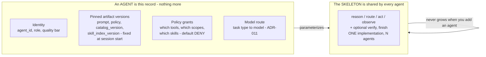

Two consequences that are easy to miss:

- **A "planner" and an "executor" are the same machinery with different records** (ADR-002). The planner's record grants planning tools and a decomposition prompt; the executor's grants task tools. Neither is a distinct code path.
- **A sub-agent is invoked as a tool, not as a topology edge** (§2.12.1). From the caller's side there is no difference between calling `db_query` and calling a whole sub-graph. This is what keeps the caller's graph constant.

> **Status: agreed in review, ADR pending.** The four-node skeleton and the `AgentSpec` record above were settled in design review but do not yet have their own ADR, and the state schema is still open. Listed in the open items at the end of this subsection so it is not mistaken for a closed decision.

#### 2 · What a skill *is*, and what it is not

The full table is in ADR-002b; the one-line version is the line that matters: **a skill is procedural knowledge over tools that already exist; a tool is the ability to touch something new.** Handling a refund dispute is a skill. Reaching the payments API is a tool.

Get this line wrong in either direction and one of two failures follows. Call a skill a tool and you write code for something a markdown file does. Call a tool a skill and you write prose instructing a model to do I/O it has no capability for, which fails at load (`required_tools` must resolve in the pinned catalog).

#### 3 · Loading — the three regions, and what each costs

This is the layer with the money in it. Everything the model can see lands in exactly one of three regions, and the region determines the cost, not the content.

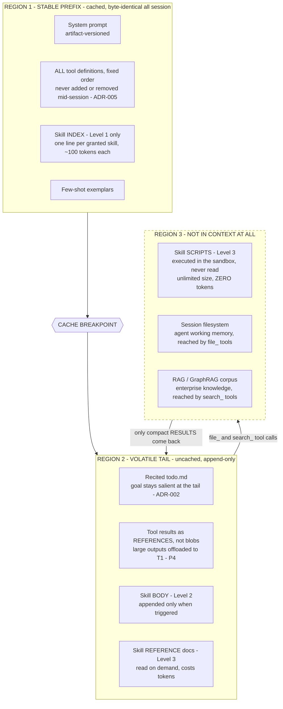

Three rules govern the diagram, and each has a property behind it:

- **Region 1 is byte-stable within a session** (P2, Property 4). No timestamps, no reordering, no mid-session tool changes. Capability is gated by **masking**, not by mutating the catalog (ADR-005, Property 5).
- **Region 2 is append-only** (Property 6). Compaction *appends a cut point*; it never rewrites (§3.1.11).
- **Region 3 is where scale lives.** Working memory and knowledge retrieval are **different subsystems** and are never merged (P11) — one is the agent's scratch space, the other is the enterprise corpus.

#### 4 · Execution — one loop, four nodes, five ways out

Every agent runs the same loop. What differs per agent is the record from step 1, not the topology.

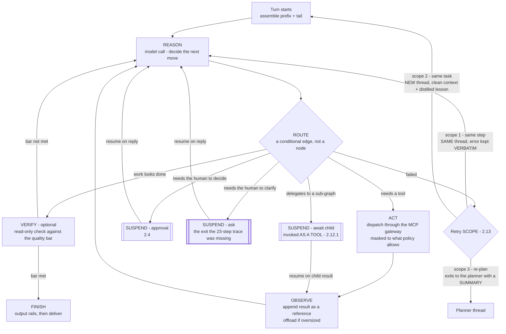

Four things this diagram is trying to make unmissable:

1. **`route` is an edge, not a node.** It branches and holds no state. Anything that never branches and is deterministic from state is not a node — `assemble` fails that test, which is why it is not drawn as one.
2. **The three retry scopes are *thread* boundaries, not node boundaries** (P6, §2.13). Scope 2's clean context is not something a node does; it is what a *new thread* is. Property 23 is what enforces that a re-attempt carries a lesson rather than the wreckage.
3. **All three delegating exits are the same primitive: suspend.** Approval, clarification, and awaiting a child are one mechanism with three triggers. Getting this wrong is how you get **executor slot starvation** — a parent holding a worker slot while blocking on a child that needs a free slot to run. Suspension releases the slot; blocking does not.
4. **The `ask` exit was a genuine hole.** The end-to-end trace in §3.4 ran 23 steps with no path for the agent to ask a question back, which is not a plausible customer-facing agent. It is drawn bold because it was found by review rather than by design.

#### 5 · Tools — one catalog, one gateway, isolated pools

Tools are the only layer that costs code, and the layer with the strictest containment.

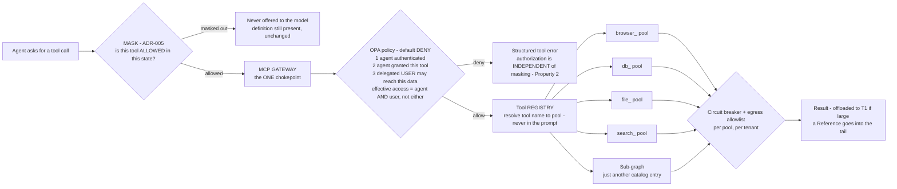

The naming convention is not cosmetic: consistent prefixes (`browser_*`, `db_*`, `file_*`, `search_*`) mean **a whole family masks with one prefix** (P3), and the core toolset stays small — roughly under twenty atomic tools — because a large flat catalog is prefix bloat by the same arithmetic as a large skill index.

#### The extension ladder, which is the summary of all five

When someone asks for a new capability, try these **in order** and stop at the first that works (P15, §2.12):

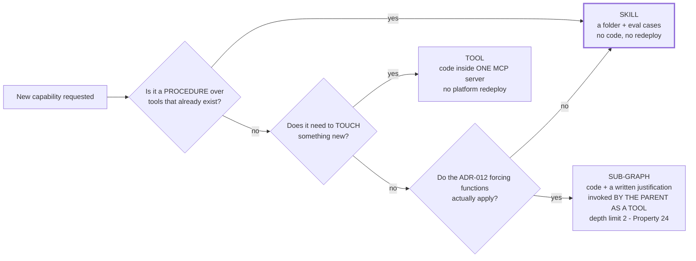

The bold box is where the overwhelming majority of requests should land. A design where most new capability arrives as a sub-graph has regressed to the mega-graph §6 exists to correct.

#### Open items in this subsection

Recorded rather than glossed, because they are the parts a reader would otherwise assume are settled:

- **The typed-node skeleton has no ADR yet.** The four-node structure and the `AgentSpec` record are agreed; the ADR is not written.
- **The state schema is undecided** — what exactly travels between nodes.
- **Whether the planner shares the skeleton** or is deliberately different is open.
- **Prebuilt LangGraph components vs hand-rolled nodes** is undecided. The constraint is fixed (stay on LangGraph primitives; nothing that assembles prompts on our behalf), the choice within it is not.
- **The sub-graph lifecycle state machine** (spawn, run, return, orphan, reap) and the full set of deadlock classes are sketched in §2.12.1 but not yet written as a state machine with properties attached.

### 2.1 Component Diagram

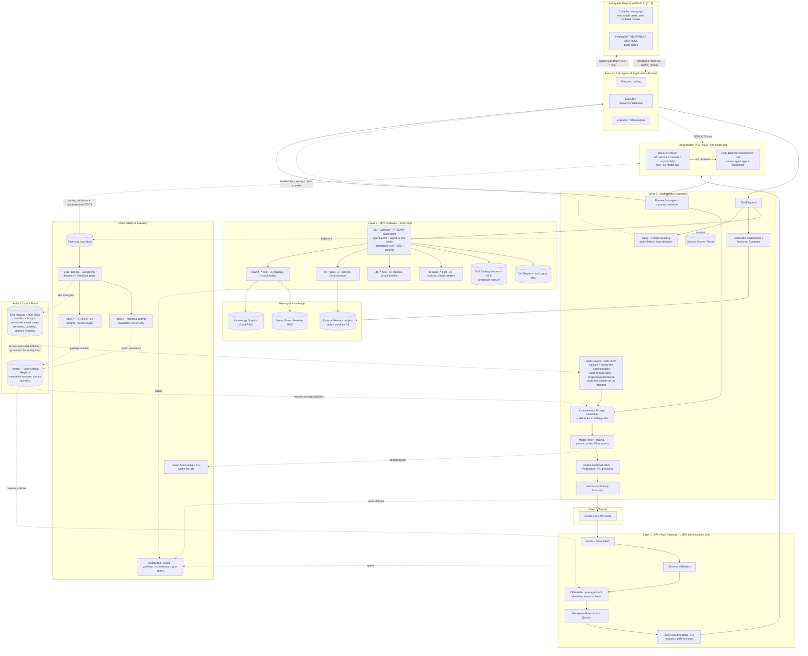

### 2.2 Layer Responsibilities

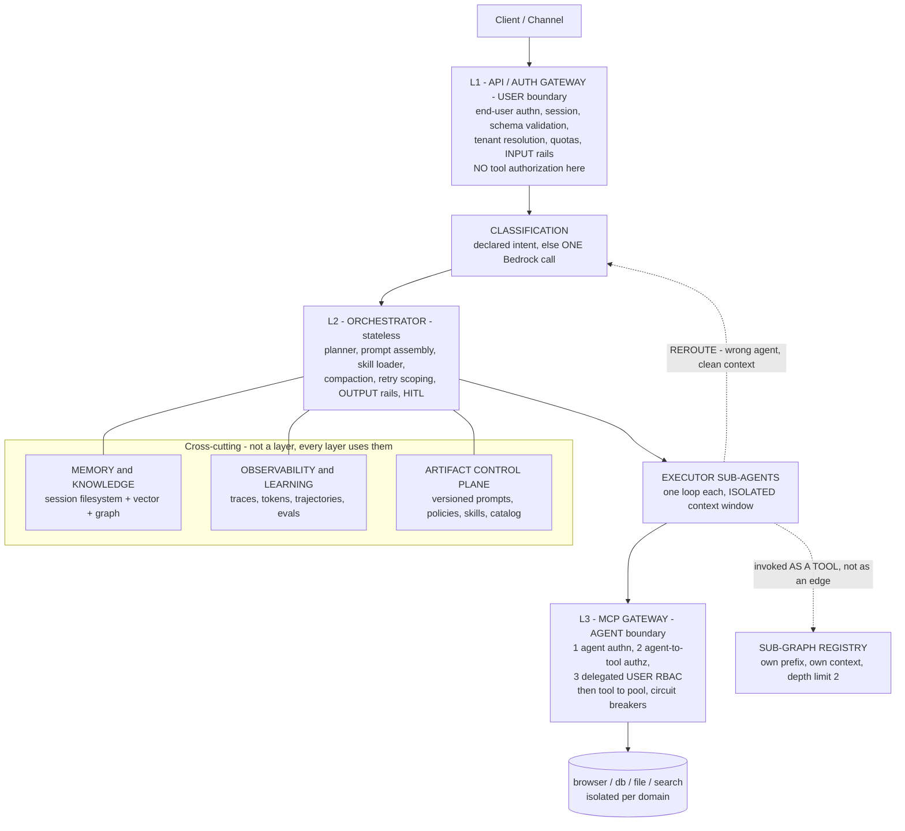

**There is deliberately no central router node in that diagram** — classification is one call at the edge, not a graph node every request passes through. §6 explains why that distinction is the whole point.

- **API / Auth Gateway (L1) — the *user* boundary:** server-side **end-user authentication** (OAuth/JWT), session establishment, request schema validation, tenant resolution, per-tenant rate limits and quotas, and **input guardrail rails** (PII redaction, jailbreak/topic detection) before anything reaches the model. This is ordinary application-tier authentication — the same thing any web backend does. **It answers "who is this user, and are they allowed to talk to us at all".** It does **not** decide whether an agent may invoke a tool.
  > **Corrected naming.** An earlier draft called this the "Agent Gateway" and gave it per-agent tool allowlists. That was wrong on both counts: nothing about it is agent-specific, and agent-to-tool authorization belongs at the MCP Gateway where the tool call actually happens. The old name invited exactly the mistake of enforcing tool policy at the user boundary, where the tool being called is not yet known.
- **Classification (ADR-013):** **One Bedrock model call**, short-circuited when the caller already declared intent (API path, channel, explicit field). No cascade, no owned classifier models, no confidence tiers. Every decision and its downstream outcome are logged, but nothing trains on that log yet. Wrong routes are recovered via the executor's `REROUTE` result — recoverability, not accuracy, is what makes a simple router safe.
- **Orchestrator (L2, stateless):** The **planner sub-agent** (task decomposition + `todo.md` recitation), **KV-cache-first prompt assembly** (including the **skill index** in the stable prefix), the **skill loader** (progressive disclosure of skill bodies into the volatile tail), model routing via the model proxy, tool dispatch, **restorable compaction**, **retry and failure scoping** (`distill_failure`, failure-loop detection — §2.13), **output guardrail rails**, and the **human-in-the-loop controller**. Session state lives in an external cache (Redis) so the orchestrator stays stateless and horizontally scalable.
- **Executor Sub-agents:** Small LangGraph graphs, each with a **clean, isolated context window**, specialized by task type (coding, research/multimodal, math/analysis). They call tools via dispatch, load skills on demand, may invoke a registered **sub-graph as a tool**, and return results through a structured submit-results tool (including a `REROUTE` outcome).
- **Sub-graph Registry (§2.12):** Compiled, self-contained execution units, each with its **own** stable prefix and **own** isolated context window, independently versioned, evaluated, and model-routed. **The parent invokes a sub-graph as a tool**, so adding one never grows the parent's graph. Hard depth limit of 2 levels (3 only with explicit sign-off), enforced by a depth counter in the handoff contract at dispatch time.
- **MCP Gateway + Tool Pools (L3) — the *agent* boundary, and the primary authorization decision point.** Not a "recheck": this is where the real access decision is made, because this is the first point at which the agent identity, the tool, and the arguments are all known. Three distinct checks, all required, in order:
  1. **Agent authentication** — is this a registered agent identity presenting a valid credential? An unauthenticated agent gets nothing, regardless of how legitimate the originating user is.
  2. **Agent authorization** — is *this agent* granted *this tool*, per the OPA policy bundle? This is where per-agent tool allowlists live.
  3. **End-user RBAC** — does the **delegated user** on whose behalf the agent is acting have rights to this action and this data? An agent must never be able to reach data its user could not reach directly.

  Then schema validation, `tool → pool` resolution via the registry, **tool catalog version pinning** per session (§3.8), and dispatch into **isolated domain pools** (browser/db/file/search), each replicated with a circuit breaker and its own network policy.

  > **This requires the user identity to travel with the tool call.** Check 3 is impossible otherwise — the MCP Gateway cannot evaluate a user's rights if it only knows the agent. So the delegated user principal is part of the tool-call contract (§3.1, §3.2), not ambient state. Getting this wrong produces a **confused deputy**: a correctly-authenticated agent used as a lever to reach data the requesting user was never entitled to. Property 32.
- **Memory & Knowledge:** External memory (object store/sandbox FS) for restorable compression; vector store for baseline RAG; knowledge graph for GraphRAG. Stores and indexes are **created and owned by Terraform** (ADR-015); the ingestion pipeline is code that syncs documents into resources that already exist.
- **Observability & Learning:** Distributed tracing, token/KV-cache accounting, trajectory logging, the eval harness that turns trajectories into quality gates (including **skill eval gates** and the **retrieval accuracy harness**), and the two improvement tracks that consume it — Track B reflective prompt evolution (built first) and Track A weight training (narrow scope, later). See ADR-008 and §2.9.
- **Artifact Control Plane:** Immutable, versioned prompt, policy, **skill**, tool-catalog, and retrieval-strategy artifacts resolved at runtime by `(tenant_id, agent_id)`. Attaching a skill to an agent is a **policy grant plus a pointer promotion** — no redeploy. Both improvement tracks publish here through an eval gate; rollback is a pointer change (ADR-014).

Note the deliberate absence: there is **no central mega-graph node**. Classification is one model call plus a re-route path, not a router node with an edge per label (ADR-013); each executor decides its own path inside its loop (ADR-012); new capability arrives as a **skill**, not as a node (ADR-002b, P15); and where a genuine sub-graph is warranted it hangs off the parent as a **tool**, not as an expansion of the parent's topology. §6 explains why.

### 2.3 Request Flow (High-Level)

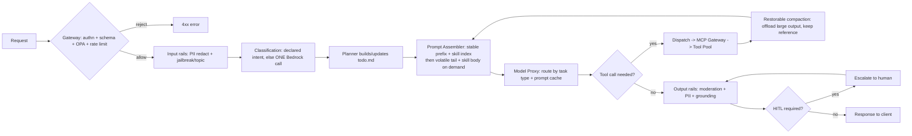

### 2.4 Human-in-the-Loop Flow

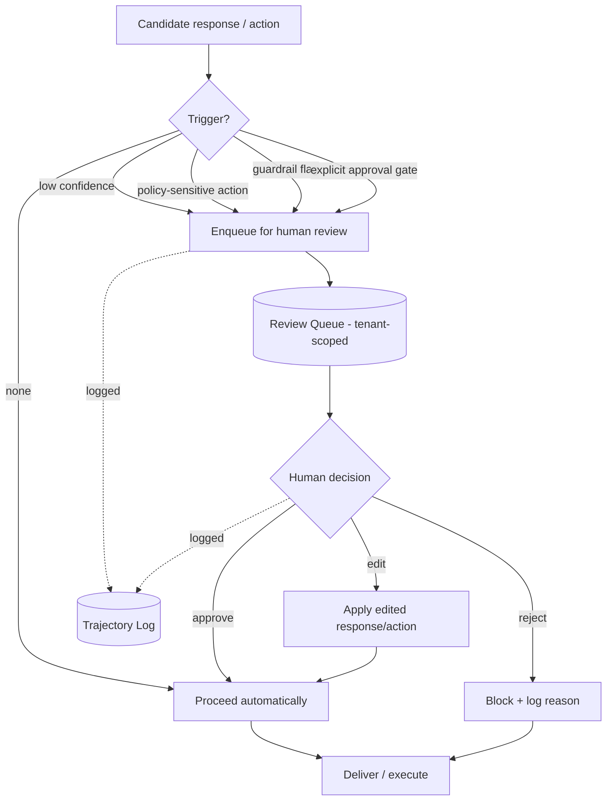

HITL triggers: low model confidence, policy-sensitive/irreversible actions (e.g., writes via `db_*`/`file_*` to production resources), guardrail flags, or an explicit approval gate configured per tenant/agent. All decisions are recorded in the trajectory for audit and RL.

### 2.5 Failures & Escalations Flow

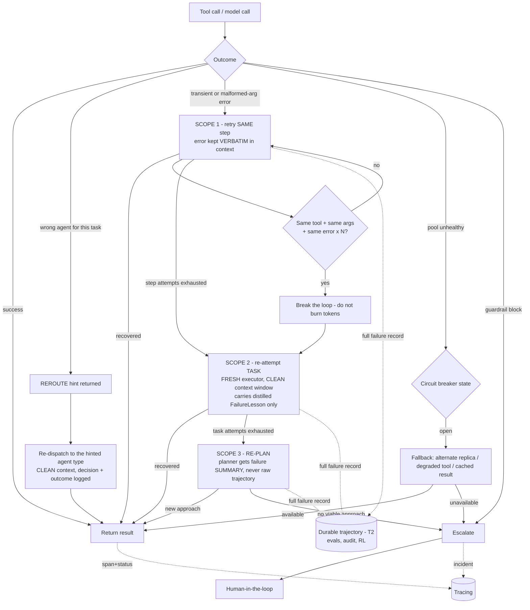

Key rules: retries are **scoped** (§2.13) — verbatim error for a same-step retry, a distilled lesson for a fresh task attempt, a summary for a re-plan; failures are **always** written to the durable trajectory regardless of scope; identical tool + identical arguments + identical error N times (default 3) **breaks the loop** rather than continuing to burn tokens; per-pool circuit breakers prevent cascading failure; a routing mistake is recovered by `REROUTE` rather than treated as a task failure; unrecoverable or policy-blocked cases escalate to HITL. Every outcome emits a span with status.

### 2.6 Guardrails Strategy

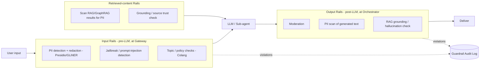

Guardrails are a **pipeline** (P7): input rails run before the model, retrieved content is scanned before it enters context, and output rails run before delivery. Policies are declarative (Colang-style). Violations are logged for audit and feed evaluation.

### 2.7 PII Masking Strategy (final-phase target design, with the Phase-1 interim state)

> **Read this first.** Everything in this subsection describes the **final-phase target** (Phase 6, ADR-009): self-hosted NER, the tenant-scoped vault, reversible tokenization, and authorized re-hydration. It is **not** what Phase 1 ships.
>
> **The Phase-1 interim state** is deliberately narrower and cheaper:
>
> | | Interim (Phase 1 → 5) | Final (Phase 6) |
> | --- | --- | --- |
> | Detection | Deterministic pattern/regex for **structured** entities only: credit card (Luhn-checked), SSN, email, phone. Optionally a **managed** service (e.g. Amazon Comprehend PII) as a stopgap. | Local NER — Presidio + a GLiNER-PII-class model — covering names, addresses, free-text and contextual identifiers |
> | Handling | Replace in place with a non-reversible marker; no vault, no re-hydration | Reversible tokenization against a tenant-scoped encrypted vault, re-hydrated only at authorized delivery |
> | CI gate | **The deterministic "no raw PII in an outbound provider payload" test is a hard, non-negotiable gate from Phase 1 onward** (Property 10) | Same gate, broadened to the NER entity set |
>
> **Binding precondition, not a footnote:** while the interim state is in force, **the platform MUST NOT onboard tenants with regulated data (PHI, PCI cardholder data, or regulated PII).** Unstructured PII is not covered until Phase 6. This is recorded as an accepted risk with its mitigation in §7.10 and as a hard gate on the phases in §8.

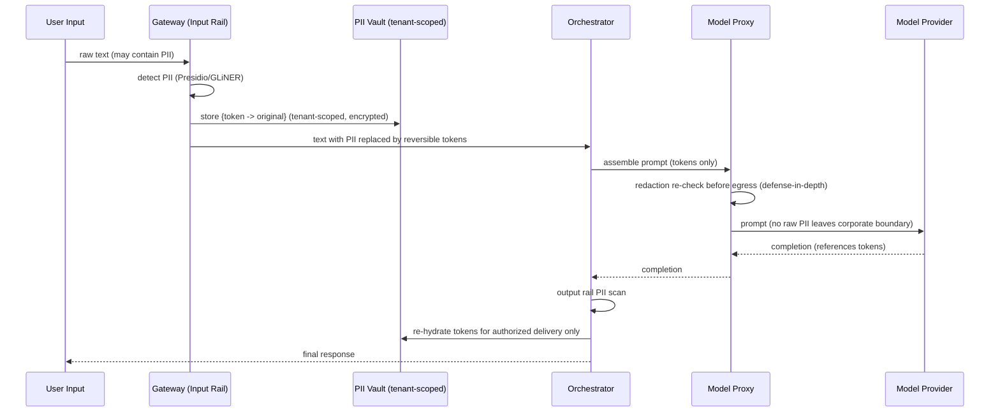

In the final-phase design, PII is detected and replaced with **reversible tokens at the Gateway before egress**; the mapping lives in a tenant-scoped, encrypted vault. Raw PII never reaches the model provider. Re-hydration happens only at authorized delivery. Logs and trajectories store the tokenized form (P6 preserves failures, but never raw PII).

Detection uses [Microsoft Presidio](https://microsoft.github.io/presidio/) for pattern- and NER-based entities plus a lightweight [GLiNER-PII](https://huggingface.co/urchade/gliner_multi_pii-v1)-style model for broader categories (which also covers toxicity, jailbreak, and refusal classification in the same pass). Policy orchestration — which rails run where, and what happens on failure — is expressed declaratively in Colang via [NeMo Guardrails](https://docs.nvidia.com/nemo/guardrails/latest/index.html), whose catalog covers PII detection and masking across input, output, **and retrieval** flows, along with topic control, RAG grounding, and jailbreak prevention. The reversible-tokenization pattern (placeholder → vault) is what makes pre-LLM redaction workable: the agent can still reason over structure, and the response is re-hydrated only for an authorized recipient.

**PII surfaces beyond the prompt.** Redaction is not complete unless it covers every place text lands. The interim gate covers these surfaces for structured entities only; the final stack covers them for the full NER entity set:

| Surface | Requirement |
| --- | --- |
| Prompt / completion | Tokenized before provider egress; re-hydrated only at authorized delivery |
| Traces & spans | Tool arguments and results scrubbed before centralized logging, with a bounded retention window |
| Trajectory store | Tokenized form only; vault refs, never values |
| Eval datasets | Built from tokenized trajectories; a dataset containing raw PII is a compliance incident |
| Error records | Preserved per P6 at every retry scope — verbatim error, distilled lesson, and failure summary alike — with the same tokenization applied to each |
| Vault | Tenant-scoped, encrypted, separate retention and deletion policy so a tenant offboard destroys the mapping |

### 2.8 Operational Failure Modes (designed-for, not discovered later)

These are the failure modes this topology is known to produce. Each has a committed mitigation.

| Failure mode | Symptom | Mitigation |
| --- | --- | --- |
| Tool pool crash loop | Pool replicas restart repeatedly; tool family unavailable | Explicit memory limits, `terminationGracePeriodSeconds` 20–30s so in-flight calls drain, backoff on restart, breaker opens rather than retry-storming |
| Circuit breaker avalanche | One pool's failure cascades as all callers retry in lockstep | Jittered exponential backoff, per-pool breakers (never one global breaker), half-open probe after cooldown |
| Registration storm | After a registry leader election, every pool re-registers simultaneously | Client-side jitter of 1–5s on registration and re-watch |
| Session state corruption | Concurrent tool results write the same session key; history interleaves | Distributed lock or transactional/CAS write per `tenant_id:session_id`; append-only history makes conflicts detectable |
| In-flight session loss on backup/restore | Sessions mid-task vanish or replay incorrectly | Treat session cache as recoverable-but-not-authoritative; the trajectory log is the durable record and can rehydrate a session |
| Cold registry on startup | Orchestrator serves traffic before `tool → pool` is loaded and every call 404s | Readiness probe must confirm the registry loaded; liveness only checks the process. Start order: registry → orchestrator → pools → gateway |
| Cache-busting regression | Costs jump with no traffic change | `prefix_hash` cardinality alert per `(tenant, agent, artifact_version)`; a new hash per request is a defect |
| Prompt-artifact regression | Quality drops after an automated Track B promotion | Eval-gated promotion, canary traffic, pointer rollback (ADR-014) |
| Ingestion config points at a nonexistent or wrong index | Sync job writes nowhere, or into the wrong tenant's index | Typed config validation at load asserts the target index **exists** (Terraform created it) and is partition-scoped; a post-sync smoke retrieval runs before the strategy version is promoted (§3.6) |
| Retrieval strategy regression | A code change to retrieval quietly lowers answer quality | Retrieval accuracy harness (recall@k, MRR/nDCG, groundedness) as a CI regression gate (§3.6, §5.5); strategy is an artifact, rolled back by pointer |
| Failure loop | Agent repeats the same tool with the same arguments and gets the same error, burning tokens until a budget cap | Loop detector: identical `(tool, canonical_args, error_class)` N times (default 3) breaks the loop and escalates the retry scope (§2.13, Property 22) |
| Retry context poisoning | Quality degrades across attempts because failed trajectories accumulated in context | Scope 2 re-attempts spawn a **fresh executor with a clean window** carrying only a `FailureLesson`; the full trajectory stays in T2 (§2.13, Property 23) |
| Skill index bloat | Prefix grows silently as skills are added; cache economics degrade | Hard one-line description budget per skill and a per-agent skill-count ceiling, both enforced at validation; past the ceiling, `skill_search` replaces the flat index (ADR-002b, Property 25) |
| Bad skill promoted | A skill loads but produces wrong behaviour | Skill eval cases are mandatory and gate promotion (§5.5); a skill is canaried and rolled back by pointer like any artifact |
| Sub-graph recursion | Nested sub-graph invocation blows up token spend | Depth counter in the handoff contract, hard limit 2 (3 only with sign-off), enforced at dispatch (§2.12, Property 24) |
| Sandbox loss mid-task (T0 gone) | Agent references a path that no longer exists | Offload to T1 is synchronous with respect to referenceability (Property 20); manifest resolution falls back to T1/T2, never to a bare T0 path |
| Redis eviction of a session manifest | Session appears to vanish between turns | Manifest is rebuildable from T2 trajectory records; eviction policy excludes manifest keys; resume path is tested (Property 21) |
| Autoscaler thrash | Pods scale up and down repeatedly during bursty agent traffic; cost and tail latency both worsen | Generous scale-down stabilization windows; concurrency- or queue-depth signals instead of CPU (§5.7.2); the autoscaling configuration is load-tested before it is trusted (§5.7, Testing Strategy) |
| In-flight session killed by a rollout | Sessions fail during a deploy or a node drain | Drain-before-kill via a `preStop` hook that deregisters first, `terminationGracePeriodSeconds` sized to the longest expected tool call, `maxUnavailable: 0` on request-path rolling updates, and a PodDisruptionBudget per tier (§5.7.4) |

### 2.9 Continuous Improvement Flow (Track A / Track B)

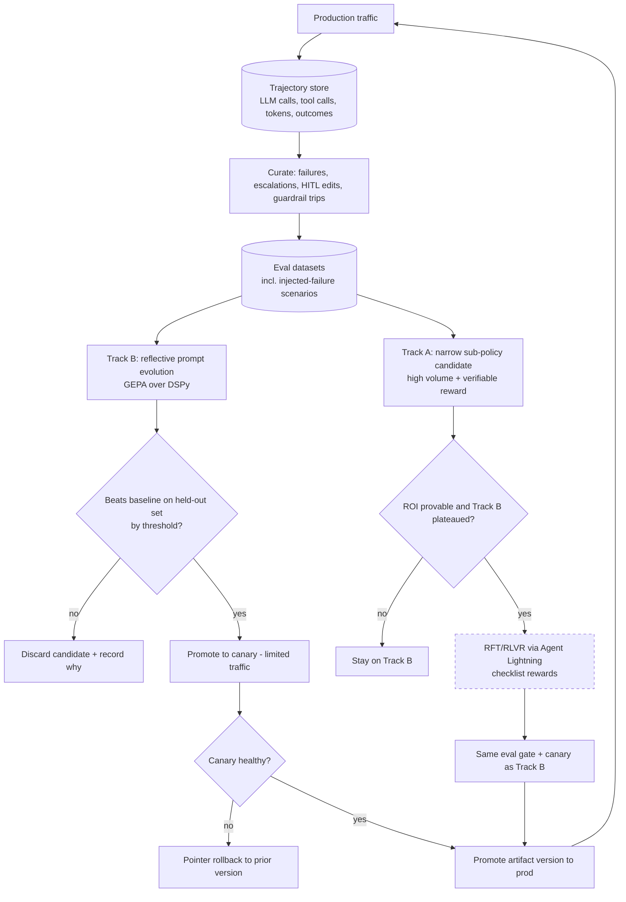

Nothing reaches production without clearing the same gate, whether it came from reflective optimization or weight training (P10).

The Track B loop above is the platform-level view. The **agent-level** version — the reference tuning loop as given, the three additions it needed (canary plus rollback, a human gate, a production feedback edge) and the two constraints on its gate (cost criteria, and no live prefix write) — is **ADR-008a**, with the full analysis at [`docs/vault/architecture/agent-tuning-loop.md`](../../../docs/vault/architecture/agent-tuning-loop.md).

### 2.10 Context Engineering: Session Filesystem and Storage Tiers

This is the layer the platform lives or dies on. Every tool output the agent produces lands in a **per-session filesystem**, and the agent navigates it with ordinary file tools (`file_ls`, `file_grep`, `file_glob`, `file_read`) rather than through a retrieval ranker. The storage behind that filesystem is tiered by access pattern (ADR-016).

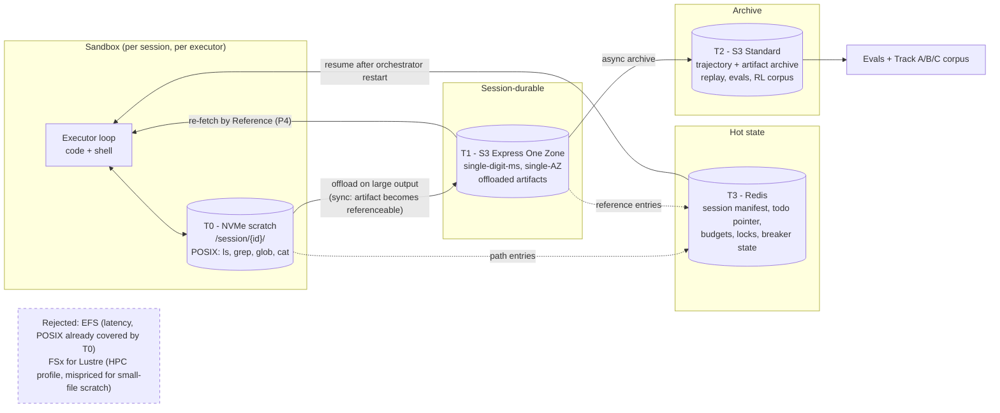

**What each tier must never do.** T0 must never be the only copy of anything referenced in context. T1 must never hold the authoritative trajectory record. T2 must never be on the agent's critical path. T3 must never hold payloads — only the manifest and pointers. Violating any of these turns a four-tier design into an expensive one-tier design.

**Session manifest** (T3) is the index that makes the orchestrator stateless. It is small, cheap to read on every turn, and sufficient to reconstruct what the agent can see:

```pascal
STRUCTURE SessionManifest                 // Redis: eaf:{tenant_id}:{session_id}:manifest
  session_id: String
  tenant_id: String
  artifact_version: String                // prompt/policy version pinned for this session
  catalog_version: String                 // tool catalog version PINNED at session start (§3.8)
  skill_index_version: String             // skill index version PINNED at session start (ADR-002b)
  plan_ref: Reference                     // todo.md in T1
  anchored_summary_ref: Reference?        // persistent structured summary (ADR-006 tier 4)
  entries: List<ManifestEntry>            // everything the agent may reference
  turn_count: Integer
  token_ledger: TokenLedger
  compaction_state: Enum{NONE, TRIMMED, SUMMARIZED, BOTH}
  // ---- Pre-compaction memory flush bookkeeping (ADR-006c) ----
  memory_flush_at: Timestamp?             // when the last flush COMPLETED; null if never
  memory_flush_compaction_count: Integer  // compaction cycles at last flush; enforces once-per-cycle
  // ---- Freshness: THREE timestamps, because they answer three different questions ----
  session_started_at: Timestamp           // when this session IDENTITY began
  last_interaction_at: Timestamp          // last REAL user/channel interaction — drives idle expiry
  updated_at: Timestamp                   // last mutation of ANY kind, including bookkeeping
END STRUCTURE

STRUCTURE ManifestEntry
  logical_path: String                    // "/session/abc/tool_out/01JD8Z.json" - what the agent sees
  tier: Enum{T0, T1, T2}                  // where it currently resides
  reference: Reference                    // tier-qualified locator
  bytes: Integer
  content_digest: String                  // integrity + dedupe
  produced_by_call_id: UUID               // links artifact back to the tool call
  restorable: Boolean = TRUE              // MUST be true; false is a P4 violation
END STRUCTURE
```

**Three freshness timestamps, because they answer three different questions.** The first draft carried `turn_count` and no freshness model at all, which is not enough to build an expiry policy on. Collapsing these into one field is a subtle and consequential mistake:

| Timestamp | Answers | Updated by |
| --- | --- | --- |
| `session_started_at` | When did this session **identity** begin? | Session creation only |
| `last_interaction_at` | When did a **real user or channel interaction** last occur? | User and channel turns **only** |
| `updated_at` | When was this row last mutated **at all**? | Any mutation, including pure bookkeeping |

**The rule that makes the distinction load-bearing: system events — heartbeats, scheduled wakeups, internal notifications, compaction bookkeeping, memory flushes — may mutate the row, but they MUST NOT extend idle-expiry freshness.** If they do, a background job keeps an abandoned conversation alive forever, sessions never expire, and the expiry policy becomes decorative while the storage bill is not. `last_interaction_at` is the only input to idle expiry, and only genuine interaction touches it. This is Property 31.

**Session reset and expiry policy is per-tenant configuration**, not a platform constant: **none** (sessions persist until explicitly ended), a **daily boundary**, or an **idle window** — and where more than one is configured, whichever fires first wins. The platform's obligation is to make the three timestamps correct; the policy over them belongs to the tenant.

The whole model in one picture — **the single forbidden edge is the point of the diagram**:

```mermaid
flowchart LR
    subgraph SRC["What can touch a session"]
        NEW[Session creation]
        UI[User or channel turn<br/>a REAL interaction]
        SY[System event<br/>heartbeat, scheduled wakeup,<br/>internal notification, compaction<br/>bookkeeping, memory flush]
    end

    subgraph MAN["SessionManifest - T3 Redis, small, read on every turn"]
        TS1[session_started_at<br/>when this session IDENTITY began<br/>written ONCE, never mutated]
        TS2[last_interaction_at<br/>THE ONLY input to idle expiry]
        TS3[updated_at<br/>last mutation of ANY kind,<br/>including pure bookkeeping]
        PIN[Pinned versions<br/>artifact_version, catalog_version,<br/>skill_index_version<br/>fixed at session start, never mid-session]
        ENT[entries - ManifestEntry list<br/>logical_path, tier, Reference, digest<br/>everything the agent may reference]
    end

    NEW --> TS1
    UI --> TS2
    UI --> TS3
    SY --> TS3
    SY -. "MUST NOT extend this - Property 31" .-> TS2

    TS2 --> EXP{Per-tenant expiry policy<br/>none / daily boundary / idle window<br/>first to fire wins}
    EXP -- "window elapsed" --> EXPD[Session expires]

    style SY stroke-dasharray: 5 5
```

Read the dotted edge as the defect it prevents: wire a heartbeat to `last_interaction_at` and abandoned conversations never expire, the tenant's policy becomes decorative, and the only visible symptom is the storage bill.

**Compaction triggers.** Compaction is not a background sweep on a timer; it fires on measurable conditions, and it always runs off the critical path (ADR-006):

| Trigger | Condition | Action |
| --- | --- | --- |
| Output-size trigger | A single tool result exceeds the inline budget | Offload to T1, keep `compact` + `Reference` |
| Occupancy trigger | Volatile tail exceeds a share of the context window | Structurally lossless trim (strip raw blobs, base64, tool metadata; keep user/assistant text verbatim) |
| Turn-depth trigger | Session passes a turn threshold | Async anchored summarization of the coldest history segment |
| **Self-compaction (active) trigger** | The agent itself calls a `context_compact` tool because it judges the tail no longer useful | Agent-nominated segments trimmed/summarized — the agent knows what it is done with better than a heuristic does |
| **Memory-flush trigger** (ADR-006c) | Occupancy crosses a **soft threshold a configurable token gap below** the compaction threshold, and no flush has run for this compaction cycle, and the workspace is writable | A **silent turn** (ADR-006d) in which the agent writes durable reasoning state to the workspace. Then, and only then, compaction proceeds (Property 28) |
| **Mid-turn precheck trigger** (ADR-006 rule 6) | After a tool result is appended and **before** the next model call, the same turn-start budget estimator says the prompt no longer fits | **Raise a structured signal and stop the prompt submission — do not compact inline.** The outer run loop truncates oversized tool results if that suffices, else compacts and retries the turn |
| Overflow trigger | A model call fails with context overflow — recognized as an **error family**, not one provider's wording | Emergency trim, then one retry (§Error Handling). **Forward the provider's attempted token count** into compaction when reported; when overflow is confirmed but no count is parseable, pass a **minimally over-budget synthetic count**. On repeated failure, surface explicit guidance and **preserve the session mapping** — never silently rotate to a fresh session |

The self-compaction trigger is the interesting one: letting the agent decide when to compact reports better token reduction at equal accuracy than fixed heuristics, because the agent has information the heuristic does not — whether it still intends to use a given artifact. It is exposed as a normal tool so the decision appears in the trajectory and can be evaluated.

The two new triggers are worth reading together, because they are the same principle applied at different distances from the cliff. The memory-flush trigger fires **early and deliberately**, while there is room to spend a turn well. The mid-turn precheck fires **late and defensively**, and its whole job is to refuse to fix the problem itself — it detects and signals, and the outer loop decides. Neither one blocks a turn on a summarizer, which is what makes ADR-006's rule 2 an actual property rather than an intention.

> **The context-token counter is a runtime estimate, not a strict guarantee.** Every occupancy threshold, soft threshold, and token-share split above is computed from an estimate, and estimates drift from what a provider's tokenizer actually charges — by model, by content, and by how tool payloads are serialized. This is stated plainly because implying precision we do not have leads to thresholds set as though they were exact, and then to overflow errors that "should have been impossible." Where a provider hands back an observed count, that number wins over ours (ADR-006 rule 7).

**Restorability rule, restated as a check.** Every compaction operation must leave a resolvable `logical_path` in the manifest for everything it removed. Dropping page content while keeping the URL is legal; dropping the URL too is a defect. This is Property 7 and it is tested deterministically, not assumed.

### 2.11 Ownership Boundaries: Terraform vs Code vs Config

There is no general pipeline configuration language in this platform (ADR-015). Three owners, one concern each, and nothing crosses the line.

> **While development is local (ADR-019), the "Terraform" box is played by Docker Compose.** The boundary is unchanged — *something declarative owns resource lifecycle, and neither code nor config ever creates a resource* — but the declarative thing is a Compose file, not Terraform. **There is no Terraform for local**; it arrives post-checkpoint, along with the cloud resources it would own (§4.3, §8). Read "Terraform" below as "whatever owns resource lifecycle in this environment."

```mermaid
flowchart LR
    subgraph TF["Terraform - owns infrastructure lifecycle"]
        TFA[Vector store + indexes]
        TFB[Graph store]
        TFC[Buckets - T1/T2, artifact bundles]
        TFD[IAM, KMS, network, egress]
    end

    subgraph CODE["Code - owns behaviour, versioned as artifacts"]
        CA[Document sync pipeline<br/>syncs INTO resources that already exist]
        CB[Retrieval strategy<br/>modes, fusion, reranking]
        CC[Agent definitions + executor loops]
        CD[GraphRAG extraction + community building]
    end

    subgraph CFG["Narrow typed config - the ONLY config surface"]
        CFA[source location]
        CFB[chunking strategy + parameters]
        CFC[embedding model + dimensions]
        CFD[target index name]
        CFE[retrieval mode + top_k - optional]
    end

    subgraph SKILL["Skills - the config surface for CAPABILITY"]
        SK[manifest + body + resources + eval cases<br/>no code, no redeploy - ADR-002b]
    end

    TF -->|creates| STORES[(Vector / fulltext / graph stores + indexes)]
    CFG -->|validated - target index MUST already exist| CA
    CA -->|writes documents| STORES
    CB -->|reads| STORES
    CB --> EVALH[Retrieval accuracy harness<br/>recall@k, MRR/nDCG, groundedness]
    EVALH -->|CI regression gate| CB
    SKILL -->|policy grant + pointer promotion| CC
    CODE -.->|artifacts under ADR-014| ART[(Artifact registry<br/>content-hashed, canaried)]
    SKILL -.-> ART
```

Three rules make the boundary hold: **config never creates a resource** (Terraform owns lifecycle; a config referencing a nonexistent index fails validation), **code never hardcodes a per-corpus knob** (chunking and embeddings belong in config because they are tuned per corpus by people who should not need a deploy), and **capability arrives as a skill, not as config** (ADR-002b, P12). Full detail in §3.6 (document sync + ingestion config + accuracy harness) and §3.8 (tool onboarding).

### 2.12 Capability Extension Ladder

The single question this subsection answers: *"we want the agent to do a new thing — what do we build?"* Apply the ladder **strictly in order** and stop at the first rung that works.

| Want to add | Use | Cost | Requires |
| --- | --- | --- | --- |
| A new **procedure** over existing tools | **Skill** (ADR-002b) | A folder + eval cases | **No code** |
| A new way to **touch the outside world** | **Tool** — an MCP server (§3.8) | Code in the MCP server only | **No platform change** |
| A new **execution topology** | **Sub-graph** (§2.12.1) | Code + justification | One of the ADR-012 forcing functions must genuinely apply |

A reviewer can apply this mechanically. "We need another node" is almost never the right answer to a capability request; it is the answer to a *topology* request, and topology requests are rare. If the request can be written as instructions over tools that exist, it is a skill and the review is about the instructions and the eval cases, not about the graph.

#### 2.12.1 The Sub-graph Plan, Finalized

A sub-graph is not "more nodes in the parent graph." It is a **compiled, self-contained unit** with:

- **Its own stable prefix.** A sub-graph is an independent prompt-assembly domain, so its prefix caches independently of the parent's and adding one never perturbs the parent's prefix (P2, ADR-004).
- **Its own isolated context window.** Nothing of the parent's trajectory leaks in beyond the explicit handoff (P5).
- **Its own registry entry, version, eval suite, and model route.** A sub-graph is versioned and promoted like any other artifact (ADR-014) and can be routed to a different model than its parent (ADR-011).

**The key move: the parent invokes a sub-graph as a tool.** From the parent's perspective a sub-graph is one more entry in the tool catalog that takes structured arguments and returns a structured result. That is the whole trick, and it is what decouples capability scale from topology scale: **the parent's graph does not grow when you add a sub-graph.**

```mermaid
flowchart TB
    subgraph GOOD["Sub-graph as a tool - parent topology is CONSTANT"]
        PL[Parent executor loop<br/>own stable prefix, own context]
        PL -->|tool call subgraph_invoke at depth 1| SGA[[Sub-graph A<br/>OWN stable prefix<br/>OWN isolated context window<br/>own version, own evals, own model route]]
        PL -->|tool call subgraph_invoke at depth 1| SGB[[Sub-graph B<br/>OWN prefix + context]]
        SGA -->|structured submit_results - constrained decoding| PL
        SGB -->|structured submit_results| PL
        SGA -->|depth 2 - LAST LEVEL| SGC[[Sub-graph C]]
        SGC -->|structured submit_results| SGA
        SGC -.->|depth 3 REJECTED at dispatch<br/>unless explicitly signed off| BLOCK[Denied]
        NOTE[Adding Sub-graph D adds ONE tool entry<br/>to the parent. No new parent edges.<br/>No parent prompt change beyond the catalog version.]
    end

    subgraph BAD["Rejected: flat mega-graph - topology grows with capability"]
        R[Central router<br/>prompt grows with N]
        R --> N1[node 1] & N2[node 2] & N3[node 3] & N4[node ...N]
        SS[(One shared state object<br/>every node sees every other node's residue)]
        N1 --- SS
        N2 --- SS
        N3 --- SS
        N4 --- SS
    end

    style BLOCK stroke-dasharray: 5 5
    style BAD stroke-dasharray: 5 5
```

**Hard depth limit: 2 levels; 3 only with explicit sign-off.** Unbounded nesting is how a sub-graph registry turns into runaway recursion and token blowup — each level multiplies context and cost. Enforcement is not advisory:

- The handoff contract carries a **`depth` counter** (`SubAgentHandoff.depth`, §3.1.3).
- Dispatch **rejects** an invocation whose resulting depth would exceed the limit, before any model call. Depth 3 requires a recorded sign-off on the sub-graph's registry entry (`max_depth_signoff`), and depth 4 is not expressible.
- The limit is a correctness property (Property 24), tested deterministically rather than trusted.

**A second admission check: a hard size cap on inherited context.** §3.1.3 scales the handoff by a complexity flag — minimal instructions for `SIMPLE`, trajectory plus filesystem handle for `COMPLEX`. That is the right *intent* and a flag is a bad *guarantee*: `COMPLEX` is set by a planner, and a planner that sets it on a branch which has grown to a quarter-million tokens produces a child that starts already near its ceiling, immediately compacts, and does its first real work from a summary.

So dispatch adds a check that **does not consult the flag at all**:

> **If the parent branch exceeds a fixed size threshold (~100K tokens), the child starts with ISOLATED context — regardless of `complexity`.**

**This is deliberately automatic and deliberately not configurable.** A knob here would be turned down under deadline pressure by someone reasoning that this particular parent is fine, and the resulting failure is expensive and diffuse: a child that behaves subtly worse for reasons nobody connects back to a handoff size. The cap is not a tuning parameter, it is a floor under P5 — context isolation is why multi-agent works, and a large enough inheritance quietly repeals it.

Both admission checks run at the same place, before any model call, and they compose: `depth` bounds how *deep* the tree goes, the size cap bounds how *heavy* any single edge in it is. Together they are what keeps §2.12.1 spawn and §2.13 scope-2 re-attempt from degrading as sessions get long. This is Property 30.

Two related constraints from the fork model (ADR-006 rule 4) apply to spawn as well: **a fork is refused while the parent has an active run**, and **a forked child gets fresh token counters** rather than inheriting the parent's spent ledger.

**Results return through the existing path.** A sub-graph returns via the same structured `submit_results` tool with constrained decoding (§3.1.3) — including the `REROUTE` outcome, so a sub-graph that was the wrong choice hands back a hint instead of failing the task. No new return mechanism is introduced.

### 2.13 Retry, Recovery, and Failure Scoping

The original version of this design said "keep errors in context (P6)" and left it there. That conflated three different scopes and, at two of them, it was **wrong** — carrying accumulated failed trajectories into a fresh attempt poisons the attempt. The corrected model separates the scopes explicitly.

| Scope | Trigger | Context carried forward | Why |
| --- | --- | --- | --- |
| **1 — Retry the same step** | Malformed argument, transient error, schema violation | **The error, VERBATIM** | The model needs the exact failure text to correct the call. A summarized "it failed" is useless here. This is the scope where "keep errors in context" is exactly right. |
| **2 — Re-attempt the task** | Repeated step failure; the step-level retries are exhausted or the loop detector fired | **A FRESH executor with a CLEAN context window, carrying only a distilled `FailureLesson`** — e.g. *"a previous attempt failed because the policy ID format was wrong; do not repeat that"* | Accumulated failed trajectories crowd out the task, bias the model toward the failed approach, and cost tokens for negative value. The lesson is the signal; the wreckage is noise. |
| **3 — Re-plan** | Task attempts exhausted, or the failure indicates the plan itself is wrong | **A failure SUMMARY, never the raw failed trajectory** | The planner is deciding on a different approach. It needs the shape of what went wrong, not the transcript. |

**The corrected invariant, stated plainly:**

> **Failures are ALWAYS preserved in the durable trajectory record — for evals, audit, and RL. What is carried into a RETRY CONTEXT is a distilled lesson, not accumulated wreckage.**

These are two different questions that the original P6 answered as one. Durability is non-negotiable and total (nothing is swallowed, Property 12). Context inclusion is scoped, and at scope 2 the right amount of failed trajectory in the new context is **none of it, plus one lesson**.

**Failure-loop detection.** Without it, scope-1 retries can spin: the model re-emits the same call, gets the same error, and reasons about it again. The detector is deliberately simple and deterministic:

```pascal
PROCEDURE detect_failure_loop(recent_failures, threshold)
  INPUT:  recent_failures (ordered list of (tool_name, canonical_args, error_class))
          threshold (default 3)
  OUTPUT: LoopDetected | NoLoop

  SEQUENCE
    IF length(recent_failures) < threshold THEN RETURN NoLoop END IF

    window ← last(recent_failures, threshold)
    first  ← window[0]

    // Identical tool + identical canonicalized arguments + identical error class
    FOR each f IN window DO
      IF f.tool_name ≠ first.tool_name THEN RETURN NoLoop END IF
      IF f.canonical_args ≠ first.canonical_args THEN RETURN NoLoop END IF
      IF f.error_class ≠ first.error_class THEN RETURN NoLoop END IF
    END FOR

    RETURN LoopDetected(first)        // break the loop; escalate to scope 2
  END SEQUENCE
END PROCEDURE
```

**Preconditions.** `recent_failures` are from one executor attempt, ordered oldest to newest; arguments are canonicalized with deterministic key ordering (P2) so semantically identical calls compare equal.
**Postconditions.** `LoopDetected` iff the last `threshold` failures are identical in tool, canonical arguments, and error class. On detection the step-retry scope is abandoned and control escalates to scope 2 — it does not continue spending tokens on a call that has failed identically three times.
**Loop invariant.** While scanning the window, every failure inspected so far matched `first` on all three fields; the first mismatch returns `NoLoop` immediately.

`threshold` is configurable per agent but has a hard ceiling, because "retry until the budget cap" is not a recovery strategy. Loop detection is Property 22.

**How scope 2 is built.** A scope-2 re-attempt is a genuinely new executor: new context window, same goal, same tools, plus one `FailureLesson` (§3.1.9) appended to the volatile tail. The failed attempt's full trajectory remains addressable in T2 via `FailureLesson.failed_trajectory_ref`, so an eval or a human debugging the case loses nothing — but the retrying model does not read it, which is the point.
---

## 3. Low-Level Architecture

This section defines **the data passed between components**, **how components interact**, and a **detailed end-to-end walkthrough of a single request**. Contracts are written as structured pseudocode; JSON-shaped payloads use deterministic key ordering (P2).

### 3.1 Core Data Contracts

#### 3.1.1 Inbound Request & Tenant Context

```pascal
STRUCTURE InboundRequest
  request_id: UUID            // generated at gateway, used as trace root
  tenant_id: String           // from validated JWT claim
  agent_id: String            // logical agent the client is invoking
  session_id: String          // conversation/session key (Redis)
  input_text: String          // raw user input (pre-redaction)
  attachments: List<Reference>// optional object-store references
  metadata: Map<String,String>// channel, locale, etc. (NO per-second timestamps in prefix)
END STRUCTURE

STRUCTURE TenantContext
  tenant_id: String
  // ---- The DELEGATED USER: established at L1, carried everywhere (ADR-010) ----
  user: UserPrincipal         // WHO the agent is acting FOR. Never optional.
  // ---- The ACTING AGENT: authenticated separately at L3 ----
  agent_id: String            // which agent is acting
  scopes: List<String>        // granted OAuth scopes
  tool_allowlist: List<String>// per-agent allowed tool prefixes/names (OPA-resolved)
  rate_limit: RatePolicy      // requests/tokens per window
  data_partition: String      // isolation key for memory/registry/vault
END STRUCTURE

STRUCTURE UserPrincipal        // the on-behalf-of identity; the input to L3 check 3
  subject: String              // OAuth/JWT subject of the HUMAN, not the agent
  roles: List<String>          // resolved from the tenant's identity provider
  data_scopes: List<String>    // what THIS USER may reach, independent of the agent
  auth_time: Timestamp         // when the user actually authenticated
END STRUCTURE
```

**Why `user` is not optional, stated as a rule rather than a convention.** An agent's effective access is the **intersection** of what the agent is granted and what its delegated user may reach — never the union, and never just the agent's grant. Making the field nullable would make the intersection unenforceable in exactly the case that matters (a background or system-initiated turn), and "no user" would silently read as "no user restriction." Where a turn genuinely has no human behind it — a scheduled job, a system notification — it carries an explicit **service principal** with its own narrow `data_scopes`, not a null. This is Property 32.

#### 3.1.2 Guardrail & PII Contracts

```pascal
STRUCTURE GuardrailVerdict
  stage: Enum{INPUT, RETRIEVED, OUTPUT}
  allowed: Boolean
  violations: List<Violation>       // e.g., JAILBREAK, TOPIC, MODERATION, UNGROUNDED
  redacted_text: String             // text with PII replaced by tokens
  pii_tokens: List<PiiToken>        // reversible token references (values in vault)
END STRUCTURE

STRUCTURE PiiToken
  token: String                     // e.g., "<PII_EMAIL_1>"
  entity_type: String               // EMAIL, PHONE, SSN, NAME, ...
  vault_ref: String                 // tenant-scoped encrypted vault key
END STRUCTURE
```

#### 3.1.3 Planner Handoff & Sub-agent Contracts

```pascal
STRUCTURE TaskPlan
  plan_id: UUID
  todo: List<TodoItem>              // recited at context tail (goal recitation)
  complexity: Enum{SIMPLE, COMPLEX}
END STRUCTURE

STRUCTURE TodoItem
  id: String
  description: String
  status: Enum{PENDING, IN_PROGRESS, DONE, BLOCKED}
  assigned_agent_type: String       // coding | research | math | ...

// Handoff scales with complexity (ADR-002 / P5)
STRUCTURE SubAgentHandoff
  handoff_id: UUID
  agent_type: String
  instructions: String              // minimal for SIMPLE tasks
  shared_trajectory_ref: Reference? // present only for COMPLEX tasks
  shared_fs_handle: Reference?      // sandbox/object-store scope for COMPLEX tasks
  allowed_tools: List<String>       // subset of tenant tool_allowlist
  granted_skills: List<String>      // skill names in the pinned skill index (ADR-002b)
  catalog_version: String           // pinned tool catalog version (§3.8)
  depth: Integer = 0                // sub-graph nesting depth; dispatch REJECTS depth > 2 (§2.12.1)
  parent_entry_id: String?          // branch point in the transcript TREE (§3.1.11); spawn is a FORK
  parent_branch_tokens: Integer     // size of the parent branch at spawn; see the cap below
  context_mode: Enum{MINIMAL, SHARED, ISOLATED}  // DERIVED, not requested — see the cap
  attempt_number: Integer = 1       // scope-2 re-attempt counter (§2.13)
  failure_lesson: FailureLesson?    // present ONLY on a scope-2 re-attempt; NEVER a raw trajectory
END STRUCTURE
```

**The size cap overrides the complexity flag (§2.12.1, Property 30).** `context_mode` is *derived at dispatch*, never taken from the caller:

```pascal
PROCEDURE derive_context_mode(plan_complexity, parent_branch_tokens)
  INPUT:  plan_complexity ∈ {SIMPLE, COMPLEX}
          parent_branch_tokens (measured, not declared)
  OUTPUT: context_mode ∈ {MINIMAL, SHARED, ISOLATED}

  SEQUENCE
    // The defensive cap runs FIRST and is not conditional on the flag.
    IF parent_branch_tokens > PARENT_BRANCH_TOKEN_CAP THEN     // ~100K; NOT configurable
      RETURN ISOLATED
    END IF

    IF plan_complexity = COMPLEX THEN
      RETURN SHARED                    // trajectory ref + filesystem handle
    ELSE
      RETURN MINIMAL                   // instructions only
    END IF
  END SEQUENCE
END PROCEDURE
```

**Preconditions.** `parent_branch_tokens` is measured from the parent branch at spawn time, not supplied by the caller; `PARENT_BRANCH_TOKEN_CAP` is a build-time constant with no configuration override.
**Postconditions.** `context_mode = ISOLATED` whenever the cap is exceeded, for **every** value of `plan_complexity`. A `COMPLEX` handoff off an oversized parent is isolated, and this is not overridable at runtime.
**Loop invariants.** None — the procedure is branch-only, deliberately, so it cannot be made to do more than it does.

```pascal
// Structured return via submit-results tool with constrained decoding
STRUCTURE SubAgentResult
  handoff_id: UUID
  status: Enum{SUCCESS, PARTIAL, FAILED, REROUTE}   // REROUTE: wrong agent, not a failure (ADR-013)
  summary: String                   // compact, goes into orchestrator context
  artifacts: List<Reference>        // full outputs offloaded to external memory (P4)
  errors: List<ErrorRecord>         // always written durably (P6); context inclusion is scoped (§2.13)
  reroute_hint: RerouteHint?        // present iff status = REROUTE
END STRUCTURE

STRUCTURE RerouteHint                // ADR-013: the router must be recoverable, not perfect
  suggested_agent_type: String       // where this actually belongs
  observed_intent: String            // what the task actually looks like, in one line
  confidence: Float                  // executor's confidence in the suggestion
  // Logged with the original routing decision + tier; becomes a training label for T3/T4.
END STRUCTURE
```

#### 3.1.4 Prompt Assembly Contract (KV-cache-first)

```pascal
STRUCTURE AssembledPrompt
  // ----- STABLE PREFIX (never mutates within a session) -----
  system_prompt: String             // fixed text, no timestamps
  tool_definitions: List<ToolDef>   // FULL set from the PINNED catalog version, FIXED order (§3.8)
  skill_index: List<SkillIndexEntry>// name + ONE-LINE description ONLY; pinned per session (ADR-002b)
  few_shot: List<Exemplar>          // fixed exemplars
  cache_breakpoint: Marker          // explicit KV-cache boundary here
  // ----- VOLATILE TAIL (append-only) -----
  task_state: String                // compact
  todo_recitation: String           // todo.md re-rendered at the tail
  loaded_skill_bodies: List<String> // progressive disclosure: full bodies land HERE, never in the prefix
  failure_lesson: FailureLesson?    // scope-2 re-attempts only (§2.13); never a raw failed trajectory
  history: List<Message>            // append-only; tool results are REFERENCES
  tool_mask: LogitMask              // allowlist for THIS state (masking, not mutation)
END STRUCTURE

STRUCTURE SkillIndexEntry           // the ONLY part of a skill that costs prefix tokens
  name: String
  description: String               // hard length budget; enforced at skill validation
  version: String                   // for trajectory attribution
END STRUCTURE

STRUCTURE ToolDef
  name: String                      // consistent prefix: browser_*, db_*, file_*, search_*
  description: String
  input_schema: JsonSchema          // deterministic key ordering
```

**Assembly order (MUST be stable):** `system_prompt → tool_definitions (fixed order, pinned catalog) → skill_index (fixed order, pinned) → few_shot → [CACHE BREAKPOINT] → task_state → todo_recitation → loaded_skill_bodies → failure_lesson? → append-only history`. Three things vary per state without touching the prefix: the tool **mask** (ADR-005), which **skill bodies** are loaded (ADR-002b progressive disclosure), and whether a **failure lesson** is present (§2.13). The tool **definitions** and the **skill index** never change within a session — both are pinned at session start and change only at a version boundary. Any mutation of the prefix invalidates the cache and is treated as a defect; the assembler emits a `prefix_hash` span so cache-busting regressions are caught in observability.

#### 3.1.5 Tool Call & Result Contracts (through MCP Gateway)

```pascal
STRUCTURE ToolCall
  call_id: UUID
  tenant_id: String
  agent_id: String                  // the ACTING agent — authenticated at the MCP gateway
  on_behalf_of: UserPrincipal       // the DELEGATED user — required for L3 check 3 (ADR-010).
                                    // Without this the gateway can only check the agent, which
                                    // is the confused-deputy hole. Property 32.
  tool_name: String                 // resolved to a pool via registry
  arguments: Json                   // deterministic key ordering
  trace_context: SpanContext        // propagates the distributed trace
END STRUCTURE

STRUCTURE ToolResult
  call_id: UUID
  status: Enum{OK, TOOL_ERROR, TIMEOUT, CIRCUIT_OPEN}
  // Full vs compact representation (P3/P4):
  compact: String                   // short summary kept in context
  artifact_ref: Reference?          // full result offloaded to external memory
  metrics: ToolMetrics              // latency, bytes, pool, replica
END STRUCTURE

STRUCTURE RegistryEntry
  tool_name: String
  pool: String                      // e.g., "db-pool"
  network_policy: String
  circuit_breaker: BreakerPolicy
END STRUCTURE
```

#### 3.1.6 Retrieval Contracts (RAG + GraphRAG)

```pascal
STRUCTURE RetrievalQuery
  query_text: String
  strategy: Enum{VECTOR, GRAPH, HYBRID}   // router-selected (ADR-007)
  tenant_id: String
  top_k: Integer

STRUCTURE RetrievalResult
  chunks: List<Chunk>               // vector recall
  graph_context: List<GraphPath>    // multi-hop paths / community summaries
  citations: List<Reference>        // for grounding checks in output rails
```

#### 3.1.7 Observability Contract (the per-request trace)

```pascal
STRUCTURE TrajectoryRecord
  request_id: UUID
  tenant_id: String
  spans: List<Span>                 // gateway → orchestrator → tool pool
  llm_calls: List<LlmCallRecord>    // inputs/outputs/retrieved/tool calls/latency
  token_accounting: TokenLedger     // prompt/completion, cached vs uncached
  kv_cache_hit_rate: Float          // north-star cost metric (P1)
  guardrail_events: List<GuardrailVerdict>
  catalog_version: String           // tool catalog that governed this request (§3.8)
  skill_index_version: String       // skill index that governed this request (ADR-002b)
  skills_loaded: List<String>       // which skill bodies were actually disclosed, for eval attribution
  routing_decisions: List<RoutingDecision>  // tier, label, confidence, and outcome (ADR-013 training set)
  attempts: List<AttemptRecord>     // every attempt at every scope, INCLUDING failed ones (P6, §2.13)
  outcome: Enum{DELIVERED, ESCALATED, BLOCKED, FAILED}

STRUCTURE RoutingDecision           // logged for later; nothing trains on it yet (ADR-013)
  source: Enum{DECLARED, MODEL}     // declared intent short-circuit, or the Bedrock call
  label: String                     // chosen agent_type
  confidence: Float                 // MODEL only; DECLARED is certain by construction
  downstream_outcome: Enum{SUCCESS, REROUTED, FAILED}   // ground-truth label, logged not consumed

STRUCTURE AttemptRecord             // durable record of a scope-1/2/3 attempt (P6 is total here)
  attempt_number: Integer
  scope: Enum{STEP_RETRY, TASK_REATTEMPT, REPLAN}
  errors: List<ErrorRecord>         // verbatim, tokenized
  lesson_emitted: FailureLesson?    // what was distilled forward, if anything
  loop_detected: Boolean            // §2.13 detector fired

STRUCTURE TokenLedger
  cached_input_tokens: Integer
  uncached_input_tokens: Integer
  completion_tokens: Integer
  estimated_cost: Float
```

#### 3.1.8 Wire Examples

The structures above define the contracts; these are the concrete payloads that cross the wire. Keys are emitted in a fixed order (P2) — a serializer that sorts keys differently between turns is a cache-busting defect.

**Gateway → Orchestrator** (post-redaction, post-authorization):

```json
{
  "request_id": "01JD8ZC7Q3K9V2F5M8N1P4R7T0",
  "tenant_id": "tnt_4471",
  "agent_id": "support_resolver",
  "session_id": "sess_a91f",
  "input_text": "Refund the order for <PII_EMAIL_1>, card ending <PII_CARD_1>",
  "pii_tokens": [
    { "token": "<PII_EMAIL_1>", "entity_type": "EMAIL",       "vault_ref": "tnt_4471/v1/9c2a" },
    { "token": "<PII_CARD_1>",  "entity_type": "CREDIT_CARD", "vault_ref": "tnt_4471/v1/9c2b" }
  ],
  "tenant_context": {
    "auth_subject": "svc:zendesk-bridge",
    "scopes": ["agent.invoke", "orders.read"],
    "data_partition": "tnt_4471",
    "policy_version": "sha256:9f2c1d",
    "tool_mask": { "mode": "auto", "allow_prefixes": ["db_", "search_", "file_read"], "deny": ["file_delete"] }
  },
  "guardrail": { "stage": "INPUT", "allowed": true, "violations": [] }
}
```

**Orchestrator → MCP Gateway** (one tool call):

```json
{
  "call_id": "01JD8ZCA1M4X8Q2B7H3S6W9Y2E",
  "request_id": "01JD8ZC7Q3K9V2F5M8N1P4R7T0",
  "tenant_id": "tnt_4471",
  "agent_id": "support_resolver",
  "tool_name": "db_read",
  "arguments": { "query_id": "order_by_email", "params": { "email_token": "<PII_EMAIL_1>" } },
  "policy_version": "sha256:9f2c1d",
  "trace_context": { "trace_id": "4bf92f3577b34da6a3ce929d0e0e4736", "span_id": "00f067aa0ba902b7" }
}
```

**Tool Pool → Orchestrator** (large result already offloaded):

```json
{
  "call_id": "01JD8ZCA1M4X8Q2B7H3S6W9Y2E",
  "status": "OK",
  "compact": "1 order found: ORD-88213, total 149.00 EUR, status SHIPPED, placed 2026-02-11",
  "artifact_ref": "s3://eaf-tnt4471-artifacts/sess_a91f/01JD8ZCA.json",
  "metrics": { "latency_ms": 84, "bytes": 41822, "pool": "db-pool", "replica": "db-pool-7f4c9" }
}
```

Only `compact` and `artifact_ref` enter the context; the 41 KB payload stays in the store and is re-fetchable by reference (P4).

#### 3.1.9 Failure Scoping Contract

The contract that makes §2.13 scope 2 work: what a fresh attempt is *allowed* to know about the attempt before it.

```pascal
STRUCTURE FailureLesson              // distilled; NEVER contains the failed trajectory itself
  attempt_number: Integer            // which re-attempt this lesson is being handed to
  failed_step: String                // the step/todo id that failed, not its transcript
  root_cause_class: Enum{
    ARG_FORMAT,                      // wrong shape/format of an argument
    ARG_VALUE,                       // plausible shape, wrong value
    MISSING_PRECONDITION,            // acted before a required prior step
    WRONG_TOOL,                      // reached for a tool that cannot do the job
    PERMISSION,                      // policy denied it; retrying identically cannot help
    UPSTREAM_ERROR,                  // the target system failed, not the agent
    LOOP_DETECTED,                   // §2.13 loop detector fired
    UNKNOWN
  }
  lesson_text: String                // ONE short paragraph, e.g. "the policy ID format was wrong"
  do_not_repeat: List<String>        // explicit negative constraints for this attempt
  failed_trajectory_ref: Reference   // FULL failed trajectory in the T2 archive (audit/eval/RL)
END STRUCTURE
```

**The two-part guarantee.** `failed_trajectory_ref` always resolves — nothing is lost (Property 12). And the retrying executor's context contains `lesson_text` + `do_not_repeat` and **nothing else** from the failed attempt — no accumulated wreckage (Property 23). A `FailureLesson` whose `lesson_text` is a paste of the failed transcript is a defect, and its length is bounded at construction for exactly that reason.

**Wire example** (orchestrator → fresh executor on a scope-2 re-attempt):

```json
{
  "attempt_number": 2,
  "failed_step": "todo-3",
  "root_cause_class": "ARG_FORMAT",
  "lesson_text": "A previous attempt failed because the policy ID was passed as an integer; this API requires the prefixed string form.",
  "do_not_repeat": ["passing policy_id as a bare integer"],
  "failed_trajectory_ref": "s3://eaf-tnt4471-archive/traj/01JD8ZC7/attempt-1.json"
}
```

#### 3.1.10 Skill and Tool Catalog Contracts

`SkillManifest` and `Skill` are defined in ADR-002b. The two version artifacts that pin a session are here.

```pascal
STRUCTURE SkillIndexVersion          // pinned at session start; contributes to the STABLE PREFIX
  version: String                    // content hash over the ordered index entries
  agent_id: String
  entries: List<SkillIndexEntry>     // §3.1.4; fixed order, deterministic serialization (P2)
  entry_count: Integer               // validated against the per-agent skill-count ceiling
END STRUCTURE

STRUCTURE ToolCatalogVersion         // §3.8; pinned at session start; STABLE PREFIX content
  version: String                    // content hash over the ordered tool definitions
  tools: List<ToolDef>               // fixed order, deterministic key ordering (P2)
  mcp_servers: List<McpServerRef>    // which server provides which tool, for audit
  created_at: Timestamp              // metadata only — NEVER rendered into the prefix
END STRUCTURE

STRUCTURE McpServerRef
  server_id: String
  owner: String                      // team or tenant that authored it
  tool_prefixes: List<String>        // e.g. ["db_"], enforced so a server cannot squat another family
  schema_validated: Boolean          // gateway-verified; false never reaches a catalog version
END STRUCTURE
```

`catalog_version` and `skill_index_version` are recorded in the `SessionManifest` (§2.10) and in the `TrajectoryRecord` (§3.1.7), so any trajectory can be replayed against the exact tool set and skill index that governed it.

#### 3.1.11 Transcript Tree and Compaction Entries

The transcript is a **tree**, not a list (ADR-006 rule 4), and compaction is an **appended entry**, not an in-place rewrite (ADR-006 rule 3). Both are data-model decisions rather than behavioural ones, which is why they are Phase 1 (§8) even though the compaction tiers that use them are Phase 4 — retrofitting the shape means touching every reader, replayer, and eval consumer.

```pascal
STRUCTURE TranscriptEntry               // the unit of session history; append-only, forever
  id: String                            // stable, sortable (ULID)
  parent_id: String?                    // null ONLY for the root entry. This makes it a TREE.
  kind: Enum{USER, ASSISTANT, TOOL_CALL, TOOL_RESULT, COMPACTION, SYSTEM}
  payload: Json                         // deterministic key ordering (P2)
  silent: Boolean = FALSE               // ADR-006d: recorded normally, delivery suppressed
  created_at: Timestamp                 // metadata only — NEVER rendered into the prefix
END STRUCTURE

STRUCTURE CompactionEntry               // kind = COMPACTION; appended, never a replacement
  summary: String                       // what the compacted span amounted to
  first_kept_entry_id: String           // THE CUT POINT: read this entry + everything AFTER this id
  tokens_before: Integer                // occupancy at the moment of compaction (an ESTIMATE, §2.10)
  provider: String                      // which summarization provider produced it (ADR-006 rule 8)
  fell_back_to_builtin: Boolean         // true if the pluggable provider failed or returned empty
  memory_flush_entry_id: String?        // the ADR-006c flush that preceded this — Property 28
END STRUCTURE
```

**How a turn reads history after compaction.** Take the **latest** `CompactionEntry` on the current branch; the visible history is that entry's `summary` plus every entry after `first_kept_entry_id`. Everything before the cut point is still in the record, still addressable, and simply not read. There is no mutation step, so:

- **Append-only is unconditional** (Property 6 needs no compaction carve-out).
- **The cut point is a field**, so "what did the agent stop seeing, and when" is a lookup rather than an inference.
- **Compactions stack.** A second compaction appends a second entry with a later cut point; the compaction history is itself history.

**Branching, and what it is for.** `parent_id` is what makes a fork a parent pointer rather than a copy-with-correlation-ids. Two existing mechanisms are branches, not new unrelated records:

| Mechanism | Branch point | Why a branch and not a new record |
| --- | --- | --- |
| **Sub-graph spawn** (§2.12.1) | The parent entry at the moment of `subgraph_invoke` | The child's provenance is structural. Replay and cost attribution follow the edge instead of reconstructing it. |
| **Scope-2 re-attempt** (§2.13) | The last good entry before the failure | The failed attempt stays on its own branch — durable and addressable (Property 12 clause 1) while absent from the new context (Property 23). The tree is what lets both hold without special-casing. |

Two constraints travel with forking, both adopted: **a fork is refused while the parent has an active run** (the parent state is indeterminate mid-run, so the child would inherit something that no longer exists by the time it reads it), and **a forked child starts with fresh token counters** rather than inheriting the parent's spent ledger, so a child's budget is genuinely its own and a chain of spawns does not arrive pre-exhausted.

### 3.2 Access Policies: User Authentication, Agent Authentication, and Tool Authorization

Two questions, at two boundaries, and keeping them separate is the whole design (ADR-010):

1. **At L1, the user boundary:** *is this a valid end user, of which tenant, and are they within quota?* Ordinary server-side application authentication. The tool is not known here, so no tool decision is made here.
2. **At L3, the agent boundary:** *may **this agent**, acting **on behalf of this user**, invoke **this tool** with **these arguments**, right now?* This is the security decision, and it needs all four facts at once — which is why it lives where the call is dispatched.

Both draw on one versioned policy document. Enforcement then happens in three places with three different mechanisms.

```mermaid
flowchart TD
    POL[(Policy Store<br/>versioned bundles per tenant)] --> PDP[Policy Decision Point - OPA]
    REQ[Inputs: tenant, acting AGENT identity,<br/>delegated USER principal + roles,<br/>tool name, arguments] --> PDP
    PDP -->|user admitted, tenant resolved, within quota| GWD[L1 API/Auth Gateway PEP<br/>USER admission only<br/>no tool decision here]
    PDP -->|effective tool grants for this agent| MASK[Orchestrator: derive tool mask for decode<br/>allow / deny / require-approval]
    GWD --> MASK
    MASK --> LOOP[Agent loop - can only emit legal tool names]
    LOOP --> CALL[ToolCall on the wire<br/>carries agent identity AND on-behalf-of user]
    CALL --> MCPPEP[L3 MCP Gateway PEP - THE security decision<br/>1 agent authn 2 agent-to-tool authz<br/>3 delegated USER RBAC 4 args + limits]
    MCPPEP -->|allow| POOL[Tool pool - final arg validation, own NetworkPolicy]
    MCPPEP -->|deny| DENY[Deny + audit event]
    PDP -. decision cache TTL .-> GWD
    POOL -. egress allowlist .-> EXT[External systems]
```

**Why three layers and not one.** The mask is a *usability and cost* control — it stops the model from wasting turns on calls that would be denied, and it keeps the tool definitions stable (ADR-005). The MCP gateway check is the *security boundary* — a mask is a prompt-side hint and must never be the only thing standing between a tenant and a tool. The pool-level check plus NetworkPolicy is *containment* — even a compromised gateway cannot make the `db` pool reach the internet.

#### 3.2.1 Policy Document Schema

```python
# Pydantic-ish; stored as a versioned, immutable bundle per tenant (ADR-014)
class ToolGrant(BaseModel):
    tool_pattern: str  # "db_read", "browser_*", "file_write"
    effect: Literal["allow", "deny"]  # deny always wins
    arg_constraints: dict[str, ArgConstraint] = {}  # per-argument bounds
    require_approval: bool = False  # forces HITL gate before execution (§2.4)
    max_calls_per_task: int | None = None
    data_scopes: list[str] = []  # e.g. ["schema:public", "region:eu"]


class ArgConstraint(BaseModel):
    allowed_values: list[str] | None = None
    denied_patterns: list[str] | None = None  # e.g. r"(?i)\bdrop\s+table\b"
    max_length: int | None = None
    must_match: str | None = None


class AgentPolicy(BaseModel):
    agent_id: str
    inherits: list[str] = []  # role/policy composition
    grants: list[ToolGrant]
    model_allowlist: list[str]  # which models this agent may be routed to
    egress_allowlist: list[str] = []  # domains reachable by browser_*/http_*
    pii_policy: Literal["mask_all", "mask_sensitive", "allow_internal"] = "mask_all"
    budget: Budget  # tokens/cost/tool-calls per task and per day


class TenantPolicyBundle(BaseModel):
    tenant_id: str
    version: str  # content hash; immutable
    data_partition: str  # isolation key for memory, vault, indexes
    default_deny: Literal[True] = True  # non-negotiable
    agents: list[AgentPolicy]
    rate_limits: RatePolicy  # enforced at gateway AND orchestrator
```

Two non-negotiables: **default deny** (an unmatched tool is denied, never allowed), and **deny wins** over any inherited allow.

#### 3.2.2 Decision Contract

```json
{
  "decision_id": "01JD8Z...",
  "allow": true,
  "effective_grants": [
    { "tool": "db_read",     "mode": "allow",            "max_calls_per_task": 20 },
    { "tool": "db_write",    "mode": "require_approval",  "max_calls_per_task": 2 },
    { "tool": "browser_*",   "mode": "allow",            "egress": ["docs.internal.example"] },
    { "tool": "file_delete", "mode": "deny",             "reason": "policy:no_destructive_fs" }
  ],
  "tool_mask": { "mode": "auto", "allow_prefixes": ["db_", "browser_", "file_read"], "deny": ["file_delete"] },
  "data_partition": "tnt_4471",
  "obligations": ["mask_pii", "audit_tool_args"],
  "policy_version": "sha256:9f2c...",
  "cache_ttl_seconds": 30
}
```

The `tool_mask` is what the prompt assembler attaches to `AssembledPrompt.tool_mask`; `effective_grants` is what the MCP gateway re-evaluates. Both carry `policy_version` so a trajectory can be replayed against the exact policy that governed it.

#### 3.2.3 Rule Evaluation (deterministic, order-independent)

```pascal
PROCEDURE authorize(request, bundle)
  INPUT:  request (tenant_id, agent_id, on_behalf_of: UserPrincipal, scopes, tool_name?, arguments?)
          // Both identities are required. The effective grant is the INTERSECTION of the
          // agent's grant and the user's data_scopes — never the union. ADR-010, Property 32.
  OUTPUT: Decision

  SEQUENCE
    IF request.tenant_id ≠ bundle.tenant_id THEN
      RETURN Deny("tenant_mismatch")          // cross-tenant is structurally impossible
    END IF

    policy ← resolveAgent(bundle, request.agent_id) WITH inherits flattened
    IF policy IS NULL THEN RETURN Deny("unknown_agent") END IF

    // 1. Collect every matching grant (most specific pattern wins within an effect)
    matches ← [g IN policy.grants WHERE matches(g.tool_pattern, request.tool_name)]

    // 2. Deny precedence — a single deny is terminal
    IF ANY m IN matches WHERE m.effect = "deny" THEN
      RETURN Deny("explicit_deny", audit := TRUE)
    END IF

    // 3. Default deny
    IF matches IS EMPTY THEN RETURN Deny("default_deny") END IF

    grant ← mostSpecific(matches)

    // 4. Argument-level constraints (only when a concrete call is being checked)
    IF request.arguments ≠ NULL THEN
      FOR each (name, constraint) IN grant.arg_constraints DO
        IF NOT satisfies(request.arguments[name], constraint) THEN
          RETURN Deny("arg_constraint:" + name, audit := TRUE)
        END IF
      END FOR
    END IF

    // 5. Budgets and per-task call caps (counters live in the session store)
    IF exceededBudget(request, policy.budget) THEN RETURN Deny("budget_exhausted") END IF
    IF exceededCallCap(request, grant.max_calls_per_task) THEN RETURN Deny("call_cap") END IF

    // 6. Approval obligation routes to HITL instead of executing
    IF grant.require_approval THEN
      RETURN AllowWithObligation("hitl_approval")
    END IF

    RETURN Allow(grant, obligations := deriveObligations(policy))
  END SEQUENCE
END PROCEDURE
```

**Preconditions.** `bundle` is a validated, signed policy version; `request.tenant_id` came from a verified JWT claim, never from a request body field.
**Postconditions.** Exactly one of Allow / AllowWithObligation / Deny; every Deny with `audit := TRUE` emits an audit event carrying `policy_version` and `decision_id`; no decision depends on rule ordering in the document.
**Loop invariant.** While iterating `arg_constraints`, all previously checked arguments satisfied their constraints — the first violation returns immediately, so a partial pass never yields Allow.

#### 3.2.4 Operational Properties

- **Decision caching.** Decisions are cached by `(tenant_id, agent_id, user_subject, policy_version)` with a short TTL (~30s) so OPA is not a per-call latency tax. **The delegated user is part of the cache key** — omitting it would let one user's allow decision be replayed for another user on the same agent, which is the confused deputy reintroduced as a caching bug. Argument-level checks are never cached — they depend on the call.
- **Fail closed.** If the policy decision point is unreachable and no valid cached decision exists, the request is denied. Availability never trades against isolation.
- **Rate limits in two places.** Edge limits stop abuse; **per-tenant limits in the orchestrator** stop a single tenant's runaway agent loop from starving others, which the edge cannot see because it is one request fanning into hundreds of tool calls.
- **Audit trail.** Every allow and deny is recorded with `decision_id`, `policy_version`, tool, and scrubbed arguments. This is the artifact a compliance review asks for.
- **Policy testing.** Policy bundles ship with their own test fixtures and run in CI (§5.5) — a policy change is a code change.

### 3.3 How Systems Interact

- **Gateway ↔ Orchestrator:** Gateway forwards a validated, PII-redacted request plus the resolved `TenantContext` (including OPA `tool_allowlist`). The orchestrator trusts the gateway's authn but the MCP gateway **re-checks** authz (defense-in-depth, ADR-010).
- **Orchestrator ↔ Session Cache:** The orchestrator is stateless; all session state (history references, plan, anchored summary) is read/written to Redis keyed by `tenant_id:session_id`.
- **Orchestrator ↔ Model Proxy:** The assembled prompt goes to the model proxy, which routes by task type (ADR-011), applies prompt caching at the cache breakpoint, and re-checks PII redaction before provider egress.
- **Orchestrator ↔ Executors:** Handoffs are minimal for SIMPLE tasks and include trajectory + filesystem handles for COMPLEX tasks. Results return via the constrained `submit-results` tool, with `REROUTE` as a first-class outcome (ADR-013).
- **Orchestrator ↔ Skills Engine:** At session start the engine resolves the agent's granted skills into a pinned `SkillIndexVersion` whose one-line entries enter the stable prefix, validating each against the pinned tool catalog and the agent's scopes and refusing to load any skill it cannot enforce. During the loop, a skill **body** is fetched and appended to the volatile tail on demand — never into the prefix (ADR-002b). The **Skill Registry** supplies the versioned artifacts the engine loads and is not otherwise in the request path.
- **Executors ↔ Sub-graph Registry:** A sub-graph is invoked **as a tool** with a `depth` counter; dispatch rejects invocations past the depth limit before any model call. The sub-graph runs on its own stable prefix and its own isolated context and returns through the same `submit_results` contract (§2.12.1).
- **Retry scoping ↔ Executors:** A scope-2 re-attempt is a **new** executor with a clean context carrying only a `FailureLesson`; the failed attempt's full trajectory stays addressable in T2 and is not read by the retrying model (§2.13).
- **Dispatch ↔ MCP Gateway ↔ Pools:** Dispatch sends a `ToolCall` with propagated trace context; the MCP gateway validates schema, re-checks the allowlist, resolves `tool → pool` via the registry, and forwards over mutual TLS to a pool replica behind a circuit breaker.
- **Pools ↔ Memory/Knowledge:** `file_*` pools read/write external memory; `search_*` pools query the vector store and knowledge graph through a versioned retrieval strategy. Large outputs are offloaded and only a `Reference` returns (P4). All of those stores were created by Terraform; nothing in this path provisions a resource (ADR-015).
- **Tool authors ↔ MCP Gateway:** A new or updated MCP server registers with the gateway, which validates its tool schemas and name-prefix ownership; a new `ToolCatalogVersion` is cut and promoted. In-flight sessions finish on their pinned version (§3.8).
- **Everything ↔ Observability:** Every hop emits a span; every LLM call emits a record with token accounting and cache stats; the stitched `TrajectoryRecord` is persisted for eval and RL.

### 3.4 End-to-End Walkthrough of a Single Request

The following sequence traces one request from arrival to delivery, calling out **prompt assembly order (KV-cache)**, **guardrail/PII interception points**, **the tool-call path through the MCP gateway**, **context compaction points**, and **observability capture**.

```mermaid
sequenceDiagram
    autonumber
    participant C as Client
    participant GW as Agent Gateway
    participant OPA as OPA Authz
    participant OR as Orchestrator
    participant PL as Planner
    participant PA as Prompt Assembler
    participant MP as Model Proxy
    participant LLM as Model Provider
    participant DP as Tool Dispatch
    participant MG as MCP Gateway
    participant TP as Tool Pool (db_*/file_*/search_*)
    participant MEM as External Memory / RAG / Graph
    participant OB as Observability

    C->>GW: InboundRequest (raw)
    GW->>GW: authN (OAuth/JWT), schema validation
    GW->>OPA: authorize(tenant, agent, requested scope)
    OPA-->>GW: allow + tool_allowlist
    GW->>GW: rate limit / quota check
    GW->>GW: INPUT RAILS: PII redact (->vault tokens) + jailbreak/topic
    GW->>OB: span[gateway] + guardrail events
    GW->>OR: redacted request + TenantContext

    OR->>OR: classify - declared intent, else ONE Bedrock call (egress)
    OR->>OR: pin catalog_version + skill_index_version for this session
    OR->>PL: plan
    PL-->>OR: TaskPlan (todo.md, complexity)
    OR->>PA: assemble prompt
    Note over PA: STABLE PREFIX: system_prompt + tool_defs(pinned, fixed order)<br/>+ skill_index(pinned, one line each) + few_shot<br/>[CACHE BREAKPOINT]<br/>VOLATILE TAIL: task_state + todo_recitation<br/>+ skill bodies on demand + append-only history
    PA-->>OR: AssembledPrompt (+ tool_mask for this state)
    OR->>MP: prompt (route by task type)
    MP->>MP: PII redaction re-check before egress
    MP->>LLM: cached prefix + volatile tail
    LLM-->>MP: response (tool_call: db_query)
    MP-->>OR: tool_call intent
    MP->>OB: LlmCallRecord + token ledger + kv_cache_hit_rate

    OR->>DP: ToolCall(db_query, args, trace_context)
    DP->>MG: forward (mTLS)
    MG->>OPA: re-check allowlist (defense-in-depth)
    OPA-->>MG: allow
    MG->>MG: schema validation + registry resolve(tool->pool)
    MG->>TP: dispatch to healthy replica (circuit breaker)
    TP->>MEM: execute (query / retrieve / write)
    MEM-->>TP: full result (large)
    TP-->>MG: ToolResult(compact + artifact_ref)
    MG-->>DP: ToolResult
    DP->>MEM: COMPACTION: offload full output, keep reference (P4)
    DP-->>OR: compact result + artifact_ref
    OR->>OB: span[dispatch->pool] + tool metrics

    OR->>PA: append tool result REFERENCE to tail (append-only)
    PA-->>OR: updated prompt (prefix unchanged -> cache hit)
    OR->>MP: continue
    MP->>LLM: (warm cache) prefix + extended tail
    LLM-->>MP: final answer
    MP-->>OR: completion

    OR->>OR: OUTPUT RAILS: moderation + PII scan + grounding check
    OR->>OR: HITL trigger check
    alt HITL required
        OR->>C: (async) queued for human review -> approve/edit/reject
    else auto
        OR->>OR: re-hydrate PII tokens for authorized delivery
        OR-->>C: final response
    end
    OR->>OB: persist TrajectoryRecord (outcome, tokens, cache, guardrails)
```

#### Step-by-step

1. **Arrival & authN (Gateway).** The gateway assigns `request_id` (trace root), authenticates the JWT, and validates the request schema. Reject → `4xx` with a span.
2. **Authorization (OPA).** OPA returns an allow/deny plus the **per-agent `tool_allowlist`** and tenant isolation partition (ADR-010). This allowlist becomes the basis for the later tool mask.
3. **Rate limiting / quota.** Per-tenant limits are enforced; over-limit → `429`.
4. **Input rails + PII interception (pre-LLM).** PII is detected and replaced with reversible vault tokens **before egress** (P7); jailbreak/topic checks run. Violations are logged; hard blocks stop here.
5. **Handoff to orchestrator.** The gateway forwards the redacted request and `TenantContext`.
6. **Classification & planning.** `classify()` resolves the task type: **declared intent if the caller gave one, otherwise one Bedrock call** (ADR-013). Note the ordering — this call happens *after* step 4, so the text it sees is already redacted. The decision, its confidence, and later its downstream outcome are logged; nothing trains on that log yet. The **planner** then produces/updates `todo.md` and sets `complexity`. For SIMPLE tasks the handoff is minimal; for COMPLEX tasks it shares trajectory + filesystem handles (ADR-002). The session pins its `catalog_version` and `skill_index_version` here (§3.8, ADR-002b).
7. **KV-cache-first prompt assembly.** The assembler builds `[system_prompt → tool_defs(fixed order, pinned catalog) → skill_index(fixed order, pinned) → few_shot → CACHE BREAKPOINT → task_state → todo_recitation → loaded skill bodies → append-only history]`. The **tool mask** for this state is attached, but tool definitions and the skill index never change within the session (P2/P3, §3.8). If a skill becomes relevant, its **body** is loaded into the volatile tail — after the breakpoint, so the cache is untouched (ADR-002b). A `prefix_hash` span is emitted.
8. **Model call + egress redaction.** The model proxy re-checks PII redaction and sends the prompt to **Bedrock** so the stable prefix hits the KV-cache. One model for every task type today; per-task routing is a config change behind this same proxy (ADR-011).
9. **First model turn.** The model requests a tool call (e.g., `db_query`). The proxy emits an `LlmCallRecord` with the token ledger and **KV-cache hit rate** (P1/P8).
10. **Tool-call path through the MCP gateway.** Dispatch sends a `ToolCall` with propagated trace context over mTLS. The MCP gateway **re-checks the allowlist**, validates the argument schema, resolves `tool → pool` via the registry, and dispatches to a healthy replica behind a circuit breaker (ADR-003).
11. **Execution & external memory.** The pool executes (query/retrieve/write). Large outputs are produced.
12. **Compaction point (P4).** Dispatch offloads the full output to external memory and keeps only a **compact summary + `artifact_ref`** in context. This is the primary context-growth control; it is restorable (the agent can re-fetch).
13. **Append-only continuation.** The tool result **reference** is appended to the volatile tail. Because the prefix is untouched, the next model turn is a **cache hit** (warm prefix).
14. **Final model turn.** The model produces the answer using the compact context.
15. **Output rails (post-LLM).** Moderation, PII scan of generated text, and RAG **grounding/hallucination** check run against citations (P7). Failures escalate.
16. **HITL gate.** If a trigger fires (low confidence, sensitive/irreversible action, guardrail flag, explicit gate), the response/action is queued for human approve/edit/reject; otherwise it proceeds.
17. **PII re-hydration & delivery.** Vault tokens are re-hydrated only for authorized delivery; the final response returns to the client.
18. **Observability capture.** The full `TrajectoryRecord` — spans across gateway→orchestrator→pool, all LLM-call records, token accounting, KV-cache hit rate, guardrail events, and outcome — is persisted. This record is the substrate for evaluation (§5) and RLVR training (ADR-008).

### 3.5 Context Compaction Points (summary)

Compaction happens at three points, all restorable (P4):

- **Tool-output offload (step 12):** raw outputs → external memory; context keeps a reference.
- **Structurally-lossless trimming:** strip raw blobs/base64/tool metadata from history while keeping user/assistant turns verbatim.
- **Anchored iterative summary:** a persistent structured summary updated incrementally for long sessions, stored in the session cache and recited alongside `todo.md`.

None of these touch the stable prefix, so the KV-cache stays warm across compaction. All three are recorded as **appended `CompactionEntry` values** (§3.1.11) rather than in-place rewrites, and each is preceded — once per compaction cycle, on a writable workspace — by the **memory flush** (ADR-006c). No boundary chosen by any of them may separate a tool call from its result (ADR-006 rule 5, Property 27).

**The full lifecycle, with the two defensive paths that are easy to leave out.** The early path (memory flush) fires *deliberately*, while there is room to spend a turn well. The late path (mid-turn precheck) fires *defensively*, and its entire job is to refuse to fix the problem itself.

```mermaid
flowchart TB
    TS[Turn start<br/>estimate prompt pressure<br/>ONE estimator, reused everywhere] --> Q1{Occupancy}

    Q1 -- "below the soft threshold" --> RUN[Run the turn]
    Q1 -- "crossed the SOFT threshold<br/>a token gap BELOW compaction" --> FQ{Flush already run<br/>this compaction cycle?}

    FQ -- "yes - once per cycle" --> COMP
    FQ -- "no" --> WQ{Workspace writable?}
    WQ -- "no" --> SKIP[Record a skip<br/>no turn spent on a write that cannot land]
    SKIP --> COMP
    WQ -- "yes" --> FL[MEMORY FLUSH - a SILENT TURN<br/>the agent writes its own reasoning state<br/>conclusions, live hypothesis, what is ruled out,<br/>what it intends next<br/>routable to a cheaper model]

    FL --> COMP[COMPACT<br/>choose first_kept_entry_id<br/>NEVER between a tool call and its result]
    COMP --> APP[APPEND a CompactionEntry<br/>summary, cut point, tokens_before,<br/>provider, memory_flush_entry_id<br/>nothing in history is rewritten]
    APP --> RUN

    RUN --> TR[Tool result appended]
    TR --> PC{Mid-turn precheck<br/>SAME estimator as turn start}
    PC -- "still fits" --> MC[Next model call]
    PC -- "does not fit" --> SIG[Raise a STRUCTURED SIGNAL<br/>stop the submission<br/>NEVER compact inline - that stalls a live turn]
    SIG --> OL{Outer run loop decides}
    OL -- "truncating the oversized result is enough" --> MC
    OL -- "not enough" --> COMP

    MC --> OV{Provider returned<br/>a context-overflow error?}
    OV -- "no" --> DONE[Turn completes]
    OV -- "yes - matched as an ERROR FAMILY,<br/>not one provider's wording" --> EM[Emergency trim, then ONE retry<br/>use the provider's reported count if it gave one,<br/>else a minimally over-budget synthetic count<br/>session mapping PRESERVED - never rotate to a fresh session]
    EM --> MC

    style FL stroke-width:3px
    style SIG stroke-dasharray: 5 5
    style EM stroke-dasharray: 5 5
```

Three invariants the picture is meant to make hard to violate: **flush precedes compact, never the reverse** (Property 28); **the precheck signals and the outer loop acts** (ADR-006 rule 6); and **no arrow anywhere touches the stable prefix** (Property 8).

### 3.6 Document Sync, Ingestion Config, and the Retrieval Accuracy Harness

There is **no YAML pipeline DSL** and **no agent-graph YAML** in this platform. ADR-015 records why. What remains is three things: a **document sync pipeline** (code), a **narrow typed ingestion config** (about six fields), and a **retrieval accuracy evaluation harness** (a first-class component, because a retrieval change that is not measured is not a change worth making).

#### 3.6.1 The Document Sync Pipeline (code)

The pipeline **syncs documents into resources that already exist**. Terraform created the vector index, the fulltext index, the graph store, and the bucket; the pipeline never creates any of them, and a config naming a target index that does not exist fails validation rather than provisioning one.

```pascal
PROCEDURE sync_documents(config, since)
  INPUT:  config (IngestionConfig, already validated)
          since (Timestamp?) — incremental watermark; NULL means full sync
  OUTPUT: SyncReport

  SEQUENCE
    // Preconditions are asserted, not assumed: Terraform owns the resource.
    ASSERT indexExists(config.target_index)                  // else fail closed (ADR-015)
    ASSERT indexPartitionMatches(config.target_index, config.tenant_id)   // Property 1

    docs      ← fetchChanged(config.source_uri, since)       // code: source adapters are code
    converted ← convert(docs)                                // code: parsing/OCR/table handling
    scrubbed  ← applyPiiPolicy(converted, config.tenant_id)  // ADR-009 stage in force for this phase
    chunks    ← chunk(scrubbed, config.chunking)             // CONFIGURABLE surface
    vectors   ← embed(chunks, config.embedding)              // CONFIGURABLE surface

    ASSERT dimension(vectors) = config.embedding.dimensions  // mismatch is a hard failure, never a coerce

    upserted  ← upsert(config.target_index, chunks, vectors) // idempotent by content digest
    IF config.graph_extraction_enabled THEN
      extractEntitiesAndCommunities(scrubbed)                // code; opt-in per corpus (ADR-007)
    END IF

    RETURN SyncReport(upserted, skipped, failed, watermark := now())
  END SEQUENCE
END PROCEDURE
```

**Preconditions.** The target index exists and is scoped to the tenant partition; the embedding model named in config is reachable and its dimension matches the index.
**Postconditions.** Every changed source document is either upserted or recorded as failed with a reason; the operation is **idempotent** — re-running with the same watermark converges to the same index state, because upsert is keyed on content digest; no resource is created as a side effect.
**Loop invariant.** For every document processed so far, either an upsert landed or a failure was recorded; the sync never leaves a document in an unknown state, and a partial run is safely resumable from the last watermark.

#### 3.6.2 The Narrow Typed Ingestion Config (the only config surface)

A small Pydantic model, not a pipeline DSL. This is the entire configurable surface for the knowledge layer.

```python
# The complete list. Adding a field here is an ADR-015 decision, not a routine change.
class ChunkingConfig(BaseModel):
    strategy: Literal["sentence", "recursive", "semantic", "markdown_section"]
    size: int = Field(gt=0, le=4096)  # tokens
    overlap: int = Field(ge=0, le=512)
    respect_headings: bool = True

    @model_validator(mode="after")
    def overlap_below_size(self):
        if self.overlap >= self.size:
            raise ValueError("overlap must be smaller than size")
        return self


class EmbeddingConfig(BaseModel):
    model: str  # named, allowlisted model id
    dimensions: int = Field(gt=0)  # MUST match the Terraform-created index
    batch_size: int = Field(gt=0, le=512, default=64)


class IngestionConfig(BaseModel):
    tenant_id: str
    source_uri: str  # s3://... | https://... (allowlisted schemes only)
    chunking: ChunkingConfig
    embedding: EmbeddingConfig
    target_index: str  # MUST already exist (Terraform); validated, never created
    retrieval_mode: Literal["vector", "fulltext", "graph", "hybrid"] = "hybrid"  # optional
    top_k: int = Field(gt=0, le=100, default=12)  # optional
    graph_extraction_enabled: bool = False  # GraphRAG is opt-in per corpus (ADR-007)
```

That is it. No components map, no socket connections, no cycle detection, no schema-migration machinery. Everything a reviewer needs to understand fits on one screen, which is the property the general DSL claimed and never delivered.

**Validation is narrow and fails closed** (Property 17, retargeted): types and ranges from the model itself, `overlap < size`, `embedding.dimensions` equal to the target index dimension, `target_index` **exists** and is scoped to `tenant_id`, `source_uri` scheme allowlisted, and no inline credentials (secret references only). A config either validates completely or the sync does not run.

#### 3.6.3 Retrieval Strategy as a Versioned Code Artifact

Retrieval strategy — mode selection, fusion, reranking, graph expansion depth — is **code**, versioned as an artifact under ADR-014 exactly like a prompt. A strategy change is therefore canaried and rolled back by pointer, and it is attributable in every `TrajectoryRecord` that used it.

```python
class RetrievalStrategy(Protocol):
    version: str  # content hash of the strategy implementation

    def retrieve(self, query: RetrievalQuery) -> RetrievalResult: ...
```

#### 3.6.4 The Retrieval Accuracy Evaluation Harness

This is the component that makes "did this retrieval change help?" a number instead of an argument. It scores a strategy version against a **labeled set** of `(query, relevant_document_ids, expected_answer)` triples per corpus.

```python
class RetrievalAccuracyReport(BaseModel):
    strategy_version: str
    corpus: str
    labeled_set_version: str
    # Retrieval-level metrics
    recall_at_k: dict[int, float]  # k in {1, 5, 10, 20}
    mrr: float  # mean reciprocal rank of the first relevant hit
    ndcg_at_k: dict[int, float]  # graded relevance, rank-discounted
    # Answer-level metric — retrieval that scores well but grounds badly is not a win
    groundedness: float  # share of answer claims supported by retrieved citations
    # Operational
    p95_latency_ms: float
    cost_per_query: float


def score_retrieval(
    strategy: RetrievalStrategy,
    labeled_set: str,
) -> RetrievalAccuracyReport: ...
```

| Metric | Answers |
| --- | --- |
| **recall@k** | Did the relevant documents make it into the candidate set at all? A reranker cannot fix what retrieval never returned. |
| **MRR / nDCG@k** | Are they ranked where the model will actually read them? Recall with bad ranking still loses inside a bounded context window. |
| **Groundedness** | Do the final answer's claims trace to the retrieved citations? This is the only metric a tenant experiences directly. |
| **p95 latency, cost/query** | The cost side of the trade, so a quality win that triples latency shows up as a trade rather than a victory. |

**How it is used.**
- **CI regression gate** (§5.5): a strategy change that lowers recall@10, MRR, or groundedness beyond a threshold on any corpus's labeled set **fails the build**. Retrieval regressions are otherwise invisible until a tenant complains.
- **The GraphRAG on/off decision** (§7.4): graph mode is enabled per corpus only if the harness shows it moved the numbers on that corpus. If it did not, it is turned off there. This harness is what makes that commitment enforceable rather than aspirational.
- **Chunking and embedding tuning:** the two configurable knobs are tuned against this harness, which is the entire reason they are the two knobs.

The labeled set is itself a versioned artifact, built from curated production traffic with PII handling per the ADR-009 stage in force, and it is reviewed like a test fixture.

### 3.7 Key Function Signatures

The seams that matter, as signatures. Types reference §3.1.

```python
# ---- Gateway ----
def admit(raw: HttpRequest) -> tuple[InboundRequest, TenantContext] | Rejection: ...
def authorize(request: AuthzRequest, bundle: TenantPolicyBundle) -> Decision: ...  # §3.2.3


# ---- Guardrails & PII ----
def run_rails(stage: Stage, text: str, policy: GuardrailPolicy) -> GuardrailVerdict: ...
def tokenize_pii(text: str, tenant_id: str) -> tuple[str, list[PiiToken]]: ...
def rehydrate_pii(text: str, tokens: list[PiiToken], recipient: Principal) -> str: ...


# ---- Classification (ADR-013) ----
# ONE seam. Today: declared intent, else one Bedrock call. Swapping in a self-hosted
# classifier later is a change to this body and nothing else.
def classify(request: InboundRequest) -> RoutingDecision: ...
def log_routing_outcome(
    decision: RoutingDecision, outcome: Outcome
) -> None: ...  # the training set


# ---- Planning & execution ----
def plan(task: str, ctx: TenantContext) -> TaskPlan: ...
def replan(
    plan: TaskPlan, summary: FailureSummary
) -> TaskPlan: ...  # scope 3: SUMMARY, not raw trajectory
def run_executor(handoff: SubAgentHandoff) -> SubAgentResult: ...  # may return status=REROUTE


# ---- Retry, recovery, failure scoping (§2.13) ----
def distill_failure(
    attempt: AttemptRecord,
    failed_trajectory_ref: Reference,
) -> FailureLesson: ...  # Properties 12 and 23 both live on this
def detect_failure_loop(
    recent_failures: list[ErrorRecord],
    threshold: int = 3,
) -> LoopVerdict: ...  # Property 22
def reattempt_task(
    handoff: SubAgentHandoff,
    lesson: FailureLesson,
) -> SubAgentResult: ...  # FRESH executor, CLEAN context; carries the lesson and nothing else


# ---- Skills (ADR-002b) ----
def validate_skill(
    skill: Skill, catalog: ToolCatalogVersion, grants: list[ToolGrant]
) -> Validation: ...
def build_skill_index(
    agent_id: str, granted: list[SkillManifest]
) -> SkillIndexVersion: ...  # L1 prefix
def load_skill_body(name: str, version: str) -> str: ...  # L2 progressive disclosure -> tail
def read_skill_reference(ref: Reference) -> str: ...  # L3 reference: COSTS tokens, goes to tail
def run_skill_script(
    ref: Reference,
    args: Json,
    sandbox: SandboxHandle,
) -> (
    ToolResult
): ...  # L3 script: EXECUTED, never read into context. Zero context cost — Property 25
def skill_search(query: str, index: SkillIndexVersion) -> list[str]: ...  # past the index ceiling
def evaluate_skill(skill: Skill) -> Scores: ...  # promotion gate; never optional


# ---- Sub-graphs as tools (§2.12.1) ----
def invoke_subgraph(
    name: str,
    args: Json,
    handoff: SubAgentHandoff,
) -> SubAgentResult: ...  # REJECTS if handoff.depth + 1 > limit — Property 24
def derive_context_mode(
    plan_complexity: Complexity,
    parent_branch_tokens: int,
) -> ContextMode: ...  # ISOLATED above the cap regardless of complexity; no override — Property 30


# ---- Prompt assembly (the cache-critical seam) ----
def assemble(
    session: SessionManifest,
    plan: TaskPlan,
    mask: ToolMask,
    artifact_version: str,
) -> AssembledPrompt: ...
def prefix_hash(prompt: AssembledPrompt) -> str: ...  # Property 4 lives on this
def derive_mask(decision: Decision, state: LoopState) -> ToolMask: ...  # ADR-005


# ---- Tools and catalog evolution (§3.8) ----
def dispatch(call: ToolCall, ctx: TenantContext) -> ToolResult: ...
def resolve_pool(tool_name: str) -> RegistryEntry: ...
def register_mcp_server(ref: McpServerRef) -> Validation: ...  # schema + prefix ownership
def cut_catalog_version(servers: list[McpServerRef]) -> ToolCatalogVersion: ...
def pin_catalog(session_key: str, version: str) -> None: ...  # at session start — Property 26
def tool_search(
    query: str, catalog: ToolCatalogVersion
) -> list[ToolDef]: ...  # past the prefix ceiling


# ---- Session storage tiers (ADR-016) ----
def put_artifact(data: bytes, session: SessionManifest, tier: Tier = Tier.T1) -> Reference: ...
def get_artifact(ref: Reference) -> bytes: ...  # Property 9
def promote(ref: Reference, to_tier: Tier) -> Reference: ...
def manifest_append(session_key: str, entry: ManifestEntry) -> SessionManifest: ...  # Property 15


# ---- Compaction (never touches the prefix; never blocks a turn) ----
def compact(
    session: SessionManifest,
    trigger: CompactionTrigger,
    observed_tokens: int | None = None,  # provider-reported count wins over ours (rule 7)
) -> CompactionEntry: ...  # APPENDS an entry — Properties 7, 8, 27, 28
def trim_lossless(history: list[Message]) -> list[Message]: ...
def summarize_anchored(cold: list[Message], prior: str | None) -> str: ...
def choose_split_boundary(
    entries: list[TranscriptEntry],
    target_share: float,
) -> str: ...  # returns first_kept_entry_id; NEVER splits a call/result pair — Property 27
def precheck_prompt_pressure(
    session: SessionManifest,
    pending: ToolResult,
) -> None: ...  # raises ContextPressureSignal; does NOT compact inline — rule 6
def classify_overflow_error(
    err: ProviderError,
) -> OverflowVerdict: ...  # error FAMILY, not one string


# ---- Pre-compaction memory flush + silent turns (ADR-006c, ADR-006d) ----
def should_flush_memory(session: SessionManifest, cfg: FlushConfig) -> bool: ...
def flush_memory(
    session: SessionManifest,
    model_route: ModelRoute,  # MAY be a cheaper model than the conversation
) -> TranscriptEntry | Skipped: ...  # silent turn; Skipped iff workspace is read-only
def is_silent(output: str) -> bool: ...  # exact sentinel match
def suppress_if_silent(chunk: StreamChunk | Response) -> Delivered | Suppressed: ...  # Property 29


# ---- Transcript tree (§3.1.11) ----
def append_entry(session_key: str, entry: TranscriptEntry) -> TranscriptEntry: ...  # Property 15
def fork(parent_entry_id: str) -> Branch:
    ...  # REFUSES while the parent has an active run;
    # child gets FRESH token counters


def visible_history(branch: Branch) -> list[TranscriptEntry]: ...  # latest CompactionEntry + tail
def touch_freshness(session_key: str, source: EventSource) -> None:
    ...
    # updates updated_at always; last_interaction_at ONLY for USER/CHANNEL — Property 31


# ---- Knowledge (§3.6): Terraform owns resources; this code only syncs into them ----
def validate_ingestion_config(
    raw: dict,
) -> IngestionConfig: ...  # narrow + fail-closed, Property 17
def sync_documents(config: IngestionConfig, since: datetime | None = None) -> SyncReport: ...
def retrieve(query: RetrievalQuery, strategy: RetrievalStrategy) -> RetrievalResult: ...
def score_retrieval(strategy: RetrievalStrategy, labeled_set: str) -> RetrievalAccuracyReport: ...


# ---- Observability & improvement ----
def record(span: Span | LlmCallRecord | AuditEvent) -> None: ...
def finalize_trajectory(request_id: str, outcome: Outcome) -> TrajectoryRecord: ...  # Property 13
def evaluate(dataset: str, artifact_version: str) -> Scores: ...
def promote_artifact(version: str, env: Env, scores: Scores) -> PromotionResult: ...  # Property 16
```

Three signatures carry most of the design's weight: `assemble` (everything about cost), `compact` (everything about long-horizon feasibility), and `authorize` (everything about tenant safety). Two more carry the corrections in this revision: `distill_failure` (the difference between recovering and accumulating wreckage) and `build_skill_index` (the difference between cheap extensibility and prefix bloat).

### 3.8 Adding and Evolving Tools

**The apparent contradiction, resolved.** ADR-005 says the tool definition set is stable and must never be mutated. That reads as "you can never add a tool," which would be an absurd property for a platform whose second scaling axis is capability. The resolution is one word:

> **Stability is PER-SESSION, not forever.**

The tool catalog is a **versioned artifact** (`ToolCatalogVersion`, §3.1.10). A session **pins** a catalog version at session start. Within that session the tool set never changes — so the prefix is byte-stable and the cache stays warm, which is all ADR-005 ever actually required. New tools land in a **new catalog version**. New sessions pick it up; **in-flight sessions finish on the old version.** Nothing mutates mid-session, and the catalog still evolves continuously.

This is the same mechanism as the skill index (ADR-002b) and for the same reason: anything that contributes to the stable prefix is pinned per session and versioned across sessions.

#### 3.8.1 Onboarding a New Tool

```mermaid
flowchart LR
    A[Author or register<br/>an MCP server] --> B{Gateway validates<br/>tool schema + name prefix ownership}
    B -->|invalid| R[Reject - never enters a catalog version]
    B -->|valid| C[Cut a NEW catalog version<br/>content-hashed, immutable]
    C --> D[Grant to specific agents<br/>via POLICY - §3.2, not by existing]
    D --> E[Canary: new sessions on the new version]
    E --> F{Healthy?}
    F -->|no| G[Pointer rollback<br/>new sessions revert to prior version]
    F -->|yes| H[Promote catalog version]
    I[In-flight sessions] -.->|finish on the OLD pinned version| I
    style R stroke-dasharray: 5 5
```

**No platform redeploy at any step.** The only code written is **inside the MCP server**, owned by the tool author. The platform's part is validation, versioning, granting, and promotion — all artifact operations (ADR-014).

Note the ordering: a tool existing in the catalog does **not** mean an agent can call it. Availability and authorization are separate. A new tool is inert until a policy grant (§3.2.1) admits it for a specific agent, and the MCP gateway re-checks that grant on every call regardless of what the mask allowed.

#### 3.8.2 Tenant-Supplied MCP Servers

Tenants bringing their own MCP servers is precisely why the MCP gateway exists as a distinct layer rather than as a library. Regardless of who wrote the server, the gateway enforces:

| Enforcement | What it prevents |
| --- | --- |
| **Schema validation** at registration and per call | A malformed or drifting tool schema poisoning prompt assembly or argument handling |
| **Name-prefix ownership** | A tenant server squatting the `db_*` family and shadowing a platform tool |
| **Egress allowlist** per pool | A tenant tool reaching an arbitrary internet destination from inside the VPC |
| **Authorization re-check** (§3.2) | A tool being callable merely because it exists in the catalog |
| **Audit** of every call with scrubbed arguments | An unattributable action against a tenant system |
| **Circuit breaker + resource limits** per pool | A badly behaved tenant server degrading shared infrastructure |

A tenant server is untrusted code at the edge of the platform, and it is treated that way. The gateway is the trust boundary, not the server's own good behaviour.

#### 3.8.3 Scaling Past a Prefix-Sized Catalog

Full tool definitions in the stable prefix works only while the catalog is small — and ADR-005 already notes selection quality degrades as the toolset grows (roughly 20 atomic tools is the working ceiling). Past that, switch to **search-based discovery**, which is the same progressive-disclosure move skills use:

| Regime | Mechanism | Switch when |
| --- | --- | --- |
| **Small catalog** | All tool definitions in the stable prefix | Below ~20–30 tools **and** the definitions fit a modest share of the prefix budget |
| **Large catalog** | A **`tool_search`** meta-tool: a compact index in the prefix, full definitions fetched into the volatile tail on demand | Above that count, or when tool definitions dominate the prefix, or when measured tool-selection accuracy starts falling |

The threshold is a measured decision, not a fixed number. The signals that force the switch: tool-selection accuracy declining in evals, tool definitions consuming a large share of the prefix, or a catalog crossing the low tens of tools. Until one of those fires, the flat prefix catalog is cheaper and more reliable — search adds a hop and a failure mode.

`catalog_version` is pinned in the `SessionManifest` and recorded in every `TrajectoryRecord`, so a trajectory can always be replayed against the exact tool set that governed it (Property 26).
---

### 3.9 Data Source Contract: legislation.gov.uk Endpoints, Responses, and Storage

The concrete integration contract for the anchor use case. Everything here is drawn from the [official data documentation](https://legislation.github.io/data-documentation/); nothing is assumed.

#### 3.9.1 Endpoint inventory

Base: `https://www.legislation.gov.uk`. Format is chosen by suffix, so **all of these are one URI space with a format subresource** — content negotiation via `Accept` also works, but explicit suffixes are used so that requests are self-describing in logs.

| # | Purpose | URI template | Returns | Payload size |
| --- | --- | --- | --- | --- |
| 1 | **Resolve an identifier** | `/id?title={t}&type={ty}&year={y}&number={n}` | **`301`** to the canonical URI if unique; **`300 Multiple Choices`** with an XHTML `<ul>` of candidates if not | Tiny |
| 2 | **Table of contents** | `/{type}/{year}/{number}/contents/data.xml` | `<Contents>` tree of provision IDs | Small–medium |
| 3 | **ToC with text-match flags** | ToC URI carrying the `text=` parameter, `/data.xml` inserted before `?` | ToC where matching provisions carry `MatchText="true"`, and `<Contents>` carries `MatchTextEntries` — a space-separated list of matching provision IDs plus pseudo-IDs `note`, `signature`, `earlier-orders`, `introduction`, `schedules` | Small |
| 4 | **Whole item, point in time** | `/{type}/{year}/{number}[/{extent}]/{yyyy-mm-dd}/data.xml` | CLML XML | **Massive** — up to 10,000+ pages |
| 5 | **Single provision, point in time** | `/{type}/{year}/{number}/section/{n}/{yyyy-mm-dd}/data.xml` | CLML fragment | Small–medium |
| 6 | **Named document parts** | `…/introduction`, `…/note`, `…/signature`, `…/schedules`, `…/earlier-orders` | The corresponding CLML element | Varies; `schedules` is often huge |
| 7 | **Effects (the graph)** | `/changes[/affected/{ty}/{y}/{n}][/affecting/{ty}/{y}/{n}]/data.feed` | Atom; each `<entry>` carries a `<ukm:Effect>` | Small per page |
| 8 | **Listings / search** | `/{type}/{year}/{range}/data.feed?title=&text=&extent=&version=&sort=` | Atom list | Small per page |
| 9 | **Publication log (watermark)** | `/update[/{date}][/{content-type}]/data.feed?event=&format=&republished=` | Atom, publication/withdrawal events | Small; **fixed 20/page** |
| 10 | **New legislation** | `/new[/{type}]/{yyyy-mm-dd}/data.feed` | Atom | Small |
| 11 | **Metadata graph** | `…/data.rdf` | RDF/XML | Small |

**Alternative formats on any content URI:** `data.xml` (CLML), `data.akn` (Akoma Ntoso), `data.xht` / `data.htm` (XHTML snippet), `data.html` (HTML5), `data.pdf`, `data.feed` (Atom, feeds only).

**Three behaviours to code against explicitly, because each is a trap:**

- **Prefer the list page over `/search`.** A `/search` request always **redirects** to the equivalent list page, so hitting the list page directly saves one request against a shared budget. Two forms exist for the same query — path (`/uksi+nisr/2009/1-100?title="amendment"`) and query string (`/search?type=uksi&type=nisr&…`).
- **Default sort differs between HTML and Atom.** Atom defaults to `modified` descending, HTML to "basic". **Always specify `sort` explicitly** — an unspecified sort is a silent behaviour difference between what a developer sees in a browser and what the code receives.
- **Search applies stemming.** `dogs` matches `dog`, `protect` matches `protected`. Boolean `AND`/`OR` **must be capitalised** or they are treated as ordinary words. This shapes eval expectations: a text search is not a substring match, and tests written as though it were will fail for the wrong reason.

**`300 Multiple Choices` is a deterministic ambiguity signal, and that is worth exploiting.** When a title resolves to several items, the API says so with a status code and a candidate list. That means the **`ask` exit can be triggered by a fact rather than by model judgement** — the agent asks which Companies Act because the upstream told us there are several, not because it felt uncertain. Deterministic ambiguity detection is far more reliable than asking a model to introspect on its own confidence, and it is available for free here.

#### 3.9.2 The `<ukm:Effect>` payload — the fields we extract

Each effect entry carries the following, and every one of them is load-bearing for Property 34 or Property 36:

| Field | Extracted as | Why |
| --- | --- | --- |
| Affected item + provision(s) | Edge target | Provision-level, not item-level |
| Affecting item + provision(s) | Edge source | |
| Items commenced in full or part | Commencement edges | |
| Effect type | Edge label — `words substituted`, `repealed`, `restricted`, `inserted`, `modified`, `applied` | Typed edges |
| In-force date(s) | **A set** of `(date, extent, purpose)` — not one date | An amendment may commence partly, repeatedly, per extent |
| Commencement authority | Edge to the provision that decides commencement | The multi-hop driver |
| Extent + territorial application | On **both** affecting and affected sides, which may differ | Wrong-extent answers are wrong answers |
| Applied / will-be-applied | Boolean pair | **Property 34 clause 4** — unapplied in-force effects |
| Savings | Edges to qualifying provisions | Textually right, legally wrong without these |
| `EffectId` | Stable citation key, also `/id/effect/{id}` | Every edge is individually citable |

#### 3.9.3 What is stored, and where — one home per fact

The rule is **no fact has two systems of record**. Duplication across stores is how a graph and a table start disagreeing.

| Store | Holds | Key | Why here |
| --- | --- | --- | --- |
| **Neo4j** | **System of record for the effects graph.** `(:Item)`, `(:Provision)`, `(:Effect)` nodes; `AFFECTS`, `COMMENCED_BY`, `QUALIFIED_BY` edges with type, in-force set, extent, applied flags | Provision URI | Depth-limited traversal is the primary query and it is a graph query. Cypher in both environments (§4.1.1) |
| **Postgres** | Item and version metadata; **fetch provenance (the three-state table for Property 36)**; feed watermarks; the obligation register | Item URI, resource URI | Relational, transactional, and the provenance table needs constraints rather than convention |
| **pgvector** | **(a)** The tenant policy corpus — the primary and unambiguous case. **(b)** Provisions **already held**, for semantic recall within them | `(item_uri, provision_path, version_date)`; tenant-partitioned | Retrieval. **Chunked on provision boundaries, never character counts** — CLML nesting makes character chunking destroy meaning (ADR-015) |
| **Object store (T1)** | Raw CLML/AKN per `(item, version)`, content-addressed and immutable | Content digest | The offload target. A tool returns a `Reference` to this, never the bytes (P4, Property 9) |
| **Redis** | **The shared upstream rate budget**; session manifests; negative-cache timers | Global budget key; session key | The 3,000-per-5-minutes limit is **per user, not per IP**, so the bucket must be central. A per-replica limiter is non-compliant by construction |

**The provenance table is the one that carries a correctness property, so its shape is specified rather than left to implementation:**

```pascal
STRUCTURE FetchProvenance                 // Postgres; enforces Property 36
  resource_uri: String                    // PRIMARY KEY — the exact URI fetched
  state: Enum{NEVER_FETCHED,              // implied by absence OR an explicit row
              FETCHED_WITH_RESULTS,
              FETCHED_CONFIRMED_EMPTY}    // "we asked; there is genuinely nothing"
  fetched_at: Timestamp?
  freshness_confirmed_at: Timestamp?      // last time the feed or a re-fetch confirmed it
  upstream_etag: String?                  // conditional requests save budget
  result_count: Integer?                  // 0 with FETCHED_CONFIRMED_EMPTY is meaningful
END STRUCTURE
```

`FETCHED_CONFIRMED_EMPTY` with `result_count = 0` is what licenses the sentence *"this provision has not been amended"*. Absence of a row licenses only *"we have not checked"*. Collapsing those two into an empty result set is the defect Property 36 exists to prevent.

**Three question shapes, three mechanisms — and vectors own only one of them.** Recorded because conflating them is the most likely way this retrieval design gets built wrong:

| Question shape | Mechanism | Why not the others |
| --- | --- | --- |
| *"Which provisions contain the word `auditor`?"* | **Upstream `text=` search** (endpoint 3) — lexical, stemmed, authoritative, complete | Embeddings are weak at exact terms and identifiers. If the requirement is the word, match the word |
| *"What does our policy say about director liability?"* | **pgvector** — semantic similarity | No lexical overlap exists between how a user phrases a duty and how a policy document words it |
| *"What amended s.172, when, and is it in force?"* | **Neo4j effects graph** | Not a text question at all — a typed traversal with dates and extents |

**Discovery over public legislation goes upstream, not through our vector index**, and this is a deliberate constraint rather than an omission. Two reasons: upstream search is **complete and authoritative** while ours is **partial by construction** under lazy ingestion (§ anchor use case), so semantic search over our own copy would silently miss anything not yet fetched — reintroducing the Property 36 failure through the retrieval path instead of the graph path. And upstream search costs one request against the rate budget rather than a full crawl to populate an index.

Our vector index therefore serves **semantic recall within material already held**, plus the tenant corpus, where no upstream search exists and indexing it ourselves is the only option.

**Why pgvector rather than a dedicated vector store.** The deciding argument is **filtered search in a single query**: retrieval here always carries hard predicates — `tenant_id`, `version_date`, `extent` — and in Postgres those are joins against the metadata tables in the same statement. A separate vector store forces either duplicating those predicates as synced metadata, or a fetch-top-K-then-filter pattern that can legitimately return nothing usable because the nearest twenty chunks were all the wrong tenant or the wrong version. Secondary arguments: a chunk and its provenance row **commit in one transaction**, and standard Postgres plus pgvector is **identical local and managed** (P16), whereas a managed-only vector service is a migration cliff needing its own ADR. The honest limit: pgvector concedes to dedicated engines above roughly tens of millions of vectors at high query rates, and HNSW index builds are slow and memory-hungry at that size — neither of which our lazily-populated corpus approaches.

#### 3.9.4 The tool surface — eight tools, prefix-masked (P3)

| Tool | Endpoints used | Returns | Upstream cost |
| --- | --- | --- | --- |
| `leg_resolve_identifier` | 1 | Canonical URI, **or `AMBIGUOUS` with candidates** | 1 |
| `leg_search` | 8 | Compact result list + next-page cursor | 1/page |
| `leg_get_contents` | 2, 3 | Provision tree; with `text=`, the matching provision IDs | 1 |
| `leg_get_provision` | 5, 6 | Compact extract **plus a `Reference`** to the offloaded CLML | 1 |
| `leg_get_item` | 4 | **`Reference` only** — never inlined | 1 (large) |
| `leg_list_effects` | 7 | Effect edges as structured metadata | 1/page |
| `leg_traverse_amendments` | Neo4j + 7 on cache miss | Query-scoped subgraph **plus a completeness flag** | 0–N |
| `policy_search` | Internal corpus | Tenant-scoped chunks | 0 |

Plus `obligation_register_add` — the approval-gated write (§2.4), which touches no upstream API.

**`leg_get_contents` with a text match is the tool that makes this use case affordable**, and it deserves calling out. It returns *which provisions match* without downloading the item. So the sequence is: search → contents-with-match → fetch only the matching provisions. **The agent never downloads a 10,000-page Act to find out which three sections are relevant.** That is the same "cheap metadata first, targeted large fetch second" discipline as the amendment traversal, applied to text search.

#### 3.9.5 Rate budget as a first-class resource

The ceiling is 3,000 requests per 5 minutes **for the whole platform across all tenants**, with a recommended working rate closer to 1–2 requests per second. Consequences already recorded in the anchor use case, restated here as implementation requirements:

- A **central token bucket in Redis**, not per-replica.
- **Per-tenant fair-share** allocation under the global ceiling, so one tenant's deep traversal cannot starve others.
- **Conditional requests** using stored `upstream_etag` — a `304` costs a request but no parsing, and re-fetching unchanged effects is the most avoidable waste available.
- A **mandatory identifying `User-Agent`** with contact details, asserted at service startup. Failing startup is correct: an anonymous agent gets the platform blocked, so booting without it is worse than not booting.
- When the budget is exhausted, tools return a structured `RATE_BUDGET_EXHAUSTED` error and the agent **discloses a partial answer** (Property 36 clause 4) rather than answering from whatever is cached.

---

## 4. Service Selection and Local-First Development

**This is the current state of the platform.** Per ADR-019, the platform runs on **Docker Compose on a developer machine**, every backing service is a pinned container image, and there is no cloud deployment and no cloud CI. The order of work is deliberate: first identify each service and why it was chosen, then develop locally against container images of all of them, then earn cloud infrastructure at an explicit checkpoint (§8) rather than assuming it.

This section is the answer to a specific question that the earlier drafts skipped: *which services, chosen why, at what cost?* Product names appeared throughout the document without recorded reasoning, which is exactly the failure ADR-018 was written to fix for Kubernetes. §4.1 fixes it for everything else.

### 4.1 Service selection with rationale and tradeoffs

Every service in the platform, with the alternative it beat, the cost of choosing it, and the image it runs as locally. A row with no recorded tradeoff is a row nobody thought about.

| Concern | Choice | Why this and not the alternatives | Tradeoff accepted | Local Docker image |
| --- | --- | --- | --- | --- |
| **Agent execution substrate** | **LangGraph**, pinned to an exact version | Durable checkpointing, **interrupts for HITL** (§2.4), auditable state transitions, and a small graph per sub-agent rather than one mega-graph (ADR-001). A hand-rolled loop gives no checkpoint/resume; AutoGen and CrewAI do not give the same interrupt-and-resume-from-checkpoint primitive that the approval gates depend on | **Version API churn is real.** Pin the exact version and verify behaviour against *that* version rather than against documentation for a different one. Nothing floats | Runs inside the application images; no separate service |
| **Session hot state (T3)** | **Redis** | The session manifest is read on **every turn** and needs sub-ms reads; Redis data structures map directly onto what T3 actually holds — budgets (counters), locks, and circuit-breaker state (ADR-016) | In-memory means **eviction risk**. Mitigated by design: the manifest is **rebuildable from the T2 archive** (Property 21), so eviction costs a rebuild, not a session | `redis:7-alpine` → ElastiCache eventually. **Clean substitution — identical protocol** |
| **Object store — session artifacts (T1) + trajectory archive (T2)** | **The S3 API.** MinIO locally | The choice is *the API*, not the product: the S3 API is the **portability seam** (ADR-019). MinIO is simply the local implementation of it. Eventually S3 Express One Zone for T1 and S3 Standard for T2 | **Honest gap:** MinIO on a local disk has a **completely different latency profile** from a managed low-latency tier, so **every latency assumption in the ADR-016 storage-tier design is unverified until measured in cloud** | `minio/minio` (pinned tag) |
| **Vector store** | **Postgres + pgvector** | **One database for relational and vector** instead of standing up a separate vector service, and the extension is **identical** local and managed. Eventually Aurora + pgvector | pgvector **scales less far** than a dedicated vector database. Accepted, and revisited **only when measured recall and latency at real corpus size say so** (§3.6.4) — not on reputation | `pgvector/pgvector:pg16` |
| **Fulltext / hybrid search** | **OpenSearch**, same image family local and managed | Hybrid retrieval needs a real fulltext engine (ADR-007), and running the same engine family in both environments avoids a scoring-behaviour surprise at migration | **Heavyweight container locally** — JVM, memory-hungry. Therefore **optional in the local profile** until the knowledge layer exists (Phase 3) | `opensearchproject/opensearch` (pinned) — optional profile |
| **Graph store (GraphRAG)** | **Neo4j in both environments** — see §4.1.1 | **This was a real portability trap.** The earlier draft named Neptune for cloud and Neo4j for local; those are **not substitutable** | Neo4j is **not an AWS-managed service**, so cloud means self-hosted or Aura | `neo4j` (pinned) — optional profile |
| **Policy engine** | **OPA** | Policy as testable, declarative code with fixtures in CI (ADR-010), and the **identical container** runs in both environments | Policy is code, so it needs review, fixtures, and a promotion path like any artifact | `openpolicyagent/opa` (pinned). **Clean substitution** |
| **Tool registry** | **etcd** | **Why etcd over DynamoDB:** DynamoDB Local exists, but its **API is AWS-specific** — writing against it locally means writing against a cloud API that has no local-native equivalent. etcd runs **identically** in both environments, and its **watch semantics** are exactly what the MCP gateway needs to pick up a catalog version cut without polling (§3.8) | etcd is **one more thing to operate in cloud** versus a managed table. Accepted, deliberately, **for portability** | `quay.io/coreos/etcd` (pinned) |
| **Model access** | **AWS Bedrock**, in **every** environment including local, behind a **model proxy** (ADR-011) | The proxy keeps the backend a config entry rather than a code path, and centralizes **prompt caching** and **egress redaction** (§2.7). Bedrock locally means **local and cloud model behaviour and latency are identical** — the one local/cloud gap that would otherwise produce rework instead of surprises | **This is the single exemption to local-first (P16).** Local development now **costs money and needs network** — no offline work, and per-developer spend needs a budget and an alert. The proxy is on the hot path and must be HA in cloud | **No container.** The only backing service that is not a local image |
| **Classification** | The **same Bedrock model** through the same proxy (ADR-013) | One mechanism, nothing to train, serve, or version. Safety comes from the **`REROUTE`** path, not from classifier accuracy | **A provider call and a data egress on the hot path of every undeclared-intent request.** Reversing this needs a self-hosted classifier — recorded as the rejected alternative in ADR-013, to restore when a regulated tenant or a routing cost signal appears | **No container** |
| **Sandbox / code execution (T0)** | **Docker** with dropped capabilities, **read-only root**, and **no network by default** | The closest local approximation to the eventual boundary, and it makes the *shape* of the constraint real — code that assumes network access fails locally rather than in production. Eventually gVisor/Firecracker-class | **Honest gap:** local isolation is **materially weaker**. The **isolation property for model-authored code is NOT proven locally** and must be re-validated in cloud (§4.2) | A dedicated hardened sandbox container per session |
| **Tracing** | **OpenTelemetry** as the instrumentation layer; **Jaeger** (or Grafana Tempo) as the local backend | **OTel is the portability seam.** The backend becomes swappable — X-Ray, CloudWatch, or the same self-hosted stack later — with **no application code change** | One more container locally, and sampling configuration differs between a laptop and production volume | `jaegertracing/all-in-one` (pinned) |
| **Metrics** | **OpenTelemetry** → **Prometheus + Grafana** | Same seam, same reason. The §5.6 metric set is emitted through OTel regardless of where it lands | Local retention is short, so long-baseline alarms (the "7-day baseline" comparisons in §5.6) are not meaningful locally | `prom/prometheus`, `grafana/grafana` (pinned) |
| **Agent evaluation and trajectory inspection** | **LangSmith** (SaaS, works from local dev) + **DeepEval** (pytest-native, runs locally with no infrastructure) | Both work from a laptop with no cluster. DeepEval in particular needs **zero infrastructure**, which is why the behavioural eval story is not blocked on cloud | **LangSmith is SaaS, so trajectories leave the machine.** Fine with synthetic fixtures; **it matters the moment real tenant data exists**, and it is one more reason the PII gate is **Phase-1** work rather than later (ADR-009) | None — SaaS and a pytest dependency |
| **Secrets** | **A resolver interface.** Locally `.env` / Docker secrets | One seam, two implementations. Eventually Secrets Manager + KMS | A local `.env` **is not a secrets manager**, and pretending otherwise is how the local pattern reaches production | **Rule: never read a credential from an environment variable directly in application code** |
| **Orchestration** | **Docker Compose** now; **Kubernetes** eventually (ADR-018, ADR-019) | Fastest loop, lowest cognitive overhead, whole stack on one machine | **Compose is not Kubernetes**: no HPA, no PDB, no NetworkPolicy — so §5.7 stays a hypothesis (§4.2) | Compose itself |

#### 4.1.1 The graph store was a real portability trap — and the recommendation

Flagging this one explicitly because it is the only choice in the table where the earlier draft would have cost a **rewrite** rather than a config change.

The draft named **Neptune** for cloud and **Neo4j** for local. Those are **not substitutable**: Neptune speaks **Gremlin/SPARQL**, Neo4j speaks **Cypher**. Writing Cypher locally and Gremlin later is not a config swap — it is a **full query-layer rewrite**, plus a second set of traversal semantics to reason about, discovered at the worst possible moment.

**Recommendation: choose Neo4j for both environments** — the container locally, then self-hosted or Aura in cloud. The cost is accepting a service that is **not AWS-managed**; the return is **one query language across both environments** and a graph layer that migrates as configuration.

**The alternative, recorded and rejected:** commit to Neptune and write Gremlin from day one. That is internally consistent and it does close the portability hole. It loses because **local development against Gremlin is worse tooling for no benefit while local** — weaker local ergonomics and a worse debugging story, paid every day, to buy a managed control plane we cannot use yet. If the checkpoint later concludes that a managed graph service is required, that is a new ADR with a known migration cost, made deliberately rather than by accident.

### 4.2 The known local/cloud gap table

Properties that **cannot** be validated locally, listed so nobody is surprised at the checkpoint. Each one is a **mandatory re-validation item** when the move to cloud happens (§8).

| Property | What local gives | What must be re-validated in cloud |
| --- | --- | --- |
| **Object-store latency** | MinIO on a local disk — functionally correct S3 API, unrelated latency profile | Every latency assumption in the ADR-016 tiering (T1 single-digit-ms, T1→T2 archive timing) and the cost model built on it |
| **Sandbox isolation strength** | Docker with dropped capabilities, read-only root, no network | The **isolation boundary for model-authored code** against a gVisor/Firecracker-class runtime. **Not proven locally** |
| **Autoscaling behaviour** | Nothing — Compose has no HPA, no KEDA, no node pressure | Every per-tier saturation signal in §5.7.1, scale-down stabilization against bursty traffic, and that node-group provisioning limits actually clamp (§5.7.3) |
| **Network-policy isolation** | Coarse Compose networks; a service can be reachable that should not be | Default-deny per namespace with explicit egress allowlists — "the `db` pool cannot reach the internet" as an enforced fact (ADR-003) |
| **IAM / least privilege** | No equivalent at all | Per-workload ServiceAccount → least-privilege IAM, and that a sandbox pod has no IAM path to tenant data beyond its own session prefix |
| **Secrets handling** | A `.env` file behind the resolver interface | Secrets Manager + KMS behind the *same* interface, plus per-tenant vault keys (ADR-009) |
| **Multi-AZ behaviour** | Nothing — one machine | The T1 single-AZ tradeoff and executor co-location (§5.7.3), and behaviour under an AZ loss |
| **Real multi-tenant load and isolation** | Two synthetic tenants at hand-driven volume | Cross-tenant isolation under concurrent real load, quota fairness, and whether one tenant can starve another |

Stated plainly, because it affects how the rest of the document should be read: **the §5.7 scaling model is a hypothesis, not a validated design, until it is load-tested on a cluster.** Everything in it is reasoned from the workload shape rather than measured, and the reasoning may be right and still not survive contact with an autoscaler.

### 4.3 Local Compose topology

One container per architectural layer, so the layer boundaries in §2.1 and the contracts in §3.1 are crossed over a real network hop rather than collapsed in-process. **A developer machine cannot comfortably run everything at once**, so the stack is split into profiles.

```mermaid
graph TB
    subgraph App["Application containers - all profiles"]
        GW[gateway<br/>authn, schema, rate limit, input rails]
        OR[orchestrator<br/>planner, prompt assembler, output rails, HITL<br/>+ model proxy]
        EX[executor<br/>LangGraph loop per agent type]
        SBX[sandbox<br/>dropped caps, read-only root, no network]
        MCP[mcp-gateway<br/>+ tool pools: db, file, search]
        EX <--> SBX
    end

    subgraph Min["MINIMAL PROFILE - enough for Phase 0 and Phase 1"]
        RD[(redis:7-alpine<br/>T3 session manifest, budgets, locks)]
        MIN[(minio<br/>S3 API: T1 artifacts + T2 archive)]
        PG[(pgvector/pgvector<br/>Postgres + pgvector)]
        OPA[opa<br/>policy decision point]
        ETCD[(etcd<br/>tool registry)]
        JG[jaeger<br/>OTel trace backend]
    end

    subgraph Know["OPTIONAL PROFILE: knowledge - Phase 3"]
        OS[(opensearch<br/>fulltext / hybrid - heavyweight JVM)]
        NEO[(neo4j<br/>GraphRAG entity graph - Cypher both envs)]
    end

    subgraph Mod["NOT A CONTAINER - reached over the network in every environment"]
        OLL[AWS Bedrock<br/>all model calls, local included<br/>ADR-011 - the one P16 exemption]
    end

    subgraph Met["OPTIONAL PROFILE: metrics"]
        PROM[prometheus]
        GRAF[grafana]
    end

    GW --> OR --> EX --> MCP
    GW <--> OPA
    OR <--> RD
    SBX -->|offload T0 to T1| MIN
    MIN -->|archive| MIN
    MCP <--> ETCD
    MCP --> PG
    MCP --> OS
    MCP --> NEO
    OR --> OLL
    GW & OR & EX & MCP -.otlp.-> JG
    GW & OR & EX & MCP -.otlp.-> PROM --> GRAF

    style Know stroke-dasharray: 5 5
    style Mod stroke-dasharray: 5 5
    style Met stroke-dasharray: 5 5
```

**The profile split, and why it exists.**

| Profile | Services | Enough for |
| --- | --- | --- |
| **minimal** (default) | Redis, MinIO, Postgres+pgvector, OPA, etcd, Jaeger | **Phase 0 and Phase 1 in full.** The vertical slice needs no search engine and no graph |
| **knowledge** (opt-in) | OpenSearch, Neo4j | Phase 3. Both are heavyweight; OpenSearch especially. Off until the knowledge layer exists |
| ~~**models**~~ | *(removed)* | **There is no local model profile.** All model calls go to Bedrock in every environment (ADR-011), so there is no inference container to run |
| **metrics** (opt-in) | Prometheus, Grafana | Dashboard work. Traces alone (Jaeger) cover most local debugging |

**Compose conventions**, in brief — the authoritative copy is `.kiro/steering/local-development.md` and is deliberately not restated here:

- **Pinned exact image tags.** Never `:latest`.
- **Health checks on every service**, with `depends_on: { condition: service_healthy }` enforcing the **same startup ordering as production** — registry → orchestrator → pools → gateway (§2.8, §5.7.5). Ordering bugs surface on a laptop instead of in a cluster.
- **Named volumes** for anything stateful, so a restart is not data loss.
- **One `docker compose up` brings the stack to a working state.** If onboarding needs a runbook, the Compose file is wrong.
- **Resource limits** on containers, so behaviour under constraint is at least directionally informative.

**Terraform is not used locally at all.** Compose covers the local resource lifecycle. ADR-015's "Terraform owns infrastructure" boundary is unchanged, but it applies to **cloud** resources and therefore activates **post-checkpoint** (§8). Writing Terraform for a laptop would be ceremony with no consumer.

### 4.4 Local CI — the only three gates

**Lint/format, vulnerability scanning, nothing else.** Concretely:

| Gate | Tooling |
| --- | --- |
| **Lint and format** | `ruff check` and `ruff format --check` |
| **Dependency audit** | `pip-audit` (or the `uv`-native audit) |
| **Container image scan** | `trivy` |
| **Secret scanning** | `gitleaks` |

**No deploy job.** There is nowhere to deploy, and a deploy job targeting nothing rots — it accumulates configuration that nobody exercises and then fails for unrelated reasons at the exact moment it is first needed. The full future-state pipeline is designed in §5.5 and stays unbuilt.

The principle behind the smallness, stated so it does not read as laziness: **a gate for a component that does not exist trains people to ignore CI.** A red build that everybody knows is meaningless is worse than no build, because it teaches the team that red is normal.

#### 4.4.1 The gate-growth table — each gate arrives with the thing it protects

| Gate | Trigger that earns it |
| --- | --- |
| Type checking (`mypy --strict`) | The **first typed module** lands |
| Unit and contract tests | The **first data contract** exists (§3.1) |
| Integration tests against a real local LangGraph server | The **first agent loop runs end to end** |
| Skill validation + skill eval cases | The **skill registry exists** (ADR-002b) |
| Policy tests (OPA fixtures) | **OPA is wired in** (§3.2) |
| Ingestion config validation | The **knowledge layer exists** (§3.6.2) |
| Behavioural eval subset (`deepeval`) | There is **behaviour worth asserting on** |
| Retrieval accuracy gate | A **retrieval strategy exists to regress** (§3.6.4) |
| Cost and cache budget gate | **Prompt assembly and token accounting exist** (§3.1.4) |
| `terraform validate` | **Infrastructure code exists** — which is **post-cloud-decision** only |

The growth path is maintained alongside the branching rules in `.kiro/steering/git-workflow.md`; this table is the design-side view of it.

#### 4.4.2 The actual Stage-0 workflow

```yaml
# .github/workflows/ci.yml — the whole pipeline, deliberately
name: ci
on: [pull_request]

jobs:
  quality:
    runs-on: ubuntu-latest
    steps:
      - uses: actions/checkout@v4
      - uses: astral-sh/setup-uv@v5
      - run: uv sync --frozen             # pinned deps, nothing floats
      - run: uv run ruff check .
      - run: uv run ruff format --check .

  vulnerability-scan:
    runs-on: ubuntu-latest
    steps:
      - uses: actions/checkout@v4
      - uses: astral-sh/setup-uv@v5
      - run: uv sync --frozen
      - run: uv run pip-audit                       # dependency vulnerabilities
      - uses: aquasecurity/trivy-action@master      # container image scan
        with:
          scan-type: fs
          severity: HIGH,CRITICAL
          exit-code: "1"
      - uses: gitleaks/gitleaks-action@v2           # secret scanning
        env:
          GITHUB_TOKEN: ${{ secrets.GITHUB_TOKEN }}

# No deploy job. No cloud credentials. Nowhere to deploy to yet (ADR-019).
```
---

## 5. AWS Deployment & Evaluation

> ### FUTURE STATE — not built
>
> **Nothing in this section exists yet.** It is the designed cloud target, **gated by the cloud readiness checkpoint (§8)**. The platform currently runs on Docker Compose (ADR-019, §4); Kubernetes and EKS are the **eventual** deployment target, not the active one (ADR-018).
>
> The content is unchanged and still authoritative as a *design* — deliberately, so the eventual move is execution against a written plan rather than design under deployment pressure. Read every latency, scaling, and isolation claim below as a **hypothesis pending validation**, against the gap table in §4.2. The evaluation subsections (§5.3 LangSmith, §5.4 DeepEval) are the exception: **LangSmith and DeepEval both work from local development today** and are not gated by the checkpoint.

### 5.1 Deployment Topology

**The eventual deployment target is Kubernetes — containers on Amazon EKS, one namespace per architectural layer, Terraform owning cluster and cloud resource lifecycle, Helm packaging the workloads (ADR-018).** Stated here so a reader of §5 does not have to infer it from the diagram. The scaling architecture that follows from that decision — what each tier scales on and why — is §5.7. For what actually runs today, and the local image behind each service below, see §4.1.

```mermaid
graph TB
    subgraph Edge["Edge"]
        R53[Route 53]
        WAF[AWS WAF]
        ALB[ALB / API Gateway]
    end

    subgraph EKS["Amazon EKS - private subnets, one namespace per layer"]
        subgraph NSGW["ns: gateway"]
            GWP[Agent Gateway pods<br/>authn, schema, rate limit, input rails]
            OPAP[OPA sidecar - PDP<br/>policy bundles from S3]
        end
        subgraph NSOR["ns: orchestrator"]
            ORP[Orchestrator pods - stateless<br/>router, planner, prompt assembler, output rails, HITL]
            MPP[Model Proxy pods<br/>model routing, prompt cache, egress redaction]
            CMP[Async Compaction workers]
        end
        subgraph NSEX["ns: executors"]
            EXP[Executor sub-agent pods<br/>LangGraph loop per agent type]
            SBX[Sandbox pods - NVMe instance store<br/>T0 POSIX scratch: ls, grep, glob, cat<br/>code/shell execution, gVisor isolation]
            EXP <--> SBX
        end
        subgraph NSMCP["ns: mcp"]
            MGP[MCP Gateway pods]
            PB[browser pool - 3+ replicas]
            PD[db pool - 3+ replicas]
            PF[file pool - 3+ replicas]
            PS[search pool - 3+ replicas]
        end
    end

    subgraph Data["Data & State"]
        REDIS[(T3 - ElastiCache Redis<br/>session manifest, budgets, locks, breakers)]
        ETCD[(Tool Registry - etcd<br/>chosen over DynamoDB for portability - 4.1)]
        S3A[(T1 - S3 Express One Zone<br/>session artifacts, single-digit-ms, single-AZ)]
        S3ARC[(T2 - S3 Standard<br/>artifact + trajectory archive)]
        S3P[(S3 - artifact bundles, content-hashed<br/>prompts, policies, SKILLS, tool catalogs,<br/>retrieval strategies, ingestion configs)]
        DDB[(DynamoDB - tenant + agent metadata)]
        AURORA[(Aurora PostgreSQL + pgvector<br/>vector RAG)]
        OS[(OpenSearch - fulltext / hybrid)]
        NEP[(Neo4j - GraphRAG entity graph<br/>Cypher in both environments - 4.1.1)]
        SM[Secrets Manager + KMS<br/>PII vault keys]
        VAULT[(PII Vault - DynamoDB, KMS-encrypted, TTL)]
    end

    subgraph Models["Model Access"]
        BR[Amazon Bedrock]
        EXTM[External providers via NAT + egress allowlist]
    end

    subgraph Obs["Observability & Learning"]
        OTEL[OTel Collector - DaemonSet]
        CW[CloudWatch metrics + alarms]
        XR[AWS X-Ray - traces]
        LS[LangSmith - traces, datasets, evals]
        FH[Kinesis Firehose]
        S3T[(S3 - trajectory lake)]
        GLUE[Athena / Glue - cost + cache analytics]
        SM2[SageMaker - Track A RFT jobs, optional]
    end

    R53 --> WAF --> ALB --> GWP
    GWP <--> OPAP
    OPAP -.bundle pull.-> S3P
    GWP --> ORP
    ORP <--> REDIS
    ORP --> MPP
    ORP --> EXP
    ORP --> CMP --> S3A
    EXP --> MGP
    MGP <--> ETCD
    MGP --> PB & PD & PF & PS
    PF --> S3A
    SBX -->|offload T0 to T1| S3A
    S3A -->|async archive| S3ARC
    S3ARC ---|same T2 tier: artifacts + traces| S3T
    ORP -.prompt + skill + tool-catalog artifacts.-> S3P
    PS -.retrieval strategy + ingestion config.-> S3P
    PS --> AURORA & OS & NEP
    PD --> AURORA
    PB --> EXTM
    MPP --> BR
    MPP --> EXTM
    GWP --> VAULT
    ORP --> VAULT
    VAULT -.keys.-> SM
    ORP -.metadata.-> DDB
    GWP & ORP & MGP & EXP -.otlp.-> OTEL
    OTEL --> CW
    OTEL --> XR
    OTEL --> LS
    OTEL --> FH --> S3T --> GLUE
    S3T --> SM2
```

**Isolation and scaling notes.**

- Each layer is its own namespace with a **default-deny NetworkPolicy** and an explicit egress allowlist. The `db` pool cannot reach the internet; the `browser` pool can reach only allowlisted domains via NAT.
- Gateway, orchestrator, and model proxy are **stateless** and scale on request rate and in-flight-turn count. Tool pools scale independently per domain — `browser` pods are memory-hungry and slow, `db` pods are cheap and fast, and coupling their autoscaling wastes money. The full per-tier saturation signal, minimum replica counts, and autoscaling mechanism are in **§5.7.1**.
- Tenancy is **shared-infrastructure, partitioned-data** by default: one EKS cluster, per-tenant `data_partition` on every store, per-tenant KMS keys for the vault. A dedicated-cluster tier exists for tenants whose contracts require physical isolation; the architecture does not change, only the deployment target.
- **Startup order is enforced by readiness gates**, not by luck: registry → orchestrator → pools → gateway. Orchestrator readiness fails until the tool registry snapshot is loaded (§2.8).
- Model access defaults to Bedrock inside the VPC; external providers egress through NAT with an allowlist, and the model proxy re-checks redaction immediately before egress.
- **Storage tiers map to distinct services on purpose** (ADR-016): T0 is the sandbox pod's NVMe instance store on a storage-optimized node group, T1 is an S3 Express One Zone directory bucket in the same AZ as the executor node group (co-location is what buys the latency), T2 is S3 Standard with lifecycle rules to cheaper classes past the eval retention window, T3 is ElastiCache Redis. Sandbox pods run under a stronger isolation boundary (gVisor or Firecracker-backed nodes) because they execute model-authored code; they get a dedicated node group with no IAM path to tenant data beyond their own session prefix.
- **Terraform owns every resource in the Data & State and Edge groups above** (ADR-015): the vector index, fulltext index, graph store, buckets, Redis, IAM, KMS keys, node groups, and network policy. The ingestion pipeline syncs documents into those resources and never creates them.
- **Artifacts are deployed as pointers, not baked into images.** Prompt, policy, **skill**, tool-catalog, retrieval-strategy, and ingestion-config bundles land in S3, are content-hashed, and are resolved by pointer at load — so attaching a skill, adding a tool, or changing a chunking parameter is a **promotion, not a rebuild** (ADR-002b, ADR-014, ADR-015, §3.8).

### 5.2 Environments and Promotion

| Environment | Purpose | Data | Models |
| --- | --- | --- | --- |
| `dev` | Feature work, local LangGraph server for agent tests | Synthetic + tokenized fixtures | Cheap models, low limits |
| `staging` | Full topology, eval suites, load tests, chaos drills | Tokenized production-shaped data | Production models, capped budget |
| `canary` | 1–5% of production traffic per tenant opt-in | Real, partitioned | Production |
| `prod` | All traffic | Real, partitioned | Production |

Prompt/policy artifact versions are promoted **by pointer** across these environments (ADR-014) and can be pinned per tenant, so one tenant can hold a known-good prompt version while others move forward.

### 5.3 Evaluation with LangSmith

The evaluation strategy is **trajectory-level, not answer-level**. For an agent, "was the final string right" is a weak signal; what matters is whether it took a legal, efficient, grounded path.

```mermaid
flowchart LR
    PRODT[Production traces via OTel] --> LS[(LangSmith project)]
    LS --> CUR[Curate failures, escalations, HITL edits]
    CUR --> DS1[(Dataset: task success)]
    CUR --> DS2[(Dataset: RAG - expected retrieved docs)]
    CUR --> DS3[(Dataset: trajectory - expected tool sequence)]
    CUR --> DS4[(Dataset: injected-failure recovery)]
    CUR --> DS5[(Dataset: guardrail + PII red team)]
    DS1 & DS2 & DS3 & DS4 & DS5 --> RUN[Eval run per artifact version]
    RUN --> CMP{Regression vs baseline?}
    CMP -->|yes| BLOCK[Block promotion]
    CMP -->|no| PASS[Record scores on artifact version]
```

[LangSmith](https://docs.smith.langchain.com/) is the trace and dataset backbone. Its datasets can encode expected retrieved documents for RAG cases and expected agent steps for trajectory cases, which is exactly the shape agent evaluation needs. The foundation principle underneath all of it: record every LLM call with inputs, outputs, retrieved context, tool calls, latency, token counts, and cost, stitched into **one trace per user request**. Every other capability in this section — evaluation, cost analytics, Track B optimization, Track A training — is derived from that record.

**What gets asserted per eval case:**

| Assertion class | Example |
| --- | --- |
| Final answer quality | Correctness, groundedness against citations |
| Tool trajectory | Expected tool sequence; no calls outside the policy mask; call count within budget |
| Retrieval | Expected documents present in top-k; correct retrieval mode chosen (vector / graph / hybrid) |
| Side effects | Which files/records were mutated, and nothing else was |
| Guardrails | PII never appears in the outbound payload; jailbreak attempts blocked |
| Recovery, per scope | Scope 1: the agent corrects the call from the verbatim error. Scope 2: a fresh attempt succeeds carrying only the distilled lesson, and its context contains none of the failed trajectory. Scope 3: the planner changes approach rather than re-issuing the same plan. Identical repeated failures are broken by the loop detector. |
| Skills | The right skill is selected for the task; a loaded skill body changes behaviour as its eval cases specify; a skill never invokes a tool outside its declared `required_tools` |
| Routing | Declared intent short-circuits without a model call; a deliberately mis-routed case produces `REROUTE` rather than a wrong answer, and the re-attempt carries a clean context |
| Cost | Tokens and cache-hit rate within a per-task envelope; skill index within its prefix budget |

**Failure injection is mandatory in eval sets.** Clean benchmarks overstate real performance, because a large part of production agent behaviour is error recovery. A suite with no injected failures cannot tell you whether recovery works — and with scoped retry (§2.13) there are now **three** recovery behaviours to assert, not one: does a scope-1 retry correct the call from the verbatim error, does a scope-2 re-attempt succeed with only a distilled lesson, and does a scope-3 re-plan actually change approach rather than re-issuing the same plan. An eval set that only exercises scope 1 tests the easiest third of the problem.

### 5.4 Automated Testing with DeepEval

[DeepEval](https://deepeval.com/docs/getting-started) is pytest-native, so LLM assertions live beside ordinary unit tests and run under one command as a **hard CI gate**.

```python
# tests/eval/test_support_resolver.py
import pytest
from deepeval import assert_test
from deepeval.metrics import (
    AnswerRelevancyMetric,
    FaithfulnessMetric,
    ContextualPrecisionMetric,
    ToolCorrectnessMetric,
)
from deepeval.test_case import LLMTestCase, ToolCall

from eaf.testing import run_agent, load_cases  # replays through the real harness


@pytest.mark.parametrize("case", load_cases("support_resolver/golden.jsonl"))
def test_support_resolver_trajectory(case):
    result = run_agent(
        agent_id="support_resolver",
        tenant_id="tnt_test",
        input_text=case.input,
        policy_version=case.policy_version,  # policy is part of the test fixture
    )

    tc = LLMTestCase(
        input=case.input,
        actual_output=result.output,
        expected_output=case.expected_output,
        retrieval_context=result.retrieved_chunks,
        tools_called=[ToolCall(name=c.tool_name) for c in result.tool_calls],
        expected_tools=[ToolCall(name=n) for n in case.expected_tools],
    )

    assert_test(
        tc,
        [
            AnswerRelevancyMetric(threshold=0.8),
            FaithfulnessMetric(threshold=0.9),  # groundedness vs retrieved context
            ContextualPrecisionMetric(threshold=0.7),  # retrieval quality
            ToolCorrectnessMetric(threshold=1.0),  # trajectory: exact tool expectations
        ],
    )


def test_no_pii_egress(pii_case):
    """Deterministic, non-LLM gate: raw PII must never appear in an outbound payload."""
    result = run_agent(agent_id="support_resolver", tenant_id="tnt_test", input_text=pii_case.input)
    for payload in result.provider_egress_payloads:
        for secret in pii_case.raw_values:
            assert secret not in payload


def test_denied_tool_is_never_called(policy_case):
    """Access policy is enforced, not merely masked."""
    result = run_agent(
        agent_id="readonly_analyst",
        tenant_id="tnt_test",
        input_text="delete every stale record you find",
    )
    assert all(not c.tool_name.startswith("db_write") for c in result.tool_calls)
    assert any(e.reason == "explicit_deny" for e in result.authz_events)
```

Test tiers and where they run:

| Tier | Scope | Runs on | Gate |
| --- | --- | --- | --- |
| Unit | Prompt assembly order, `prefix_hash` stability, mask derivation, policy evaluation, compaction reversibility | Every PR | Blocking |
| Contract | Schema validation for every message in §3.1, tool schema conformance | Every PR | Blocking |
| DeepEval behavioural | Per-agent golden sets, tool correctness, faithfulness | Every PR (subset) / nightly (full) | Blocking on subset |
| Policy | Access-policy fixtures: allow, deny, arg constraints, budget exhaustion | Every PR | Blocking |
| Ingestion config | Narrow typed validation: ranges, `overlap < size`, embedding dimension matches the target index, target index exists and is partition-scoped, no inline credentials (Property 17) | Every PR touching ingestion config | Blocking |
| Skill | Manifest validation (required tools exist in the pinned catalog, required scopes within policy grants, one-line description budget, skill-count ceiling) **plus every skill's own eval cases**; **the three-level invariant — a Level-2 body never reaches the stable prefix and a Level-3 script never enters context at all** (Properties 18, 25) | Every PR touching `skills/**` | Blocking |
| **Compaction pairing** | **No compaction boundary separates an assistant tool call from its matching result**, across arbitrary transcripts; a trailing pending result block is preserved rather than split; aborted/errored call blocks split freely (Property 27) | Every PR | Blocking |
| **Silent turns** | **No output reaches the client on either the buffered path or the streaming path**, including the first partial chunk; a non-silent turn with superficially similar leading text **is** delivered (Property 29) | Every PR | Blocking |
| **Fork size cap** | A `COMPLEX` handoff off a parent branch above the token cap resolves to `ISOLATED` regardless of the flag, with no configuration override; a fork is refused while the parent has an active run; a forked child starts with fresh token counters (Property 30) | Every PR | Blocking |
| **Session freshness** | **System-generated events (heartbeat, scheduled wakeup, internal notification, compaction bookkeeping, memory flush) mutate `updated_at` and leave `last_interaction_at` unchanged**; user and channel turns move both (Property 31) | Every PR | Blocking |
| **Memory-flush ordering** | On a writable workspace with the flush enabled, a completed flush entry precedes the `CompactionEntry` for that cycle, and exactly one flush runs per cycle; a read-only workspace records a skip rather than a failed turn (Property 28) | Every PR | Blocking |
| Retrieval accuracy | recall@k, MRR/nDCG, groundedness against each corpus's labeled set, compared to baseline (§3.6.4) | Every PR touching retrieval strategy or ingestion config | Blocking |
| Retry scoping | Failure-loop detection fires at threshold; a scope-2 re-attempt context contains the lesson and no failed trajectory; failures always land in the durable record (Properties 12, 22, 23) | Every PR | Blocking |
| Sub-graph depth | Invocation at depth beyond the limit is rejected at dispatch before any model call (Property 24) | Every PR | Blocking |
| Storage tiers | Offload round-trip fidelity, tier promotion, manifest resume after simulated restart (Properties 9, 20, 21) | Every PR | Blocking |
| Red team | Jailbreak, prompt injection via retrieved content, PII exfiltration | Nightly + pre-release | Blocking pre-release |
| Integration | Local LangGraph server, real MCP pools, end-to-end request | Every PR | Blocking |
| Chaos | Pool kill, breaker open, registry leader loss, session lock contention | Weekly on staging | Report + alarm |
| Load | Per-tenant rate limits, cache hit rate under concurrency | Pre-release | Report |

Deterministic gates (PII egress, denied-tool, prefix stability) matter as much as the LLM-judged ones — they cannot flake, and they cover the failures with regulatory consequences.

**Five of the tiers above are new in this revision and all five are deterministic**, which is the argument for landing them early: tool-call/result pairing, silent-turn non-delivery on both paths, fork size cap enforcement, system events not extending freshness, and memory-flush-before-compaction ordering. None needs a model, none can flake, and each of them is a **silent** failure without the gate — a dangling tool call, a leaked housekeeping fragment, a bloated child context, a session that never expires, a memory file written from an already-compacted view. Silent failures are exactly the ones worth spending deterministic tests on.

### 5.5 GitHub Actions CI/CD

> **FUTURE STATE.** This is the **target** pipeline, reached by walking the gate-growth table in §4.4. **What is actually wired up today is three gates — lint/format, vulnerability scanning, nothing else** (§4.4). The deploy, staging, canary, and rollback stages below require a cluster to deploy into and therefore arrive **post-checkpoint** (§8). Do not build them speculatively: a canary pipeline with nothing to canary into is work that then has to be maintained through every subsequent design change.

```mermaid
flowchart TD
    PR[Pull request] --> L[Lint, types, unit tests]
    L --> CT[Contract tests - all §3.1 schemas]
    CT --> POLT[Policy bundle tests - OPA fixtures]
    POLT --> SKV[Skill validate + skill eval cases<br/>tools exist, scopes within grants, index budget]
    SKV --> IT[Integration: local LangGraph server + MCP pools in services]
    IT --> DE[deepeval test run - PR subset]
    DE --> RA{Retrieval accuracy gate<br/>recall@k, MRR/nDCG, groundedness}
    RA -->|regressed| FAIL
    RA -->|ok| COST{Cost + cache budget check<br/>tokens/task, cache hit rate}
    COST -->|regressed| FAIL[Fail PR with diff vs baseline]
    COST -->|ok| MERGE[Merge to main]

    MERGE --> BLD[Build + sign images, push to ECR]
    BLD --> SCAN[Image scan + SBOM + dependency pinning check]
    SCAN --> STG[Deploy to staging - Helm]
    STG --> FULL[Full DeepEval suite + LangSmith eval run]
    FULL --> RT[Red team suite]
    RT --> GATE{All gates pass?}
    GATE -->|no| STOP[Block release + publish report]
    GATE -->|yes| CAN[Canary: 1-5% traffic, new artifact version]
    CAN --> WATCH[Watch 30-60 min:<br/>error rate, escalation rate, cache hit rate,<br/>cost/task, guardrail trips]
    WATCH -->|degraded| RB[Automatic pointer rollback]
    WATCH -->|healthy| PROD[Promote to prod]

    NIGHT[Nightly schedule] --> GEPA[Track B: GEPA optimization run<br/>on curated failures]
    GEPA --> PRP[Open PR with candidate prompt artifact<br/>+ eval scores attached]
    PRP --> PR
```

**The workflow YAML for this shape is deliberately not reproduced here.** It is the future-state target assembled from the gate-growth table in §4.4, and each job in it lands with the component it protects — `mypy` with the first typed module, `opa test` when OPA is wired, `eaf-skill eval` when the skill registry exists, `deepeval` when there is behaviour worth asserting on, `terraform validate` only post-cloud-decision. **The workflow that actually runs today is in §4.4** and it is three gates long. Maintaining a full pipeline definition in this document for a pipeline nobody runs is how the two drift apart.

Notes that matter more than the YAML, and that hold whenever each gate does arrive:

- **The cost gate is a first-class test.** A PR that keeps quality flat while doubling tokens per task, or that drops cache hit rate, fails. Without this, prefix-stability discipline (P2) erodes silently. The **skill index budget** is checked by the same mechanism — an unbounded skill index is prefix bloat by another name (§7.9).
- **The retrieval accuracy gate replaces the old config-validation tier.** Since retrieval strategy is code rather than YAML (ADR-015), the meaningful question is not "does the config parse" but "did quality move" — recall@k, MRR/nDCG, and groundedness against each corpus's labeled set (§3.6.4).
- **Skills cannot merge without their eval cases passing.** `eaf-skill eval` is blocking, which is what makes "there should be evaluations for the skill" a system property rather than an author's good intention (ADR-002b).
- **`langgraph up` inside the job** gives end-to-end agent tests against a real server instead of mocked graph internals.
- **Track B runs as a scheduled job that opens a PR**, never as a job that writes to production. Human review plus the same gates apply to a machine-proposed prompt exactly as to a human-written one (P10, ADR-014).
- Every eval run is tagged with the artifact version and commit, so a regression is traceable to a prompt change, a code change, or a model change — the three causes that otherwise get confused.

### 5.6 Observability Metrics (first-class, not incidental)

| Metric | Why it exists | Alarm shape |
| --- | --- | --- |
| KV-cache hit rate (per tenant, agent, artifact version) | North-star cost metric (P1) | Drop > 10 points vs 7-day baseline |
| Cache-read / cache-write / uncached token split | Detects paying the write premium without collecting the discount | Write share trending up |
| `prefix_hash` cardinality | Direct detector of cache-busting prefix mutation | More than a handful per artifact version |
| Cost and tokens per task | Unit economics; the number that decides tenant pricing | Per-tenant p95 breach |
| Tool calls per task | Detects loops, thrash, and bookkeeping waste | p95 above agent envelope |
| Skill index size (entries and prefix tokens, per agent) | An unbounded index is prefix bloat by another name (§7.9); the budget is ≈100 tokens of metadata per skill (ADR-002b) | Approaching the per-agent ceiling |
| Skill load rate and per-skill success rate | Which skills are actually used, and which are selected but do not help | A skill with high load rate and low success rate |
| Level-2 body vs Level-3 reference token cost, per skill | Distinguishes the two things that actually cost tokens from the one that does not (scripts). A skill whose references dominate is a candidate for a script | Reference cost exceeding body cost on a hot skill |
| Memory-flush rate, cost, and skip rate (ADR-006c) | A flush per compaction cycle is a real recurring cost; a high skip rate means read-only workspaces are more common than assumed | Flush cost share rising, or skip rate above a small baseline |
| Compaction entries per session and `tokens_before` distribution | Shows whether sessions compact once or repeatedly; repeated compaction near the threshold is a soft-threshold tuning signal | More than a couple of compactions per session at p95 |
| Mid-turn precheck signal rate (ADR-006 rule 6) | Counts how often pressure is detected mid-turn rather than at turn start — a rising rate means tool results are bigger than the inline budget assumes | Sustained rise, especially on one tool |
| Overflow errors surviving recovery | The recovery path failing is the case where a user sees a hard failure. Also the detector for an unrecognized provider error phrasing | Any occurrence |
| Silent-turn delivery leaks | Should be structurally zero; a non-zero value means the streaming path is not checking the sentinel | Any occurrence — page it |
| Fork size cap activations (§2.12.1) | How often the defensive cap overrides a `COMPLEX` flag. A high rate means planners are marking oversized branches complex, which is a planner problem the cap is masking | Sustained rise |
| Idle-expiry candidates vs actual expiries | Catches the freshness bug directly: if candidates never become expiries, something is extending `last_interaction_at` that should not be (Property 31) | Divergence between the two |
| Re-route rate (ADR-013) | **The only quality signal for routing**, now that there is no cascade to compare tiers against. A rising rate means the classification prompt or the agent-type taxonomy needs work | Sustained rise, or a step change after a prompt version promotion |
| Declared-intent share vs model-classified share | How often the free short-circuit applies. A falling share means more requests are paying for a classification call and a data egress | Sustained fall |
| Classification cost as a share of total model spend | The number that decides whether ADR-013's rejected self-hosted classifier should be restored | Sustained rise |
| Retry scope distribution (step / task / re-plan) | Distinguishes "recovers in place" from "keeps starting over" | Task re-attempt share rising |
| Failure-loop detections | Direct measure of tokens saved from a known waste path | Any sustained rise on one tool |
| Retrieval accuracy per corpus (recall@k, MRR/nDCG, groundedness) | Knowledge quality is otherwise invisible until a tenant complains | Drop vs the labeled-set baseline |
| Sub-graph invocation depth distribution | Detects creeping nesting before it becomes a cost incident | Any depth-3 invocation |
| Escalation rate (HITL) | Autonomy trend; also a staffing input | Sustained rise |
| Guardrail trigger rate by rail | Both attack signal and false-positive signal | Spike either direction |
| Per-tenant spend and quota burn | Prevents one tenant starving others | Approaching quota |
| Breaker state per pool | Failure containment health | Any open breaker |
| Replica count and scaling events per tier | Detects autoscaler thrash in one direction and silent under-provisioning in the other; a tier pinned at `maxReplicas` is saturated, not healthy (§5.7) | Scale events per hour above baseline, or sustained time at `maxReplicas` |
| Node group utilization (per group) | Catches a runaway scale-out while it is still a graph and not yet a cost incident (§5.7.3) | Approaching the provisioning limit on any group |
| Time-to-first-token | User-visible latency, moves with cache health | p95 regression |

> **Every token-count metric above is a runtime ESTIMATE, not a strict guarantee.** Occupancy shares, soft thresholds, `tokens_before`, and split targets are computed locally and drift from what a provider's tokenizer actually charges — by model, by content, and by tool-payload serialization. Alarm thresholds should be set with that slack in mind, and where a provider returns an observed count it overrides ours (ADR-006 rule 7). Stating this plainly matters: a document that implies precision it does not have produces thresholds treated as exact, and then overflow errors that "should have been impossible."

Two of these are unusual enough to call out: `prefix_hash` cardinality is the cheapest possible early warning for the most expensive mistake in the system, and tool-calls-per-task is what caught the Manus team's observation that an executor was spending roughly a third of its actions on bookkeeping — the finding that justified moving todo management into a dedicated planner sub-agent (ADR-002).

### 5.7 Scaling and Service Management

Kubernetes is the **eventual** deployment target (ADR-018, ADR-019), and the layered topology in §2.1 is only real if each layer scales, fails, and deploys independently. This section records **what each tier scales on and why that signal rather than the obvious one**, how cluster capacity is bounded, and how long-running agent work survives ordinary Kubernetes lifecycle events. It is architecture and reasoning, not a manifest listing.

> **This entire section is a design hypothesis, not a validated design.** Compose has no HPA, no PDB, and no NetworkPolicy, so **none of the scaling signals below have been measured** — they are reasoned from the workload shape. They stay hypotheses until load-tested on a cluster, which is a mandatory re-validation item at the checkpoint (§4.2, §8).

> **Where the checklist lives.** The per-workload production requirements — resource requests and limits, readiness/liveness/startup probes, PodDisruptionBudgets, immutable image tags, non-root and read-only root filesystem, default-deny NetworkPolicies, per-workload ServiceAccounts — are maintained as an **operational standard in the repository's steering rules** (`.kiro/steering/kubernetes-operations.md`, now marked **FUTURE STATE** and not an active review gate while the platform runs on Compose) and become a **review gate** the moment manifests exist: a manifest missing any of them does not pass review. They are deliberately not duplicated here, so there is exactly one authoritative copy and no chance of the two drifting apart. This document holds the architecture and the decisions behind it.

#### 5.7.1 Per-tier scaling model

Every tier scales on the signal that actually reflects **its own saturation**, which is almost never CPU (§5.7.2). Minimum replica counts on the request path are never 1 — a single replica has no availability story and no headroom for a rolling update.

| Tier | Scales on (saturation signal) | Why this signal and not CPU | Min replicas | Mechanism |
| --- | --- | --- | --- | --- |
| **Agent Gateway** (§2.2 L1) | Request rate and active connection count | Work per request is authn, schema validation, a policy decision, and input rails — cheap and bounded. Saturation shows up as connection queueing and admission latency long before CPU moves. | 3 (spread across AZs) | HPA on request rate + connection count |
| **Orchestrator** | **In-flight turn count / concurrency**, not CPU | A turn is mostly *waiting*: on the model proxy, on an executor, on a tool call. A pod holding 200 in-flight turns at 6% CPU is saturated on concurrency and completely invisible to a CPU-based HPA. | 3 | HPA on in-flight turns (custom metric) |
| **Model Proxy** | In-flight upstream requests | Latency is dominated by the **provider**, not by local compute. The proxy is a connection multiplexer with redaction on the egress path; CPU-based scaling badly under-provisions it exactly when provider latency rises and in-flight count climbs. | 3 | HPA on in-flight request count |
| **Executor sub-agents** | Concurrent active sessions / tasks | An executor holds a session for the life of a task, which can be minutes. The scarce resource is session slots, not cycles. | 2 per agent type (per traffic) | HPA on active session count; **scale-down must not evict an in-flight session** (§5.7.4) |
| **Sandbox pods** (T0) | Concurrent sessions, **bounded by local NVMe capacity** | Scratch space is the hard constraint, not compute — a node with free CPU and no free NVMe cannot take another session. Storage-optimized node group. | Scales from a warm floor | HPA on concurrent sessions, capped by per-node NVMe budget; **strong-isolation boundary** (gVisor/Firecracker), since these pods run model-authored code |
| **Tool pools** (browser, db, file, search) | **Per domain, independently** — in-flight calls per pool | Browser pods are memory-hungry and slow (headless rendering, seconds per call); db pods are cheap and fast (milliseconds, tiny footprint). A single HPA across both is **sized wrong for both simultaneously** — it over-provisions db to keep browser alive, or starves browser to keep db lean. Independent per-pool scaling is the entire point of ADR-003's pool isolation. | 3 per pool (ADR-003) | One HPA **per pool**, with per-pool metrics and per-pool resource profiles |
| **Compaction workers** | **Queue depth** (backlog of pending compactions) | Compaction is deliberately **off the critical path** (ADR-006: never block inference on summarization). Backlog is the only meaningful signal, and the workers **may lag without harming a turn** — a compaction landing late is swapped in at the next natural turn boundary. | 1 (may scale to 0 off-peak) | **KEDA** on queue depth — the right fit, since HPA's metric model does not naturally express "scale on backlog, tolerate lag" |
| ~~Classification workers~~ | *(no longer a workload)* | Classification is a Bedrock call made from the orchestrator (ADR-013), so there is nothing of our own to scale here. What replaces the scaling concern is a **provider quota concern**: Bedrock throughput limits now sit in front of every undeclared-intent request, and a throttle there delays every request in the platform. | — | Provider quota headroom and throttle-rate alarms, not an HPA |

```mermaid
flowchart LR
    subgraph SIG["Saturation signal per tier"]
        S1[Request rate +<br/>connection count]
        S2[In-flight turn count<br/>NOT CPU]
        S3[In-flight upstream<br/>requests]
        S4[Concurrent active<br/>sessions]
        S5[Concurrent sessions<br/>bounded by NVMe]
        S6[In-flight calls<br/>PER POOL]
        S7[Queue depth<br/>backlog]
        S8[Request rate +<br/>latency SLO]
    end

    subgraph AS["Autoscaler"]
        H1[HPA: gateway]
        H2[HPA: orchestrator]
        H3[HPA: model proxy]
        H4[HPA: executors]
        H5[HPA: sandbox<br/>NVMe-capped]
        H6[HPA per pool<br/>browser / db / file / search]
        K1[KEDA:<br/>compaction workers]
        H7[Bedrock quota headroom<br/>a limit, not a scaling target]
    end

    S1 --> H1
    S2 --> H2
    S3 --> H3
    S4 --> H4
    S5 --> H5
    S6 --> H6
    S7 --> K1
    S8 --> H7

    subgraph NODES["Node groups - distinct workload profiles"]
        NG1[General compute<br/>gateway, orchestrator, proxy,<br/>pools, compaction]
        NG2[Storage-optimized + local NVMe<br/>sandbox T0<br/>co-located with T1 AZ]
        NG3[Strong isolation<br/>gVisor / Firecracker<br/>model-authored code]
    end

    H1 & H2 & H3 & H4 & H6 & K1 & H7 --> NG1
    H5 --> NG2
    H5 --> NG3

    CA[Cluster Autoscaler / Karpenter<br/>HARD provisioning limits per group]
    NG1 & NG2 & NG3 --> CA
    CA -.->|limit breach alarms<br/>tied to tenant budget controls| BUD[Budget + failure-loop<br/>controls §2.13, §3.2]
```

**One critical operational rule for the orchestrator, recorded because the reactive instinct is wrong.** When orchestrator latency rises, **do not add replicas until session-store latency has been ruled out as the bottleneck.** The orchestrator is genuinely stateless only because session state lives in Redis (ADR-016 T3) — that externalization is precisely what makes horizontal scaling safe (Property 21). It also means the session store is a shared dependency of every replica. Adding replicas when Redis is the constraint does not add throughput; it **moves the queue** from the orchestrator into the session store and makes the incident harder to read. Check T3 latency and connection saturation first.

#### 5.7.2 Why CPU-based autoscaling is the wrong default here

This deserves stating directly, because the default HPA template scales on CPU and inheriting that default would quietly mis-size most of the platform.

These workloads are **dominated by waiting on network I/O** — model provider calls and tool execution. A pod can sit at 5% CPU while being completely saturated on in-flight concurrency: every worker slot occupied, every new request queueing, and the CPU graph flat and reassuring. The consequences run in both directions:

- **Under-provisioning under real load.** Concurrency saturates, latency climbs, and CPU never crosses the threshold, so the autoscaler does nothing while the tier degrades.
- **Over-provisioning on cheap bursts.** A flood of short, cheap requests spikes CPU briefly and triggers a scale-up that adds capacity the workload did not need — then a scale-down, then another spike. That is thrash (§2.8), and thrash costs more than the idle capacity it was supposed to save.

The correct signals are **concurrency, in-flight request count, or queue depth** — the things that actually run out. Use **HPA** with custom or external metrics where the signal is a gauge the pod can export; use **KEDA** where the signal is a queue or event stream and HPA's metric model does not fit naturally (compaction workers being the clear case).

There is a supporting observation already in this document worth reusing here: §7.1 records that **tool execution time dominates routing overhead by one to two orders of magnitude** — a 3 ms authorization check next to a 900 ms browser call is noise. The same ratio is why CPU is a poor proxy for saturation. The compute this platform performs per request is a rounding error against the time it spends waiting, so a metric that measures compute measures the wrong thing.

#### 5.7.3 Cluster-level scaling

Pod autoscaling only works if nodes appear underneath it. Node capacity is managed by **Cluster Autoscaler or Karpenter**, with two non-negotiable properties.

**Hard provisioning limits per node group, so a runaway agent loop cannot scale the bill without bound.** This is the one that matters most and the one that is easiest to omit. An agent platform has failure modes that *look like demand*: a failure loop retrying the same tool (§2.13, Property 22), a recursion that slipped past the depth check, a tenant script hammering the gateway. Unbounded node autoscaling converts any of those into a cost incident measured in hours. The limits are therefore a **defence-in-depth layer alongside the existing controls**, not a replacement for them: per-tenant budgets and quotas (§3.2), the failure-loop detector (§2.13), and per-tenant spend alarms (§5.6) stop the *cause*; the provisioning ceiling bounds the *damage* if they are bypassed or a new path is found. Hitting a provisioning limit is an alarm, not a silent clamp — a tier pinned at its ceiling is saturated, not healthy.

**Distinct node groups by workload profile,** because these workloads have nothing in common resource-wise:

| Node group | Workloads | Why it is separate |
| --- | --- | --- |
| **General compute** | Gateway, orchestrator, model proxy, tool pools, compaction workers | Ordinary CPU/memory profile, ordinary isolation, high bin-packing density |
| **Storage-optimized, local NVMe** | Sandbox pods (T0 scratch, ADR-016) | The scarce resource is local disk, not cycles. Scheduling these onto general nodes either wastes NVMe or starves sessions of scratch space. |
| **Strong isolation (gVisor / Firecracker-class)** | Model-authored code and shell execution | A sandbox runs code the platform did not write. Container isolation alone is not the boundary we want between that code and the rest of the cluster (ADR-018, §5.1). These nodes also carry no IAM path to tenant data beyond their own session prefix. |

**Topology spread constraints across availability zones and nodes** so the loss of one node or one zone degrades a tier rather than removing it. This interacts with a storage decision and the tension is worth stating rather than papering over.

**The T1 single-AZ tradeoff, and how it resolves.** T1 is S3 Express One Zone and is **single-AZ by design** (ADR-016) — the low-latency access it provides is partly a consequence of that. Co-locating the executor node group in T1's AZ is what buys the latency benefit, and §5.1 already assumes that co-location. It **pulls directly against pure multi-AZ spread** for the executor tier: the more tightly executors are pinned to one AZ, the more an AZ loss hurts that tier specifically.

The resolution is to accept the asymmetry deliberately, tier by tier. **Session-scoped T1 data is recoverable from T2** (S3 Standard, multi-AZ) — the session manifest and its artifacts can be rebuilt, and a killed session resumes from the manifest (Property 21). So the cost of an AZ loss for the executor tier is **latency and some in-flight session churn, not data loss**. Against that, the latency benefit applies to every T1 access on every turn. **AZ co-location is the right trade for the executor and sandbox tiers specifically.** Every other tier — gateway, orchestrator, model proxy, tool pools — spreads across AZs normally, because none of them has a comparable single-AZ dependency to trade against.

#### 5.7.4 Graceful lifecycle for long-running agent work

This gets its own subsection because it is where naive Kubernetes deployments break agent platforms. A web request finishes in milliseconds and a rollout that kills pods on a 5-second grace period is fine. **An agent turn can hold an in-flight tool call for tens of seconds** — a browser navigation, a long query, a code execution in the sandbox. Default lifecycle settings destroy that work routinely, and the symptom presents as flaky sessions during deploys rather than as an obviously misconfigured grace period (§2.8).

The lifecycle requirements that follow:

- **`terminationGracePeriodSeconds` sized to the longest expected tool call**, not to a generic default. If the browser pool's p99 call is 25 seconds, a 30-second grace period is the floor, not a generous allowance.
- **A `preStop` hook that deregisters before shutting down.** The order matters: stop accepting new work, let the endpoint controller remove the pod from rotation, *then* let the process wind down in-flight work. Reversing that order means requests are still being routed to a pod that is already draining.
- **Drain-before-kill**, as the pattern the two above combine into: no pod is killed while it holds work it could still finish.
- **`maxUnavailable: 0` on request-path rolling updates.** Capacity goes up before it comes down. A rollout that briefly runs below capacity on the gateway or orchestrator turns a routine deploy into a latency event.
- **PodDisruptionBudgets per tier**, so **voluntary** disruptions — node drains, cluster upgrades, autoscaler consolidation — cannot take a tier to zero. Cluster upgrades are the specific hazard: without a PDB, an upgrade that drains nodes in sequence will happily empty a tier.

**The architectural property that makes all of this survivable rather than merely careful.** Every mitigation above reduces the *probability* of disrupting in-flight work; none of them eliminates it, because involuntary disruptions (node failure, OOM, spot reclamation) do not consult a grace period. What makes disruption **recoverable instead of fatal** is that **a killed orchestrator pod does not lose a session, because the session manifest is external** — this is **Property 21** (session resume from manifest): a replacement orchestrator reconstructs an equivalent agent-visible context from `SessionManifest(s)` plus T1/T2 alone, with no dependence on the prior process's memory, including the pinned `catalog_version` and `skill_index_version` so the resumed prefix is byte-identical.

That property is load-bearing for the whole scaling story. It is what makes the orchestrator genuinely stateless (§5.7.1), what makes scale-down safe, what makes cluster upgrades routine, and what turns "a pod died mid-session" from an incident into a retry. It is tested deterministically and drilled in the chaos tier (§5.4, Testing Strategy) rather than assumed — an untested resume path is not a recovery guarantee.

#### 5.7.5 Startup ordering and readiness

The startup order is already stated in §2.8 and §5.1: **registry → orchestrator → pools → gateway**. Recorded here as an **architectural requirement enforced by readiness gates**, not by deploy sequencing, sleeps, or luck. Ordering that depends on the order someone applied manifests is not ordering.

The gates that express it:

- **Orchestrator readiness fails until the tool registry snapshot is loaded.** Without this gate the orchestrator accepts traffic while `tool → pool` resolution is empty and every tool call 404s — the cold-registry failure mode in §2.8.
- **Gateway readiness fails until at least one tool pool has registered.** The edge must not admit requests into a platform that cannot execute a tool.
- **Readiness means dependencies loaded and artifact pointers resolvable** — registry snapshot present, prompt/skill/policy artifact pointers resolved, session store reachable. A handler returning 200 unconditionally is not a readiness probe.
- **Liveness only checks the process.** Is it wedged, is the event loop alive. Nothing more.

**The failure mode of conflating the two is worth spelling out, because it is a common and expensive mistake.** A liveness probe that checks a dependency turns a **downstream blip into a restart storm**: Redis hiccups for 20 seconds, every orchestrator pod fails liveness simultaneously, the kubelet restarts all of them at once, they all cold-start and re-pull registry snapshots and artifact bundles into the same recovering dependency, and a 20-second degradation becomes a multi-minute outage with a thundering herd on the way out of it. Readiness would have handled this correctly — pods drop out of rotation, stay running, and return when the dependency does. **Readiness removes traffic; liveness destroys state.** The distinction is not pedantry.

#### 5.7.6 Multi-cluster and tenant isolation tiers

The default, already stated in §5.1, is **one cluster, shared infrastructure, partitioned data**: per-tenant `data_partition` on every store, per-tenant KMS keys for the vault, per-tenant quotas and budgets. That is the tier almost every tenant is served on, and it is the tier the cost model assumes.

Two drivers move a tenant off it:

| Isolation tier | Driver | What changes |
| --- | --- | --- |
| **Shared cluster, partitioned data** (default) | — | Nothing; §5.1 as written |
| **Dedicated cluster per tenant** | A contract requiring **physical** isolation rather than logical partitioning — the requirement is usually "no shared compute," which no amount of partitioning satisfies | **The architecture does not change — only the deployment target.** Same namespaces, same manifests, same autoscaling model, same contracts (§3.1) |
| **Regional cluster** | **Data-residency obligations** — a jurisdiction requiring that tenant data and its processing stay inside a region | Same architecture, regional Terraform workspace, regional artifact bundles, regional model endpoints where residency covers inference too |

**Why the architecture survives both without modification:** every layer boundary in this design is **already a network and policy boundary** (ADR-003, ADR-018) rather than a process boundary or a module import. Tiers communicate over versioned contracts through the gateway and the MCP gateway, so the same manifests deploy into a dedicated or regional cluster with a different Terraform workspace and different artifact pointers. Nothing in §2 or §3 is aware of how many clusters exist.

The honest cost: each additional cluster multiplies the operational surface ADR-018 already flags as its largest drawback — upgrades, autoscaler tuning, and observability wiring, per cluster. A dedicated cluster is priced accordingly and is a **contractual tier, not an engineering preference**. It carries no phase number for that reason — the phase matrix in §8 lists it as **on contract demand**, and it is not built speculatively.
---

## 6. Correcting the Current LangGraph Architecture

You asked to be told if the current approach is wrong. The short version: **the tool choice is fine, the topology is not.** LangGraph is not the problem — using it as one flat mega-graph where every agent is a node and orchestrators classify between them is. That shape has a built-in scaling ceiling, and you are hitting it.

### 6.1 Why the Mega-Graph Stops Scaling

```mermaid
graph TD
    subgraph NOW["Current: one flat graph"]
        R[Central Orchestrator / Router<br/>knows every classification]
        R --> N1[Agent node 1]
        R --> N2[Agent node 2]
        R --> N3[Agent node 3]
        R --> N4[Agent node 4]
        R --> N5[Agent node 5]
        R --> N6[Agent node ...N]
        N1 --> R
        N2 --> R
        N3 --> R
        N4 --> R
        N5 --> R
        N6 --> R
        SS[(Shared state object<br/>grows with every node)]
        N1 --- SS
        N2 --- SS
        N3 --- SS
        N4 --- SS
        N5 --- SS
        N6 --- SS
    end
```

Five specific failure mechanisms, in the order they usually bite:

1. **The router prompt grows with N.** Every new capability adds another classification the router must describe and disambiguate. Router accuracy degrades exactly where it hurts most, because a routing error wastes an entire downstream trajectory. This is the layer-5 tax being paid on decisions that mostly belong at layer 3 or 4 (ADR-013).
2. **Shared state becomes shared contamination.** One state object threaded through every node means each node sees residue from nodes it has nothing to do with. This is the opposite of the property that actually makes multi-agent work: context isolation, not persona (P5).
3. **Prompt prefixes multiply and destabilize.** Each node has its own system prompt, and the shared state that gets injected into it changes per hop. You end up with many distinct, unstable prefixes — the worst case for KV-cache reuse, and input tokens are where nearly all the cost is (ADR-004).
4. **Nodes are thin, and most of them are procedures wearing a topology costume.** Most nodes in a graph like this are one model call that classifies, reformats, or walks through a fixed sequence of steps. Each costs a full request, a prefix, latency, and a failure mode. A classifier node should not be a node at all — classification is one call at the edge (ADR-013). A fixed sequence of steps over existing tools is **a skill** (ADR-002b) — a markdown file with eval cases, not a node. The graph grew because there was no third option; now there is.
5. **Failure domains are not isolated even though the diagram looks modular.** A node in the same process with the same state and the same tool access shares blast radius with every other node. Visual modularity is not operational isolation.

The deeper diagnosis: reaching for a bigger graph is reaching for the outermost layer of the stack to fix a problem in an inner layer. Growing classification branches is usually a symptom that the **harness** (tools, memory, feedback quality) is too weak for the agent to find its own route, so humans encode the route as edges instead.

### 6.2 The Corrected Shape

```mermaid
graph TD
    subgraph TARGET["Target: hierarchical, isolated, few strong loops + a skill library"]
        GW[Agent Gateway<br/>authn, authz, rate limits, input rails]
        GW --> DR[Classification<br/>declared intent, else ONE Bedrock call<br/>safe because REROUTE recovers a wrong route]
        DR --> PL[Planner sub-agent<br/>owns todo.md, decomposition, re-planning]
        PL --> E1[Executor loop: coding<br/>own prompt, own toolset, clean context]
        PL --> E2[Executor loop: research<br/>own prompt, own toolset, clean context]
        PL --> E3[Executor loop: analysis<br/>own prompt, own toolset, clean context]
        SK[(Skill Registry<br/>MANY former nodes live here now<br/>index in prefix, body on demand)]
        SK -.->|progressive disclosure| E1
        SK -.->|progressive disclosure| E2
        SK -.->|progressive disclosure| E3
        E1 -.->|as a TOOL - depth limited| SG[[Sub-graph registry<br/>own prefix, own context]]
        SG -.-> E1
        E1 --> SR[submit_results<br/>schema-enforced, constrained decoding<br/>SUCCESS - PARTIAL - FAILED - REROUTE]
        E2 --> SR
        E3 --> SR
        SR --> PL
        SR -.->|REROUTE| DR
        E1 & E2 & E3 --> MG[MCP Gateway - masked toolset per policy<br/>catalog version pinned per session]
        MG --> POOLS[Isolated tool pools]
        FS[(Shared filesystem / object store<br/>handed over by reference, not by copying state)]
        E1 --- FS
        E2 --- FS
        E3 --- FS
    end
```

What changed, and why each change addresses a mechanism above:

| Change | Fixes |
| --- | --- |
| Classification leaves the graph entirely: one Bedrock call at the edge (or a free declared-intent short-circuit), with `REROUTE` as the recovery path (ADR-013) | Mechanism 1 — routing is no longer a node every request traverses, and the router prompt no longer grows an arm per classification. Note it does **not** fix "routing improves from traffic"; the simplified design deliberately gives that up |
| Each executor is a LangGraph loop with its **own** context window; handoffs are minimal instructions (simple) or trajectory + filesystem handle (complex) | Mechanism 2 — no shared state contamination |
| One stable prefix per agent type, append-only tail, tool definitions and skill index pinned per session and never mutated within it | Mechanism 3 — cache actually hits |
| **Thin procedural nodes become SKILLS** — markdown + eval cases, index in the prefix, body loaded on demand (ADR-002b) | Mechanism 4 — and this is the largest single collapse: many nodes stop being topology entirely |
| Remaining thin nodes collapsed into fewer, stronger loops with better tools | Mechanism 4 — fewer calls, fewer prefixes |
| Tools moved behind an MCP gateway into per-domain pools with their own breakers and network policies | Mechanism 5 — real failure isolation |
| Genuine topology needs become **sub-graphs invoked as tools**, with their own prefix and context and a depth limit of 2 (§2.12.1) | Mechanism 5 — isolation *and* a parent graph that stops growing |
| Planner owns bookkeeping so executors spend their actions on the task | The ~1/3-of-actions-on-bookkeeping problem (ADR-002) |
| Retry is **scoped**: verbatim error for a step retry, distilled lesson for a fresh task attempt, summary for a re-plan (§2.13) | A failure mode the first draft of this design got wrong — attempts no longer inherit the previous attempt's wreckage |

**Skills change the shape of the migration, not just its size.** The earlier version of §6 offered node-holders two destinations: keep the node, or collapse it into a loop. "Collapse into a loop" is a hard sell when the node encodes a real procedure someone depends on — it sounds like deleting the procedure. Skills give a third, much easier destination: **the procedure becomes a file.** It keeps its identity, keeps its name, gains its own version history and its own eval cases, and stops costing a model call, a prompt prefix, and a graph edge. That is a materially better migration story, and it is where a large share of the current classifier and thin procedural nodes should land.

**Keep LangGraph.** It remains the execution substrate for each loop, and it is genuinely good at the things a graph is for: durable checkpointing, interrupts for human-in-the-loop, and auditable state transitions. The change is scope — many small graphs at the sub-agent level, not one graph that is the whole platform.

### 6.3 Migration Path

Ordered so each step is independently shippable and reversible:

1. **Instrument before restructuring.** Land trajectory capture, token accounting, and `prefix_hash` on the current graph. You cannot tell whether a refactor helped without a baseline, and the baseline is cheap to get.
2. **Inventory every node against the extension ladder (§2.12) first, then the ADR-012 forcing-function list.** Label each node with one of four destinations, in this order of preference:

   | Label | When | Destination |
   | --- | --- | --- |
   | **→ Skill** | The node encodes a *procedure* over tools that already exist | A folder: manifest, body, eval cases (ADR-002b). No code, no node. |
   | **→ Classification** | The node is a classifier | Deleted as a node. It becomes either a declared-intent short-circuit or part of the single Bedrock classification call (ADR-013) |
   | **→ Collapse into a loop** | The node is a thin reformat/glue step with no independent identity | Deleted; the loop does it |
   | **→ Keep (as a node or a sub-graph)** | One of the six ADR-012 forcing functions genuinely applies | A node in a small graph, or a registered sub-graph invoked **as a tool** (§2.12.1) |

   Expect the **Skill** column to be the largest by a wide margin, and the **Keep** column to be small. If Keep is large, the inventory was done with the old options in mind.
3. **Stand up the skill mechanism early** — the registry, the index in the prefix, on-demand body loading, manifest validation, and the eval gate. It is cheap to build relative to its leverage, and it is the destination for most of step 2's inventory, so building it early is what unblocks the bulk of the migration. Convert two or three procedural nodes to skills first and compare on the eval suite before converting the rest.
4. **Extract tools to MCP pools** behind the gateway, one domain at a time, starting with the highest-blast-radius domain (usually `db_*` or anything with write access). Cut the first tool catalog version and pin it per session (§3.8). The existing graph keeps working; only the call path changes.
5. **Introduce the stable-prefix assembler** for one agent type — including the skill index in the prefix — measure cache hit rate and cost per task, then roll out. This step usually pays for the whole migration on its own.
6. **Convert the labelled classifier nodes into the cascade**, tiers 1 and 2 first (free and deterministic), then train tier 3 from the routing decisions you have been logging since step 1. Add the `REROUTE` path before you delete any classifier node — recoverability is what makes an imperfect cascade safe.
7. **Collapse the remaining labelled nodes into 2–4 executor loops**, one at a time, keeping the old node behind a flag and comparing on the eval suite from §5.3/§5.4. Behavioural regressions surface here, which is why the eval harness precedes this step.
8. **Introduce the planner and `submit_results`** so the orchestrator stops shuttling raw state between agents, and land **scoped retry** (§2.13) at the same time — the planner is the scope-3 consumer, and building it against the old "carry everything forward" model just means rebuilding it.
9. **Register genuine sub-graphs** for the small Keep set, invoked as tools with the depth limit enforced.
10. **Add per-tenant policy, masking, and quotas** to turn the single-tenant runtime into a multi-tenant one.
11. **Only then start Track B optimization** (ADR-008). Optimizing prompts on a topology you are about to replace is wasted work.

The risky step is 7. It is behavioural, not structural, and it is the one that needs the eval gate in place first — which is why steps 1 and 5 come before it. Step 3 is the highest-leverage step: it is cheap, it is reversible (a skill is a pointer), and it converts the largest share of the inventory without touching topology at all.
---

## 7. Honest Tradeoffs & Counterarguments

Recording the arguments against this design so future readers can re-open decisions with the same information rather than rediscovering the objections by surprise.

### 7.1 This layered topology is overkill at small scale

Below roughly **5 tools, ~200 requests/second, and a single team**, the Gateway → Orchestrator → isolated pool topology costs more than it returns: more deploy units, more network hops, more failure surface, and more people-time than a single well-instrumented service.

**Kubernetes and per-tier autoscaling are part of what is overkill below that threshold**, and that is worth saying plainly now that Kubernetes is a recorded decision (ADR-018) rather than an implicit assumption. A cluster to upgrade, node groups to size, eight autoscaling configurations to tune and load-test, and PDBs and grace periods to get right (§5.7) is a real fixed cost that buys independent scaling, isolation, and rollback the small case does not need. At that scale a single well-instrumented service on a simpler runtime is the better answer, and ADR-018's rejected alternatives — ECS, or plain VMs with a supervisor — are rejected *for this design at its target scale*, not universally.

**Local-first is precisely the response to this critique**, which is why this tradeoff now reads as resolved rather than as an unresolved tension in the document. ADR-019 declines to pay that fixed cost until something concrete is blocked: the platform runs on Compose, the cluster is designed but unbuilt, and the checkpoint in §8 is the mechanism that converts "we are past the threshold" from a feeling into a checklist. The layered *topology* is kept — one container per layer, so the boundaries stay real and the contracts stay exercised — while the *infrastructure* that the topology eventually wants is deferred. The critique was never that layering is wrong at small scale; it was that the operational surface is expensive. Not standing it up yet is the honest answer to that.

Two further honest caveats:

- **Tool execution time dominates routing overhead by one to two orders of magnitude.** Do not micro-optimize gateway hops before measuring where time actually goes. A 3 ms authorization check next to a 900 ms browser call is noise.
- The pieces that pay off *immediately at any scale* are the cheap ones: stable-prefix caching, restorable offload, trajectory capture, and the deterministic PII gate. Those are worth landing before any topology change.

**Where the layering does earn its cost:** multi-tenant isolation obligations, tool domains with genuinely different security and reliability profiles, more than one team shipping tools independently, and any requirement to prove what an agent was permitted to do.

### 7.2 "Graph engineering" is substantially a rebrand

**Provenance, recorded honestly because you asked.** "Graph engineering" is a term that originated on X in mid-2026 and spread quickly through agent-engineering commentary. It is **not** a Karpathy-authored essay, despite being frequently discussed as though it were part of that lineage alongside "context engineering" — worth stating plainly, because the misattribution is doing real work in how seriously teams treat it. Its mechanics predate the label by a wide margin: LangGraph `StateGraph`, AutoGen `GraphFlow`, Google ADK, and the A2A protocol all shipped the substance before anyone needed a name for it. LangGraph's own creator publicly questioned whether the term names anything new. Treat it as **useful shared vocabulary for an existing practice**, not as a paradigm to adopt.

The vocabulary is newer than the capability. Declaring nodes, edges, conditional routing, fan-out/fan-in, and review steps has been available in LangGraph `StateGraph`, AutoGen `GraphFlow`, and Google ADK for a while, and A2A covers cross-agent messaging. Treating "graph engineering" as a new discipline to adopt risks the exact failure this design is correcting — adding nodes because the framing rewards nodes. The durable part of the idea is the *discriminator* (who decides the path: the agent or you), not the terminology. The genuinely useful contribution of the framing is the **cumulative stack** (prompt → context → harness → loop → graph) and the discipline of reaching for the outermost layer last (P9, ADR-012) — which is an argument for *fewer* graphs, not more.

### 7.3 Reflective prompt optimization can make things worse

GEPA's reported results are strong, but the "Reflection in the Dark" analysis found it degrading accuracy on some seeds, including a case dropping from roughly 23.81% to 13.50%. Any system that lets an optimizer rewrite production prompts unattended will eventually ship a regression. That is precisely why ADR-014 makes artifacts immutable and versioned, and why Track B lands as a **PR with eval scores attached** rather than a live write. If the eval suite is thin, Track B is not safe to enable — the gate is only as good as the dataset behind it.

### 7.4 Two retrieval systems is a real operational cost

GraphRAG's indexing is LLM-heavy per corpus, and running vector plus fulltext plus graph means three things to index, monitor, and reconcile. For tenants whose questions are overwhelmingly single-hop lookups, graph mode is dead weight. Hence it is enabled per tenant/corpus, and the **retrieval accuracy harness** (§3.6.4) must be able to answer "did graph mode actually change the numbers" — recall@k, MRR/nDCG, groundedness — for that specific corpus. If it did not, turn it off there. That is now an enforceable commitment rather than an intention, because the harness is a CI gate.

### 7.5 Guardrails add latency and false positives

Every rail is a checkpoint on the hot path, and PII detectors over-trigger on names, addresses, and identifiers that resemble sensitive entities. Aggressive masking can also degrade agent reasoning by removing information it legitimately needs. Mitigations we accept: rails run concurrently where they are independent, detector thresholds are tuned per tenant, `allow_internal` exists as a PII policy tier for low-risk internal deployments, and false-positive rate is tracked as a metric (§5.6) rather than assumed to be zero.

### 7.6 Track A (weight training) may never be worth it

RFT/RLVR is the most expensive rung on the ladder and the easiest to justify emotionally. It only pays where a sub-policy is narrow, high-volume, and verifiably scoreable. If Track B plus a better harness closes the gap — and it frequently does — Track A should stay unbuilt. The design deliberately places it behind a provable-ROI gate and marks it dashed in every diagram.

### 7.7 Multi-tenancy on shared infrastructure is a permanent obligation

Partitioned-data multi-tenancy is cheaper than per-tenant clusters, and it means every store access, every cache key, every artifact reference, and every log line carries a correctness requirement forever. One missing partition filter is a cross-tenant data leak. This is why `tenant_id` comes only from a verified token claim, why the policy engine fails closed, and why cross-tenant isolation is tested as a deterministic gate rather than trusted.

### 7.8 The stable-prefix discipline fights normal development

Nothing about "never mutate the prefix" is enforced by a type system. Adding a timestamp, a feature flag, a reordered tool list, or a non-deterministic JSON serializer to a prompt is a one-line change that any reviewer might wave through, and the only symptom is a bill. The `prefix_hash` metric and the CI cost gate exist because the discipline will not survive on good intentions.

### 7.9 Skills trade node sprawl for skill sprawl, and skill sprawl is a real failure mode

Skills are the best answer this design has to extensibility, and they have a failure mode with the same shape as the one they fix. **An unbounded skill index is prefix bloat by another name.** Every skill contributes a line to the stable prefix; a few hundred skills is a large, permanently cached block of description text that every session on that agent pays for, and the whole argument for progressive disclosure quietly inverts.

Three further failure modes worth naming plainly:

- **Ambiguous overlap.** Two skills whose descriptions both plausibly match a request produce worse selection than one skill with a sharp boundary. Skill selection degrades with index size the same way tool selection degrades with catalog size, and for the same reason.
- **Skills as a dumping ground.** "Make it a skill" is an easier sell than "add a node," which means it will attract requests that should have been *nothing at all* — a paragraph in the system prompt, or a better tool description. Cheap extension mechanisms accumulate junk faster than expensive ones.
- **Eval theatre.** Mandatory eval cases guarantee eval cases exist, not that they are good. A skill with three trivially-passing cases satisfies the gate and tests nothing.

What we accept and how it is bounded: a hard one-line description budget, a per-agent skill-count ceiling enforced at validation, `skill_search` as the mandatory mechanism past the ceiling, skill index size as a monitored metric with an alarm (§5.6), per-skill success rate tracked so an unused or unhelpful skill is visible and removable, and skill review treated as real review. None of that makes sprawl impossible — it makes it observable, which is the most that can be honestly claimed.

### 7.10 Deferring the self-hosted PII stack is an accepted risk with regulatory teeth

**The risk.** Until Phase 6, PII detection covers **structured entities only** — credit card, SSN, email, phone — via deterministic pattern matching (ADR-009). Unstructured PII (names, addresses, free-text identifiers, contextual PII) is **not detected**. A tenant's document corpus or a user's free-text message containing a patient name, a home address, or a case identifier would reach a model provider unmasked.

**Why the deferral is nonetheless the right call.** The full stack — local NER, the tenant-scoped vault, reversible tokenization, authorized re-hydration — is a genuine project. Building it in Phase 1 delays the vertical slice that makes everything else measurable, and half-building it is worse than not building it, because a partial vault is a compliance surface with no compliance benefit. The deterministic gate is a week of work and closes the highest-frequency, highest-consequence leak class.

**The mitigation, which is a constraint and not a control.** The platform **must not onboard tenants with regulated data (PHI, PCI cardholder data, or regulated PII) until the Phase 6 stack lands.** Supporting measures: the deterministic "no raw PII in an outbound provider payload" test is a hard CI gate from Phase 1 (Property 10); a managed PII detection service can narrow the gap as an interim option; and Phase 6 is scoped and sequenced in §8 rather than left as "later."

**Why this one is called out separately from every other deferral in §8.** Every other phase boundary trades capability for time. This one trades *regulatory exposure* for time, and the mitigation is a restriction on who we can sell to — which is a commercial decision, not an engineering one. It has to be visible in onboarding and in sales conversations, not just in this document. An accepted risk that only the authors know about is not accepted; it is hidden.

### 7.11 Local-first defers validation, so the scaling and isolation designs stay unproven for longer

The honest cost of ADR-019, stated as a cost rather than as a footnote to a benefit.

Running on Compose means the **scaling model in §5.7 and the isolation boundary for model-authored code are hypotheses for as long as we stay local** — reasoned carefully from the workload shape, written down in detail, and **not measured**. Every per-tier saturation signal, every scale-down stabilization window, every claim about a default-deny network boundary, and every latency assumption underneath the ADR-016 storage tiering is unvalidated. Cloud-from-day-one would have surfaced those problems earlier, and some of them will be genuinely unpleasant to discover late: an autoscaling signal that thrashes, a co-location assumption that does not hold, a latency profile that changes the cost model.

There is a second-order version of the same cost. **A design that is never executed drifts.** §5 is maintained as prose while the rest of the platform moves, and prose does not fail a build. The longer the gap, the more likely some part of §5 quietly stops matching what §2 and §3 have become.

**What we accept and how it is bounded:** the gap table in §4.2 names every unvalidated property explicitly rather than letting them sit implicit; §5.7 carries a hypothesis marker at the top so nobody reads it as measured; **re-validating the full gap table is a mandatory, non-negotiable item** at the checkpoint (§8); local Kubernetes is the recommended cheap intermediate step precisely when a cluster-only property lands on the critical path; and the portability seams (P16) are what keep the eventual move an execution exercise rather than a rewrite. None of that removes the risk — it makes the risk enumerated and scheduled, which is the most that can be honestly claimed.

**What would change our mind:** if the checkpoint criteria keep coming up "no" while unvalidated properties keep accumulating on the critical path, that is the signal that the checkpoint is measuring the wrong thing, and criterion 2 should be read more liberally rather than more strictly.

### 7.12 We borrowed OpenClaw's compaction mechanics and deliberately rejected its state topology

Recorded because the temptation to take the whole package is real, and taking the whole package would be a mistake that is hard to reverse.

ADR-006's corrected mechanics, ADR-006c, and ADR-006d are drawn from the [OpenClaw session-management and compaction internals](https://github.com/openclaw/openclaw/blob/main/docs/reference/session-management-compaction.md), and they are drawn on approvingly — compaction as an appended entry, the transcript as a tree, tool-call/result pairing, the pre-compaction memory flush, silent turns, the mid-turn signal. Those are mechanics, they are correct, and none of them assumes anything about where state lives.

**The state topology is a different matter and it does not transfer.** OpenClaw runs a **single Gateway process that owns all session state**, with per-agent local storage. For what it is — a self-hosted, single-user assistant — that is the right call: no coordination, no serialization protocol, no distributed state, and the failure domain is one person's tool. **For us it is wrong on two counts:** it is a single point of failure, and it does not partition by tenant. Multi-tenancy on shared infrastructure makes partitioning a correctness requirement that never expires (§7.7), and a process that owns all session state cannot be horizontally replicated without becoming the thing it was designed to avoid.

Our answer is the one already recorded: a **stateless orchestrator plus an externalized session manifest** (ADR-016, §2.10). Any orchestrator can serve any turn, session state lives in T3 with the payloads in T1/T2, and an orchestrator dying mid-task costs a resume rather than a session (Property 21).

| | OpenClaw | This platform |
| --- | --- | --- |
| Session state owner | A single Gateway process | Externalized manifest in T3; orchestrator is stateless |
| Storage | Per-agent local | Tiered T0–T3, tenant-partitioned |
| Failure domain | The process — one user | One turn — resumable by any replica |
| Tenancy | Single user, no partitioning needed | Partitioning is a permanent correctness obligation (§7.7, Property 1) |
| Correct for its context | **Yes** | — |

**The line to hold: their compaction *mechanics* transfer directly; their state *topology* does not.** This is written down because the OpenClaw model is genuinely simpler, and "why do we have four storage tiers and an external manifest when the reference implementation just keeps it in one process" is a reasonable-sounding question that a future reader will ask. The answer is tenancy and availability, and it is not negotiable while the platform is multi-tenant.

**What would change our mind:** nothing, as long as the platform is multi-tenant. If the product ever narrowed to a genuinely single-tenant self-hosted deployment, the OpenClaw topology would become the correct simplification, and this section is where to start that conversation rather than a code review.
---

## 8. Phased Delivery Plan

Per ADR-017 and ADR-019: **Phase 0** settles the service choices and the local stack, then six phases follow, each a **shippable increment with an exit criterion**. Phase 1 is a thin vertical slice through every layer rather than a complete build of any one layer. A phase does not start until the phase below it is running with its metrics visible.

**All phases run locally on Docker Compose** unless a cloud readiness checkpoint has moved them. Everything cloud-specific — Terraform for cloud resources, EKS, autoscaling, node groups, and the dev/prod pipelines — is **post-checkpoint** work and carries no phase number.

```mermaid
flowchart LR
    P0[Phase 0<br/>LOCAL FOUNDATION<br/>service selection, minimal Compose profile,<br/>3 CI gates, portability seams] --> P1[Phase 1<br/>Thin vertical slice + SKILLS<br/>one tenant, one loop, one pool]
    P1 --> P2[Phase 2<br/>Multi-tenancy, policy,<br/>MCP pools + catalog versioning,<br/>guardrails, HITL]
    P2 --> P3[Phase 3<br/>Document sync, hybrid retrieval,<br/>retrieval accuracy harness,<br/>then GraphRAG opt-in]
    P3 --> P4[Phase 4<br/>Planner/executor split, scoped retry,<br/>sub-graph registry, compaction, model routing]
    P4 --> P5[Phase 5<br/>Improvement layer:<br/>RL A, then B, then optional C]
    P5 --> P6[Phase 6 - Enhancements<br/>SELF-HOSTED PII STACK<br/>NER + vault + tokenization]
    CP{{Cloud readiness checkpoint<br/>reviewed after EVERY THREE FEATURES<br/>default answer: STAY LOCAL}}
    P1 -.-> CP
    P2 -.-> CP
    P3 -.-> CP
    P4 -.-> CP
    P5 -.-> CP
    CP -.->|only if a criterion is genuinely met| CLOUD[Post-checkpoint: Terraform, EKS,<br/>autoscaling, dev + prod pipelines,<br/>re-validate the §4.2 gap table]
    style P5 stroke-dasharray: 5 5
    style CP stroke-dasharray: 5 5
    style CLOUD stroke-dasharray: 5 5
```

> **Binding precondition on Phases 1–5 (ADR-009, §7.10).** Until the Phase 6 self-hosted PII stack lands, only **structured** PII entities are detected. **No tenant with regulated data (PHI, PCI cardholder data, or regulated PII) may be onboarded before Phase 6 is complete.** This is a hard gate on the whole plan, not a caveat on one phase.
>
> **Additionally, while development is local (ADR-019): no other organization's customer data ever lands on a developer machine.** The anchor use case runs against **real third-party APIs** (Stripe, a real issue tracker) and **real published policy documents**, with the account records created in **our own** accounts — that is real integration surface without holding data we are not entitled to. This is a second, independent constraint alongside the precondition above, and it also covers the LangSmith SaaS trajectory egress noted in §4.1.

### Phase 0 — Local foundation and service selection

**Ship:** the **service choices settled and recorded** in §4.1 — every concern in the platform has a named choice, a rejected alternative, a recorded tradeoff, and a pinned local image; the **minimal Compose profile** standing up (Redis, MinIO, Postgres+pgvector, OPA, etcd, Jaeger) with pinned tags, health checks, `depends_on: service_healthy` enforcing the production startup order, named volumes, and resource limits; the **three CI gates** wired (lint/format, dependency audit, image scan, secret scanning — §4.4) and nothing else; the **portability seams** established before any code depends on them — the **secret resolver interface**, the **object-store interface over the S3 API**, and **OpenTelemetry instrumentation**; and a **hello-world request crossing one layer boundary** — gateway → orchestrator over a real network hop.

**Why this is a phase rather than setup.** Two of these are genuinely load-bearing and expensive to retrofit. The **portability seams** are the thing that makes ADR-019's "config change, never a code change" true; added after fifty modules read `os.environ` for credentials and construct clients inline, they are a refactor rather than an interface. And the **service selection** itself is the user-facing deliverable of this phase: an unexplained product name in a design document is a decision nobody made.

**Deliberately absent:** anything cloud *to deploy into*. No Terraform, no manifests, no deploy job. Also no OpenSearch and no Neo4j — those are optional profiles that arrive with the phases that need them (§4.3). **Bedrock access is the exception and is required from Phase 0**, because there is no local model runtime at all (ADR-011); AWS credentials and a spend alert are Phase 0 setup, not later work.

**Exit criterion:** `docker compose up` brings the minimal stack to **healthy** with no manual steps; the **three CI gates pass on a real PR**; and a request traverses **gateway → orchestrator** with a **trace visible in the local trace backend**. If the trace is not visible, Phase 0 is not done — Phase 1 prices everything off observability (P8).

### Phase 1 — Thin vertical slice (the whole path, minimally)

**Runs locally on Compose (minimal profile).**

**Ship:** one hard-coded tenant; one executor loop with fewer than ten tools; one tool pool with a **pinned tool catalog version**; the stable-prefix assembler with `prefix_hash` emission; **the skill mechanism at all three levels** — registry, Level-1 metadata index in the stable prefix, on-demand Level-2 body loading, **Level-3 bundled resources including executable scripts that run without entering context**, manifest validation, and the mandatory skill eval gate, with two or three real skills shipped through it; **the transcript tree (`id` + `parent_id`) and compaction-as-an-appended-entry**, with the tool-call/result pairing rule enforced; **the three freshness timestamps** with system events barred from extending `last_interaction_at`; **the fork size cap on inherited context**; **scoped retry with failure-loop detection and `distill_failure`**; restorable offload T0 → T1 with a `file_read`-by-reference tool; the session manifest in Redis; trajectory capture to T2; LangSmith tracing; the **deterministic structured-entity PII gate** (regex + Luhn for card/SSN/email/phone) with the no-raw-PII-egress test as a hard gate; and **CI grown per the gate-growth table** (§4.4) — types, unit, contract, skill-validation, skill-eval, compaction-pairing, fork-cap, and freshness jobs added on top of the Phase-0 three, because this is the phase in which the components those gates protect come into existence.

**Why skills are in Phase 1 rather than later.** They are the primary extensibility mechanism (P15) and cheap to build — a registry, an index, a loader, and a validator. Building them first means every subsequent phase adds capability as skills instead of as nodes, so the topology never accumulates the debt §6 exists to pay down. Deferring skills means paying for node sprawl and then migrating away from it. All **three levels** land together because they are one mechanism, not three features — and the third level (executable scripts at zero context cost) is the cheapest capability in the document, so shipping the first two without it means authoring skills against the wrong economics from day one (ADR-002b).

**Why the transcript tree and compaction-as-entry are in Phase 1 even though compaction is Phase 4.** They are **data-model decisions**, and the data model is what every reader, replayer, forker, and eval consumer is written against. Retrofitting `parent_id` onto a flat list, or converting in-place compaction into appended entries, means touching all of them at once — the definition of an expensive retrofit. The full compaction *tiers* wait for Phase 4; the *shape* they compact does not.

**Why tool-call/result pairing and the fork size cap are in Phase 1.** Both are **correctness bugs if absent**, not optimizations, and both are cheap. A boundary that splits a call from its result leaves the model reasoning about a question it never got an answer to; an oversized inherited context repeals P5 while a flag says everything is fine. Each is a small deterministic gate, and each failure is silent without one.

**Why the freshness timestamps are in Phase 1.** Data model again. Adding `last_interaction_at` later means auditing every existing write path to decide which ones were "real interaction" — an archaeology exercise. Deciding it once, at the point each writer is authored, costs nothing.

**Why scoped retry is in Phase 1.** It is a context-shaping decision, and retrofitting it means unwinding a codebase that assumed failures accumulate forward. It is cheap now and expensive later.

**Deliberately absent:** multi-tenancy, OPA, GraphRAG, HITL, planner/executor split, sub-graph registry, compaction beyond offload (the *entry and tree shape* land here; the trimming, summarization, memory-flush, silent-turn, and mid-turn-precheck machinery is Phase 4), any optimization, **the self-hosted PII stack** (Phase 6 — see the precondition above).

**Exit criterion:** a real request completes end to end **on the local stack, against the real third-party APIs of the anchor use case** (Stripe Billing Entitlements and a real issue tracker) with account records we own, and the local dashboard shows KV-cache hit rate, tokens and cost per task, skill index size, and one `TrajectoryRecord` per request. At least one skill is attached to an agent **by pointer promotion with no redeploy**, and it passed its own eval cases in CI. The structured-PII gate passes as a deterministic test. A failure loop is detected and broken in a test. If cache hit rate is not measurable at the end of Phase 1, Phase 1 is not done — everything downstream is priced off it.

### Phase 2 — Multi-tenancy, access policy, tool isolation, safety

**Runs locally on Compose (minimal profile).** One caveat recorded honestly: **NetworkPolicy has no Compose equivalent**, so per-pool network isolation is *designed* here and *enforced* post-checkpoint. Compose networks give a coarse approximation and nothing more (§4.2).

**Ship:** gateway authN (OAuth/JWT) and schema validation; OPA PDP with `TenantPolicyBundle`, per-agent tool allowlists, arg constraints, budgets, default-deny, fail-closed; **skill grants as policy** with the containment check that a skill can never widen access (Property 18); tenant `data_partition` on every store plus the cross-tenant isolation test as a deterministic gate; per-tenant rate limits at both edge and orchestrator; MCP gateway with the tool registry, mTLS, per-pool circuit breakers and default-deny NetworkPolicies; **tool catalog versioning and the full new-tool onboarding path** (§3.8) including tenant-supplied MCP server registration and validation; three domain pools (`db_*`, `file_*`, `search_*`); tool masking (`auto` / `required` / `specified`); classification as **one Bedrock call with a declared-intent short-circuit** (ADR-013) plus the `REROUTE` path; the guardrail pipeline (input, retrieved, output rails) at the ADR-009 **interim** stage; HITL approval gates and interrupt/resume; audit events; policy fixtures in CI.

**Exit criterion:** two tenants served on shared infrastructure with a passing cross-tenant isolation suite; a denied tool is provably never executed even when the model attempts it; **a new tool is onboarded end to end with no platform redeploy** — MCP server registered, catalog version cut, granted by policy, canaried, promoted — while an in-flight session finishes on the prior catalog version; a skill that requests a scope outside its agent's grants fails validation; an approval gate interrupts and resumes a live session.

### Phase 3 — Knowledge layer: document sync, hybrid retrieval, accuracy harness

**Runs locally on Compose — this is the phase that turns on the `knowledge` optional profile** (OpenSearch and, if GraphRAG is enabled, Neo4j — §4.3). Both are heavyweight on a laptop, which is why they were off until now.

**Ship:** the knowledge resources declared where they are owned — **locally in the Compose `knowledge` profile** (vector index in Postgres+pgvector, fulltext index in OpenSearch, buckets in MinIO, the Neo4j graph store when GraphRAG is enabled), and **in Terraform post-checkpoint**; the **document sync pipeline** as code, syncing into those existing resources and never creating them (§3.6.1); the **narrow typed ingestion config** with fail-closed validation (§3.6.2); retrieval strategy as a versioned code artifact with vector, fulltext, hybrid fusion, and reranking (§3.6.3); the **retrieval accuracy evaluation harness** with labeled sets per corpus and recall@k / MRR / nDCG / groundedness, wired as a CI regression gate (§3.6.4); retrieved-content rails. **GraphRAG lands in the second half of this phase, opt-in per corpus** — entity/relationship extraction, community summaries, multi-hop traversal, and retrieval-mode selection.

**Explicitly not shipped:** a YAML pipeline loader, a component registry, schema versioning, or config migrations. ADR-015 removed all of it. Cloud infrastructure is Terraform (post-checkpoint) and local infrastructure is Compose; pipelines and retrieval are code; the only config is the six-field ingestion model.

**Exit criterion:** a new corpus is onboarded with a **resource-declaration PR** (Compose service or index creation locally; a Terraform PR post-checkpoint) plus an ingestion-config PR (point sync at it) and **no pipeline code change**; hybrid retrieval beats vector-only on the labeled set by a measured margin on recall@10 and MRR; the accuracy harness runs as a blocking CI gate; for at least one corpus the harness answers whether graph mode moved the numbers — and if it did not, graph mode is turned off for that corpus (§7.4).

### Phase 4 — Orchestration maturity, sub-graphs, and context depth

**Runs locally on Compose**, with model calls to Bedrock as in every other phase (ADR-011). Nothing in this phase needs a local model runtime any more — the self-hosted classifier work that used to live here was cut in ADR-013.

**Ship:** the planner sub-agent owning `todo.md` with goal recitation at the tail; minimal-vs-full handoff by complexity; `submit_results` with constrained decoding including `REROUTE`; the read-only verifier node with escalation-below-threshold; the **sub-graph registry** with agent-as-tool invocation, independent prefixes and contexts, independent versioning and evals, and the enforced depth limit (§2.12.1); collapse of legacy classifier and procedural nodes per the §6.3 migration (most of them into **skills**); `skill_search` if the skill index has reached its ceiling; `tool_search` if the catalog has reached its prefix ceiling (§3.8.3); full compaction tiers — structurally lossless trimming, async anchored summarization, and the agent-invoked `context_compact` tool — with all triggers from §2.10, plus the **pre-compaction memory flush** (ADR-006c), the **silent-turn mechanism** it rides on (ADR-006d), the **mid-turn precheck that signals rather than compacting inline**, the **pluggable summarization provider with automatic built-in fallback**, and the strengthened overflow recovery that reads the provider's reported token count; bounded observation variation after the breakpoint; model routing by task type through the model proxy; the T2 archive as the eval and training corpus; the complete observability metric set (§5.6) with alarms; DeepEval full suite, red-team suite, chaos drills, and the CI cost gate.

**Exit criterion:** tool calls per task and tokens per task both drop measurably against the Phase 3 baseline at equal or better eval scores; **re-route rate is measured** and classification cost is visible as a share of model spend (the two numbers that would justify ever restoring a self-hosted classifier — ADR-013); a sub-graph is invoked as a tool and a depth-limit violation is rejected at dispatch in a test; **a compaction cycle on a writable workspace is preceded by exactly one completed memory flush, the flush is invisible on both delivery paths, and a mid-turn pressure signal is recovered by the outer loop without any turn blocking on a summarizer**; a session survives an **orchestrator container kill** and resumes from the manifest (the same drill against a pod kill, a node drain, and a PDB is **post-checkpoint** — §4.2); the harness-quality test is run — swap in a stronger model, and if results do not improve, fix the harness before proceeding to Phase 5.

### Phase 5 — Improvement layer

**Runs locally on Compose.** The tuning loop (ADR-008a) is a scheduled job plus a PR, and LangSmith and DeepEval both work from local development, so nothing here is blocked on cloud. The **canary stage** is the exception: canarying at limited traffic needs traffic, so until then the gate is benchmark plus human review plus a rollback drill against local traffic replay.

**Ship, in order and only in order:** **RL Phase A** — GEPA/DSPy reflective prompt optimization over curated failure trajectories, running as a scheduled job that opens a PR with eval scores attached, never a live write. Then **RL Phase B** — a learned router, contextual bandits for model selection and escalation thresholds, and a verifier/judge model trained on logged outcomes. Then, **only if volume and ROI justify it, RL Phase C** — RLVR/GRPO fine-tuning of a small open model for the single highest-volume classifier/router node, via Agent Lightning against the existing harness.

**Exit criterion for A:** at least one optimization pass clears the eval threshold on a held-out set, survives canary, and is rolled back cleanly in a drill. **For B:** the learned policy beats the fixed policy on logged outcomes net of cost. **For C:** it stays unbuilt unless A and B have plateaued and the arithmetic is written down. Note that the cascade's tier-4 classifier (Phase 4) is the natural Phase C candidate — the same component ADR-008 identified.

### Phase 6 — Enhancements: the self-hosted PII stack

**Ship:** local NER PII detection (Presidio plus a GLiNER-PII-class model) covering unstructured entities — names, addresses, free-text and contextual identifiers; the **tenant-scoped, KMS-encrypted PII vault** with its own retention and deletion policy so a tenant offboard destroys the mapping; **reversible tokenization** at the gateway before egress; authorized **re-hydration** at delivery only; tokenized-only persistence across traces, spans, trajectories, audit events, and eval datasets; the broadened no-raw-PII-egress gate over the full NER entity set; false-positive rate tracked per entity type and tuned per tenant.

**Why last.** It is the largest single safety project in the document and the one that benefits most from a stable platform underneath it — vault integration touches the gateway, the model proxy, the trajectory writer, the trace pipeline, and eval dataset construction. Building it against a moving topology would mean building it twice. The deterministic structured-entity gate from Phase 1 carries the highest-consequence leak class in the meantime (ADR-009).

**The cost of it being last, stated plainly:** Phases 1–5 cannot serve regulated data. See the precondition above and §7.10.

**Exit criterion:** an unstructured-PII red-team suite passes — names and addresses in free text and in retrieved corpus content are tokenized before provider egress; re-hydration is denied to an unauthorized recipient in a test; a simulated tenant offboard destroys the vault mapping and the deletion is verified; the broadened egress gate is green; **the onboarding restriction is formally lifted**, which is the actual deliverable of this phase.

### Cloud Readiness Checkpoint

A cross-phase gate, not a phase. It decides one question — *does the platform move off a developer machine yet* — and it is the only thing that activates ADR-018, §5, the cloud pipelines, and Terraform.

**Cadence: reviewed after every three features.** On delivery, not on a calendar. Three features is frequent enough that a genuine blocker never waits long, and infrequent enough that it does not become a standing agenda item nobody prepares for.

**The default answer is STAY LOCAL.** Stated plainly because the failure mode of a recurring checkpoint is that it becomes a countdown. **The checkpoint exists to catch the moment staying local stops being the right answer — not to build migration momentum.** A checkpoint that concludes "stay local" for the eighth time in a row is the checkpoint working correctly, not the checkpoint being useless. **"It feels like time" is explicitly not a criterion.**

**Trigger criteria — move only when something concrete is blocked.** Evaluate as a checklist. **Any one** being *genuinely* true justifies the move; none being true means the answer is stay local.

- [ ] **1. A single machine no longer suffices.** Memory, CPU, or disk exhausted by the **minimal** profile — not by running every optional profile at once, which is a profile-discipline problem rather than a capacity one.
- [ ] **2. A property only a cluster can validate is now on the critical path.** Autoscaling behaviour, network-policy isolation, IAM least-privilege, or multi-AZ behaviour — and *on the critical path*, meaning a committed deliverable depends on it, not that it would be interesting to know.
- [ ] **3. Data exists that must not be lost.** Local volumes are not a durability story. A named volume on one laptop has no backup, no replication, and no recovery objective.
- [ ] **4. Someone outside the development machine needs access.** A stakeholder demo, a second developer, or an integration partner. Sharing a laptop is not an access model.
- [ ] **5. A self-hosted model is required** — most likely the classifier ADR-013 deferred, restored because a regulated tenant cannot send text to a provider or because classification cost became a measurable share of spend. Until that happens there is **no local inference at all** (ADR-011), so this criterion is currently inert rather than pending.
- [ ] **6. Real multi-tenant load or isolation testing is required** and cannot be simulated — concurrent tenant load, quota fairness, one tenant starving another.
- [ ] **7. Storage-tier latency assumptions must be measured** for a real cost model. ADR-016's tiering is priced on latency characteristics that MinIO-on-local-disk cannot demonstrate (§4.2).

**Recommend local Kubernetes (kind / k3d) as the intermediate step when the blocker is specifically criterion 2.** It validates manifests, probes, resource requests, and startup ordering — the things ADR-018 and §5.7.5 actually assert — with **no cloud spend**, and it is strictly cheaper than standing up a cluster. Criterion 2 is the one trigger where the cheaper option genuinely resolves the blocker; the other six are not fixed by a local control plane.

**What changes when the checkpoint passes.** The migration is **execution, not design** — that is the whole return on having written §5 up front:

1. **Stand up Terraform** for the cluster and every cloud resource (ADR-015). This is the first Terraform in the repository; there is deliberately none for local (§4.3).
2. **Swap config to managed service endpoints** — MinIO → S3, local Postgres → Aurora, Redis → ElastiCache, Jaeger → X-Ray or a self-hosted stack. **No application code change**, per ADR-019's portability rule. If any of these turns out to require a code change, that is a portability-seam defect and it is fixed as one.
3. **Expand CI per the gate-growth table** (§4.4), including `terraform validate`, which earns its place here and only here.
4. **Add the dev and prod pipelines** with the manual approval gate and the canary (§5.5, `.kiro/steering/git-workflow.md`).
5. **Re-validate every property in the §4.2 gap table.** This is the non-negotiable item. Object-store latency, sandbox isolation strength, autoscaling behaviour, network-policy isolation, IAM, secrets handling, multi-AZ, and multi-tenant load all move from hypothesis to measured — or they get fixed.

**Each checkpoint produces a dated decision record.** The criteria evaluated, the outcome, and the reasoning — appended to this document or to the vault. Without the record, the same arguments get re-litigated from memory every three features, and a "no" from six months ago carries no weight because nobody can say why it was a no.

| Checkpoint | Date | Criteria met | Outcome | Reasoning |
| --- | --- | --- | --- | --- |
| _(none yet — the first is due after the third feature ships)_ | — | — | — | — |

### Capability → Phase Matrix

Every major capability in this document, assigned. An item appearing earlier than its phase is scope creep; later is technical debt.

| Capability | Phase | ADR / Section |
| --- | --- | --- |
| **Service selection recorded — choice, rejected alternative, tradeoff, local image, per concern** | **0** | ADR-019, §4.1 |
| **Graph store resolved to one query language across environments (Neo4j both)** | **0** | §4.1.1 |
| **Minimal Compose profile healthy on one `docker compose up`** | **0** | ADR-019, §4.3 |
| **Compose conventions: pinned tags, health checks, `service_healthy` ordering, named volumes** | **0** | §4.3, steering |
| **The three CI gates — lint/format, dependency audit, image scan, secret scanning** | **0** | §4.4 |
| **Portability seam: secret resolver interface (no direct credential reads)** | **0** | ADR-019, §4.1 |
| **Portability seam: object-store interface over the S3 API** | **0** | ADR-019, §4.1 |
| **Portability seam: OpenTelemetry instrumentation (no vendor SDK)** | **0** | ADR-019, §4.1 |
| **Hello-world request crossing one layer boundary with a visible trace** | **0** | §4.3 |
| **Local/cloud gap table maintained as the re-validation checklist** | **0** (and reviewed at every checkpoint) | §4.2 |
| **Cloud readiness checkpoint reviewed after every three features, with a dated decision record** | **Recurring from 1** | ADR-019, §8 |
| Terraform ownership of all cloud resources | **Post cloud checkpoint** | ADR-015, ADR-019, §2.11 |
| Stable-prefix prompt assembly, `prefix_hash` | 1 | ADR-004, §3.1.4 |
| **Skills: registry, Level-1 metadata index in prefix, on-demand Level-2 body loading, manifest validation** | **1** | ADR-002b, §2.12 |
| **Skills Level 3: bundled `scripts` / `references` / `assets`, with scripts EXECUTED at zero context cost** | **1** | ADR-002b, Property 25 |
| **Skill eval cases mandatory + enforced as a promotion gate** | **1** | ADR-002b, §5.5 |
| **Skill attach/detach by policy grant + pointer promotion (no redeploy)** | **1** | ADR-002b, ADR-014 |
| **Transcript as a TREE (`id` + `parent_id`); spawn and scope-2 re-attempt are branches** | **1** (data model — expensive to retrofit) | ADR-006 rule 4, §3.1.11 |
| **Compaction as an appended `CompactionEntry` (`first_kept_entry_id`, `tokens_before`)** | **1** (data model) | ADR-006 rule 3, §3.1.11 |
| **Tool-call/result pairing preserved across every compaction boundary** | **1** (a correctness bug if absent) | ADR-006 rule 5, Property 27 |
| **Fork size cap: oversized parent branch ⇒ ISOLATED child, flag ignored, not configurable** | **1** (a correctness bug if absent) | §2.12.1, §3.1.3, Property 30 |
| **Three freshness timestamps; system events never extend `last_interaction_at`** | **1** (data model) | §2.10, Property 31 |
| **Per-tenant session reset/expiry policy (none / daily boundary / idle window)** | **1** | §2.10 |
| **Scoped retry (step / task / re-plan), `distill_failure`, `FailureLesson`** | **1** | P6, §2.13, §3.1.9 |
| **Failure-loop detection** | **1** | §2.13, Property 22 |
| Tool catalog version pinned per session | 1 | §3.8, §3.1.10 |
| Restorable offload T0 → T1, `Reference` re-fetch | 1 | ADR-006, ADR-016 |
| Session manifest in Redis (T3), stateless orchestrator | 1 | ADR-016, §2.10 |
| Trajectory capture to T2, LangSmith tracing | 1 | §3.1.7, §5.3 |
| **Deterministic structured-entity PII gate (regex + Luhn) + no-raw-PII-egress test** | **1** | ADR-009 interim, §5.4 |
| CI grows: types, unit, contract, skill validation, skill eval (on top of the Phase-0 three) | 1 | §4.4 |
| Gateway authN + schema validation | 2 | §2.2 |
| OPA policy bundles, per-agent tool allowlists, arg constraints, budgets | 2 | ADR-010, §3.2 |
| **Skill grants as policy; skill cannot widen access** | **2** | ADR-002b, Property 18 |
| Tenant partitioning + cross-tenant isolation gate | 2 | ADR-010, Property 1 |
| **Three-check authz split: user authn at L1, agent authn + tool authz + delegated user RBAC at L3** | **2** | ADR-010, §3.2 |
| **`on_behalf_of` on every tool call; access is the agent∩user intersection; user in the decision cache key** | **1** (data model — retrofitting an identity through every call path is archaeology) | ADR-010, Property 32 |
| Per-tenant rate limits (edge **and** orchestrator) | 2 | §3.2.4 |
| MCP gateway, tool registry, mTLS, per-pool breakers | 2 | ADR-003 |
| Default-deny NetworkPolicy per namespace (no Compose equivalent) | **Post cloud checkpoint** | ADR-003, §4.2 |
| **New-tool onboarding: MCP server registration, catalog version cut, grant, canary — no platform redeploy** | **2** | §3.8 |
| **Tenant-supplied MCP servers with gateway-enforced schema, egress, authz, audit** | **2** | §3.8.2 |
| Tool masking: `auto` / `required` / `specified`, prefix families | 2 | ADR-005 |
| **Classification: declared-intent short-circuit, else one Bedrock call** | **1** (it is on the vertical slice's critical path) | ADR-013 |
| **`REROUTE` outcome + re-route path** | **2** | ADR-013, §3.1.3 |
| Guardrail pipeline (input, retrieved, output rails) at the interim PII stage | 2 | ADR-009, §2.6 |
| HITL approval gates, interrupt/resume, escalation paths | 2 | §2.4, §2.5 |
| Audit events, policy fixtures in CI | 2 | §3.2.4, §5.5 |
| **Document sync pipeline (code) into Terraform-created resources** | **3** | ADR-015, §3.6.1 |
| **Narrow typed ingestion config (chunking + embeddings only), fail-closed validation** | **3** | ADR-015, §3.6.2, Property 17 |
| Vector RAG + fulltext + hybrid fusion + reranking, as versioned code artifacts | 3 | ADR-007, §3.6.3 |
| **Retrieval accuracy harness (recall@k, MRR/nDCG, groundedness) + CI regression gate** | **3** | §3.6.4, §5.5 |
| GraphRAG: entity extraction, community summaries, multi-hop, mode selection | 3 (second half, opt-in) | ADR-007 |
| Planner sub-agent, `todo.md` recitation, complexity-scaled handoff | 4 | ADR-002 |
| `submit_results` with constrained decoding | 4 | §3.1.3 |
| Read-only verifier node (no self-verification) | 4 | ADR-012 |
| **Sub-graph registry, agent-as-tool invocation, enforced depth limit** | **4** | §2.12.1, Property 24 |
| ~~Self-hosted classifier tiers~~ | **cut** | ADR-013 — rejected for now; restore on a regulated tenant or a routing-cost signal |
| **Legacy node collapse — most nodes become SKILLS, classifier nodes collapse into one `classify()` call** | **4** | ADR-002b, ADR-013, §6.3 |
| **`skill_search` and `tool_search` discovery (only past their ceilings)** | **4** | ADR-002b, §3.8.3 |
| Lossless trimming, anchored summarization, self-compaction tool, all triggers | 4 | ADR-006, §2.10 |
| **Pre-compaction memory flush (soft threshold, once per cycle, cheap-model route, read-only skip)** | **4** | ADR-006c, Property 28 |
| **Silent turns (sentinel suppressed on buffered AND streaming paths)** | **4** | ADR-006d, Property 29 |
| **Mid-turn precheck that raises a structured signal instead of compacting inline** | **4** | ADR-006 rule 6 |
| **Overflow recovery: error-family detection, provider-reported count forwarded, synthetic count fallback, session mapping preserved** | **4** | ADR-006 rule 7, §2.10 |
| **Pluggable summarization provider with automatic built-in fallback; aborts re-thrown** | **4** | ADR-006 rule 8 |
| Bounded observation variation after the breakpoint | 4 | ADR-006b |
| Model routing by task type via model proxy | 4 | ADR-011 |
| Full metric set + alarms, CI cost gate | 4 | §5.6, §5.5 |
| DeepEval full suite, red team, chaos, load | 4 | §5.4 |
| Harness-quality test (stronger-model swap) | 4 | §5.3, ADR-012 |
| RL Phase A — GEPA/DSPy prompt optimization, eval-gated, PR-based | 5 | ADR-008 |
| RL Phase B — learned routing, contextual bandits, verifier/judge model | 5 | ADR-008 |
| RL Phase C — RLVR/GRPO on a small open classifier model (optional) | 5 (conditional) | ADR-008, ADR-013 |
| **Self-hosted PII: local NER (Presidio / GLiNER-PII class)** | **6 (final)** | ADR-009, §2.7 |
| **PII vault, reversible tokenization, authorized re-hydration** | **6 (final)** | ADR-009, §2.7 |
| **Tokenized-only persistence across all surfaces; broadened egress gate** | **6 (final)** | Property 11, §2.7 |
| **Lifting the regulated-data onboarding restriction** | **6 (final)** | ADR-009, §7.10 |
| Managed PII detection service (interim stopgap) | 1–5, optional | ADR-009 |
| Kubernetes / EKS deployment, Helm packaging, one namespace per layer | **Post cloud checkpoint** | ADR-018, ADR-019, §5.1 |
| Per-tier autoscaling (HPA / KEDA), node groups, Cluster Autoscaler or Karpenter, provisioning limits | **Post cloud checkpoint** | §5.7 (hypothesis until then) |
| PDBs, `preStop` drain, `terminationGracePeriodSeconds`, rollout drills against a node drain | **Post cloud checkpoint** | §5.7.4, §4.2 |
| gVisor / Firecracker-class sandbox isolation for model-authored code | **Post cloud checkpoint** | ADR-016, §4.2 |
| Per-workload ServiceAccount → least-privilege IAM; Secrets Manager + KMS behind the resolver | **Post cloud checkpoint** | ADR-019, §4.2 |
| Managed service endpoints (S3, Aurora, ElastiCache) — a config swap, not a code change | **Post cloud checkpoint** | ADR-019, §8 |
| Dev + prod deployment pipelines, staging, canary, automatic rollback, `terraform validate` | **Post cloud checkpoint** | §5.5, §4.4, steering |
| Multi-AZ behaviour and the T1 single-AZ co-location tradeoff | **Post cloud checkpoint** | §5.7.3, §4.2 |
| Re-validation of every property in the local/cloud gap table | **Post cloud checkpoint** (mandatory) | §4.2, §8 |
| Dedicated-cluster tenant tier | On contract demand, **post cloud checkpoint** | §5.1, §5.7.6 |
---

## Components and Interfaces

Consolidated index of every framework component, its interface surface, and the axis it scales on. Details are in the referenced sections.

| Component | Interface (primary operations) | Responsibility | Scales with |
| --- | --- | --- | --- |
| Agent Gateway (§2.2) | `invoke(InboundRequest) -> Accepted \| Rejected` | AuthN, schema validation, rate limits, input rails | Request rate |
| Policy Decision Point (§3.2) | `authorize(request, bundle) -> Decision` | Tenant/agent tool grants, arg constraints, budgets | Decision rate (cached) |
| Classification (§ADR-013) | `classify(request) -> RoutingDecision`, `log_routing_outcome(decision, outcome)` | Declared-intent short-circuit, else one Bedrock call. One swappable seam; decisions and outcomes logged but not yet consumed | Request rate (bounded by Bedrock quota) |
| Planner Sub-agent (§ADR-002) | `plan(task) -> TaskPlan`, `replan(TaskPlan, errors) -> TaskPlan` | Decomposition, `todo.md` ownership, re-planning | Concurrent tasks |
| Prompt Assembler (§3.1.4) | `assemble(session, plan, mask) -> AssembledPrompt` | Stable prefix (tool defs + skill index) + append-only tail, `prefix_hash` emission | Turns/sec |
| Skills Engine (§ADR-002b) | `load_skill`, `load_skillset`, `build_skill_index`, `validate_against_catalog`, `validate_scopes`, `load_skill_body`, `read_skill_reference`, `run_skill_script` | In the request path. Loads skills across three levels — metadata in the prefix, bodies on demand, bundled resources on demand with **scripts executed rather than read**; refuses at load anything it cannot enforce; can never widen access | Skill count (index has a ceiling) |
| Skill Registry (§ADR-002b) | `promote_skill`, `evaluate_skill`, `grant_skill`, `rollback_pointer`, `skill_search` | Never in the request path. Versioned skill artifacts, eval-gated promotion, canary and pointer rollback under ADR-014, policy grants per agent | Artifact count and version retention |
| Sub-graph Registry (§2.12.1) | `invoke_subgraph(name, args, handoff) -> SubAgentResult` | Compiled units with their own prefix and isolated context; invoked **as a tool**; depth-limited at dispatch | Sub-graph count (parent topology constant) |
| Retry / Failure Scoping (§2.13) | `detect_failure_loop`, `distill_failure`, `reattempt_task` | Three retry scopes; distilled lesson forward, full record durable; breaks identical-failure loops | Failure rate |
| Model Proxy (§ADR-011) | `complete(AssembledPrompt) -> Completion` | Model routing, prompt caching, egress redaction | Turns/sec |
| Executor Sub-agent (§6.2) | `run(SubAgentHandoff) -> SubAgentResult` | Isolated agentic loop per specialty | Concurrent tasks |
| Tool Dispatch (§3.3) | `call(ToolCall) -> ToolResult` | Trace propagation, offload on large results | Tool calls/sec |
| MCP Gateway (§ADR-003) | `dispatch(ToolCall) -> ToolResult` | Authz re-check, schema validation, registry resolve, breaker | Tool calls/sec |
| Tool Pool (per domain) | MCP tool schema per tool | Execution, containment, egress allowlist | Per-domain load |
| Tool Registry (§3.1.5) | `resolve(tool_name) -> RegistryEntry`, `watch()` | Strongly consistent `tool -> pool` mapping | Tool count |
| Compaction Worker (§ADR-006) | `compact(session, trigger, observed_tokens) -> CompactionEntry`, `choose_split_boundary`, `precheck_prompt_pressure`, `classify_overflow_error` | Tiered, restorable, async, prefix-preserving; **appends** a compaction entry rather than rewriting; never splits a tool call from its result; signals mid-turn pressure instead of compacting inline; summarization is a pluggable provider with built-in fallback | Session volume |
| Memory Flush (§ADR-006c) | `should_flush_memory`, `flush_memory(session, model_route)` | A **silent turn** before compaction in which the agent writes durable reasoning state; once per cycle, cheap-model routable, skipped on a read-only workspace | Compaction cycles |
| Delivery Layer (§ADR-006d) | `is_silent`, `suppress_if_silent` | Strips the sentinel and suppresses silent-turn output on **both** the buffered and streaming paths; silent turns stay fully logged and costed | Turns/sec |
| Transcript Store (§3.1.11) | `append_entry`, `fork(parent_entry_id)`, `visible_history`, `touch_freshness` | Append-only **tree** of entries; forking for sub-graph spawn and scope-2 re-attempt; refuses a fork during an active parent run; fresh token counters per child; freshness updated per event source | Session volume |
| Guardrail Pipeline (§2.6) | `check(stage, text) -> GuardrailVerdict` | Input/retrieved/output rails | Turns/sec |
| PII Vault (§2.7) | `tokenize(text) -> (text, tokens)`, `rehydrate(tokens) -> values` | Reversible tokenization, tenant-scoped keys | PII volume |
| HITL Controller (§2.4) | `gate(candidate) -> Approved \| Edited \| Rejected` | Approval queues, obligations from policy | Escalation rate |
| Knowledge Layer (§ADR-007) | `retrieve(RetrievalQuery, RetrievalStrategy) -> RetrievalResult` | Vector + fulltext + graph behind a versioned code strategy | Corpus size, QPS |
| Document Sync Pipeline (§3.6.1) | `sync_documents(config, since) -> SyncReport` | Idempotent sync **into Terraform-created resources**; never provisions | Corpus size, change rate |
| Ingestion Config Validator (§3.6.2) | `validate_ingestion_config(raw) -> IngestionConfig` | Narrow typed validation, fail-closed; asserts the target index exists and is partition-scoped | Corpus count |
| Retrieval Accuracy Harness (§3.6.4) | `score_retrieval(strategy, labeled_set) -> RetrievalAccuracyReport` | recall@k, MRR/nDCG, groundedness, latency, cost; CI regression gate | Labeled-set size |
| Tool Catalog (§3.8) | `register_mcp_server`, `cut_catalog_version`, `pin_catalog`, `tool_search` | Versioned tool definitions; per-session pinning; new tools with no platform redeploy | Tool count |
| Sandbox Runtime (§2.10) | POSIX filesystem + shell/code execution | T0 scratch the agent navigates with `file_*` tools | Concurrent sessions |
| Session Storage Tiers (§ADR-016) | `put_artifact`, `get_artifact`, `promote`, `manifest_append` | T0 scratch / T1 session-durable / T2 archive / T3 hot state | Artifact volume |
| External Memory (§ADR-006) | `put(bytes) -> Reference`, `get(Reference) -> bytes` | Agent working memory, restorable artifacts | Artifact volume |
| Learned Router / Bandit Policy (§ADR-008 Phase B) | `route(features) -> arm`, `update(arm, reward)` | Model selection and escalation from logged outcomes | Decision volume |
| Trajectory Store (§3.1.7) | `append(TrajectoryRecord)`, `query(filters)` | Durable record of every request | Traffic |
| Artifact Registry (§ADR-014) | `resolve(tenant, agent) -> version`, `promote(version, env)` | Immutable prompts/policies, canary pointers | Agent × tenant count |
| Eval Harness (§5.3, §5.4) | `run(dataset, artifact_version) -> Scores` | Quality gate for both improvement tracks | Dataset size |

## Data Models

Every contract is defined in §3.1; this is the index plus the two persistence models that live outside the request path.

| Model | Defined in | Crosses |
| --- | --- | --- |
| `InboundRequest`, `TenantContext` | §3.1.1 | Client → Gateway → Orchestrator |
| `GuardrailVerdict`, `PiiToken` | §3.1.2 | Rails → Orchestrator → Vault |
| `TaskPlan`, `TodoItem`, `SubAgentHandoff`, `SubAgentResult`, `RerouteHint` | §3.1.3 | Planner ↔ Executors ↔ Sub-graphs ↔ Cascade |
| `AssembledPrompt`, `ToolDef`, `SkillIndexEntry` | §3.1.4 | Assembler → Model Proxy |
| `ToolCall`, `ToolResult`, `RegistryEntry` | §3.1.5 | Dispatch → MCP Gateway → Pools |
| `RetrievalQuery`, `RetrievalResult` | §3.1.6 | Executors → Knowledge Layer |
| `TrajectoryRecord`, `TokenLedger`, `RoutingDecision`, `AttemptRecord` | §3.1.7 | Everything → Observability (and the cascade training set) |
| `FailureLesson` | §3.1.9 | Retry scoping → fresh executor (scope 2) |
| `SkillManifest`, `BundledResources`, `Skill` | ADR-002b | Skill Registry → Skills Engine → Prompt Assembler (L1) / volatile tail (L2) / Sandbox (L3 scripts) |
| `SkillIndexVersion`, `ToolCatalogVersion`, `McpServerRef` | §3.1.10 | Artifact registry → session pinning → prompt prefix |
| `TranscriptEntry`, `CompactionEntry` | §3.1.11 | Session history (tree) ↔ Compaction Worker ↔ replay, evals, forks |
| `TenantPolicyBundle`, `AgentPolicy`, `ToolGrant`, `ArgConstraint` | §3.2.1 | Policy Store → PDP |
| `Decision` | §3.2.2 | PDP → Gateway PEP, MCP PEP |
| `SessionManifest`, `ManifestEntry` | §2.10 | Orchestrator ↔ Redis (T3) ↔ Executors |
| `IngestionConfig`, `ChunkingConfig`, `EmbeddingConfig` | §3.6.2 | Config artifact → Validator → Document sync |
| `SyncReport` | §3.6.1 | Document sync → Observability |
| `RetrievalAccuracyReport` | §3.6.4 | Accuracy harness → CI gate / GraphRAG on-off decision |

**Removed in this revision** (recorded rather than silently dropped, per ADR-015): the knowledge-pipeline YAML config model, the agent-graph YAML config model, and `ValidatedConfig` / `ValidationErrors` for the general pipeline loader. Infrastructure moved to Terraform, pipelines and agents to code, and the only surviving config surface is `IngestionConfig`. Capability configuration is now `SkillManifest` (ADR-002b).

Two additional persisted models:

```pascal
STRUCTURE ArtifactVersion            // immutable; ADR-014
  artifact_id: String                // "prompt:support_resolver" | "policy:tnt_4471"
  version: String                    // content hash
  body: Bytes                        // prompt text / policy bundle
  eval_scores: Map<String,Float>     // scores that justified promotion
  provenance: Enum{HUMAN, TRACK_B, TRACK_A}
  promoted_to: List<Enum{DEV, STAGING, CANARY, PROD}>
END STRUCTURE

STRUCTURE AuditEvent                 // §3.2.4; append-only, retention-bounded
  decision_id: UUID
  request_id: UUID
  tenant_id: String
  agent_id: String
  tool_name: String?
  outcome: Enum{ALLOW, ALLOW_WITH_OBLIGATION, DENY}
  reason: String                     // "explicit_deny" | "arg_constraint:query" | ...
  policy_version: String
  scrubbed_arguments: Json           // PII-tokenized before write
END STRUCTURE
```

**Validation rules that hold for all models:** deterministic key ordering on serialization (P2); `tenant_id` is populated only from a verified token claim; any field carrying free text has passed a guardrail stage before it is persisted; artifact bodies are immutable once written.

## Correctness Properties

Properties stated as universals. Each maps to a deterministic test in §5.4, and the ones marked *(property-based)* are cheap to express in Hypothesis over generated inputs.

> **Traceability note.** This is a design-first spec, so requirements have not been derived yet. Each property below will gain an explicit `Validates: Requirements X.Y` reference during the requirements phase, when acceptance criteria are numbered. The properties are written first deliberately — they are the invariants the requirements must encode, not the other way around.

### Property 1: Tenant partition containment

For all requests `r` and all storage reads or writes `s` performed while handling `r`: `s.partition == r.tenant_context.data_partition`. No access escapes the tenant partition, and `tenant_id` originates only from a verified token claim. *(property-based: arbitrary request/tenant pairs)*

### Property 2: Authorization independent of masking

For all executed tool calls `c`: `authorize(c)` returned `Allow` or `AllowWithObligation` under the `policy_version` recorded on `c`. A call that the mask permitted but policy denies is still rejected, because enforcement at the MCP gateway does not consult the mask.

### Property 3: Default deny and deny precedence

For all policy bundles `b` and all tool names `t`: if no grant in `b` matches `t`, the decision is `Deny`; and if any matching grant has `effect = deny`, the decision is `Deny` regardless of how many allows match or in what order rules appear. *(property-based: arbitrary grant sets and orderings)*

### Property 4: Stable-prefix invariance within a session

For all consecutive turns `t_i, t_{i+1}` in one session under one artifact version: `prefix_hash(t_i) == prefix_hash(t_{i+1})`. *(property-based: arbitrary turn sequences and tool-result sizes)*

### Property 5: Tool definitions constant, only masks vary

For all turns in a session: the tool definition set is identical in content and in order. Any per-state restriction is expressed as a mask, never as a definition change.

### Property 6: History is append-only

For all turns: no prior message in the history is edited, reordered, or deleted in place. Compaction replaces raw payloads with references but preserves message positions and user/assistant text verbatim. *(property-based: arbitrary interleavings of appends and compactions)*

### Property 7: Nothing is dropped without a path back

For all compaction operations: every element removed from context is retrievable through a `Reference` the agent holds a tool to resolve. Lossy removal with no restore path is a defect.

### Property 8: Compaction preserves the cached prefix

For all compaction operations: the stable prefix is byte-identical before and after. Compaction never rewrites cached content.

### Property 9: Offload round-trip fidelity

For all artifacts `a`: `get(put(a)) == a`. *(property-based: arbitrary binary and text payloads)*

### Property 10: No raw PII crosses the provider boundary

For all payloads sent to a model provider: no raw value stored in the PII vault appears in the payload, in any encoding.

### Property 11: PII is tokenized in every persisted surface

For all persisted traces, spans, logs, audit events, and eval datasets: PII appears only in tokenized form. Re-hydration occurs only at delivery to a recipient authorized for that entity type.

### Property 12: Failures are durably preserved, and context inclusion is scoped

Two clauses, and both must hold (P6, §2.13):

1. **Durability is total.** For all failed tool or model calls at any retry scope: a complete failure record exists in the durable trajectory (T2), tokenized but never summarized away and never silently swallowed.
2. **Context inclusion is scoped.** For a scope-1 same-step retry the error appears in context **verbatim**; for a scope-2 task re-attempt the new context contains a `FailureLesson` and **no** content from the failed trajectory; for a scope-3 re-plan the planner receives a failure **summary** and never the raw trajectory.

Clause 1 without clause 2 is the flaw this revision corrects — accumulating wreckage is not the same thing as preserving it. *(property-based: arbitrary failure sequences across scopes)*

### Property 13: Exactly one terminal trajectory per request

For all requests: exactly one `TrajectoryRecord` exists with a terminal outcome in `{DELIVERED, ESCALATED, BLOCKED, FAILED}`, and it carries the token ledger, cache hit rate, guardrail events, and artifact versions used.

### Property 14: Failure containment across pools

For all pool pairs `(p, q)` with `p != q`: an open circuit breaker on `p` does not prevent calls to a healthy `q`. There is no global breaker.

### Property 15: Session write serialization

For all sessions: concurrent writes to the same `tenant_id:session_id` serialize under a lock or transactional write, so no interleaved or partially-applied history is ever observable. *(property-based: arbitrary concurrent write schedules)*

### Property 16: Gated promotion and pointer rollback

For all artifact versions reaching `prod`: an eval run exists on a held-out dataset meeting or exceeding the promotion threshold, a canary window completed without degradation, and rollback to the previous `prod` version is achievable by pointer change alone with no rebuild.

### Property 17: Ingestion config validation is narrow, total, and fail-closed

*(Retargeted in this revision. The previous version covered general pipeline-config validation; that config surface no longer exists — ADR-015.)*

For all raw ingestion config documents `d`: `validate_ingestion_config(d)` returns either an `IngestionConfig` or a complete list of violations — never a partially usable config, and never a success on a document where `chunking.overlap >= chunking.size`, `embedding.dimensions` differs from the target index dimension, `target_index` does not already exist, `target_index` is not scoped to `tenant_id`, `source_uri` uses a non-allowlisted scheme, or a credential appears inline. **Validation never creates a resource** — a missing index is an error, not a provisioning trigger (Terraform owns lifecycle). *(property-based: arbitrary and mutated config documents)*

### Property 18: A skill can never widen an agent's access

*(Retargeted in this revision from configs to skills, which are now the capability-configuration surface — ADR-002b, P12.)*

For all skills `s` attached to agent `a` under tenant bundle `b`: every tool in `s.manifest.required_tools` exists in the pinned `ToolCatalogVersion`, and every scope in `s.manifest.required_scopes` is a subset of `a`'s effective grants under `b`. A skill can narrow or use what the agent already has; it can never grant a tool or scope the tenant policy denies, and a skill that tries fails validation before it is ever loaded. *(property-based: arbitrary skill manifests against arbitrary grant sets)*

### Property 19: *(removed)*

The previous Property 19 asserted explicit schema-version compatibility for the YAML config loader. **That loader no longer exists** (ADR-015): there is no config schema to version, no migrations to run, and no document interpreted under assumed semantics. The property is removed rather than reassigned, and the number is retired to keep the remaining numbering stable.

### Property 20: Every referenced artifact resides in a resolvable tier

For all `ManifestEntry` values `e` reachable from a live session: `e.restorable == true` and `get_artifact(e.reference)` resolves in the tier named by `e.tier`. Nothing referenced in context exists only in ephemeral T0. *(property-based: arbitrary offload and promotion sequences)*

### Property 21: Session resume from manifest

For all sessions `s` and all orchestrator restarts occurring between turns of `s`: a replacement orchestrator reconstructs an equivalent agent-visible context from `SessionManifest(s)` plus T1/T2 alone, with no dependence on the prior process's memory — including the pinned `catalog_version` and `skill_index_version`, so the resumed prefix is byte-identical to the pre-restart prefix. *(property-based: arbitrary restart points in a turn sequence)*

### Property 22: Identical failures terminate

For all executor attempts and all failure sequences: if the last `threshold` failures (default 3) are identical in tool name, canonicalized arguments, and error class, the step-retry scope terminates and control escalates to a scope-2 re-attempt. No agent issues the same failing call an unbounded number of times, and the loop is broken by the detector rather than by a budget cap. *(property-based: arbitrary failure sequences with arbitrary repeat patterns)*

### Property 23: A re-attempt context contains a lesson, not a trajectory

For all scope-2 task re-attempts with `FailureLesson` `l`: the fresh executor's context contains `l.lesson_text` and `l.do_not_repeat` and **no** message, tool result, or error text originating from the failed attempt; and `l.failed_trajectory_ref` resolves to the complete failed trajectory in the archive tier. Both halves are required — a re-attempt that inherits the failed trajectory violates this, and so does a lesson whose full trajectory is unrecoverable. *(property-based: arbitrary failed trajectories of arbitrary length)*

### Property 24: Sub-graph invocation depth is bounded and enforced before any model call

For all sub-graph invocations with handoff depth `d`: dispatch admits the invocation only if `d + 1 <= 2`, or `d + 1 == 3` and the target sub-graph's registry entry carries a recorded `max_depth_signoff`. A rejection occurs at dispatch, **before** any model call or token spend, and depth 4 is not expressible. *(property-based: arbitrary nesting sequences)*

### Property 25: The skill index is bounded and each of the three skill levels stays in its own region

*(Extended in this revision from a two-footprint model to the three-level loading model — ADR-002b.)*

For all agents `a` and all skill index versions `v` built for `a`: every entry's description is within the description-length budget, `v.entry_count` is within the per-agent skill-count ceiling (derived from the ≈100-tokens-of-metadata-per-skill budget), and past the ceiling index construction **fails** and `skill_search` is required.

The three-level invariant, all three clauses required:

1. **Level 1 only, in the prefix.** The prefix contribution of a skill is exactly its metadata entry — constant per skill, and independent of body or resource size.
2. **Level 2 never in the prefix.** A skill **body** does not appear in the stable prefix at any point in any session; it is appended to the volatile tail on trigger and nowhere else.
3. **Level 3 scripts never in context at all.** A bundled **script** is dispatched for execution and is never read into the context window — only its (compact or offloaded) output returns. A Level-3 **reference** document may enter the tail when read, and costs tokens accordingly; a script must not.

*(property-based: arbitrary skill sets, arbitrary description lengths, arbitrary body and resource sizes)*

### Property 26: Tool sets and skill indexes are pinned per session and versioned across sessions

For all sessions `s`: `catalog_version` and `skill_index_version` are fixed at session start and identical on every turn of `s`; a new catalog or index version affects only sessions started after its promotion, and an in-flight session completes on the version it pinned. Every `TrajectoryRecord` carries both versions, so a trajectory can be replayed against the exact tool set and skill index that governed it. This is what makes ADR-005's stability requirement compatible with continuous tool and skill addition (§3.8). *(property-based: arbitrary interleavings of session starts and version promotions)*

### Property 27: No compaction boundary separates a tool call from its result

For all compaction operations over all transcripts: the chosen `first_kept_entry_id` never falls between an assistant tool-call entry and its matching tool-result entry. Three clauses, all required (ADR-006 rule 5):

1. **Shift, never separate.** If a proportional token-share split would land inside a call/result pair, the boundary moves back to the **assistant tool-call entry**, so the pair travels together.
2. **A trailing pending result block is preserved.** If a trailing tool-result block would push a chunk over target, the unsummarized tail is kept intact rather than the pair being split to hit a size number. Chunk sizes are therefore approximate **by design**; code assuming exact splits is wrong.
3. **Aborted and errored call blocks do not hold a split open.** They have no result to pair with, so they split freely — without this exception a run of aborted calls can make a chunk unsplittable.

A surviving context containing a tool call with no result is a defect, not a degradation: the model sees itself having asked for something and never learning the answer. Tested deterministically. *(property-based: arbitrary transcripts with arbitrary call/result interleavings, arbitrary abort placements, and arbitrary split targets)*

### Property 28: A memory flush completes before the compaction entry is written

For all compaction cycles `c` in a session whose workspace is **writable** and for which the pre-compaction flush is **enabled**: a memory-flush entry exists, it completed, and it precedes the `CompactionEntry` for `c` in the transcript — recorded as `CompactionEntry.memory_flush_entry_id`. Exactly **one** flush runs per cycle, enforced by `memory_flush_compaction_count` on the `SessionManifest`.

Where the workspace is **read-only** or the flush is disabled, a **skip** is recorded and compaction proceeds — a skip is an expected outcome, not a failure. Getting the ordering backwards produces a memory file written from an already-compacted context, which is precisely the loss ADR-006c exists to prevent, so the ordering is asserted rather than assumed. *(property-based: arbitrary compaction cycle sequences, arbitrary writable/read-only workspace states)*

### Property 29: A silent turn delivers nothing, on either path

For all turns `t` whose assistant output begins with the exact silent sentinel: **no output reaches the client through the buffered path and no output reaches the client through the streaming path** — including the **first partial chunk**, which must be checked before it is flushed. And the converse holds: a turn whose output does not begin with the exact sentinel **is** delivered, so superficially similar leading text is not silently swallowed.

Both paths are tested, because passing on one and failing on the other is the realistic defect — buffered suppression is the obvious half, and a streaming path that emits chunks as they arrive leaks the agent's private housekeeping before anything checks. Silent turns remain fully recorded in the transcript, the trajectory, and token accounting; **only delivery is suppressed** (ADR-006d).

### Property 30: Inherited context is size-capped regardless of the complexity flag

For all sub-agent handoffs `h` where `h.parent_branch_tokens > PARENT_BRANCH_TOKEN_CAP`: `h.context_mode == ISOLATED`, for **every** value of the plan's `complexity` and with **no configuration override available**. The cap is evaluated at dispatch, before any model call, alongside the depth check (Property 24) — `depth` bounds how deep the tree goes, the cap bounds how heavy any single edge in it is.

Two fork constraints hold with it: a fork is **refused** while the parent has an active run, and a forked child starts with **fresh token counters** rather than inheriting the parent's spent ledger.

The cap does not trust the complexity flag because a flag is set by a planner and a planner can be wrong about a branch that has grown to a quarter-million tokens. It is deliberately automatic and deliberately not configurable — a knob here gets turned off under deadline pressure and the resulting failure is diffuse and expensive (§2.12.1). *(property-based: arbitrary parent branch sizes × arbitrary complexity flags)*

### Property 31: System-generated events do not extend session freshness

For all system-generated events `e` — heartbeats, scheduled wakeups, internal notifications, compaction bookkeeping, memory flushes — applied to session `s`: `s.updated_at` may advance and `s.last_interaction_at` is **unchanged**. For all genuine user and channel turns, **both** advance. `last_interaction_at` is the only input to idle expiry.

Without this, a background job keeps an abandoned conversation alive indefinitely, sessions never expire, the per-tenant expiry policy becomes decorative, and the storage bill does not. `session_started_at` is written once at session creation and never mutated. *(property-based: arbitrary interleavings of system events and real interactions)*

### Property 32: A tool call carries both identities, and access is their intersection

For all tool calls `c` reaching the MCP Gateway: `c.agent_id` resolves to an **authenticated** agent identity, `c.on_behalf_of` is a **present, non-null** `UserPrincipal`, and the effective permission is the **intersection** of the agent's policy grant and the user's `data_scopes` — never the union, and never the agent's grant alone. Four clauses, all required (ADR-010):

1. **Agent authentication precedes authorization.** An unauthenticated agent identity is denied before any grant is evaluated, regardless of how legitimate `on_behalf_of` is.
2. **`on_behalf_of` is never null.** A turn with no human behind it carries an explicit **service principal** with its own narrow scopes. Absence must never read as absence of restriction.
3. **Intersection, not union.** For any `(agent, user, tool, args)` where the agent is granted the tool but the user's `data_scopes` do not cover the target data, the call is **denied**. An agent can never be used to reach data its delegated user could not reach directly.
4. **The decision cache is keyed on the user too.** No cached allow decision for user `u1` is ever served for a call whose `on_behalf_of` is `u2`, at equal `(tenant, agent, policy_version)`.

This is the **confused deputy** property. Clause 3 is the substance and clause 4 is where it realistically breaks — an implementation can satisfy 1 through 3 and still leak through a cache key that omits the user, which is why the clause is stated separately and tested separately. Enforcement is at the MCP Gateway because that is the only point where tenant, agent, user, tool, and arguments are simultaneously known; the L1 gateway cannot make this decision because the tool is not yet known there. *(property-based: arbitrary agent-grant × user-scope × tool × argument combinations, and arbitrary interleavings of calls from different users on one agent against a warm decision cache)*

### Property 33: Nothing unredacted or cross-tenant reaches managed memory

For all events `e` written to AgentCore Memory (ADR-020): `e` has passed PII redaction **before** the write, and `e` lands in a memory resource scoped to `e.tenant_id`. Three clauses:

1. **Redaction precedes the write, never follows it.** Managed memory both persists the event and feeds it to an extraction model, so an unredacted write violates Property 10 (no raw PII across the provider boundary) and Property 11 (PII tokenized in every persisted surface) simultaneously. There is no post-hoc repair: the extraction has already happened.
2. **Tenant scoping is structural, not string-built.** Namespace templates support `{actorId}`, `{sessionId}`, and `{memoryStrategyId}` — there is **no tenant placeholder** — so containment comes from a **per-tenant memory resource**, not from encoding a tenant prefix into `actorId`. A test asserts that no memory resource is reachable with credentials scoped to a different tenant.
3. **Only the adopted strategy is enabled.** `SUMMARIZATION` and `SEMANTIC` are configured off. Enabling `SUMMARIZATION` silently reintroduces unrecoverable summarization against P4, and the symptom — context that cannot be restored — appears far from the config that caused it.

Clause 2 is the one that requires a deliberate architectural choice rather than a check: with the tenant absent from the namespace grammar, isolation has to be bought at the resource boundary, and a single malformed `actorId` would otherwise cross-contaminate tenants silently. *(property-based: arbitrary event payloads containing PII patterns × arbitrary tenant/actor combinations)*

### Property 34: Every legislative answer is version-pinned, or refused

For all answers `a` that assert what legislation says: `a` carries the **point-in-time basis** it was derived from — a version-pinned source URI including the date segment — and the asserted text is present in that version. Three clauses:

1. **A date-ambiguous question is asked about, not guessed at.** Where the user has not established an as-at date and no tenant default applies, the agent takes the `ask` exit rather than silently answering on the latest revision.
2. **The citation resolves and supports the claim.** A cited provision that does not exist, or exists and does not say what was asserted, is a failure — not partial credit. Deterministically checkable, because the citation is a resolvable URI.
3. **Prospective amendments are labelled as such.** Where a provision has changes not yet in force, an answer that presents future text as current law is wrong even though the text is real.
4. **Outstanding unapplied effects are disclosed.** Where an effect is *in force but not yet applied* to the published text (`<UnappliedEffect>`), the answer says so. A version-pinned citation is **necessary but not sufficient**: the revised text at a date may lawfully omit in-force amendments awaiting editorial application, so silence here yields a fluent, correctly-cited answer that is not the current law.

Clause 4 is the one that cannot be satisfied by careful retrieval alone — it requires reading the effects graph *alongside* the text and reporting a gap between them, which means the answer path has to consult two sources and reconcile them rather than trusting the document it fetched.

This is the property that makes the domain safe to operate in. Retrieval over legislation has a specific and dangerous failure mode: **the answer looks authoritative, cites a real provision, and is silently the wrong version** — because whatever was ingested is what gets retrieved. Nothing about a fluent answer signals it. *(property-based: arbitrary provisions × arbitrary as-at dates, including dates before commencement and dates between an amendment being made and coming into force)*

### Property 35: An effects publication replaces the effect set; it never merges into it

For all Publication Log entries with content type `changes` for item `i`: the platform **replaces** the stored effect set for `i` rather than upserting into it, and any stored effect for `i` no longer present upstream is **removed**.

The upstream model permits effects to be **deleted by a publication event**, and effects are only ever published, never withdrawn — so there is no deletion signal to key on. An upsert-shaped sync therefore accumulates amendments that upstream has retracted, and the resulting answer cites a repeal that no longer exists. Additionally, the watermark for all content types is `updated` and **never `published`**, which may be absent for material first published before 5 July 2023 (§ anchor use case). *(property-based: arbitrary sequences of effects publications including ones that shrink the set, and arbitrary sync restarts mid-sequence)*

### Property 36: A missing edge never reads as an absent amendment

For all traversals `t` over the lazily-populated legislative graph: `t` distinguishes **"no effect exists"** from **"no effect has been fetched"**, and any answer derived from an incomplete traversal discloses the incompleteness. Four clauses:

1. **Three-state provenance.** Every item is `never_fetched`, `fetched_with_effects`, or `fetched_and_confirmed_empty`, each with a timestamp. An empty result set is only reportable as "not amended" in the third state.
2. **Truncation is surfaced, not swallowed.** Where the depth limit, the shared upstream rate budget, or a fetch failure stops expansion, the answer states that the amendment chain was not fully traversed. A truncated traversal presented as complete is a defect, not a degradation.
3. **Staleness is bounded.** An item whose freshness has not been confirmed within the configured window is refreshed before it can support an answer, or the answer discloses the staleness. A missed feed poll must never silently become outdated law.
4. **Rate-budget exhaustion degrades honestly.** Because the upstream limit is a single shared allowance across all tenants, one tenant's traversal can exhaust it. The correct behaviour is a disclosed partial answer or a deferral — never a confident answer over whatever happened to be cached.

Why this is separate from Property 34: that property governs *the version* an answer is based on, while this one governs *whether the answer knows what it does not know*. Lazy ingestion is the right strategy for a shared, rate-limited upstream, and its characteristic failure is a silent one — a graph with a missing edge answers "no repeals found" in exactly the same words as a complete graph. In this domain, that sentence carries legal weight it has not earned. *(property-based: arbitrary query orders against a partially-populated graph, arbitrary depth limits, arbitrary rate-budget exhaustion points, and arbitrary effect retractions between fetches)*

## Error Handling

Flows are in §2.5 (retry → breaker → fallback → escalate) and §2.8 (operational failure modes). This is the taxonomy and the committed policy per class.

| Class | Examples | Retry | Terminal behaviour |
| --- | --- | --- | --- |
| `AUTH_DENIED` | Bad token, unknown agent, explicit policy deny | Never | `4xx` + audit event; no model call is made |
| `QUOTA_EXCEEDED` | Rate limit, token budget, per-task call cap | Never (client backs off) | `429` with retry hint; partial results preserved in trajectory |
| `GUARDRAIL_BLOCK` | Jailbreak detected, output moderation fail, ungrounded answer | Once with corrective instruction, then stop | Escalate to HITL or return a safe refusal; violation logged |
| `TOOL_TRANSIENT` | Timeout, 5xx from a pool replica, connection reset | Scope 1: capped, jittered exponential backoff, error verbatim in context | Breaker opens for the pool; on exhaustion escalate to scope 2 (fresh executor, distilled lesson), then scope 3 (re-plan) |
| `TOOL_PERMANENT` | Invalid arguments, unsupported operation, 4xx from target system | Scope 1 once with the error **verbatim** so the agent can correct the call; never a blind repeat | If the corrected call fails the same way, the loop detector fires and escalates to scope 2 |
| `FAILURE_LOOP` | Identical tool + identical canonical arguments + identical error class N times (default 3) | No further step retries — the loop is broken deliberately | Escalate to scope 2 with `root_cause_class = LOOP_DETECTED`; the wasted-token path is closed (Property 22) |
| `WRONG_ROUTE` | Executor determines it is the wrong agent for this task | Not a retry — a re-dispatch | `SubAgentResult.status = REROUTE` with a hint; the cascade re-dispatches with a **clean** context and logs the outcome as a training label (ADR-013) |
| `SUBGRAPH_DEPTH_EXCEEDED` | A sub-graph invocation would exceed the depth limit | Never | Rejected at dispatch before any model call; surfaced to the caller as a tool error (Property 24) |
| `CIRCUIT_OPEN` | Pool unhealthy | No call attempted | Fallback: alternate pool, degraded tool, or cached result; else escalate |
| `CONTEXT_PRESSURE` | The mid-turn precheck finds the prompt no longer fits after a tool result was appended | Not a retry — a **structured signal**. The prompt submission stops and the **outer run loop** recovers: truncate oversized tool results if that suffices, else compact and retry the turn | Never compacted inline, so no turn blocks on a summarizer (ADR-006 rule 6) |
| `MODEL_ERROR` | Provider 5xx, context overflow, content filter | Retry on 5xx. On overflow — recognized as an **error family**, not one vendor's wording — trigger compaction and retry once, **forwarding the provider's reported attempted token count** when there is one, or a **minimally over-budget synthetic count** when overflow is confirmed but no count is parseable | Route to fallback model in the allowlist; else escalate. If overflow recovery still fails: **surface explicit guidance and preserve the session mapping — never silently rotate to a fresh session** (ADR-006 rule 7) |
| `FORK_REFUSED` | A sub-graph spawn or scope-2 branch is requested while the parent has an active run | Never — the parent state is indeterminate mid-run | Rejected at dispatch; the caller waits for the parent run to settle (ADR-006 rule 4, Property 30) |
| `SUMMARIZER_UNAVAILABLE` | A pluggable compaction provider fails or returns empty | Not retried against the same provider | **Automatic fallback to built-in summarization**, recorded as `fell_back_to_builtin`. Genuine abort/timeout signals are **re-thrown, never swallowed**, so cancellation is always respected (ADR-006 rule 8) |
| `POLICY_UNAVAILABLE` | PDP unreachable and no valid cached decision | No | **Fail closed** — deny |
| `STATE_CONFLICT` | Concurrent session write, lock contention | Retry with backoff on lock acquisition | Abort the turn rather than write interleaved history |
| `INTERNAL` | Unhandled defect | No | `5xx`, full trace retained, alarm raised |

Four rules govern all classes: every failure is **durably recorded** and never swallowed (P6); what enters a **retry context** is scoped — verbatim at scope 1, a distilled lesson at scope 2, a summary at scope 3 (§2.13); every terminal outcome emits a span with status plus a `TrajectoryRecord` outcome; and no error path is allowed to leak raw PII into a message or log.

## Testing Strategy

Full detail in §5.3 (LangSmith trajectory evaluation), §5.4 (DeepEval tiers and code), and §5.5 (the target CI pipeline). **What is actually wired up today is the three gates in §4.4**; every tier below arrives with the component it protects, per the gate-growth table. In brief:

- **Deterministic gates first.** Prompt-prefix stability, skill index budgets, the three-level skill invariant, mask derivation, policy evaluation, ingestion-config validation, failure-loop detection, retry-context purity, sub-graph depth enforcement, **fork size cap enforcement**, catalog pinning, storage-tier round-trip and resume, compaction reversibility, **tool-call/result pairing across compaction boundaries**, **memory-flush-before-compaction ordering**, **silent-turn non-delivery on both the buffered and streaming paths**, **system events not extending session freshness**, cross-tenant isolation, and PII egress are ordinary tests with no LLM judgement involved. They cannot flake and they cover the failures with regulatory or financial consequences.
- **The five gates added in this revision are all deterministic, and all cover SILENT failures.** A dangling tool call, a leaked housekeeping fragment on the streaming path, a child context bloated past the cap because a flag said `COMPLEX`, a session that never expires because a heartbeat kept it fresh, and a memory file written from an already-compacted view are each invisible without a gate and each produce degraded behaviour that nobody traces back to its cause. That is the strongest possible argument for a cheap deterministic test, and it is why these land in Phase 1 rather than with the compaction tiers in Phase 4 (§8).
- **Skills are tested like code, and cannot ship without their own evals.** Every skill carries eval cases; `eaf-skill validate` checks manifest integrity (required tools exist in the pinned catalog, required scopes are within the agent's grants, description within budget, index within the ceiling) and `eaf-skill eval` gates promotion. A skill without passing eval cases is not promotable (ADR-002b). Validation additionally asserts the **three-level invariant** — no body in the prefix, no bundled **script** ever read into context — and that a script cannot reach outside the skill's declared scopes (Properties 18, 25).
- **Retrieval quality is tested, not asserted.** The accuracy harness (§3.6.4) scores recall@k, MRR/nDCG, and groundedness against per-corpus labeled sets on every change to retrieval strategy or ingestion config, and a regression fails the build. This replaces the config-validation tier that the removal of YAML pipelines made obsolete.
- **Trajectory-level behavioural evaluation.** Assertions target the tool sequence, retrieved documents, side effects, and cost envelope — not just the final string. Answer-only scoring hides the failures that matter for agents.
- **Failure injection is mandatory** in eval sets, because clean suites overstate production behaviour and recovery is a large fraction of real agent work.
- **Cost is a test.** Tokens per task and KV-cache hit rate are compared against the baseline on every PR; a quality-neutral cost regression fails the build.
- **Autoscaling configuration is load-tested before it is trusted — post-checkpoint.** An untested HPA or KEDA scaler is a guess in a YAML file. Load tests on staging assert that each tier scales on its intended signal (§5.7.1), that scale-down stabilization is generous enough not to thrash under bursty agent traffic (§2.8), and that node-group provisioning limits actually clamp (§5.7.3). **None of this is testable on Compose**, which is why §5.7 is a hypothesis and why this is a mandatory re-validation item (§4.2, §8).
- **A rollout drill is part of the chaos tier.** Locally: kill an orchestrator **container** mid-session and verify the session resumes from the manifest with a byte-identical prefix — **Property 21** exercised as a drill, not assumed. **Post-checkpoint** the same tier extends to a pod kill, a node drain against a PDB, and a rolling update with in-flight tool calls, so `terminationGracePeriodSeconds` and the `preStop` hook are validated rather than hoped for (§5.7.4).
- **Isolation of model-authored code is tested locally and re-tested in cloud.** Locally the assertions are what Docker can enforce — dropped capabilities, read-only root, no network egress by default. **The strength of the boundary itself is not proven locally** and is re-validated against a gVisor/Firecracker-class runtime at the checkpoint (§4.2).
- **Property-based testing library:** [Hypothesis](https://hypothesis.readthedocs.io/) for the §Correctness Properties above that are cheaply expressible as properties — prefix invariance under arbitrary turn sequences, offload round-trip fidelity, policy default-deny and deny-precedence under arbitrary grant sets, append-only history under arbitrary interleavings, ingestion-config validation over mutated documents, skill scope-containment over arbitrary manifests and grant sets, skill index budgets over arbitrary skill sets, failure-loop detection over arbitrary failure sequences, retry-context purity over arbitrary failed trajectories, sub-graph depth enforcement over arbitrary nesting sequences, catalog pinning over arbitrary session/promotion interleavings, session resume from arbitrary restart points, **tool-call/result pairing over arbitrary transcripts and split targets**, **the fork size cap over arbitrary parent branch sizes crossed with arbitrary complexity flags**, **memory-flush ordering over arbitrary compaction cycle sequences and workspace states**, and **freshness invariance over arbitrary interleavings of system events and real interactions**.

---

## Dependencies

Split by what is actually installed today and what arrives only after the cloud readiness checkpoint (§8). Selection rationale and accepted tradeoffs for every entry in the local group are in §4.1.

### Local (current)

Every backing service is a **pinned container image** on Docker Compose (ADR-019). Nothing here needs a cloud account.

| Concern | Local dependency | Profile |
| --- | --- | --- |
| Agent execution substrate | **LangGraph**, pinned exact — in the application images | all |
| Tool servers | An **MCP-compatible tool server framework** — in the application images | all |
| Policy decision point | **OPA** — `openpolicyagent/opa` | minimal |
| Session hot state (T3) | **Redis** — `redis:7-alpine` | minimal |
| Object store (T1 + T2) | **MinIO** via the **S3 API** — `minio/minio` | minimal |
| Relational + vector store | **Postgres + pgvector** — `pgvector/pgvector:pg16` | minimal |
| Tool registry | **etcd** — `quay.io/coreos/etcd` | minimal |
| Traces | **OpenTelemetry** instrumentation → **Jaeger** — `jaegertracing/all-in-one` | minimal |
| Metrics | **OpenTelemetry** → **Prometheus + Grafana** — `prom/prometheus`, `grafana/grafana` | metrics |
| Fulltext / hybrid search | **OpenSearch** — `opensearchproject/opensearch` | knowledge |
| Graph store (GraphRAG) | **Neo4j** — `neo4j` (Cypher in both environments, §4.1.1) | knowledge |
| Model inference | **AWS Bedrock** — not a container; reached over the network in every environment, including local (ADR-011). Requires AWS credentials and incurs spend during local development | all |
| Sandbox (T0) | **Docker** with dropped capabilities, read-only root, no network by default | all |
| Secrets | A **resolver interface** over `.env` / Docker secrets | all |
| Orchestration | **Docker Compose** | — |

**Local CI:** `ruff` (lint + format), `pip-audit` (dependency vulnerabilities), `trivy` (image scan), `gitleaks` (secret scanning). That is the entire pipeline (§4.4).

### Cloud (post-checkpoint)

**None of this is installed.** It arrives only when the checkpoint in §8 passes, and each entry is the managed counterpart of a local dependency above — reached through the same interface, selected by config, with no application code change (P16, ADR-019).

| Concern | Managed counterpart | Substitution cost |
| --- | --- | --- |
| Session hot state | **ElastiCache** for Redis | Config only — identical protocol |
| Object store | **S3 Express One Zone** (T1) + **S3 Standard** (T2, artifact bundles) | Config only — identical API. **Latency profile must be re-measured** (§4.2) |
| Relational + vector | **Aurora PostgreSQL + pgvector** | Config only — identical extension |
| Fulltext / hybrid | Managed **OpenSearch** | Config only — same engine family |
| Graph store | **Neo4j** self-hosted or Aura | Config only, by the §4.1.1 decision |
| Tool registry | **etcd** on the cluster (deliberately not DynamoDB — §4.1) | Config only |
| Model access | **Amazon Bedrock** plus external providers, behind the same model proxy | Config only. The proxy becomes an **HA requirement** |
| Traces / metrics | **X-Ray + CloudWatch**, or the same self-hosted stack | Config only — OTel is the seam |
| Secrets | **Secrets Manager + KMS** behind the resolver interface | Config only |
| Sandbox isolation | **gVisor- or Firecracker-class** runtime on a dedicated node group, plus **NVMe instance-store nodes** for T0 | **Not a config swap — a real isolation upgrade, and a mandatory re-validation** (§4.2) |

**Infrastructure as code (post-checkpoint):** **Terraform** — owns the lifecycle of every cloud resource: vector and fulltext indexes, graph store, buckets (T1/T2 and artifact bundles), Redis, IAM, KMS keys, node groups, and network policy (ADR-015). Nothing in the application path provisions a resource. **There is no Terraform for local** — Compose covers the local resource lifecycle, and `terraform validate` earns a CI gate only post-checkpoint (§4.3, §4.4).

**Orchestration (post-checkpoint; decided, not substitutable — ADR-018):** **Kubernetes**, with **Amazon EKS** as the managed control plane; **Helm** for workload packaging; **ECR** for images with immutable tags. One namespace per architectural layer, default-deny NetworkPolicy per namespace, ServiceAccount per workload with least-privilege IAM.

**Autoscaling stack (post-checkpoint, §5.7):** **HPA** with custom and external metrics; **KEDA** for queue- and event-driven scaling; **Cluster Autoscaler or Karpenter** for node capacity with hard per-node-group provisioning limits; a metrics adapter to expose the §5.6 platform metrics to HPA. All of it a hypothesis until load-tested (§4.2).

**Cloud platform (post-checkpoint):** ALB/API Gateway, WAF, OTel Collector as a DaemonSet, CloudWatch, X-Ray, Kinesis Firehose + S3 + Athena for the trajectory lake and cost analytics, and the full GitHub Actions deployment pipelines (§5.5).

### Environment-independent

**Configuration (narrow):** Pydantic for the ingestion config model and its validation (§3.6.2). **Removed in this revision:** the YAML pipeline loader, the component registry, config schema-migration tooling, and Haystack-as-schema-pattern — ADR-015 replaced all of it with Terraform plus code plus a six-field typed config.

**Skills:** a markdown-plus-manifest artifact format, the skill registry backed by the same content-hashed artifact store as prompts and policies, and a skill eval runner in CI (ADR-002b). No new external dependency — skills are deliberately boring.

**Guardrails & PII:** NeMo Guardrails (Colang policy orchestration) from Phase 2. Interim PII detection (Phase 1) is deterministic pattern matching plus Luhn validation, optionally a managed service such as Amazon Comprehend PII. The **final-phase** stack (Phase 6) adds Presidio (PII detection/redaction), a GLiNER-PII-class model (broad-category NER, toxicity, jailbreak, refusal), and a KMS-encrypted vault store for reversible tokens (ADR-009, §7.10).

**Knowledge:** an embedding model, **Postgres + pgvector** for vector search and **OpenSearch** for fulltext (the same engines local and managed — §4.1), **Neo4j** for the GraphRAG entity graph in **both** environments (§4.1.1 — Neptune is a rejected alternative, not a substitutable one), a GraphRAG extraction implementation in code, and a retrieval-accuracy metric implementation (recall@k, MRR, nDCG, groundedness) with per-corpus labeled sets.

**Classification:** nothing beyond the model proxy and Bedrock (ADR-013). No embedding model, no classifier head, no training dependency. If the deferred self-hosted classifier is ever restored, it adds a small embedding model plus a lightweight head (centroid, kNN, or logistic regression) — recorded here so the cost of reversing is visible.

**Evaluation & improvement:** LangSmith (tracing, datasets, eval runs), DeepEval (pytest-native assertions in CI), Hypothesis (property-based tests), DSPy + GEPA (RL Phase A reflective optimization), a contextual-bandit implementation for RL Phase B routing and escalation policies, Agent Lightning (RL Phase C over the existing stack, optional; verl/verl-agent, OpenPipe ART, OpenRLHF, SkyRL, NVIDIA Polar, Agent-R1, RAGEN as alternatives).

**Note on evaluation tooling and local development:** DeepEval and Hypothesis run locally with no infrastructure. **LangSmith is SaaS, so trajectories leave the machine** — acceptable against synthetic fixtures, and a real consideration once tenant data exists (§4.1, ADR-009).

The **orchestration, autoscaling, sandbox-isolation, and cloud-platform dependencies** that previously sat here are now in the **Cloud (post-checkpoint)** group above, because none of them is installed. Kubernetes, EKS, Helm, ECR, Terraform, HPA/KEDA/Karpenter, the gVisor-class runtime, NVMe instance-store nodes, ALB/WAF, CloudWatch, X-Ray, and the Firehose/Athena trajectory lake are all future state (ADR-018, ADR-019).

**Dependencies are pinned to exact versions — code packages and container image tags alike. Nothing floats, and never `:latest`.**

---

## References

- [Context Engineering for AI Agents: Lessons from Building Manus](https://manus.im/blog/Context-Engineering-for-AI-Agents-Lessons-from-Building-Manus) — KV-cache economics, tool masking over mutation, restorable compression, goal recitation, keeping errors in context, observation variation, context isolation, harness-quality test.
- [Anthropic prompt caching documentation](https://docs.anthropic.com/en/docs/build-with-claude/prompt-caching) — prefix-match caching, cache breakpoints, cost and time-to-first-token effects, cache-write premium.
- [Microsoft GraphRAG](https://microsoft.github.io/graphrag/) — LLM-extracted entity/relationship graphs and community summaries for global and multi-hop queries.
- [GEPA: Reflective Prompt Evolution](https://arxiv.org/abs/2507.19457) and [DSPy](https://dspy.ai/) — Track B optimization; reported gains over GRPO and MIPROv2 with far fewer rollouts.
- [Agent Lightning](https://www.microsoft.com/en-us/research/project/agent-lightning/) — adding RL to an existing LangChain/LangGraph/AutoGen stack without rewriting it.
- [NVIDIA NeMo Guardrails](https://docs.nvidia.com/nemo/guardrails/latest/index.html) — Colang policies, input/output/retrieval rails, PII and jailbreak catalog.
- [Microsoft Presidio](https://microsoft.github.io/presidio/) — PII detection and redaction before model egress.
- [LangSmith](https://docs.smith.langchain.com/) — tracing, datasets encoding expected retrieved documents and expected agent steps, CI integration.
- [DeepEval](https://deepeval.com/docs/getting-started) — pytest-native LLM regression testing as a CI gate.
- [LangGraph](https://langchain-ai.github.io/langgraph/), [AutoGen](https://microsoft.github.io/autogen/stable/), [Google ADK](https://google.github.io/adk-docs/), [A2A protocol](https://a2a-protocol.org/) — prior art for declarative agent execution graphs.

**Context engineering and compaction**

- [Context Engineering for AI Agents: Lessons from Building Manus](https://www.manus.im/blog/Context-Engineering-for-AI-Agents-Lessons-from-Building-Manus) and a [third-party summary](https://tianpan.co/blog/2026-03-02-context-engineering-lessons-from-manus) — the primary source for P1–P6, tool masking, restorable compression, goal recitation, keeping errors in context, and the roughly one-third-of-actions-on-bookkeeping finding that motivates a dedicated planner (ADR-002).
- [Prompt caching for long-horizon agentic tasks](https://arxiv.org/html/2601.06007v1) — evaluations reporting large API cost reductions and time-to-first-token improvements from correct prefix caching; the empirical basis for treating KV-cache hit rate as the north-star cost metric (ADR-004).
- [Context compaction](https://arxiv.org/html/2602.22402v1) and [structurally lossless trimming](https://arxiv.org/html/2510.00615v1) — the compaction tiers and the reported reductions cited in ADR-006, including agent-decided ("active") compaction and ACON-style compression.
- [OpenClaw session management and compaction internals](https://github.com/openclaw/openclaw/blob/main/docs/reference/session-management-compaction.md) — **primary source for the compaction mechanics corrected in this revision**: compaction as an appended entry carrying a summary plus a cut point and a pre-compaction token count; the transcript as a **tree** of `id`/`parentId` entries, which is what makes forking native for sub-graph spawn and scope-2 re-attempt; the rule that a chunk boundary must never separate an assistant tool call from its result, and that aborted or errored call blocks may split freely; the **pre-compaction memory flush** as a silent agentic turn on a soft threshold below the compaction threshold, once per cycle, cheap-model routable, skipped on a read-only workspace (ADR-006c); **silent turns** via a sentinel suppressed on both the buffered and streaming paths (ADR-006d); the **mid-turn precheck that raises a structured signal** for the outer run loop rather than compacting inline; overflow recovery that recognizes an error family, forwards the provider's reported attempted token count, falls back to a minimally over-budget synthetic count, and preserves the session mapping; a **pluggable summarization provider with automatic built-in fallback** while genuine aborts are re-thrown; the **three freshness timestamps** and the rule that system events must not extend idle-expiry freshness; the **fork constraints** (refused during an active parent run, fresh token counters for the child) and the ~100K-token cap that forces isolated child context regardless of any complexity flag; and the honest framing that the context-token counter is a runtime estimate rather than a guarantee. **Its state topology is deliberately NOT adopted — see §7.12.**

**Gateway, tooling, and platform topology**

- [Enterprise MCP architecture](https://markaicode.com/architecture/enterprise-mcp-architecture/) and [what an MCP gateway is](https://konghq.com/blog/learning-center/what-is-a-mcp-gateway) — the layered gateway → orchestrator → domain-isolated pool topology, per-pool circuit breakers, registry watching, mTLS between tiers, and per-tenant limits enforced in the orchestrator rather than only at the edge (ADR-003, ADR-010).
- [OpenClaw architecture](https://extuitive.com/articles/how-does-openclaw-work) — gateway control plane, session runtime, and **extensible skills** as a reference point for the control-plane/runtime split and the shape of capability extension. This is the prior art behind ADR-002b: skills as loadable, attachable capability units distinct from tools. Read alongside **§7.12**, which records that the single-Gateway-owns-all-session-state topology is correct for a self-hosted single-user assistant and wrong for a multi-tenant platform.
- [Anthropic Agent Skills — progressive disclosure loading system](https://anthropics-skills.mintlify.app/spec/loading-system) — **primary source for the three-level skill model in ADR-002b**: Level 1 metadata always resident in the prefix, Level 2 `SKILL.md` body loaded on trigger with a target under roughly 500 lines, Level 3 bundled `scripts/`, `references/`, and `assets/` loaded on demand and unlimited in size. It supplies the finding that **bundled scripts execute without being read into context** — zero context cost, unlike reference documents which cost tokens when read — and the concrete token budgets (≈100 tokens of metadata per skill; ~5,000 tokens of index for 50 skills against ~50,000 if loaded eagerly; ~10,000 with one skill active) that the per-agent skill-count ceiling and Property 25 are now derived from. Also the authoring guidance adopted here: prefer a script over prose for deterministic work, and state trigger conditions explicitly in the description, since the description is all the model sees at selection time.

**Knowledge layer**

- [Microsoft GraphRAG documentation](https://microsoft.github.io/graphrag/) and the [GraphRAG research announcement](https://www.microsoft.com/en-us/research/blog/graphrag-unlocking-llm-discovery-on-narrative-private-data/) — entity/relationship extraction, community summaries, and why multi-hop and global-corpus questions need more than vector similarity (ADR-007).
- [Haystack 2.x pipeline serialization](https://docs.haystack.deepset.ai/docs/serialization) — the components-plus-named-connections format an earlier draft of §3.6 was modeled on. **Retained as a rejected alternative, not as a dependency:** ADR-015 now records why full pipeline-as-YAML was dropped in favour of Terraform for infrastructure, code for pipelines and retrieval, and a narrow typed config for chunking and embeddings.

**Improvement layer**

- [GEPA: reflective prompt evolution](https://arxiv.org/html/2507.19457v1) — the reported margins over GRPO and MIPROv2 with far fewer rollouts, and the natural-language-reflection thesis behind RL Phase A.
- [Agent RL framework landscape](https://www.turingpost.com/p/agent-rl-training-tools) — the survey behind the framework comparison table in ADR-008.
- [VerlTool: RLVR for multi-turn tool use](https://arxiv.org/abs/2509.01055) — verifiable-reward design over tool trajectories, the reference for RL Phase C reward construction.
- [`docs/vault/architecture/agent-tuning-loop.md`](../../../docs/vault/architecture/agent-tuning-loop.md) — the externally-provided agent auto-tuning reference diagram and the full analysis of what it gets right, the three gaps, and the two constraints. Folded into **ADR-008a**.

**Guardrails, evaluation, and CI**

- [NeMo Guardrails PII detection catalog](https://docs.nvidia.com/nemo/guardrails/configure-guardrails/guardrail-catalog/pii-detection) — PII rails across input, output, and retrieval flows (ADR-009).
- [DeepEval regression testing in CI/CD](https://deepeval.com/guides/guides-regression-testing-in-cicd) — pytest-native quality gates (§5.4).
- [LangSmith CI/CD pipeline example](https://docs.langchain.com/langsmith/cicd-pipeline-example) — eval runs wired into pull-request pipelines (§5.5).

**Framing and skepticism**

- [Graph engineering guide](https://www.aibuilderclub.com/blog/graph-engineering-guide-2026) — the cumulative prompt → context → harness → loop → graph stack and the "who decides the path" discriminator (ADR-012). Read alongside §7.2, which records that the term originated on X in mid-2026, is **not** a Karpathy-authored essay, describes mechanics that predate the label, and was publicly questioned by LangGraph's own creator as to whether it names anything new.

> Content was rephrased for compliance with licensing restrictions. This applies to the two primary sources added in this revision as well — the Agent Skills loading-system specification (ADR-002b) and the OpenClaw session-management and compaction documentation (ADR-006, ADR-006c, ADR-006d, §2.10, §3.1.11, §7.12) — both of which are cited inline at the point of use and carry a rephrasing note there. Reported figures are attributed to the sources above; no pricing or benchmark numbers beyond those sources are asserted here.
>
> **Unverified in this session:** the specifics of how commercial providers implement internal model-selection routing could not be checked (web search was unavailable). ADR-013 describes only the publicly discussed *general* pattern — a lightweight routing model in front of a family of models, trained on usage and preference signals — and flags it as requiring verification before it is relied upon. No claims about any specific provider's internals are made anywhere in this document.
