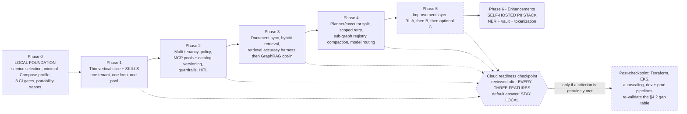

# 8. Phased Delivery Plan

Per [[ADR-017]] and [[ADR-019]]: **[[Phase 0]]** settles the service choices and the local stack, then six phases follow, each a **shippable increment with an exit criterion**. [[Phase 1]] is a thin vertical slice through every layer rather than a complete build of any one layer. A phase does not start until the phase below it is running with its metrics visible.

**All phases run locally on Docker Compose** unless a cloud readiness checkpoint has moved them. Everything cloud-specific — Terraform for cloud resources, EKS, autoscaling, node groups, and the dev/prod pipelines — is **post-checkpoint** work and carries no phase number.

> **Binding precondition on Phases 1–5 ([[ADR-009]], [[§7.10]]).** Until the [[Phase 6]] self-hosted PII stack lands, only **structured** PII entities are detected. **No tenant with regulated data (PHI, PCI cardholder data, or regulated PII) may be onboarded before [[Phase 6]] is complete.** This is a hard gate on the whole plan, not a caveat on one phase.
>
> **Additionally, while development is local ([[ADR-019]]): no other organization's customer data ever lands on a developer machine.** The anchor use case runs against **real third-party APIs** (Stripe, a real issue tracker) and **real published policy documents**, with the account records created in **our own** accounts — that is real integration surface without holding data we are not entitled to. This is a second, independent constraint alongside the precondition above, and it also covers the LangSmith SaaS trajectory egress noted in [[§4.1]].

## In this section

- [[phase-0|Phase 0 — Local foundation and service selection]]
- [[phase-1|Phase 1 — Thin vertical slice (the whole path, minimally)]]
- [[phase-2|Phase 2 — Multi-tenancy, access policy, tool isolation, safety]]
- [[phase-3|Phase 3 — Knowledge layer: document sync, hybrid retrieval, accuracy harness]]
- [[phase-4|Phase 4 — Orchestration maturity, sub-graphs, and context depth]]
- [[phase-5|Phase 5 — Improvement layer]]
- [[phase-6|Phase 6 — Enhancements: the self-hosted PII stack]]
- [[cloud-readiness-checkpoint|Cloud Readiness Checkpoint]]
- [[capability-phase-matrix|Capability → Phase Matrix]]
