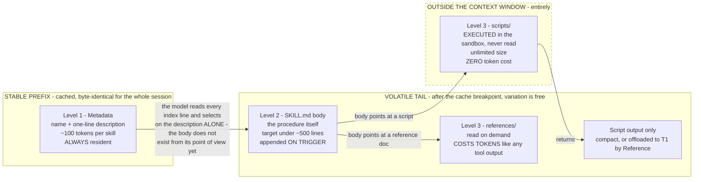
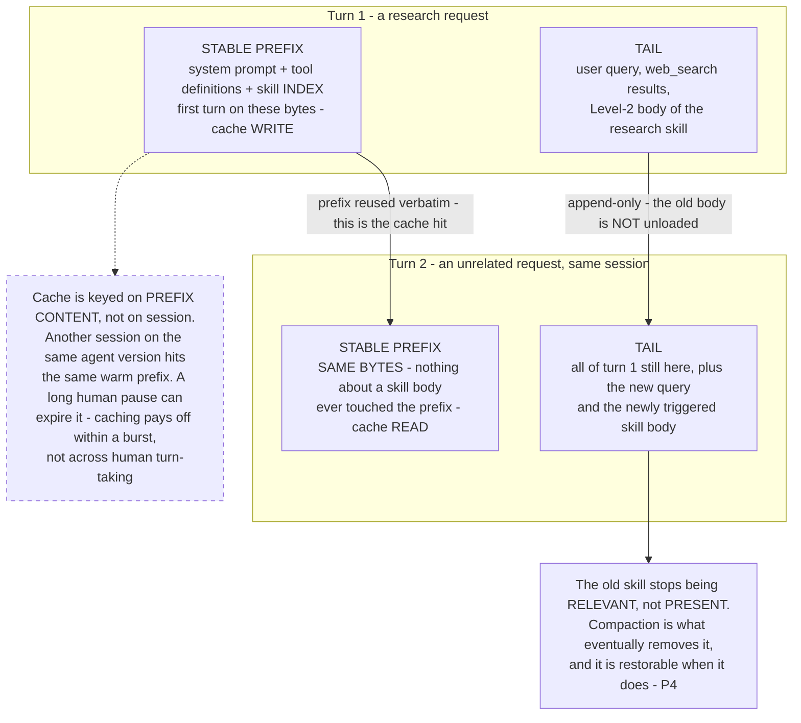

# ADR-002b: Capability extension via Skills with progressive disclosure

Part of [[1-architecture-decisions-adrs|1. Architecture Decisions (ADRs)]].

**Decision.** The primary mechanism for teaching an agent to do something new is a **Skill**: a versioned artifact containing a manifest, a body of procedural instructions, optional bundled scripts and reference files, and **its own eval cases**. Skills are attached to agents by **policy grant plus pointer promotion** — the same path as a prompt artifact ([[ADR-014]]) — and are loaded by **progressive disclosure**: only a one-line skill **index** lives in the stable prefix; the full body is pulled into the volatile tail when the skill becomes relevant.

**Context.** This was a genuine gap in the first draft of this design. The question that exposed it: *a developer writes a skill file, it gets evaluated, it gets attached to an agent, and the agent gains a new capability — why isn't that here?* The draft had two extension mechanisms, both expensive: add a tool (code, deploy, new MCP surface) or add a node/sub-graph (code, topology growth — the exact thing [[ADR-012]] exists to prevent). Neither covers the common case, which is *"the agent should follow this procedure"* — a procedure composed entirely of tools that already exist.

The paired worry is equally real: an extensibility story that only works if every addition requires a platform code change is not an extensibility story. Skills are the answer to that worry, and the sharp line below is what makes the answer honest rather than rhetorical.

**The line between a Skill and a Tool.** This distinction is load-bearing; blurring it collapses skills back into either prompt bloat or code.

| | **Skill** | **Tool** |
| --- | --- | --- |
| What it is | Procedural knowledge — *how to do X* | New I/O capability — the ability to *touch* something new |
| Contents | Markdown instructions, optional bundled scripts and reference files | Code implementing an API/DB/system call |
| Composes over | Tools that **already exist** | Nothing — it *is* the primitive |
| Cost to add | A folder plus eval cases | Code in one MCP server |
| Platform code change | **None** | None to the platform; code inside the MCP server ([[§3.8]]) |
| Redeploy | **No** — pointer promotion | No platform redeploy; the MCP server ships on its own cadence |

The practical consequence: **most "make the agent do a new thing" requests are procedures, not new I/O.** Handling a refund dispute, running a quarterly variance review, writing a postmortem in the house format, migrating a schema the way this org migrates schemas — all of these are sequences over `db_*`, `search_*`, and `file_*` tools that already exist. Those are skills, and they cost zero code. The concern that extension "won't work unless adding a skill also needs code changes" is true only for the minority of requests that genuinely need a new I/O surface — and for those, the code lives in an MCP server owned by the tool author, not in the platform.

**Progressive disclosure is what makes this compatible with [[P2]]/[[ADR-004]].** The first draft of this ADR modelled **two** footprints — an index entry in the prefix and a body in the tail. The [Agent Skills loading-system specification](https://anthropics-skills.mintlify.app/spec/loading-system) defines **three**, and the third one is the interesting one:

| Level | Contents | Size | When loaded |
| --- | --- | --- | --- |
| **1 — Metadata** | `name` + `description`, optional compatibility declarations | ~50–200 words per skill (≈100 tokens) | **Always** — it lives in the stable prefix |
| **2 — SKILL.md body** | Instructions, workflow, examples, pointers to bundled resources | **Under ~500 lines is the target** | On trigger — appended to the volatile tail |
| **3 — Bundled resources** | `scripts/`, `references/`, `assets/` | **Unlimited** | On demand, individually |

**The finding the two-footprint model completely missed: scripts in Level 3 execute without ever entering the context window.** A skill can ship a validation, transformation, or parsing script that does real work at **zero context cost**, because the model invokes it rather than reads it. Reference documents are different — reading one costs tokens like any other tool output. Same directory, same version, radically different economics, and the distinction changes authoring guidance materially.

The three levels map onto three **regions**, and which region a thing lands in is what determines its cost:



The dashed region is the one that changes authoring guidance: **anything deterministic belongs there**, because that region is free.

**Concrete token budgets, which is the ceiling this design was previously hand-waving.** At roughly 100 tokens of metadata per skill: **50 skills ≈ 5,000 tokens of always-resident index**, against roughly **50,000 tokens if every body were loaded eagerly**. One active skill takes the working total to about **10,000 tokens**. These are the numbers the per-agent skill-count ceiling is set from — not "keep it small," which is not a budget and cannot be enforced in CI. The ceiling is a number, `SkillIndexVersion.entry_count` is validated against it ([[§3.1]].10), and the index token cost is a monitored metric ([[§5.6]]).

**Two authoring rules follow directly from the three levels.**

1. **Prefer a script over prose wherever the work is deterministic.** A script is unlimited in size, costs zero context, and cannot be misread, misremembered, or partially followed by a model. Prose instructions telling the model how to validate an IBAN are strictly worse than a script that validates one. Prose is for judgement; scripts are for procedure.
2. **Be explicit and pushy in the description about when the skill should trigger.** The description is the *only* thing the model sees at selection time — the body does not exist yet from its point of view. A description that describes what the skill *is* without saying when to reach for it will not get selected. Trigger conditions belong in the description, stated plainly, even at the cost of sounding blunt.

So N skills cost almost nothing until they are used. Adding a skill changes the prefix **only at a version boundary**, never mid-session: a session pins a skill-index version at session start, exactly as it pins a tool catalog version ([[§3.8]]). Within a session the index is byte-stable and the cache stays warm; the body arrives after the cache breakpoint where variation is free, and Level-3 resources arrive there too — or, for scripts, not at all.

**What happens to a loaded skill when the next request is about something else.** Recorded because it is the question the model of "loading" invites, and the intuitive answer is wrong. There is **no unload step**. A skill body is an appended block of text in the tail; nothing evicts it, nothing swaps it out. It stops being *relevant*, not *present*, and what eventually removes it is compaction ([[ADR-006]]) — the same mechanism that removes any other cold tail content.



Two consequences worth stating plainly, because both were mis-stated in an earlier draft of this design:

- **Skill selection is not a semantic retrieval step by default.** The model sees every Level-1 index line in the prefix and picks from them the way it picks a tool. There is no embedding lookup in the common path. `skill_search` is the exception that arrives only past the index ceiling ([[§7.9]]), and it exists because the flat index stopped being affordable, not because search is better.

  **Why skills resist retrieval where tools accept it, which is not a symmetry this design assumed at first.** Semantic tool search was adopted deliberately ([[ADR-021]]) on evidence that large static catalogs degrade selection accuracy. That reasoning does *not* transfer to skills, for three reasons:

  1. **The cost is already gone.** A tool spec is a JSON schema and cannot be compressed to one line; a skill's resident footprint is already one line at ≈100 tokens. Progressive disclosure did the work retrieval would be doing. Searching the index optimises the cheap half — 5,000 tokens at 50 skills — while the expensive half is already deferred.
  2. **The failure is silent rather than loud.** A missed tool announces itself: the model reports it cannot do the thing, or calls the wrong tool and gets a wrong-shaped result. A missed skill produces a fluent answer from general knowledge with the procedure simply absent. Retrieval is acceptable where recall misses are visible and dangerous where they are not.
  3. **It would put a probabilistic step in front of enforcement.** The gate checks the obligations of **triggered** skills only — correctly, since a skill whose guidance never entered the prompt has no business blocking an answer ([[§3.1]].10). But that means if retrieval decides which skills are even *candidates*, a recall miss does not raise a violation: the obligation was never evaluated, and nothing records that it wasn't. With a flat index the model can still fail to *select* a skill, but the candidate set is complete and the miss is detectable in eval. With retrieval the skill was never in the room. An unenforced obligation nobody can detect is the same failure the loader refuses files to prevent.

  **The lever to reach for before retrieval is deterministic partition.** Skills are granted per agent, tenant and role by policy, which already filters the index — the same token reduction with zero recall risk and a prefix that stays byte-stable per agent. Prefer a partition that can be proven over a ranking that can only be measured.

  **If the ceiling is genuinely reached, `skill_search` is two-tier, not all-or-nothing.** A skill declares whether it is retrievable. Compliance-critical skills — the ones whose absence fails silently — stay resident in the index unconditionally; only the long tail becomes searchable. The flag is validated at load like every other manifest field, so "this skill must always be visible" is enforced rather than remembered.
- **The cache is a property of the bytes, not of the conversation.** A busy agent stays warm because many sessions share one prefix; an idle session goes cold on provider TTL regardless of how important it is. Cost models built on "the session is cached" are wrong; the right unit is the prefix.

**Structure of a skill.**

```pascal
STRUCTURE SkillManifest                  // skills/{name}/skill.yaml — the Level-1 metadata
  name: String                           // stable identifier, e.g. "refund_dispute_resolution"
  description: String                     // ONE line; the ONLY thing visible at selection time.
                                          // MUST state trigger conditions, not just purpose.
  version: String                         // content hash of manifest + body + resources
  required_tools: List<String>            // must all exist in the pinned tool catalog
  required_scopes: List<String>           // must be a SUBSET of the agent's policy grants
  bundled_resources: BundledResources     // Level 3; three kinds, three cost profiles
  eval_case_ref: Reference                // REQUIRED; promotion is impossible without it
END STRUCTURE

STRUCTURE BundledResources               // the undifferentiated list this replaces was a mistake
  scripts: List<Reference>               // EXECUTED, never read into context. ZERO context cost.
                                          // Unlimited size. Prefer these for deterministic work.
  references: List<Reference>            // READ on demand. Costs tokens like any tool output.
  assets: List<Reference>                // templates, fixtures, files the skill emits or fills in
END STRUCTURE

STRUCTURE Skill
  manifest: SkillManifest                 // Level 1 — stable prefix
  body: String                            // Level 2 — markdown procedure, volatile tail, ~<500 lines
END STRUCTURE
```

**The three-level invariant, stated as a rule the loader enforces:** a Level-2 body never appears in the stable prefix, and a Level-3 script never enters the context window at all — it is dispatched for execution and only its output (compact, or offloaded per [[ADR-006]]) comes back. Violating either collapses progressive disclosure into ordinary prompt bloat. This is [[Property 25]].

> Content from the Agent Skills loading-system specification was rephrased for compliance with licensing restrictions.

**Two components, not one: the Skills Engine and the Skill Registry.** Recorded because an earlier draft used one name for both and the ambiguity reached the code, where the package holding the machinery and the directory holding the artifacts were both called `skills`. They are separate concerns with **different lifetimes**, and the split is the reason the name is now explicit in both places.

| | **Skills Engine** | **Skill Registry** |
| --- | --- | --- |
| What it is | In-process machinery: parse, validate, build the index, refuse the unenforceable, hand obligations to the gate | Storage and promotion pipeline: where versioned skill artifacts live and how they reach an agent |
| Lives at | `agent/skills_engine/` — code | `skills/**` as source of truth, promoted artifacts under [[ADR-014]] |
| Operations | `load_skill`, `load_skillset`, `build_skill_index`, `validate_against_catalog`, `validate_scopes`, `load_skill_body`, `run_skill_script` | version, canary, grant by policy, eval-gate, roll back by pointer, `skill_search` past the ceiling |
| Runs | **Every session** — at start to build the pinned index, and on every trigger to load a body | **At a promotion boundary** — never in the request path |
| Fails by | Refusing to load. A skill that cannot be enforced never reaches an agent | Refusing to promote. A skill whose eval cases regress does not ship |
| Built | Yes — the loader, the obligation checks, and the gate exist | Not yet; [[Phase 3]]–4 |

The boundary is worth holding because the failure modes are different and land on different people. An Engine defect is a **runtime** fault in the request path — a skill silently not enforced, which is the one outcome this whole ADR exists to prevent. A Registry defect is a **release** fault — the wrong version of a correct skill reaching an agent, caught by canary and undone by pointer rollback ([[ADR-014]]). Collapsing them into one component means one blast radius, one on-call story, and one version number for two things that change at wildly different rates.

**Validation at load (fail closed).** Two checks are non-negotiable, and both are the **Engine's** job, not the Registry's — they must hold at load in the request path, not merely at promotion time, because the pinned tool catalog can change underneath a skill that was valid when it shipped:
1. Every `required_tools` entry resolves in the pinned tool catalog version. A skill referencing a tool that does not exist never loads.
2. Every `required_scopes` entry is within the agent's effective policy grants. **A skill can never widen access** — it can only narrow or use what the agent already has. This mirrors the policy-containment guarantee ([[Property 18]]) and is enforced at the same place, so a skill is not a side door around [[§3.2]].

**Every skill ships its own eval cases, and cannot be promoted without passing them.** This is enforced in CI ([[§5.5]]), not left to author discipline. A skill without eval cases fails validation; a skill whose eval cases regress fails promotion. That makes "there should be evaluations for the skill" a property of the system rather than a convention.

**Consequences.**
- (+) **Capability scale decouples from topology scale.** The graph does not grow when the agent learns a procedure. This is the same decoupling sub-graphs-as-tools gives at the execution layer ([[§2.12]]).
- (+) Skills are ordinary artifacts under [[ADR-014]] — content-hashed, canaried, rolled back by pointer, attributable in the trajectory record. **No redeploy** is required to attach or detach one.
- (+) A domain expert can author a skill. It is markdown plus eval cases, not Python.
- (+) **Level-3 scripts buy deterministic capability at zero context cost.** This is the cheapest rung on the whole extension ladder — cheaper than a tool, because there is no MCP server, and cheaper than prose, because there are no tokens.
- (−) **The skill index must stay small, and now there is a number.** One line per skill (hard description-length limit) at ≈100 tokens of metadata each, with a per-agent skill-count ceiling derived from that figure; past the ceiling the index itself is prefix bloat, which is the failure mode this ADR was supposed to avoid ([[§7.9]]).
- (−) **A bundled script is code, and code needs the same containment as a tool.** Zero context cost is not zero risk: scripts execute in the sandbox under the same dropped-capability, read-only-root, no-egress-by-default posture as any model-authored code ([[§2.10]], [[ADR-016]]), and a skill's scripts cannot reach anything its `required_scopes` do not already cover ([[Property 18]]).
- (−) A large skill library needs a **`skill_search`** discovery mechanism — the same progressive-disclosure move a large tool catalog needs ([[§3.8]]). Below the ceiling, the flat index is cheaper and more reliable; above it, search is mandatory.
- (−) Skill sprawl is real: two skills that overlap ambiguously produce worse selection than one skill that is clearly scoped. Skill review is a real review, not a rubber stamp.

**Alternatives considered.**
- **(a) Bake procedures into the system prompt** — rejected. Unbounded prefix growth (directly against [[P2]]/[[ADR-004]]), no independent versioning, no independent eval, and every procedure change becomes a prompt change that invalidates the cache for every session on that agent.
- **(b) One sub-graph node per procedure** — rejected. This is precisely the topology explosion [[ADR-012]] exists to correct: a node per procedure recreates the mega-graph with extra steps.
- **(c) Fine-tune a model per procedure** — rejected as wildly disproportionate. The cost and latency of a training cycle to encode "follow these eight steps" is not defensible when a markdown file with eval cases does the same job reversibly.
