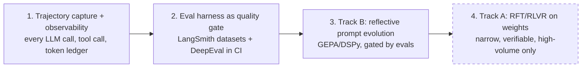
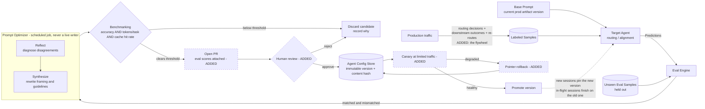

# ADR-008: Continuous improvement as two distinct tracks — behaviour tuning now, weight training later

Part of [[1-architecture-decisions-adrs|1. Architecture Decisions (ADRs)]].

**Decision.** Split agent improvement into **two tracks that are never conflated**, and ship them in order:

- **Track B — Production behaviour optimization, no weight updates (build this first).** Evolve the *text artifacts* the agent runs on — system prompts, tool descriptions, planner instructions, few-shot exemplars — using reflective optimization over captured trajectories. Every candidate is versioned, eval-gated, canaried, and rollback-able.
- **Track A — Weight training (later, narrow scope only).** Reinforcement fine-tuning on model weights for narrow, high-volume, verifiably-scored sub-policies, once Track B has plateaued and the ROI is provable.

> **Naming map, to avoid confusion later.** The two *tracks* describe the mechanism (text artifacts vs weights). The three *RL phases* below describe delivery order: **Phase A** and **Phase B** are both Track B (no weight updates — prompts, then learned routing/judging policies), and **Phase C** is Track A (weights). Elsewhere in this document, "Track B" and "RL Phase A/B" refer to the same body of work, and "Track A" and "RL Phase C" likewise. [[§8]] sequences all three under [[Phase 5]] of delivery.

**Context.** A common and important question: does "agent RL" mean retraining a model, or can agent behaviour be tuned in production? Both exist, they have wildly different cost and risk profiles, and treating them as one thing leads teams to attempt fine-tuning before they have the trace data or eval gates that make it meaningful.

**Rationale — Track B.** [GEPA (Genetic-Pareto, ICLR 2026)](https://arxiv.org/abs/2507.19457) samples system-level trajectories (reasoning, tool calls, tool outputs), reflects on them in natural language to diagnose what failed, proposes and tests prompt updates, and merges complementary lessons drawn from a Pareto frontier of its own attempts. Reported results: it outperforms GRPO by about 10% on average and up to 20%, using up to 35x fewer rollouts, and beats MIPROv2 by more than 10%. It is built on [DSPy](https://dspy.ai/). The underlying thesis is that when the parameters being optimized are natural-language artifacts, natural-language reflection over full traces carries far more signal than a sparse scalar reward.

**Rationale — Track A.** RLVR extends verifiable-reward RL to multi-turn tool use (e.g. VerlTool). Checklist rewards (CM2-style) decompose each turn into fine-grained binary criteria with evidence grounding, which converts open-ended judging into a stabler classification-style decision. For this platform, [Microsoft Agent Lightning](https://www.microsoft.com/en-us/research/project/agent-lightning/) is the best fit because it adds RL to an *existing* LangChain/LangGraph/AutoGen stack without rewriting the agent; [NVIDIA Polar](https://developer.nvidia.com/blog/) similarly turns an existing harness into an RL-ready rollout environment. Other viable options if requirements change: OpenPipe ART (agent-first GRPO), verl-agent (long-horizon, PPO/GRPO/DAPO/RLOO), OpenRLHF (distributed Ray + vLLM + DeepSpeed), SkyRL (full stack with Gymnasium envs), RAGEN (failure diagnostics for reasoning collapse and reward quality), Marti (multi-agent/graph workflows), Unsloth (consumer-GPU LoRA/GRPO).

**The ladder we commit to** (each rung is a prerequisite for the next):

**The three RL phases, stated concretely.** "Agent RL" is used loosely in the industry; this is what each phase actually means here, what it needs, and when it is allowed to start.

| Phase | What is optimized | Mechanism | Prerequisite | Feasible on API-served frontier models? |
| --- | --- | --- | --- | --- |
| **A — Behaviour, no training** | Prompts, tool descriptions, planner instructions, few-shot sets | Trajectory capture → evals → reflective prompt optimization ([GEPA](https://arxiv.org/html/2507.19457v1) over [DSPy](https://dspy.ai/)) | Trajectory store + eval harness | **Yes** — this is where production agent RL actually lives |
| **B — Policy, still no weight updates** | Routing decisions, model selection, escalation thresholds, verifier/judge scoring | Learned router over logged outcomes; **contextual bandits** for model selection and escalation (context = task features, arms = model/route/escalate, reward = eval score minus cost); a separate **read-only verifier model** scoring candidate answers | Phase A running, enough logged outcomes per arm to beat a fixed policy | **Yes** — the learned components are small models we own; the frontier model stays untouched |
| **C — Weights, narrow scope only** | One high-volume, verifiably-scored sub-policy. **No candidate exists in the platform today** — the router was the natural one, and [[ADR-013]] removed it | RLVR / GRPO fine-tuning of a **small open model** | Phase B plateaued, **and** some component is actually self-hosted to train | **No for the frontier model**, and currently **not applicable at all** — Bedrock-only means we host no weights |

**Be explicit about the constraint:** weight-level RL is not available on API-served frontier models. You cannot backpropagate into a vendor's hosted weights. So in practice, "we're doing RL on our agent" in production means Phase A and Phase B for almost everyone, and Phase C only where a narrow node has enough volume to host and train a small model of your own. Framing Phase C as the goal is how teams end up with a training cluster and no measurable improvement.

**Phase C currently has no candidate, and that is a direct consequence of [[ADR-013]].** A router *would* be the ideal Phase C target: high-volume, latency-sensitive, cheap to serve as a small open model, and — rarest of all — **verifiably scoreable**, because downstream task success is a ground-truth label for whether the route was right. But [[ADR-013]] was simplified to a single Bedrock call, and **you cannot weight-train a model you do not host.** So Phase C is not merely gated on Phase B plateauing; it is gated on first restoring a self-hosted classifier. Recorded plainly because it would otherwise look like Phase C is one step away when it is two, and the first step has been deliberately deferred.

**Reward design references** for Phase C, if it is ever reached: [VerlTool / RLVR for multi-turn tool use](https://arxiv.org/abs/2509.01055) for verifiable rewards over tool trajectories, and CM2-style **checklist rewards** which decompose a turn into fine-grained binary, evidence-grounded criteria — converting open-ended judging into a stabler classification decision than a single scalar score.

**Framework landscape** ([survey](https://www.turingpost.com/p/agent-rl-training-tools)), with the selection reasoning attached rather than a bare list:

| Framework | Fit here |
| --- | --- |
| [Agent Lightning](https://www.microsoft.com/en-us/research/project/agent-lightning/) | **First choice.** Adds RL to an existing LangChain / LangGraph / AutoGen / CrewAI stack without rewriting the agent — decisive for us, since the agent already exists |
| NVIDIA Polar | Turns an existing harness into an RL-ready rollout environment; same "don't rewrite the agent" property |
| verl / verl-agent | Long-horizon multi-turn agent RL (PPO, GRPO, DAPO, RLOO); the reference implementation if we need full control |
| OpenPipe ART | Agent-first GRPO with a lower operational bar |
| OpenRLHF | Distributed scale (Ray + vLLM + DeepSpeed) — relevant only well past our expected Phase C volume |
| SkyRL | Full stack with Gymnasium-style environments |
| Agent-R1, RAGEN | Failure diagnostics — reasoning collapse and reward-quality analysis; useful even if we never train, as a lens on why a policy is bad |

**Consequences.**
- (+) Measurable improvement is available in weeks (Phase A / Track B) rather than after a training-infrastructure project.
- (+) Both tracks consume the same `TrajectoryRecord` ([[§3.1]].7), so the observability investment pays for both.
- (−) **Reflective optimization can regress.** The "Reflection in the Dark" analysis reports GEPA degrading accuracy on some seeds, including a case falling from roughly 23.81% to 13.50%. Therefore candidates are **never auto-applied**: promotion requires clearing an eval threshold on a held-out set, passing a canary at limited traffic, and retaining a one-click rollback to the prior prompt version. Prompt versions are immutable artifacts, not editable config.
- (−) Track A needs verifiable environments and a reward-authoring discipline; without them it will optimize the wrong thing confidently.

**Alternatives considered.** RLHF with scalar human preferences — kept as a complementary signal, rejected as the primary signal for multi-turn tool use (noisy and expensive per sample). Manual prompt iteration only — rejected as unscalable across many agents and tenants, though it remains the fallback when eval coverage for an agent is thin. Weight training first — rejected outright: without trajectory capture and eval gates there is no reward to train against and no way to detect regression.

#### ADR-008a: The agent tuning loop — reference design adopted with three additions and two constraints

A reference diagram for how the agent is auto-tuned was provided as input to this ADR and analyzed in full at [`docs/vault/architecture/agent-tuning-loop.md`](../../../docs/vault/architecture/agent-tuning-loop.md). Its substance is folded in here so the corrections live in the design rather than only in a vault note.

**The reference loop as given.** Base Prompt + Labeled Samples → **Target Agent** (a routing/alignment agent) → Predictions → **Eval Engine** (fed a separate held-out set of Unseen Eval Samples) → matched and mismatched samples → **Prompt Optimizer** (*Reflect*: diagnose the disagreements → *Synthesize*: rewrite the framing and guidelines) → **Benchmarking** → **Agent Config Store** (register the updated agent version) → Updated Prompt → back to the Target Agent.

**What it gets right, recorded as validation of this ADR rather than as new information.**

| Element | Why it is correct |
| --- | --- |
| **Reflect → Synthesize** | Exactly the reflective-optimization mechanism this ADR commits to: diagnose failures in natural language, then rewrite the instruction. When the parameter being optimized *is* text, natural-language reflection over full traces carries far more signal than a scalar reward. |
| **A held-out unseen set, kept separate** | Correct eval discipline. It is what makes "did this candidate improve" a real question rather than a restatement of the training data. |
| **Benchmarking precedes registration** | The eval gate comes before promotion, not after it. |
| **The config store registers a *version*** | Matches [[ADR-014]] — every behavioural change is attributable to an immutable, content-hashed version. |
| **The target is a routing/alignment agent** | Independently the same conclusion this ADR reaches about the right first target: routing is high-volume, latency-sensitive, and **verifiably scoreable**, because downstream task success is a free ground-truth label for whether the route was right ([[ADR-013]]). |

**Three gaps that must be added.**

1. **No canary, no rollback — the one that will bite.** As drawn, benchmarking passes and the updated prompt goes **straight to the live agent**. Given the documented seed sensitivity of reflective optimization — a reported drop from roughly **23.81% to 13.50%** in one case — a benchmark-then-live loop is precisely the shape that ships a regression. Required: a **canary stage at limited traffic** between the config store and the live agent, watched over a defined window, plus an explicit **rollback edge** to the prior version.
2. **No human gate.** The loop is fully automatic. Our position, per [[P10]]: the optimizer **opens a PR with eval scores attached and never writes to production**. The same review and the same gates apply to a machine-proposed prompt as to a human-written one.
3. **A static hand-labeled dataset with no production feedback edge.** There is no edge from production back into the labeled set, which makes the dataset a fixed cost that stops improving the moment someone stops labeling. Production already yields labels for free — the routing decision, the tier that produced it, the confidence, the downstream outcome, and the **`REROUTE` signal** when an executor reports it was handed the wrong task ([[§3.1]].3). Feeding that back turns a one-off tuning exercise into a **flywheel that improves with traffic rather than with labeling budget**.

**Two constraints.**

1. **Cost belongs in the gate.** Accuracy alone is the wrong pass/fail criterion. **Tokens per task and KV-cache hit rate are pass/fail criteria alongside accuracy**, because a more accurate but longer prompt loses on prefix economics ([[P1]]). A quality-neutral cost regression fails the gate.
2. **"Updated Prompt" cannot be a live write.** A rewritten prompt changes the **stable prefix** and therefore invalidates the cache for every session running on that agent ([[P2]], [[ADR-004]]). The resolution already exists in this design: a session **pins an artifact version at session start** ([[ADR-014]], [[§3.8]]), so a newly promoted prompt affects only sessions started **after** promotion and in-flight sessions complete on the version they pinned.

**The adopted loop** — dashed nodes are the additions to the reference design:

**The honest precondition.** **If eval coverage for an agent is thin, this loop is not safe to enable for that agent.** The gate is only as good as the dataset behind it, and an optimizer pointed at a weak eval set will confidently make things worse. That is a per-agent enablement decision, not a platform-wide switch.
