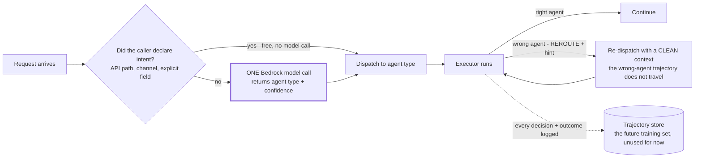

# ADR-013: Classification is one Bedrock model call, made safe by recoverability rather than accuracy

Part of [[1-architecture-decisions-adrs|1. Architecture Decisions (ADRs)]].

**Decision.** Classification is **a single Bedrock model call**. If the caller already declared intent — the API path, the channel, an explicit intent field — use it and skip the call; that is a short-circuit, not a tier. There is **no confidence cascade, no self-hosted embedding classifier, no locally trained classifier, and no per-tier thresholds**. What makes this safe is not classifier accuracy but the **`REROUTE`** escape hatch: an executor that receives the wrong task hands it back, and the orchestrator re-dispatches.

**Context — this ADR was deliberately cut down.** The previous version specified a five-tier confidence-gated cascade whose workhorse was a self-hosted embedding classifier, with a small locally fine-tuned classifier above it and an LLM only for the ambiguous residual. That design is defensible on cost and on data egress, and it is **too much machinery to build before there is a single working request path.** It required: two owned models, two retraining loops, labeled data per tenant, drift monitoring, per-tier confidence thresholds, and a local model-serving runtime — all to answer "which agent handles this?" on traffic that does not exist yet.

The decision is to spend that complexity later, if the numbers justify it, and to spend nothing on it now.

**Rationale.** The reframe that survived the cut is the one that was load-bearing all along: **the router does not need to be right, it needs to be recoverable.** With a working `REROUTE` path, a router that is roughly 90% accurate is fine — the 10% costs one wasted hop, is detected, and is logged. Given that, the marginal value of a bespoke classifier over one Bedrock call is a cost and latency optimization, not a correctness requirement. Optimizations get built when they are measured, not when they are imagined.

Concretely, what stays:

- `SubAgentResult.status` includes **`REROUTE`** with a `reroute_hint` ([[§3.1]].3).
- Re-route is a **first-class outcome, not a failure**: re-dispatch to the suggested agent type with a **clean context** ([[§2.13]], scope 2).
- **Re-route rate is a monitored metric** ([[§5.6]]) — now the *only* quality signal for routing, which makes it more important rather than less.
- The re-route path appears in the failure/escalation flow ([[§2.5]]).
- Every routing decision and its downstream outcome are still **logged** ([[P8]]). Nothing consumes that log yet, and that is fine: it costs one column and it is the precondition for ever revisiting this decision with evidence.

**The trade being accepted, stated plainly because it reverses the previous rationale.** Routing now sends request text to a model provider **purely to decide where to send it**. The old ADR called that "a data-egress surface created for a routing decision, which is a bad trade," and that argument has not become wrong — it has been **outranked by wanting a working system first**. Two consequences follow and both are binding:

1. **The regulated-data precondition now covers routing too.** The existing gate ([[ADR-009]], [[§7.10]]) already forbids onboarding tenants with PHI, PCI cardholder data, or regulated PII before [[Phase 6]]. That gate is now doing more work than it was: classification text crosses the provider boundary on every undeclared-intent request. Input rails and structured-PII redaction still run **before** the classification call, not after ([[§2.6]], [[P7]]).
2. **This is the first thing to revisit when a regulated tenant appears.** Not a nice-to-have. A tenant that cannot send text to a provider cannot use undeclared-intent routing at all, and the answer at that point is to restore a self-hosted classifier — which is why the rejected design is recorded below rather than deleted.

**Consequences.**
- (+) **Nothing to train, serve, monitor, or version.** No owned models, no labeled data requirement, no local model runtime, no cold-start problem.
- (+) Handles free-text intent from day one, including cases no rule set resolves.
- (+) Re-route keeps routing errors bounded and observable instead of silently poisoning a trajectory.
- (+) The decision is cheap to reverse: swap the implementation behind `classify()` ([[§3.7]]). Nothing else in the platform knows how classification happens.
- (−) **A provider call and a data egress on the hot path of every undeclared-intent request.** Cost, latency, and a privacy surface, all three.
- (−) **Routing does not improve with traffic.** The log accumulates and nothing learns from it. Accuracy is whatever the model and the prompt give you.
- (−) The classification prompt is a **prefix to keep stable** ([[P2]]/[[ADR-004]]) — one more artifact under the versioning discipline that the embedding classifier would not have needed.
- (−) Re-route rate is now the *only* routing quality signal, so if it is not instrumented, routing quality is unmeasured.

**Alternatives considered.**
- **The five-tier cascade with a self-hosted embedding workhorse** — *rejected for now, recorded for later.* Correct on cost and egress; disproportionate before a working request path exists. Restore it when a regulated tenant appears, when routing cost becomes a measurable share of spend, or when re-route rate shows accuracy is genuinely limiting. Shape, if restored: embed the query with a small local embedding model, then a lightweight head (centroid, kNN, or logistic regression) trained on the logged decisions and outcomes.
- **Pure deterministic rules** — rejected. Free-text intent is not a lookup, and a rule table that pretends otherwise rots silently.
- **Chasing a near-perfect classifier of any kind** — rejected on principle. A cheap classifier plus a re-route path beats an expensive classifier with no escape hatch, and that argument is what makes the simplification safe.
