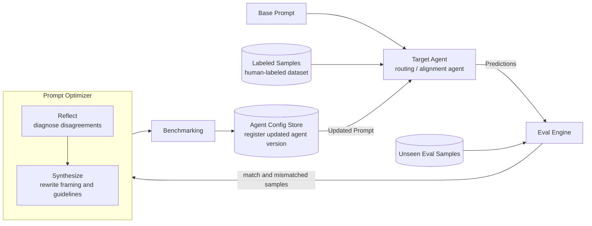
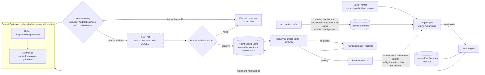

# Agent Tuning Loop — Reference Design

A reference diagram for how the agent is auto-tuned, provided as input to the improvement-layer design. **Adopted with three additions and two constraints** — recorded below rather than absorbed silently, so the deltas stay reviewable.

Original image: `../assets/agent-tuning-loop.png`

Related: [[ADR-008]] · [[ADR-013]] · [[ADR-014]] · [[Phase 5]]

> Linked by **alias**, not by filename. Generated note filenames embed the section title, so a title edit would silently break a hand-written link; the aliases are stable.

## The Reference Loop As Given

## What It Gets Right

| Element | Why it is correct |
| --- | --- |
| **Reflect → Synthesize** | This is the reflective-optimization mechanism: diagnose failures in natural language, then rewrite the instruction. Natural-language reflection over full traces carries far more signal than a scalar reward when the parameter being optimized *is* text. |
| **Unseen Eval Samples held separate** | A held-out set is what makes "did this candidate actually improve" a real question rather than a restatement of the training data. |
| **Benchmarking before registering** | The eval gate precedes promotion, not the reverse. |
| **Agent Config Store registers a *version*** | Matches the immutable versioned-artifact model — every behavioural change is attributable to a specific version. |
| **Target is a routing/alignment agent** | The correct first target, and the same conclusion reached independently in the cascade design: routing is high-volume, latency-sensitive, and **verifiably scoreable**, because downstream task success is a ground-truth label for whether the route was right. |

## Gap 1 — No canary, no rollback (the one that will bite)

As drawn, `Benchmarking` passes and the updated prompt goes **straight to the live agent**. That is unsafe, and not hypothetically: reflective prompt optimization is known to regress on some seeds — a published follow-up analysis reports accuracy falling from roughly 23.81% to 13.50% in one case. A benchmark-then-live loop is precisely the shape that ships that regression.

Required additions: a **canary stage** at limited traffic between the config store and the live agent, health watched over a defined window, and an explicit **rollback edge** back to the previous version.

## Gap 2 — No human gate

The loop is fully automatic. Our position is that an optimizer **never writes to production**: it opens a pull request with eval scores attached, and the same review and gates apply to a machine-proposed prompt as to a human-written one.

## Gap 3 — The dataset is static and hand-labeled

There is no edge from production back into `Labeled Samples`, which makes the dataset a fixed cost that stops improving the moment someone stops labeling.

Production traffic already produces labels for free: the routing decision, its confidence, the tier that produced it, and the **downstream outcome** — including the re-route signal when an executor reports it was handed the wrong task. Feeding that back is what turns this from a one-off tuning exercise into a flywheel that improves with traffic rather than with labeling budget.

## Constraint 1 — Cost belongs in the gate

Accuracy alone is the wrong pass/fail. A prompt that scores better while running 40% longer loses on prefix economics, because input tokens dominate agent cost. **Tokens per task and KV-cache hit rate are gate criteria alongside accuracy**, and a quality-neutral cost regression fails.

## Constraint 2 — "Updated Prompt" cannot be a live write

A rewritten prompt changes the **stable prefix**, which invalidates the KV cache for every session running on that agent. A live write mid-session is both a cache event and a correctness problem.

The resolution already exists in the design: a session **pins an artifact version at session start**. A newly promoted prompt affects only sessions started after promotion, and in-flight sessions complete on the version they pinned.

## The Adopted Loop

Dashed nodes are the additions to the reference design.

## Where This Sits in Delivery

This is the **behaviour-tuning track** — prompts and text artifacts, no weight updates — and it is the first rung of the improvement layer. It is **not** early work: it depends on trajectory capture and an eval harness already being in place, because without them there is no reward to optimize against and no way to detect a regression.

Two honest preconditions:

- **If eval coverage for an agent is thin, this loop is not safe to enable for that agent.** The gate is only as good as the dataset behind it, and an optimizer pointed at a weak eval set will confidently make things worse.
- **The routing target is the right place to start, but not because routing is the biggest cost.** It is because routing is the one component whose success has a cheap, unambiguous ground-truth label.
