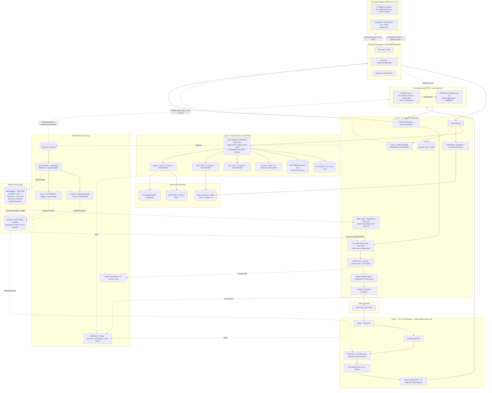

# 2.1 Component Diagram

Part of [[architecture|Architecture]].

```mermaid
graph TD
    subgraph Client["Client / Channel"]
        UI[Tenant App / API Client]
    end

    subgraph GW["Layer 1 - API / Auth Gateway - USER authentication only"]
        AUTH[AuthN - OAuth/JWT]
        SCHEMA[Schema Validation]
        OPA[OPA Authz - per-agent tool allowlists, tenant isolation]
        RATE[Per-tenant Rate Limits / Quotas]
        INRAIL[Input Guardrail Rails - PII redaction, jailbreak/topic]
    end

    subgraph CLS["Classification (ADR-013) - one model call"]
        C1[Declared intent?<br/>API surface / channel / explicit field<br/>free - no model call]
        C2[ONE Bedrock classification call<br/>returns agent type + confidence]
        C1 -->|not declared| C2
    end

    subgraph ORCH["Layer 2 - Orchestrator (stateless)"]
        PLANNER[Planner Sub-agent - todo.md recitation]
        SESSION[(Session Cache - Redis)]
        PROMPT[KV-cache-first Prompt Assembler<br/>+ skill index in stable prefix]
        SKILLLOAD[Skill Loader - progressive disclosure<br/>body into volatile tail on demand]
        MODELPROXY[Model Proxy - routing, prompt cache, PII redaction]
        DISPATCH[Tool Dispatch]
        COMPACT[Restorable Compaction / Anchored Summary]
        RETRY[Retry + Failure Scoping<br/>distill_failure, loop detection]
        OUTRAIL[Output Guardrail Rails - moderation, PII, grounding]
        HITL[Human-in-the-loop Controller]
    end

    subgraph EXEC["Executor Sub-agents (LangGraph substrate)"]
        EX1[Executor: coding]
        EX2[Executor: research/multimodal]
        EX3[Executor: math/analysis]
    end

    subgraph SUBG["Sub-graph Registry (ADR-012, §2.12)"]
        SG1[Compiled sub-graph<br/>own stable prefix, own isolated context]
        SG2[Invoked BY THE PARENT AS A TOOL<br/>depth limit 2]
    end

    subgraph MCP["Layer 3 - MCP Gateway + Tool Pools"]
        MCPGW[MCP Gateway - PRIMARY authz point<br/>agent authn + agent-to-tool authz<br/>+ delegated user RBAC + schema]
        REG[(Tool Registry - tool→pool, etcd)]
        CATALOG[(Tool Catalog Versions - §3.8<br/>pinned per session)]
        POOLB[browser_* pool - 3+ replicas, circuit breaker]
        POOLD[db_* pool - 3+ replicas, circuit breaker]
        POOLF[file_* pool - 3+ replicas, circuit breaker]
        POOLS[search_* pool - 3+ replicas, circuit breaker]
    end

    subgraph MEM["Memory & Knowledge"]
        OBJ[(External Memory - object store / sandbox FS)]
        VEC[(Vector Store - baseline RAG)]
        GRAPH[(Knowledge Graph - GraphRAG)]
    end

    subgraph OBS["Observability & Learning"]
        TRACE[Distributed Tracing - gateway→orchestrator→pool spans]
        TOKENS[Token Accounting + KV-cache hit rate]
        TRAJ[(Trajectory Log Store)]
        EVAL[Eval Harness - LangSmith datasets + DeepEval gates]
        OPT[Track B - reflective prompt evolution GEPA/DSPy]
        RL[Track A - RFT/RLVR on weights, narrow scope]
    end

    subgraph ART["Artifact Control Plane"]
        REGART[(Prompt + Policy Artifact Registry<br/>immutable versions, canary pointers)]
        SKILLREG[(Skill Registry - ADR-002b<br/>manifest + body + resources + eval cases<br/>versioned, canaried, granted by policy)]
    end

    UI --> AUTH --> SCHEMA --> OPA --> RATE --> INRAIL --> CLS
    CLS --> PLANNER --> PROMPT
    PLANNER --> EXEC
    SKILLLOAD --> PROMPT
    PROMPT --> MODELPROXY
    EXEC --> DISPATCH --> MCPGW
    EXEC -. invoke sub-graph AS A TOOL .-> SUBG
    SUBG -. structured result via submit_results .-> EXEC
    MCPGW --> REG
    MCPGW --> CATALOG
    MCPGW --> POOLB & POOLD & POOLF & POOLS
    POOLF --> OBJ
    POOLS --> VEC
    POOLS --> GRAPH
    DISPATCH --> COMPACT --> OBJ
    DISPATCH --> RETRY
    RETRY -. distilled lesson only - clean context .-> EXEC
    EXEC -. REROUTE hint .-> CLS
    MODELPROXY --> OUTRAIL --> HITL --> UI
    ORCH -. session .-> SESSION
    GW -. spans .-> TRACE
    ORCH -. spans/tokens .-> TRACE
    MCP -. spans .-> TRACE
    MODELPROXY -. tokens/cache .-> TOKENS
    ORCH -. trajectory .-> TRAJ
    TRAJ --> EVAL
    EVAL --> OPT
    EVAL --> RL
    TRAJ -. routing decisions + outcomes train T3/T4 .-> CLS
    OPT -. gated promotion .-> REGART
    RL -. gated promotion .-> REGART
    EVAL -. skill eval gate .-> SKILLREG
    REGART -. resolves prompts/policies .-> PROMPT
    SKILLREG -. resolves skill index + bodies .-> SKILLLOAD
    REGART -. resolves policies .-> OPA
```
