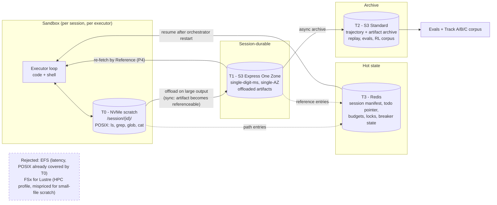
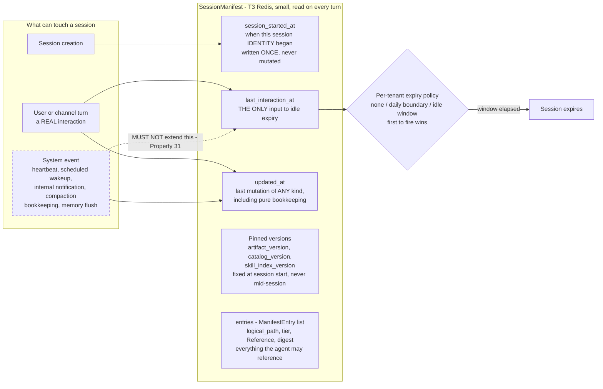

# 2.10 Context Engineering: Session Filesystem and Storage Tiers

Part of [[architecture|Architecture]].

This is the layer the platform lives or dies on. Every tool output the agent produces lands in a **per-session filesystem**, and the agent navigates it with ordinary file tools (`file_ls`, `file_grep`, `file_glob`, `file_read`) rather than through a retrieval ranker. The storage behind that filesystem is tiered by access pattern ([[ADR-016]]).



**What each tier must never do.** T0 must never be the only copy of anything referenced in context. T1 must never hold the authoritative trajectory record. T2 must never be on the agent's critical path. T3 must never hold payloads — only the manifest and pointers. Violating any of these turns a four-tier design into an expensive one-tier design.

**Session manifest** (T3) is the index that makes the orchestrator stateless. It is small, cheap to read on every turn, and sufficient to reconstruct what the agent can see:

```pascal
STRUCTURE SessionManifest                 // Redis: eaf:{tenant_id}:{session_id}:manifest
  session_id: String
  tenant_id: String
  artifact_version: String                // prompt/policy version pinned for this session
  catalog_version: String                 // tool catalog version PINNED at session start (§3.8)
  skill_index_version: String             // skill index version PINNED at session start (ADR-002b)
  plan_ref: Reference                     // todo.md in T1
  anchored_summary_ref: Reference?        // persistent structured summary (ADR-006 tier 4)
  entries: List<ManifestEntry>            // everything the agent may reference
  turn_count: Integer
  token_ledger: TokenLedger
  compaction_state: Enum{NONE, TRIMMED, SUMMARIZED, BOTH}
  // ---- Pre-compaction memory flush bookkeeping (ADR-006c) ----
  memory_flush_at: Timestamp?             // when the last flush COMPLETED; null if never
  memory_flush_compaction_count: Integer  // compaction cycles at last flush; enforces once-per-cycle
  // ---- Freshness: THREE timestamps, because they answer three different questions ----
  session_started_at: Timestamp           // when this session IDENTITY began
  last_interaction_at: Timestamp          // last REAL user/channel interaction — drives idle expiry
  updated_at: Timestamp                   // last mutation of ANY kind, including bookkeeping
END STRUCTURE

STRUCTURE ManifestEntry
  logical_path: String                    // "/session/abc/tool_out/01JD8Z.json" - what the agent sees
  tier: Enum{T0, T1, T2}                  // where it currently resides
  reference: Reference                    // tier-qualified locator
  bytes: Integer
  content_digest: String                  // integrity + dedupe
  produced_by_call_id: UUID               // links artifact back to the tool call
  restorable: Boolean = TRUE              // MUST be true; false is a P4 violation
END STRUCTURE
```

**Three freshness timestamps, because they answer three different questions.** The first draft carried `turn_count` and no freshness model at all, which is not enough to build an expiry policy on. Collapsing these into one field is a subtle and consequential mistake:

| Timestamp | Answers | Updated by |
| --- | --- | --- |
| `session_started_at` | When did this session **identity** begin? | Session creation only |
| `last_interaction_at` | When did a **real user or channel interaction** last occur? | User and channel turns **only** |
| `updated_at` | When was this row last mutated **at all**? | Any mutation, including pure bookkeeping |

**The rule that makes the distinction load-bearing: system events — heartbeats, scheduled wakeups, internal notifications, compaction bookkeeping, memory flushes — may mutate the row, but they MUST NOT extend idle-expiry freshness.** If they do, a background job keeps an abandoned conversation alive forever, sessions never expire, and the expiry policy becomes decorative while the storage bill is not. `last_interaction_at` is the only input to idle expiry, and only genuine interaction touches it. This is [[Property 31]].

**Session reset and expiry policy is per-tenant configuration**, not a platform constant: **none** (sessions persist until explicitly ended), a **daily boundary**, or an **idle window** — and where more than one is configured, whichever fires first wins. The platform's obligation is to make the three timestamps correct; the policy over them belongs to the tenant.

The whole model in one picture — **the single forbidden edge is the point of the diagram**:



Read the dotted edge as the defect it prevents: wire a heartbeat to `last_interaction_at` and abandoned conversations never expire, the tenant's policy becomes decorative, and the only visible symptom is the storage bill.

**Compaction triggers.** Compaction is not a background sweep on a timer; it fires on measurable conditions, and it always runs off the critical path ([[ADR-006]]):

| Trigger | Condition | Action |
| --- | --- | --- |
| Output-size trigger | A single tool result exceeds the inline budget | Offload to T1, keep `compact` + `Reference` |
| Occupancy trigger | Volatile tail exceeds a share of the context window | Structurally lossless trim (strip raw blobs, base64, tool metadata; keep user/assistant text verbatim) |
| Turn-depth trigger | Session passes a turn threshold | Async anchored summarization of the coldest history segment |
| **Self-compaction (active) trigger** | The agent itself calls a `context_compact` tool because it judges the tail no longer useful | Agent-nominated segments trimmed/summarized — the agent knows what it is done with better than a heuristic does |
| **Memory-flush trigger** ([[ADR-006c]]) | Occupancy crosses a **soft threshold a configurable token gap below** the compaction threshold, and no flush has run for this compaction cycle, and the workspace is writable | A **silent turn** ([[ADR-006d]]) in which the agent writes durable reasoning state to the workspace. Then, and only then, compaction proceeds ([[Property 28]]) |
| **Mid-turn precheck trigger** ([[ADR-006]] rule 6) | After a tool result is appended and **before** the next model call, the same turn-start budget estimator says the prompt no longer fits | **Raise a structured signal and stop the prompt submission — do not compact inline.** The outer run loop truncates oversized tool results if that suffices, else compacts and retries the turn |
| Overflow trigger | A model call fails with context overflow — recognized as an **error family**, not one provider's wording | Emergency trim, then one retry (§Error Handling). **Forward the provider's attempted token count** into compaction when reported; when overflow is confirmed but no count is parseable, pass a **minimally over-budget synthetic count**. On repeated failure, surface explicit guidance and **preserve the session mapping** — never silently rotate to a fresh session |

The self-compaction trigger is the interesting one: letting the agent decide when to compact reports better token reduction at equal accuracy than fixed heuristics, because the agent has information the heuristic does not — whether it still intends to use a given artifact. It is exposed as a normal tool so the decision appears in the trajectory and can be evaluated.

The two new triggers are worth reading together, because they are the same principle applied at different distances from the cliff. The memory-flush trigger fires **early and deliberately**, while there is room to spend a turn well. The mid-turn precheck fires **late and defensively**, and its whole job is to refuse to fix the problem itself — it detects and signals, and the outer loop decides. Neither one blocks a turn on a summarizer, which is what makes [[ADR-006]]'s rule 2 an actual property rather than an intention.

> **The context-token counter is a runtime estimate, not a strict guarantee.** Every occupancy threshold, soft threshold, and token-share split above is computed from an estimate, and estimates drift from what a provider's tokenizer actually charges — by model, by content, and by how tool payloads are serialized. This is stated plainly because implying precision we do not have leads to thresholds set as though they were exact, and then to overflow errors that "should have been impossible." Where a provider hands back an observed count, that number wins over ours ([[ADR-006]] rule 7).

**Restorability rule, restated as a check.** Every compaction operation must leave a resolvable `logical_path` in the manifest for everything it removed. Dropping page content while keeping the URL is legal; dropping the URL too is a defect. This is [[Property 7]] and it is tested deterministically, not assumed.
