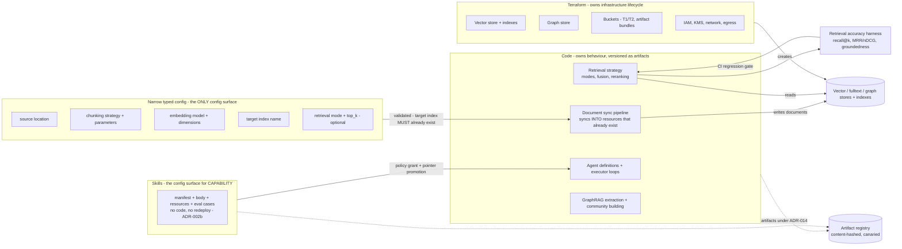

# 2.11 Ownership Boundaries: Terraform vs Code vs Config

Part of [[architecture|Architecture]].

There is no general pipeline configuration language in this platform ([[ADR-015]]). Three owners, one concern each, and nothing crosses the line.

> **While development is local ([[ADR-019]]), the "Terraform" box is played by Docker Compose.** The boundary is unchanged — *something declarative owns resource lifecycle, and neither code nor config ever creates a resource* — but the declarative thing is a Compose file, not Terraform. **There is no Terraform for local**; it arrives post-checkpoint, along with the cloud resources it would own ([[§4.3]], [[§8]]). Read "Terraform" below as "whatever owns resource lifecycle in this environment."

Three rules make the boundary hold: **config never creates a resource** (Terraform owns lifecycle; a config referencing a nonexistent index fails validation), **code never hardcodes a per-corpus knob** (chunking and embeddings belong in config because they are tuned per corpus by people who should not need a deploy), and **capability arrives as a skill, not as config** ([[ADR-002b]], [[P12]]). Full detail in [[§3.6]] (document sync + ingestion config + accuracy harness) and [[§3.8]] (tool onboarding).
