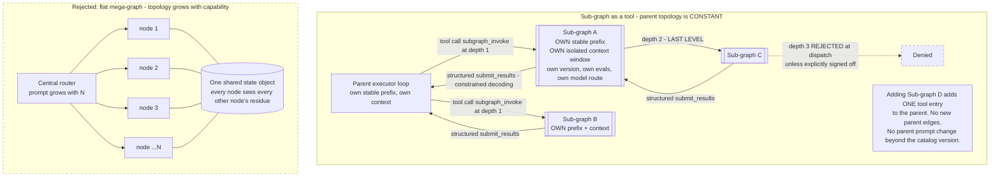

# 2.12 Capability Extension Ladder

Part of [[architecture|Architecture]].

The single question this subsection answers: *"we want the agent to do a new thing — what do we build?"* Apply the ladder **strictly in order** and stop at the first rung that works.

| Want to add | Use | Cost | Requires |
| --- | --- | --- | --- |
| A new **procedure** over existing tools | **Skill** ([[ADR-002b]]) | A folder + eval cases | **No code** |
| A new way to **touch the outside world** | **Tool** — an MCP server ([[§3.8]]) | Code in the MCP server only | **No platform change** |
| A new **execution topology** | **Sub-graph** (§2.12.1) | Code + justification | One of the [[ADR-012]] forcing functions must genuinely apply |

A reviewer can apply this mechanically. "We need another node" is almost never the right answer to a capability request; it is the answer to a *topology* request, and topology requests are rare. If the request can be written as instructions over tools that exist, it is a skill and the review is about the instructions and the eval cases, not about the graph.

#### 2.12.1 The Sub-graph Plan, Finalized

A sub-graph is not "more nodes in the parent graph." It is a **compiled, self-contained unit** with:

- **Its own stable prefix.** A sub-graph is an independent prompt-assembly domain, so its prefix caches independently of the parent's and adding one never perturbs the parent's prefix ([[P2]], [[ADR-004]]).
- **Its own isolated context window.** Nothing of the parent's trajectory leaks in beyond the explicit handoff ([[P5]]).
- **Its own registry entry, version, eval suite, and model route.** A sub-graph is versioned and promoted like any other artifact ([[ADR-014]]) and can be routed to a different model than its parent ([[ADR-011]]).

**The key move: the parent invokes a sub-graph as a tool.** From the parent's perspective a sub-graph is one more entry in the tool catalog that takes structured arguments and returns a structured result. That is the whole trick, and it is what decouples capability scale from topology scale: **the parent's graph does not grow when you add a sub-graph.**

**Hard depth limit: 2 levels; 3 only with explicit sign-off.** Unbounded nesting is how a sub-graph registry turns into runaway recursion and token blowup — each level multiplies context and cost. Enforcement is not advisory:

- The handoff contract carries a **`depth` counter** (`SubAgentHandoff.depth`, [[§3.1]].3).
- Dispatch **rejects** an invocation whose resulting depth would exceed the limit, before any model call. Depth 3 requires a recorded sign-off on the sub-graph's registry entry (`max_depth_signoff`), and depth 4 is not expressible.
- The limit is a correctness property ([[Property 24]]), tested deterministically rather than trusted.

**A second admission check: a hard size cap on inherited context.** [[§3.1]].3 scales the handoff by a complexity flag — minimal instructions for `SIMPLE`, trajectory plus filesystem handle for `COMPLEX`. That is the right *intent* and a flag is a bad *guarantee*: `COMPLEX` is set by a planner, and a planner that sets it on a branch which has grown to a quarter-million tokens produces a child that starts already near its ceiling, immediately compacts, and does its first real work from a summary.

So dispatch adds a check that **does not consult the flag at all**:

> **If the parent branch exceeds a fixed size threshold (~100K tokens), the child starts with ISOLATED context — regardless of `complexity`.**

**This is deliberately automatic and deliberately not configurable.** A knob here would be turned down under deadline pressure by someone reasoning that this particular parent is fine, and the resulting failure is expensive and diffuse: a child that behaves subtly worse for reasons nobody connects back to a handoff size. The cap is not a tuning parameter, it is a floor under [[P5]] — context isolation is why multi-agent works, and a large enough inheritance quietly repeals it.

Both admission checks run at the same place, before any model call, and they compose: `depth` bounds how *deep* the tree goes, the size cap bounds how *heavy* any single edge in it is. Together they are what keeps §2.12.1 spawn and [[§2.13]] scope-2 re-attempt from degrading as sessions get long. This is [[Property 30]].

Two related constraints from the fork model ([[ADR-006]] rule 4) apply to spawn as well: **a fork is refused while the parent has an active run**, and **a forked child gets fresh token counters** rather than inheriting the parent's spent ledger.

**Results return through the existing path.** A sub-graph returns via the same structured `submit_results` tool with constrained decoding ([[§3.1]].3) — including the `REROUTE` outcome, so a sub-graph that was the wrong choice hands back a hint instead of failing the task. No new return mechanism is introduced.
