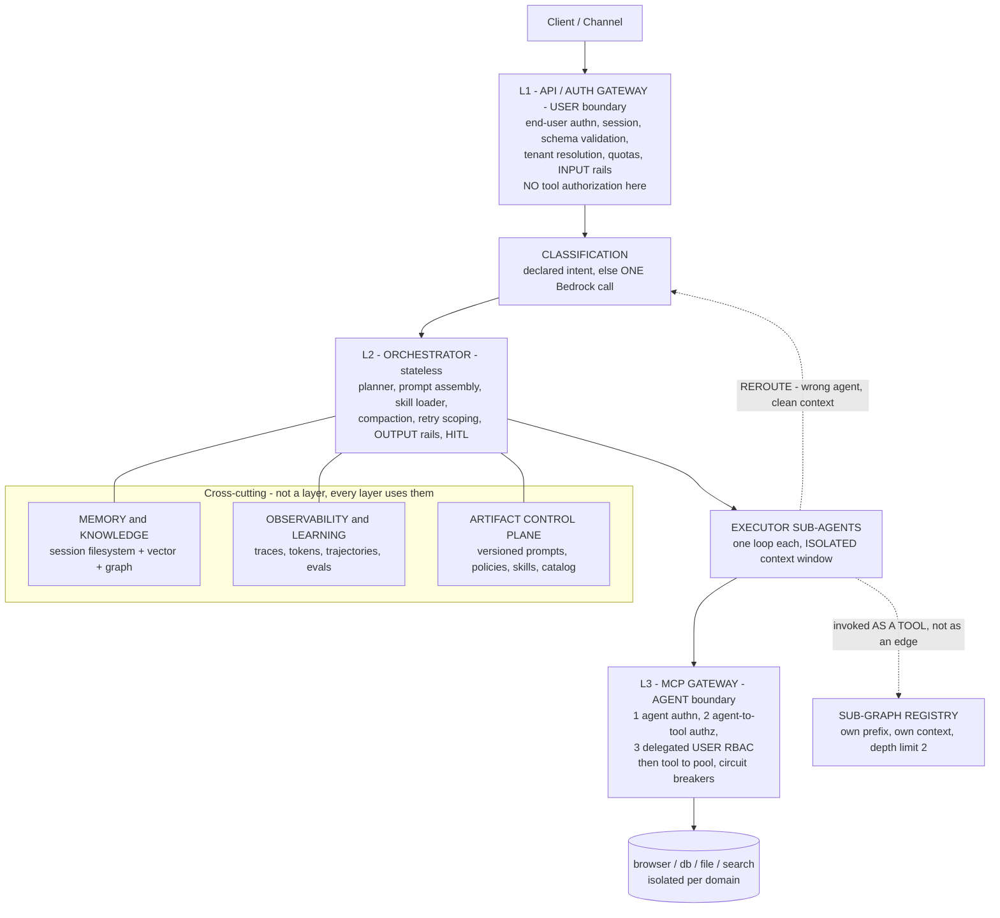

# 2.2 Layer Responsibilities

Part of [[architecture|Architecture]].

**There is deliberately no central router node in that diagram** — classification is one call at the edge, not a graph node every request passes through. [[§6]] explains why that distinction is the whole point.

- **API / Auth Gateway (L1) — the *user* boundary:** server-side **end-user authentication** (OAuth/JWT), session establishment, request schema validation, tenant resolution, per-tenant rate limits and quotas, and **input guardrail rails** (PII redaction, jailbreak/topic detection) before anything reaches the model. This is ordinary application-tier authentication — the same thing any web backend does. **It answers "who is this user, and are they allowed to talk to us at all".** It does **not** decide whether an agent may invoke a tool.
  > **Corrected naming.** An earlier draft called this the "Agent Gateway" and gave it per-agent tool allowlists. That was wrong on both counts: nothing about it is agent-specific, and agent-to-tool authorization belongs at the MCP Gateway where the tool call actually happens. The old name invited exactly the mistake of enforcing tool policy at the user boundary, where the tool being called is not yet known.
- **Classification ([[ADR-013]]):** **One Bedrock model call**, short-circuited when the caller already declared intent (API path, channel, explicit field). No cascade, no owned classifier models, no confidence tiers. Every decision and its downstream outcome are logged, but nothing trains on that log yet. Wrong routes are recovered via the executor's `REROUTE` result — recoverability, not accuracy, is what makes a simple router safe.
- **Orchestrator (L2, stateless):** The **planner sub-agent** (task decomposition + `todo.md` recitation), **KV-cache-first prompt assembly** (including the **skill index** in the stable prefix), the **skill loader** (progressive disclosure of skill bodies into the volatile tail), model routing via the model proxy, tool dispatch, **restorable compaction**, **retry and failure scoping** (`distill_failure`, failure-loop detection — [[§2.13]]), **output guardrail rails**, and the **human-in-the-loop controller**. Session state lives in an external cache (Redis) so the orchestrator stays stateless and horizontally scalable.
- **Executor Sub-agents:** Small LangGraph graphs, each with a **clean, isolated context window**, specialized by task type (coding, research/multimodal, math/analysis). They call tools via dispatch, load skills on demand, may invoke a registered **sub-graph as a tool**, and return results through a structured submit-results tool (including a `REROUTE` outcome).
- **Sub-graph Registry ([[§2.12]]):** Compiled, self-contained execution units, each with its **own** stable prefix and **own** isolated context window, independently versioned, evaluated, and model-routed. **The parent invokes a sub-graph as a tool**, so adding one never grows the parent's graph. Hard depth limit of 2 levels (3 only with explicit sign-off), enforced by a depth counter in the handoff contract at dispatch time.
- **MCP Gateway + Tool Pools (L3) — the *agent* boundary, and the primary authorization decision point.** Not a "recheck": this is where the real access decision is made, because this is the first point at which the agent identity, the tool, and the arguments are all known. Three distinct checks, all required, in order:
  1. **Agent authentication** — is this a registered agent identity presenting a valid credential? An unauthenticated agent gets nothing, regardless of how legitimate the originating user is.
  2. **Agent authorization** — is *this agent* granted *this tool*, per the OPA policy bundle? This is where per-agent tool allowlists live.
  3. **End-user RBAC** — does the **delegated user** on whose behalf the agent is acting have rights to this action and this data? An agent must never be able to reach data its user could not reach directly.

  Then schema validation, `tool → pool` resolution via the registry, **tool catalog version pinning** per session ([[§3.8]]), and dispatch into **isolated domain pools** (browser/db/file/search), each replicated with a circuit breaker and its own network policy.

  > **This requires the user identity to travel with the tool call.** Check 3 is impossible otherwise — the MCP Gateway cannot evaluate a user's rights if it only knows the agent. So the delegated user principal is part of the tool-call contract ([[§3.1]], [[§3.2]]), not ambient state. Getting this wrong produces a **confused deputy**: a correctly-authenticated agent used as a lever to reach data the requesting user was never entitled to. [[Property 32]].
- **Memory & Knowledge:** External memory (object store/sandbox FS) for restorable compression; vector store for baseline RAG; knowledge graph for GraphRAG. Stores and indexes are **created and owned by Terraform** ([[ADR-015]]); the ingestion pipeline is code that syncs documents into resources that already exist.
- **Observability & Learning:** Distributed tracing, token/KV-cache accounting, trajectory logging, the eval harness that turns trajectories into quality gates (including **skill eval gates** and the **retrieval accuracy harness**), and the two improvement tracks that consume it — Track B reflective prompt evolution (built first) and Track A weight training (narrow scope, later). See [[ADR-008]] and [[§2.9]].
- **Artifact Control Plane:** Immutable, versioned prompt, policy, **skill**, tool-catalog, and retrieval-strategy artifacts resolved at runtime by `(tenant_id, agent_id)`. Attaching a skill to an agent is a **policy grant plus a pointer promotion** — no redeploy. Both improvement tracks publish here through an eval gate; rollback is a pointer change ([[ADR-014]]).

Note the deliberate absence: there is **no central mega-graph node**. Classification is one model call plus a re-route path, not a router node with an edge per label ([[ADR-013]]); each executor decides its own path inside its loop ([[ADR-012]]); new capability arrives as a **skill**, not as a node ([[ADR-002b]], [[P15]]); and where a genuine sub-graph is warranted it hangs off the parent as a **tool**, not as an expansion of the parent's topology. [[§6]] explains why.
