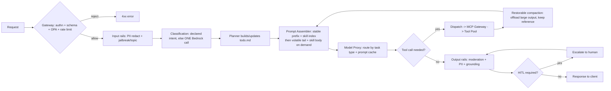

# 2.3 Request Flow (High-Level)

Part of [[architecture|Architecture]].

```mermaid
flowchart LR
    A[Request] --> B{Gateway: authn + schema + OPA + rate limit}
    B -->|reject| Z[4xx error]
    B -->|allow| C[Input rails: PII redact + jailbreak/topic]
    C --> D[Classification: declared intent, else ONE Bedrock call]
    D --> E[Planner builds/updates todo.md]
    E --> F[Prompt Assembler: stable prefix + skill index<br/>then volatile tail + skill body on demand]
    F --> G[Model Proxy: route by task type + prompt cache]
    G --> H{Tool call needed?}
    H -->|yes| I[Dispatch -> MCP Gateway -> Tool Pool]
    I --> J[Restorable compaction: offload large output, keep reference]
    J --> F
    H -->|no| K[Output rails: moderation + PII + grounding]
    K --> L{HITL required?}
    L -->|yes| M[Escalate to human]
    M --> K
    L -->|no| N[Response to client]
```
