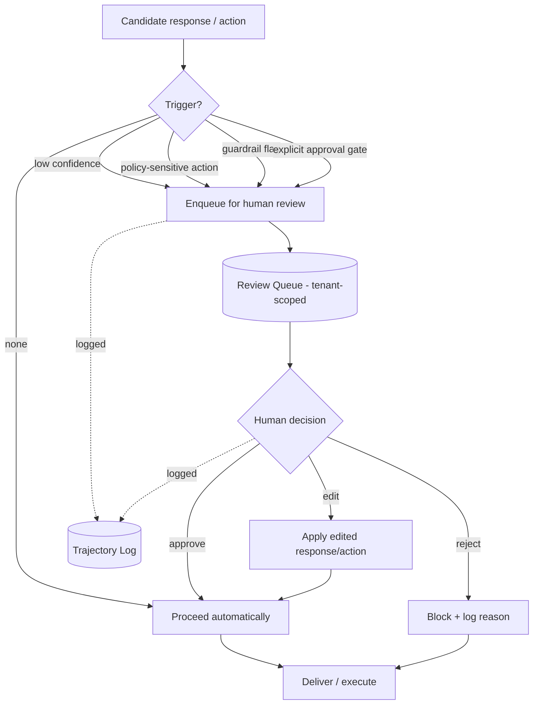

# 2.4 Human-in-the-Loop Flow

Part of [[architecture|Architecture]].

HITL triggers: low model confidence, policy-sensitive/irreversible actions (e.g., writes via `db_*`/`file_*` to production resources), guardrail flags, or an explicit approval gate configured per tenant/agent. All decisions are recorded in the trajectory for audit and RL.
