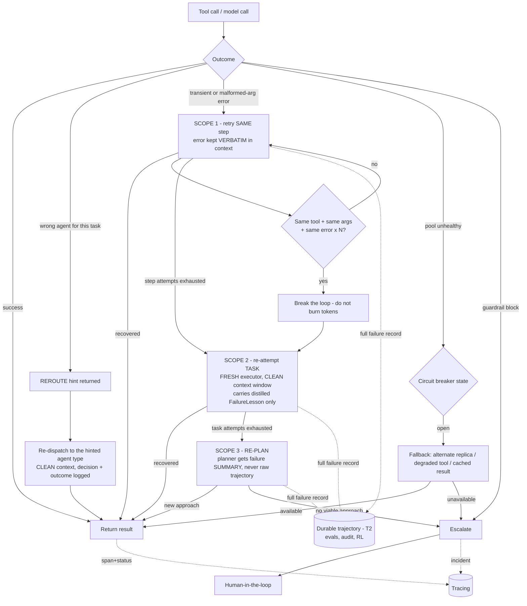

# 2.5 Failures & Escalations Flow

Part of [[architecture|Architecture]].

Key rules: retries are **scoped** ([[§2.13]]) — verbatim error for a same-step retry, a distilled lesson for a fresh task attempt, a summary for a re-plan; failures are **always** written to the durable trajectory regardless of scope; identical tool + identical arguments + identical error N times (default 3) **breaks the loop** rather than continuing to burn tokens; per-pool circuit breakers prevent cascading failure; a routing mistake is recovered by `REROUTE` rather than treated as a task failure; unrecoverable or policy-blocked cases escalate to HITL. Every outcome emits a span with status.
