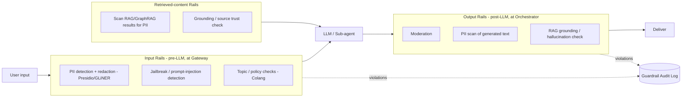

# 2.6 Guardrails Strategy

Part of [[architecture|Architecture]].

Guardrails are a **pipeline** ([[P7]]): input rails run before the model, retrieved content is scanned before it enters context, and output rails run before delivery. Policies are declarative (Colang-style). Violations are logged for audit and feed evaluation.
