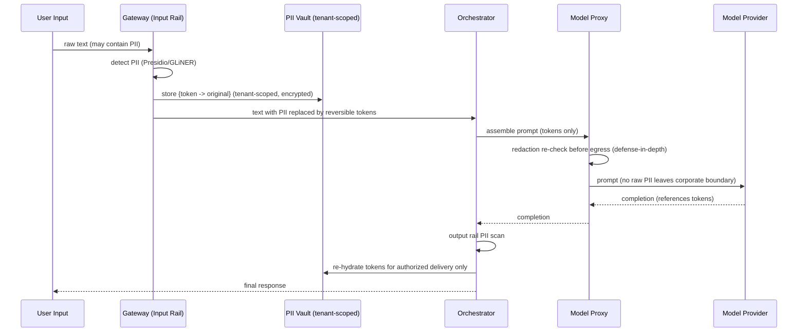

# 2.7 PII Masking Strategy (final-phase target design, with the Phase-1 interim state)

Part of [[architecture|Architecture]].

> **Read this first.** Everything in this subsection describes the **final-phase target** ([[Phase 6]], [[ADR-009]]): self-hosted NER, the tenant-scoped vault, reversible tokenization, and authorized re-hydration. It is **not** what [[Phase 1]] ships.
>
> **The Phase-1 interim state** is deliberately narrower and cheaper:
>
> | | Interim ([[Phase 1]] → 5) | Final ([[Phase 6]]) |
> | --- | --- | --- |
> | Detection | Deterministic pattern/regex for **structured** entities only: credit card (Luhn-checked), SSN, email, phone. Optionally a **managed** service (e.g. Amazon Comprehend PII) as a stopgap. | Local NER — Presidio + a GLiNER-PII-class model — covering names, addresses, free-text and contextual identifiers |
> | Handling | Replace in place with a non-reversible marker; no vault, no re-hydration | Reversible tokenization against a tenant-scoped encrypted vault, re-hydrated only at authorized delivery |
> | CI gate | **The deterministic "no raw PII in an outbound provider payload" test is a hard, non-negotiable gate from [[Phase 1]] onward** ([[Property 10]]) | Same gate, broadened to the NER entity set |
>
> **Binding precondition, not a footnote:** while the interim state is in force, **the platform MUST NOT onboard tenants with regulated data (PHI, PCI cardholder data, or regulated PII).** Unstructured PII is not covered until [[Phase 6]]. This is recorded as an accepted risk with its mitigation in [[§7.10]] and as a hard gate on the phases in [[§8]].

In the final-phase design, PII is detected and replaced with **reversible tokens at the Gateway before egress**; the mapping lives in a tenant-scoped, encrypted vault. Raw PII never reaches the model provider. Re-hydration happens only at authorized delivery. Logs and trajectories store the tokenized form ([[P6]] preserves failures, but never raw PII).

Detection uses [Microsoft Presidio](https://microsoft.github.io/presidio/) for pattern- and NER-based entities plus a lightweight [GLiNER-PII](https://huggingface.co/urchade/gliner_multi_pii-v1)-style model for broader categories (which also covers toxicity, jailbreak, and refusal classification in the same pass). Policy orchestration — which rails run where, and what happens on failure — is expressed declaratively in Colang via [NeMo Guardrails](https://docs.nvidia.com/nemo/guardrails/latest/index.html), whose catalog covers PII detection and masking across input, output, **and retrieval** flows, along with topic control, RAG grounding, and jailbreak prevention. The reversible-tokenization pattern (placeholder → vault) is what makes pre-LLM redaction workable: the agent can still reason over structure, and the response is re-hydrated only for an authorized recipient.

**PII surfaces beyond the prompt.** Redaction is not complete unless it covers every place text lands. The interim gate covers these surfaces for structured entities only; the final stack covers them for the full NER entity set:

| Surface | Requirement |
| --- | --- |
| Prompt / completion | Tokenized before provider egress; re-hydrated only at authorized delivery |
| Traces & spans | Tool arguments and results scrubbed before centralized logging, with a bounded retention window |
| Trajectory store | Tokenized form only; vault refs, never values |
| Eval datasets | Built from tokenized trajectories; a dataset containing raw PII is a compliance incident |
| Error records | Preserved per [[P6]] at every retry scope — verbatim error, distilled lesson, and failure summary alike — with the same tokenization applied to each |
| Vault | Tenant-scoped, encrypted, separate retention and deletion policy so a tenant offboard destroys the mapping |
