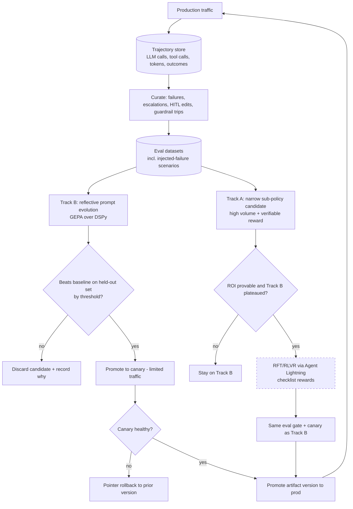

# 2.9 Continuous Improvement Flow (Track A / Track B)

Part of [[architecture|Architecture]].

Nothing reaches production without clearing the same gate, whether it came from reflective optimization or weight training ([[P10]]).

The Track B loop above is the platform-level view. The **agent-level** version — the reference tuning loop as given, the three additions it needed (canary plus rollback, a human gate, a production feedback edge) and the two constraints on its gate (cost criteria, and no live prefix write) — is **ADR-008a**, with the full analysis at [`docs/vault/architecture/agent-tuning-loop.md`](../../../docs/vault/architecture/agent-tuning-loop.md).
