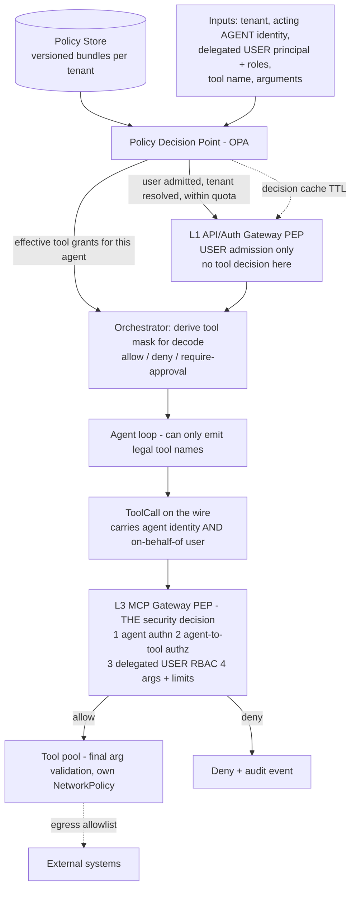

# 3.2 Access Policies: User Authentication, Agent Authentication, and Tool Authorization

Part of [[3-low-level-architecture|3. Low-Level Architecture]].

Two questions, at two boundaries, and keeping them separate is the whole design ([[ADR-010]]):

1. **At L1, the user boundary:** *is this a valid end user, of which tenant, and are they within quota?* Ordinary server-side application authentication. The tool is not known here, so no tool decision is made here.
2. **At L3, the agent boundary:** *may **this agent**, acting **on behalf of this user**, invoke **this tool** with **these arguments**, right now?* This is the security decision, and it needs all four facts at once — which is why it lives where the call is dispatched.

Both draw on one versioned policy document. Enforcement then happens in three places with three different mechanisms.



**Why three layers and not one.** The mask is a *usability and cost* control — it stops the model from wasting turns on calls that would be denied, and it keeps the tool definitions stable ([[ADR-005]]). The MCP gateway check is the *security boundary* — a mask is a prompt-side hint and must never be the only thing standing between a tenant and a tool. The pool-level check plus NetworkPolicy is *containment* — even a compromised gateway cannot make the `db` pool reach the internet.

#### 3.2.1 Policy Document Schema

```python
# Pydantic-ish; stored as a versioned, immutable bundle per tenant (ADR-014)
class ToolGrant(BaseModel):
    tool_pattern: str  # "db_read", "browser_*", "file_write"
    effect: Literal["allow", "deny"]  # deny always wins
    arg_constraints: dict[str, ArgConstraint] = {}  # per-argument bounds
    require_approval: bool = False  # forces HITL gate before execution (§2.4)
    max_calls_per_task: int | None = None
    data_scopes: list[str] = []  # e.g. ["schema:public", "region:eu"]


class ArgConstraint(BaseModel):
    allowed_values: list[str] | None = None
    denied_patterns: list[str] | None = None  # e.g. r"(?i)\bdrop\s+table\b"
    max_length: int | None = None
    must_match: str | None = None


class AgentPolicy(BaseModel):
    agent_id: str
    inherits: list[str] = []  # role/policy composition
    grants: list[ToolGrant]
    model_allowlist: list[str]  # which models this agent may be routed to
    egress_allowlist: list[str] = []  # domains reachable by browser_*/http_*
    pii_policy: Literal["mask_all", "mask_sensitive", "allow_internal"] = "mask_all"
    budget: Budget  # tokens/cost/tool-calls per task and per day


class TenantPolicyBundle(BaseModel):
    tenant_id: str
    version: str  # content hash; immutable
    data_partition: str  # isolation key for memory, vault, indexes
    default_deny: Literal[True] = True  # non-negotiable
    agents: list[AgentPolicy]
    rate_limits: RatePolicy  # enforced at gateway AND orchestrator
```

Two non-negotiables: **default deny** (an unmatched tool is denied, never allowed), and **deny wins** over any inherited allow.

#### 3.2.2 Decision Contract

```json
{
  "decision_id": "01JD8Z...",
  "allow": true,
  "effective_grants": [
    { "tool": "db_read",     "mode": "allow",            "max_calls_per_task": 20 },
    { "tool": "db_write",    "mode": "require_approval",  "max_calls_per_task": 2 },
    { "tool": "browser_*",   "mode": "allow",            "egress": ["docs.internal.example"] },
    { "tool": "file_delete", "mode": "deny",             "reason": "policy:no_destructive_fs" }
  ],
  "tool_mask": { "mode": "auto", "allow_prefixes": ["db_", "browser_", "file_read"], "deny": ["file_delete"] },
  "data_partition": "tnt_4471",
  "obligations": ["mask_pii", "audit_tool_args"],
  "policy_version": "sha256:9f2c...",
  "cache_ttl_seconds": 30
}
```

The `tool_mask` is what the prompt assembler attaches to `AssembledPrompt.tool_mask`; `effective_grants` is what the MCP gateway re-evaluates. Both carry `policy_version` so a trajectory can be replayed against the exact policy that governed it.

#### 3.2.3 Rule Evaluation (deterministic, order-independent)

```pascal
PROCEDURE authorize(request, bundle)
  INPUT:  request (tenant_id, agent_id, on_behalf_of: UserPrincipal, scopes, tool_name?, arguments?)
          // Both identities are required. The effective grant is the INTERSECTION of the
          // agent's grant and the user's data_scopes — never the union. ADR-010, Property 32.
  OUTPUT: Decision

  SEQUENCE
    IF request.tenant_id ≠ bundle.tenant_id THEN
      RETURN Deny("tenant_mismatch")          // cross-tenant is structurally impossible
    END IF

    policy ← resolveAgent(bundle, request.agent_id) WITH inherits flattened
    IF policy IS NULL THEN RETURN Deny("unknown_agent") END IF

    // 1. Collect every matching grant (most specific pattern wins within an effect)
    matches ← [g IN policy.grants WHERE matches(g.tool_pattern, request.tool_name)]

    // 2. Deny precedence — a single deny is terminal
    IF ANY m IN matches WHERE m.effect = "deny" THEN
      RETURN Deny("explicit_deny", audit := TRUE)
    END IF

    // 3. Default deny
    IF matches IS EMPTY THEN RETURN Deny("default_deny") END IF

    grant ← mostSpecific(matches)

    // 4. Argument-level constraints (only when a concrete call is being checked)
    IF request.arguments ≠ NULL THEN
      FOR each (name, constraint) IN grant.arg_constraints DO
        IF NOT satisfies(request.arguments[name], constraint) THEN
          RETURN Deny("arg_constraint:" + name, audit := TRUE)
        END IF
      END FOR
    END IF

    // 5. Budgets and per-task call caps (counters live in the session store)
    IF exceededBudget(request, policy.budget) THEN RETURN Deny("budget_exhausted") END IF
    IF exceededCallCap(request, grant.max_calls_per_task) THEN RETURN Deny("call_cap") END IF

    // 6. Approval obligation routes to HITL instead of executing
    IF grant.require_approval THEN
      RETURN AllowWithObligation("hitl_approval")
    END IF

    RETURN Allow(grant, obligations := deriveObligations(policy))
  END SEQUENCE
END PROCEDURE
```

**Preconditions.** `bundle` is a validated, signed policy version; `request.tenant_id` came from a verified JWT claim, never from a request body field.
**Postconditions.** Exactly one of Allow / AllowWithObligation / Deny; every Deny with `audit := TRUE` emits an audit event carrying `policy_version` and `decision_id`; no decision depends on rule ordering in the document.
**Loop invariant.** While iterating `arg_constraints`, all previously checked arguments satisfied their constraints — the first violation returns immediately, so a partial pass never yields Allow.

#### 3.2.4 Operational Properties

- **Decision caching.** Decisions are cached by `(tenant_id, agent_id, user_subject, policy_version)` with a short TTL (~30s) so OPA is not a per-call latency tax. **The delegated user is part of the cache key** — omitting it would let one user's allow decision be replayed for another user on the same agent, which is the confused deputy reintroduced as a caching bug. Argument-level checks are never cached — they depend on the call.
- **Fail closed.** If the policy decision point is unreachable and no valid cached decision exists, the request is denied. Availability never trades against isolation.
- **Rate limits in two places.** Edge limits stop abuse; **per-tenant limits in the orchestrator** stop a single tenant's runaway agent loop from starving others, which the edge cannot see because it is one request fanning into hundreds of tool calls.
- **Audit trail.** Every allow and deny is recorded with `decision_id`, `policy_version`, tool, and scrubbed arguments. This is the artifact a compliance review asks for.
- **Policy testing.** Policy bundles ship with their own test fixtures and run in CI ([[§5.5]]) — a policy change is a code change.
