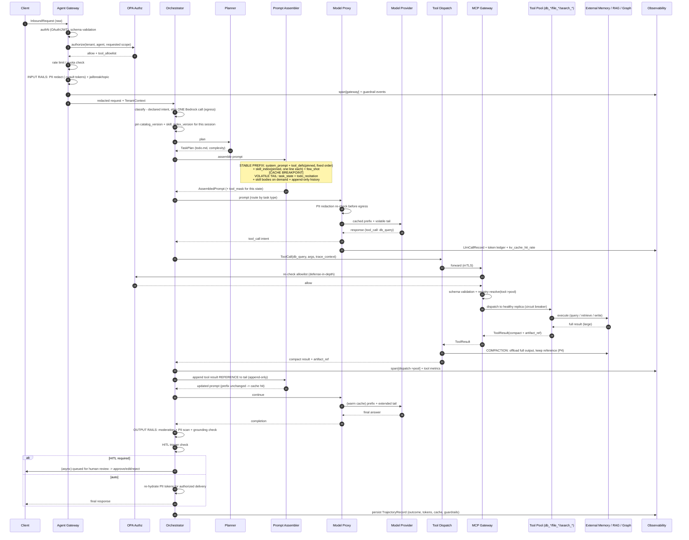

# 3.4 End-to-End Walkthrough of a Single Request

Part of [[3-low-level-architecture|3. Low-Level Architecture]].

The following sequence traces one request from arrival to delivery, calling out **prompt assembly order (KV-cache)**, **guardrail/PII interception points**, **the tool-call path through the MCP gateway**, **context compaction points**, and **observability capture**.

#### Step-by-step

1. **Arrival & authN (Gateway).** The gateway assigns `request_id` (trace root), authenticates the JWT, and validates the request schema. Reject → `4xx` with a span.
2. **Authorization (OPA).** OPA returns an allow/deny plus the **per-agent `tool_allowlist`** and tenant isolation partition ([[ADR-010]]). This allowlist becomes the basis for the later tool mask.
3. **Rate limiting / quota.** Per-tenant limits are enforced; over-limit → `429`.
4. **Input rails + PII interception (pre-LLM).** PII is detected and replaced with reversible vault tokens **before egress** ([[P7]]); jailbreak/topic checks run. Violations are logged; hard blocks stop here.
5. **Handoff to orchestrator.** The gateway forwards the redacted request and `TenantContext`.
6. **Classification & planning.** `classify()` resolves the task type: **declared intent if the caller gave one, otherwise one Bedrock call** ([[ADR-013]]). Note the ordering — this call happens *after* step 4, so the text it sees is already redacted. The decision, its confidence, and later its downstream outcome are logged; nothing trains on that log yet. The **planner** then produces/updates `todo.md` and sets `complexity`. For SIMPLE tasks the handoff is minimal; for COMPLEX tasks it shares trajectory + filesystem handles ([[ADR-002]]). The session pins its `catalog_version` and `skill_index_version` here ([[§3.8]], [[ADR-002b]]).
7. **KV-cache-first prompt assembly.** The assembler builds `[system_prompt → tool_defs(fixed order, pinned catalog) → skill_index(fixed order, pinned) → few_shot → CACHE BREAKPOINT → task_state → todo_recitation → loaded skill bodies → append-only history]`. The **tool mask** for this state is attached, but tool definitions and the skill index never change within the session ([[P2]]/[[P3]], [[§3.8]]). If a skill becomes relevant, its **body** is loaded into the volatile tail — after the breakpoint, so the cache is untouched ([[ADR-002b]]). A `prefix_hash` span is emitted.
8. **Model call + egress redaction.** The model proxy re-checks PII redaction and sends the prompt to **Bedrock** so the stable prefix hits the KV-cache. One model for every task type today; per-task routing is a config change behind this same proxy ([[ADR-011]]).
9. **First model turn.** The model requests a tool call (e.g., `db_query`). The proxy emits an `LlmCallRecord` with the token ledger and **KV-cache hit rate** ([[P1]]/[[P8]]).
10. **Tool-call path through the MCP gateway.** Dispatch sends a `ToolCall` with propagated trace context over mTLS. The MCP gateway **re-checks the allowlist**, validates the argument schema, resolves `tool → pool` via the registry, and dispatches to a healthy replica behind a circuit breaker ([[ADR-003]]).
11. **Execution & external memory.** The pool executes (query/retrieve/write). Large outputs are produced.
12. **Compaction point ([[P4]]).** Dispatch offloads the full output to external memory and keeps only a **compact summary + `artifact_ref`** in context. This is the primary context-growth control; it is restorable (the agent can re-fetch).
13. **Append-only continuation.** The tool result **reference** is appended to the volatile tail. Because the prefix is untouched, the next model turn is a **cache hit** (warm prefix).
14. **Final model turn.** The model produces the answer using the compact context.
15. **Output rails (post-LLM).** Moderation, PII scan of generated text, and RAG **grounding/hallucination** check run against citations ([[P7]]). Failures escalate.
16. **HITL gate.** If a trigger fires (low confidence, sensitive/irreversible action, guardrail flag, explicit gate), the response/action is queued for human approve/edit/reject; otherwise it proceeds.
17. **PII re-hydration & delivery.** Vault tokens are re-hydrated only for authorized delivery; the final response returns to the client.
18. **Observability capture.** The full `TrajectoryRecord` — spans across gateway→orchestrator→pool, all LLM-call records, token accounting, KV-cache hit rate, guardrail events, and outcome — is persisted. This record is the substrate for evaluation ([[§5]]) and RLVR training ([[ADR-008]]).
