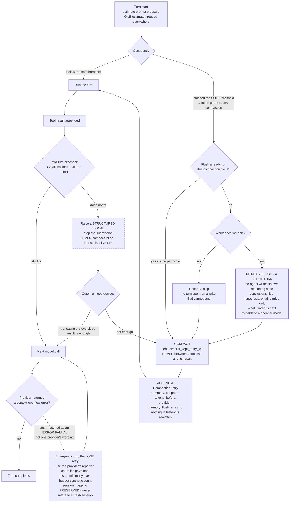

# 3.5 Context Compaction Points (summary)

Part of [[3-low-level-architecture|3. Low-Level Architecture]].

Compaction happens at three points, all restorable ([[P4]]):

- **Tool-output offload (step 12):** raw outputs → external memory; context keeps a reference.
- **Structurally-lossless trimming:** strip raw blobs/base64/tool metadata from history while keeping user/assistant turns verbatim.
- **Anchored iterative summary:** a persistent structured summary updated incrementally for long sessions, stored in the session cache and recited alongside `todo.md`.

None of these touch the stable prefix, so the KV-cache stays warm across compaction. All three are recorded as **appended `CompactionEntry` values** ([[§3.1]].11) rather than in-place rewrites, and each is preceded — once per compaction cycle, on a writable workspace — by the **memory flush** ([[ADR-006c]]). No boundary chosen by any of them may separate a tool call from its result ([[ADR-006]] rule 5, [[Property 27]]).

**The full lifecycle, with the two defensive paths that are easy to leave out.** The early path (memory flush) fires *deliberately*, while there is room to spend a turn well. The late path (mid-turn precheck) fires *defensively*, and its entire job is to refuse to fix the problem itself.

Three invariants the picture is meant to make hard to violate: **flush precedes compact, never the reverse** ([[Property 28]]); **the precheck signals and the outer loop acts** ([[ADR-006]] rule 6); and **no arrow anywhere touches the stable prefix** ([[Property 8]]).
