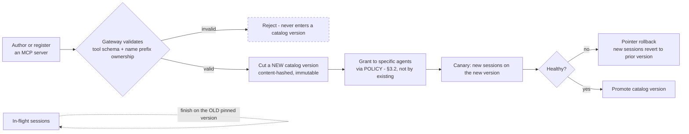

# 3.8 Adding and Evolving Tools

Part of [[3-low-level-architecture|3. Low-Level Architecture]].

**The apparent contradiction, resolved.** [[ADR-005]] says the tool definition set is stable and must never be mutated. That reads as "you can never add a tool," which would be an absurd property for a platform whose second scaling axis is capability. The resolution is one word:

> **Stability is PER-SESSION, not forever.**

The tool catalog is a **versioned artifact** (`ToolCatalogVersion`, [[§3.1]].10). A session **pins** a catalog version at session start. Within that session the tool set never changes — so the prefix is byte-stable and the cache stays warm, which is all [[ADR-005]] ever actually required. New tools land in a **new catalog version**. New sessions pick it up; **in-flight sessions finish on the old version.** Nothing mutates mid-session, and the catalog still evolves continuously.

This is the same mechanism as the skill index ([[ADR-002b]]) and for the same reason: anything that contributes to the stable prefix is pinned per session and versioned across sessions.

#### 3.8.1 Onboarding a New Tool

**No platform redeploy at any step.** The only code written is **inside the MCP server**, owned by the tool author. The platform's part is validation, versioning, granting, and promotion — all artifact operations ([[ADR-014]]).

Note the ordering: a tool existing in the catalog does **not** mean an agent can call it. Availability and authorization are separate. A new tool is inert until a policy grant ([[§3.2]].1) admits it for a specific agent, and the MCP gateway re-checks that grant on every call regardless of what the mask allowed.

#### 3.8.2 Tenant-Supplied MCP Servers

Tenants bringing their own MCP servers is precisely why the MCP gateway exists as a distinct layer rather than as a library. Regardless of who wrote the server, the gateway enforces:

| Enforcement | What it prevents |
| --- | --- |
| **Schema validation** at registration and per call | A malformed or drifting tool schema poisoning prompt assembly or argument handling |
| **Name-prefix ownership** | A tenant server squatting the `db_*` family and shadowing a platform tool |
| **Egress allowlist** per pool | A tenant tool reaching an arbitrary internet destination from inside the VPC |
| **Authorization re-check** ([[§3.2]]) | A tool being callable merely because it exists in the catalog |
| **Audit** of every call with scrubbed arguments | An unattributable action against a tenant system |
| **Circuit breaker + resource limits** per pool | A badly behaved tenant server degrading shared infrastructure |

A tenant server is untrusted code at the edge of the platform, and it is treated that way. The gateway is the trust boundary, not the server's own good behaviour.

#### 3.8.3 Scaling Past a Prefix-Sized Catalog

Full tool definitions in the stable prefix works only while the catalog is small — and [[ADR-005]] already notes selection quality degrades as the toolset grows (roughly 20 atomic tools is the working ceiling). Past that, switch to **search-based discovery**, which is the same progressive-disclosure move skills use:

| Regime | Mechanism | Switch when |
| --- | --- | --- |
| **Small catalog** | All tool definitions in the stable prefix | Below ~20–30 tools **and** the definitions fit a modest share of the prefix budget |
| **Large catalog** | A **`tool_search`** meta-tool: a compact index in the prefix, full definitions fetched into the volatile tail on demand | Above that count, or when tool definitions dominate the prefix, or when measured tool-selection accuracy starts falling |

The threshold is a measured decision, not a fixed number. The signals that force the switch: tool-selection accuracy declining in evals, tool definitions consuming a large share of the prefix, or a catalog crossing the low tens of tools. Until one of those fires, the flat prefix catalog is cheaper and more reliable — search adds a hop and a failure mode.

`catalog_version` is pinned in the `SessionManifest` and recorded in every `TrajectoryRecord`, so a trajectory can always be replayed against the exact tool set that governed it ([[Property 26]]).
---
