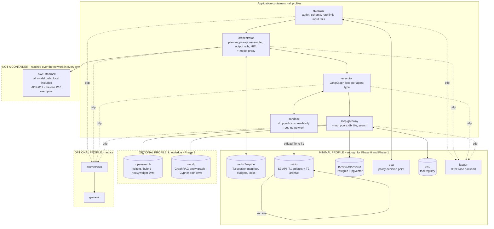

# 4.3 Local Compose topology

Part of [[4-service-selection-and-local-first-development|4. Service Selection and Local-First Development]].

One container per architectural layer, so the layer boundaries in [[§2.1]] and the contracts in [[§3.1]] are crossed over a real network hop rather than collapsed in-process. **A developer machine cannot comfortably run everything at once**, so the stack is split into profiles.

**The profile split, and why it exists.**

| Profile | Services | Enough for |
| --- | --- | --- |
| **minimal** (default) | Redis, MinIO, Postgres+pgvector, OPA, etcd, Jaeger | **[[Phase 0]] and [[Phase 1]] in full.** The vertical slice needs no search engine and no graph |
| **knowledge** (opt-in) | OpenSearch, Neo4j | [[Phase 3]]. Both are heavyweight; OpenSearch especially. Off until the knowledge layer exists |
| ~~**models**~~ | *(removed)* | **There is no local model profile.** All model calls go to Bedrock in every environment ([[ADR-011]]), so there is no inference container to run |
| **metrics** (opt-in) | Prometheus, Grafana | Dashboard work. Traces alone (Jaeger) cover most local debugging |

**Compose conventions**, in brief — the authoritative copy is `.kiro/steering/local-development.md` and is deliberately not restated here:

- **Pinned exact image tags.** Never `:latest`.
- **Health checks on every service**, with `depends_on: { condition: service_healthy }` enforcing the **same startup ordering as production** — registry → orchestrator → pools → gateway ([[§2.8]], [[§5.7]].5). Ordering bugs surface on a laptop instead of in a cluster.
- **Named volumes** for anything stateful, so a restart is not data loss.
- **One `docker compose up` brings the stack to a working state.** If onboarding needs a runbook, the Compose file is wrong.
- **Resource limits** on containers, so behaviour under constraint is at least directionally informative.

**Terraform is not used locally at all.** Compose covers the local resource lifecycle. [[ADR-015]]'s "Terraform owns infrastructure" boundary is unchanged, but it applies to **cloud** resources and therefore activates **post-checkpoint** ([[§8]]). Writing Terraform for a laptop would be ceremony with no consumer.
