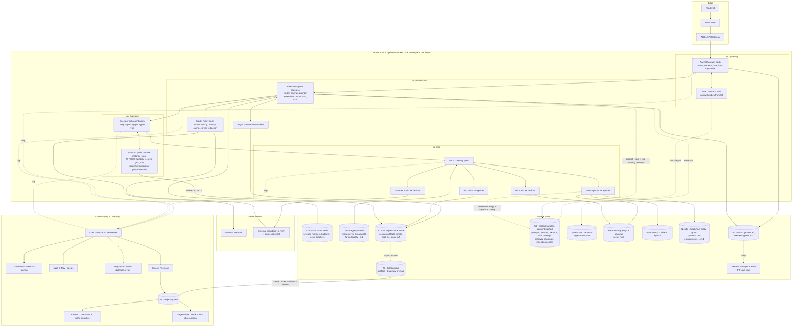

# 5.1 Deployment Topology

Part of [[5-aws-deployment-evaluation|5. AWS Deployment & Evaluation]].

**The eventual deployment target is Kubernetes — containers on Amazon EKS, one namespace per architectural layer, Terraform owning cluster and cloud resource lifecycle, Helm packaging the workloads ([[ADR-018]]).** Stated here so a reader of [[§5]] does not have to infer it from the diagram. The scaling architecture that follows from that decision — what each tier scales on and why — is [[§5.7]]. For what actually runs today, and the local image behind each service below, see [[§4.1]].

**Isolation and scaling notes.**

- Each layer is its own namespace with a **default-deny NetworkPolicy** and an explicit egress allowlist. The `db` pool cannot reach the internet; the `browser` pool can reach only allowlisted domains via NAT.
- Gateway, orchestrator, and model proxy are **stateless** and scale on request rate and in-flight-turn count. Tool pools scale independently per domain — `browser` pods are memory-hungry and slow, `db` pods are cheap and fast, and coupling their autoscaling wastes money. The full per-tier saturation signal, minimum replica counts, and autoscaling mechanism are in **[[§5.7]].1**.
- Tenancy is **shared-infrastructure, partitioned-data** by default: one EKS cluster, per-tenant `data_partition` on every store, per-tenant KMS keys for the vault. A dedicated-cluster tier exists for tenants whose contracts require physical isolation; the architecture does not change, only the deployment target.
- **Startup order is enforced by readiness gates**, not by luck: registry → orchestrator → pools → gateway. Orchestrator readiness fails until the tool registry snapshot is loaded ([[§2.8]]).
- Model access defaults to Bedrock inside the VPC; external providers egress through NAT with an allowlist, and the model proxy re-checks redaction immediately before egress.
- **Storage tiers map to distinct services on purpose** ([[ADR-016]]): T0 is the sandbox pod's NVMe instance store on a storage-optimized node group, T1 is an S3 Express One Zone directory bucket in the same AZ as the executor node group (co-location is what buys the latency), T2 is S3 Standard with lifecycle rules to cheaper classes past the eval retention window, T3 is ElastiCache Redis. Sandbox pods run under a stronger isolation boundary (gVisor or Firecracker-backed nodes) because they execute model-authored code; they get a dedicated node group with no IAM path to tenant data beyond their own session prefix.
- **Terraform owns every resource in the Data & State and Edge groups above** ([[ADR-015]]): the vector index, fulltext index, graph store, buckets, Redis, IAM, KMS keys, node groups, and network policy. The ingestion pipeline syncs documents into those resources and never creates them.
- **Artifacts are deployed as pointers, not baked into images.** Prompt, policy, **skill**, tool-catalog, retrieval-strategy, and ingestion-config bundles land in S3, are content-hashed, and are resolved by pointer at load — so attaching a skill, adding a tool, or changing a chunking parameter is a **promotion, not a rebuild** ([[ADR-002b]], [[ADR-014]], [[ADR-015]], [[§3.8]]).
