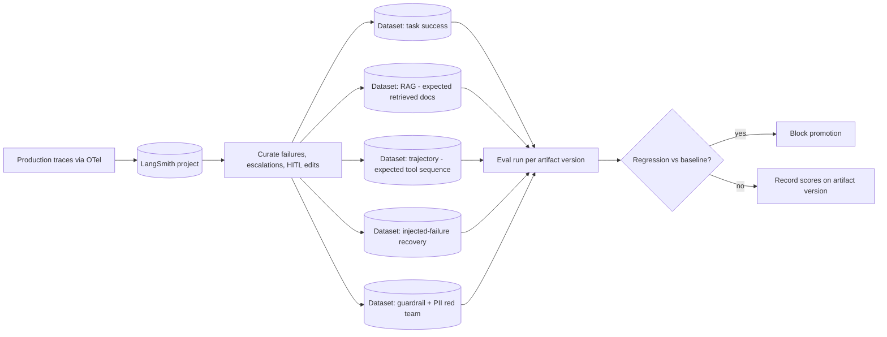

# 5.3 Evaluation with LangSmith

Part of [[5-aws-deployment-evaluation|5. AWS Deployment & Evaluation]].

The evaluation strategy is **trajectory-level, not answer-level**. For an agent, "was the final string right" is a weak signal; what matters is whether it took a legal, efficient, grounded path.

[LangSmith](https://docs.smith.langchain.com/) is the trace and dataset backbone. Its datasets can encode expected retrieved documents for RAG cases and expected agent steps for trajectory cases, which is exactly the shape agent evaluation needs. The foundation principle underneath all of it: record every LLM call with inputs, outputs, retrieved context, tool calls, latency, token counts, and cost, stitched into **one trace per user request**. Every other capability in this section — evaluation, cost analytics, Track B optimization, Track A training — is derived from that record.

**What gets asserted per eval case:**

| Assertion class | Example |
| --- | --- |
| Final answer quality | Correctness, groundedness against citations |
| Tool trajectory | Expected tool sequence; no calls outside the policy mask; call count within budget |
| Retrieval | Expected documents present in top-k; correct retrieval mode chosen (vector / graph / hybrid) |
| Side effects | Which files/records were mutated, and nothing else was |
| Guardrails | PII never appears in the outbound payload; jailbreak attempts blocked |
| Recovery, per scope | Scope 1: the agent corrects the call from the verbatim error. Scope 2: a fresh attempt succeeds carrying only the distilled lesson, and its context contains none of the failed trajectory. Scope 3: the planner changes approach rather than re-issuing the same plan. Identical repeated failures are broken by the loop detector. |
| Skills | The right skill is selected for the task; a loaded skill body changes behaviour as its eval cases specify; a skill never invokes a tool outside its declared `required_tools` |
| Routing | Declared intent short-circuits without a model call; a deliberately mis-routed case produces `REROUTE` rather than a wrong answer, and the re-attempt carries a clean context |
| Cost | Tokens and cache-hit rate within a per-task envelope; skill index within its prefix budget |

**Failure injection is mandatory in eval sets.** Clean benchmarks overstate real performance, because a large part of production agent behaviour is error recovery. A suite with no injected failures cannot tell you whether recovery works — and with scoped retry ([[§2.13]]) there are now **three** recovery behaviours to assert, not one: does a scope-1 retry correct the call from the verbatim error, does a scope-2 re-attempt succeed with only a distilled lesson, and does a scope-3 re-plan actually change approach rather than re-issuing the same plan. An eval set that only exercises scope 1 tests the easiest third of the problem.
