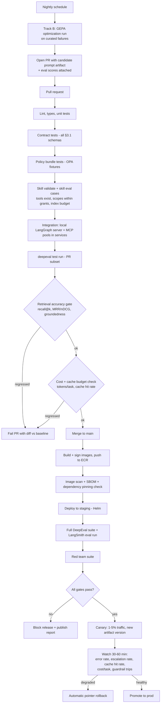

# 5.5 GitHub Actions CI/CD

Part of [[5-aws-deployment-evaluation|5. AWS Deployment & Evaluation]].

> **FUTURE STATE.** This is the **target** pipeline, reached by walking the gate-growth table in [[§4.4]]. **What is actually wired up today is three gates — lint/format, vulnerability scanning, nothing else** ([[§4.4]]). The deploy, staging, canary, and rollback stages below require a cluster to deploy into and therefore arrive **post-checkpoint** ([[§8]]). Do not build them speculatively: a canary pipeline with nothing to canary into is work that then has to be maintained through every subsequent design change.

**The workflow YAML for this shape is deliberately not reproduced here.** It is the future-state target assembled from the gate-growth table in [[§4.4]], and each job in it lands with the component it protects — `mypy` with the first typed module, `opa test` when OPA is wired, `eaf-skill eval` when the skill registry exists, `deepeval` when there is behaviour worth asserting on, `terraform validate` only post-cloud-decision. **The workflow that actually runs today is in [[§4.4]]** and it is three gates long. Maintaining a full pipeline definition in this document for a pipeline nobody runs is how the two drift apart.

Notes that matter more than the YAML, and that hold whenever each gate does arrive:

- **The cost gate is a first-class test.** A PR that keeps quality flat while doubling tokens per task, or that drops cache hit rate, fails. Without this, prefix-stability discipline ([[P2]]) erodes silently. The **skill index budget** is checked by the same mechanism — an unbounded skill index is prefix bloat by another name ([[§7.9]]).
- **The retrieval accuracy gate replaces the old config-validation tier.** Since retrieval strategy is code rather than YAML ([[ADR-015]]), the meaningful question is not "does the config parse" but "did quality move" — recall@k, MRR/nDCG, and groundedness against each corpus's labeled set ([[§3.6]].4).
- **Skills cannot merge without their eval cases passing.** `eaf-skill eval` is blocking, which is what makes "there should be evaluations for the skill" a system property rather than an author's good intention ([[ADR-002b]]).
- **`langgraph up` inside the job** gives end-to-end agent tests against a real server instead of mocked graph internals.
- **Track B runs as a scheduled job that opens a PR**, never as a job that writes to production. Human review plus the same gates apply to a machine-proposed prompt exactly as to a human-written one ([[P10]], [[ADR-014]]).
- Every eval run is tagged with the artifact version and commit, so a regression is traceable to a prompt change, a code change, or a model change — the three causes that otherwise get confused.
