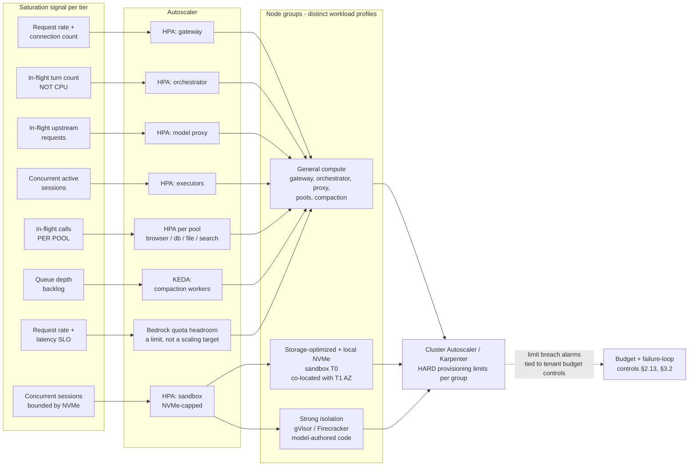

# 5.7 Scaling and Service Management

Part of [[5-aws-deployment-evaluation|5. AWS Deployment & Evaluation]].

Kubernetes is the **eventual** deployment target ([[ADR-018]], [[ADR-019]]), and the layered topology in [[§2.1]] is only real if each layer scales, fails, and deploys independently. This section records **what each tier scales on and why that signal rather than the obvious one**, how cluster capacity is bounded, and how long-running agent work survives ordinary Kubernetes lifecycle events. It is architecture and reasoning, not a manifest listing.

> **This entire section is a design hypothesis, not a validated design.** Compose has no HPA, no PDB, and no NetworkPolicy, so **none of the scaling signals below have been measured** — they are reasoned from the workload shape. They stay hypotheses until load-tested on a cluster, which is a mandatory re-validation item at the checkpoint ([[§4.2]], [[§8]]).

> **Where the checklist lives.** The per-workload production requirements — resource requests and limits, readiness/liveness/startup probes, PodDisruptionBudgets, immutable image tags, non-root and read-only root filesystem, default-deny NetworkPolicies, per-workload ServiceAccounts — are maintained as an **operational standard in the repository's steering rules** (`.kiro/steering/kubernetes-operations.md`, now marked **FUTURE STATE** and not an active review gate while the platform runs on Compose) and become a **review gate** the moment manifests exist: a manifest missing any of them does not pass review. They are deliberately not duplicated here, so there is exactly one authoritative copy and no chance of the two drifting apart. This document holds the architecture and the decisions behind it.

#### 5.7.1 Per-tier scaling model

Every tier scales on the signal that actually reflects **its own saturation**, which is almost never CPU (§5.7.2). Minimum replica counts on the request path are never 1 — a single replica has no availability story and no headroom for a rolling update.

| Tier | Scales on (saturation signal) | Why this signal and not CPU | Min replicas | Mechanism |
| --- | --- | --- | --- | --- |
| **Agent Gateway** ([[§2.2]] L1) | Request rate and active connection count | Work per request is authn, schema validation, a policy decision, and input rails — cheap and bounded. Saturation shows up as connection queueing and admission latency long before CPU moves. | 3 (spread across AZs) | HPA on request rate + connection count |
| **Orchestrator** | **In-flight turn count / concurrency**, not CPU | A turn is mostly *waiting*: on the model proxy, on an executor, on a tool call. A pod holding 200 in-flight turns at 6% CPU is saturated on concurrency and completely invisible to a CPU-based HPA. | 3 | HPA on in-flight turns (custom metric) |
| **Model Proxy** | In-flight upstream requests | Latency is dominated by the **provider**, not by local compute. The proxy is a connection multiplexer with redaction on the egress path; CPU-based scaling badly under-provisions it exactly when provider latency rises and in-flight count climbs. | 3 | HPA on in-flight request count |
| **Executor sub-agents** | Concurrent active sessions / tasks | An executor holds a session for the life of a task, which can be minutes. The scarce resource is session slots, not cycles. | 2 per agent type (per traffic) | HPA on active session count; **scale-down must not evict an in-flight session** (§5.7.4) |
| **Sandbox pods** (T0) | Concurrent sessions, **bounded by local NVMe capacity** | Scratch space is the hard constraint, not compute — a node with free CPU and no free NVMe cannot take another session. Storage-optimized node group. | Scales from a warm floor | HPA on concurrent sessions, capped by per-node NVMe budget; **strong-isolation boundary** (gVisor/Firecracker), since these pods run model-authored code |
| **Tool pools** (browser, db, file, search) | **Per domain, independently** — in-flight calls per pool | Browser pods are memory-hungry and slow (headless rendering, seconds per call); db pods are cheap and fast (milliseconds, tiny footprint). A single HPA across both is **sized wrong for both simultaneously** — it over-provisions db to keep browser alive, or starves browser to keep db lean. Independent per-pool scaling is the entire point of [[ADR-003]]'s pool isolation. | 3 per pool ([[ADR-003]]) | One HPA **per pool**, with per-pool metrics and per-pool resource profiles |
| **Compaction workers** | **Queue depth** (backlog of pending compactions) | Compaction is deliberately **off the critical path** ([[ADR-006]]: never block inference on summarization). Backlog is the only meaningful signal, and the workers **may lag without harming a turn** — a compaction landing late is swapped in at the next natural turn boundary. | 1 (may scale to 0 off-peak) | **KEDA** on queue depth — the right fit, since HPA's metric model does not naturally express "scale on backlog, tolerate lag" |
| ~~Classification workers~~ | *(no longer a workload)* | Classification is a Bedrock call made from the orchestrator ([[ADR-013]]), so there is nothing of our own to scale here. What replaces the scaling concern is a **provider quota concern**: Bedrock throughput limits now sit in front of every undeclared-intent request, and a throttle there delays every request in the platform. | — | Provider quota headroom and throttle-rate alarms, not an HPA |

**One critical operational rule for the orchestrator, recorded because the reactive instinct is wrong.** When orchestrator latency rises, **do not add replicas until session-store latency has been ruled out as the bottleneck.** The orchestrator is genuinely stateless only because session state lives in Redis ([[ADR-016]] T3) — that externalization is precisely what makes horizontal scaling safe ([[Property 21]]). It also means the session store is a shared dependency of every replica. Adding replicas when Redis is the constraint does not add throughput; it **moves the queue** from the orchestrator into the session store and makes the incident harder to read. Check T3 latency and connection saturation first.

#### 5.7.2 Why CPU-based autoscaling is the wrong default here

This deserves stating directly, because the default HPA template scales on CPU and inheriting that default would quietly mis-size most of the platform.

These workloads are **dominated by waiting on network I/O** — model provider calls and tool execution. A pod can sit at 5% CPU while being completely saturated on in-flight concurrency: every worker slot occupied, every new request queueing, and the CPU graph flat and reassuring. The consequences run in both directions:

- **Under-provisioning under real load.** Concurrency saturates, latency climbs, and CPU never crosses the threshold, so the autoscaler does nothing while the tier degrades.
- **Over-provisioning on cheap bursts.** A flood of short, cheap requests spikes CPU briefly and triggers a scale-up that adds capacity the workload did not need — then a scale-down, then another spike. That is thrash ([[§2.8]]), and thrash costs more than the idle capacity it was supposed to save.

The correct signals are **concurrency, in-flight request count, or queue depth** — the things that actually run out. Use **HPA** with custom or external metrics where the signal is a gauge the pod can export; use **KEDA** where the signal is a queue or event stream and HPA's metric model does not fit naturally (compaction workers being the clear case).

There is a supporting observation already in this document worth reusing here: [[§7.1]] records that **tool execution time dominates routing overhead by one to two orders of magnitude** — a 3 ms authorization check next to a 900 ms browser call is noise. The same ratio is why CPU is a poor proxy for saturation. The compute this platform performs per request is a rounding error against the time it spends waiting, so a metric that measures compute measures the wrong thing.

#### 5.7.3 Cluster-level scaling

Pod autoscaling only works if nodes appear underneath it. Node capacity is managed by **Cluster Autoscaler or Karpenter**, with two non-negotiable properties.

**Hard provisioning limits per node group, so a runaway agent loop cannot scale the bill without bound.** This is the one that matters most and the one that is easiest to omit. An agent platform has failure modes that *look like demand*: a failure loop retrying the same tool ([[§2.13]], [[Property 22]]), a recursion that slipped past the depth check, a tenant script hammering the gateway. Unbounded node autoscaling converts any of those into a cost incident measured in hours. The limits are therefore a **defence-in-depth layer alongside the existing controls**, not a replacement for them: per-tenant budgets and quotas ([[§3.2]]), the failure-loop detector ([[§2.13]]), and per-tenant spend alarms ([[§5.6]]) stop the *cause*; the provisioning ceiling bounds the *damage* if they are bypassed or a new path is found. Hitting a provisioning limit is an alarm, not a silent clamp — a tier pinned at its ceiling is saturated, not healthy.

**Distinct node groups by workload profile,** because these workloads have nothing in common resource-wise:

| Node group | Workloads | Why it is separate |
| --- | --- | --- |
| **General compute** | Gateway, orchestrator, model proxy, tool pools, compaction workers | Ordinary CPU/memory profile, ordinary isolation, high bin-packing density |
| **Storage-optimized, local NVMe** | Sandbox pods (T0 scratch, [[ADR-016]]) | The scarce resource is local disk, not cycles. Scheduling these onto general nodes either wastes NVMe or starves sessions of scratch space. |
| **Strong isolation (gVisor / Firecracker-class)** | Model-authored code and shell execution | A sandbox runs code the platform did not write. Container isolation alone is not the boundary we want between that code and the rest of the cluster ([[ADR-018]], [[§5.1]]). These nodes also carry no IAM path to tenant data beyond their own session prefix. |

**Topology spread constraints across availability zones and nodes** so the loss of one node or one zone degrades a tier rather than removing it. This interacts with a storage decision and the tension is worth stating rather than papering over.

**The T1 single-AZ tradeoff, and how it resolves.** T1 is S3 Express One Zone and is **single-AZ by design** ([[ADR-016]]) — the low-latency access it provides is partly a consequence of that. Co-locating the executor node group in T1's AZ is what buys the latency benefit, and [[§5.1]] already assumes that co-location. It **pulls directly against pure multi-AZ spread** for the executor tier: the more tightly executors are pinned to one AZ, the more an AZ loss hurts that tier specifically.

The resolution is to accept the asymmetry deliberately, tier by tier. **Session-scoped T1 data is recoverable from T2** (S3 Standard, multi-AZ) — the session manifest and its artifacts can be rebuilt, and a killed session resumes from the manifest ([[Property 21]]). So the cost of an AZ loss for the executor tier is **latency and some in-flight session churn, not data loss**. Against that, the latency benefit applies to every T1 access on every turn. **AZ co-location is the right trade for the executor and sandbox tiers specifically.** Every other tier — gateway, orchestrator, model proxy, tool pools — spreads across AZs normally, because none of them has a comparable single-AZ dependency to trade against.

#### 5.7.4 Graceful lifecycle for long-running agent work

This gets its own subsection because it is where naive Kubernetes deployments break agent platforms. A web request finishes in milliseconds and a rollout that kills pods on a 5-second grace period is fine. **An agent turn can hold an in-flight tool call for tens of seconds** — a browser navigation, a long query, a code execution in the sandbox. Default lifecycle settings destroy that work routinely, and the symptom presents as flaky sessions during deploys rather than as an obviously misconfigured grace period ([[§2.8]]).

The lifecycle requirements that follow:

- **`terminationGracePeriodSeconds` sized to the longest expected tool call**, not to a generic default. If the browser pool's p99 call is 25 seconds, a 30-second grace period is the floor, not a generous allowance.
- **A `preStop` hook that deregisters before shutting down.** The order matters: stop accepting new work, let the endpoint controller remove the pod from rotation, *then* let the process wind down in-flight work. Reversing that order means requests are still being routed to a pod that is already draining.
- **Drain-before-kill**, as the pattern the two above combine into: no pod is killed while it holds work it could still finish.
- **`maxUnavailable: 0` on request-path rolling updates.** Capacity goes up before it comes down. A rollout that briefly runs below capacity on the gateway or orchestrator turns a routine deploy into a latency event.
- **PodDisruptionBudgets per tier**, so **voluntary** disruptions — node drains, cluster upgrades, autoscaler consolidation — cannot take a tier to zero. Cluster upgrades are the specific hazard: without a PDB, an upgrade that drains nodes in sequence will happily empty a tier.

**The architectural property that makes all of this survivable rather than merely careful.** Every mitigation above reduces the *probability* of disrupting in-flight work; none of them eliminates it, because involuntary disruptions (node failure, OOM, spot reclamation) do not consult a grace period. What makes disruption **recoverable instead of fatal** is that **a killed orchestrator pod does not lose a session, because the session manifest is external** — this is **[[Property 21]]** (session resume from manifest): a replacement orchestrator reconstructs an equivalent agent-visible context from `SessionManifest(s)` plus T1/T2 alone, with no dependence on the prior process's memory, including the pinned `catalog_version` and `skill_index_version` so the resumed prefix is byte-identical.

That property is load-bearing for the whole scaling story. It is what makes the orchestrator genuinely stateless (§5.7.1), what makes scale-down safe, what makes cluster upgrades routine, and what turns "a pod died mid-session" from an incident into a retry. It is tested deterministically and drilled in the chaos tier ([[§5.4]], Testing Strategy) rather than assumed — an untested resume path is not a recovery guarantee.

#### 5.7.5 Startup ordering and readiness

The startup order is already stated in [[§2.8]] and [[§5.1]]: **registry → orchestrator → pools → gateway**. Recorded here as an **architectural requirement enforced by readiness gates**, not by deploy sequencing, sleeps, or luck. Ordering that depends on the order someone applied manifests is not ordering.

The gates that express it:

- **Orchestrator readiness fails until the tool registry snapshot is loaded.** Without this gate the orchestrator accepts traffic while `tool → pool` resolution is empty and every tool call 404s — the cold-registry failure mode in [[§2.8]].
- **Gateway readiness fails until at least one tool pool has registered.** The edge must not admit requests into a platform that cannot execute a tool.
- **Readiness means dependencies loaded and artifact pointers resolvable** — registry snapshot present, prompt/skill/policy artifact pointers resolved, session store reachable. A handler returning 200 unconditionally is not a readiness probe.
- **Liveness only checks the process.** Is it wedged, is the event loop alive. Nothing more.

**The failure mode of conflating the two is worth spelling out, because it is a common and expensive mistake.** A liveness probe that checks a dependency turns a **downstream blip into a restart storm**: Redis hiccups for 20 seconds, every orchestrator pod fails liveness simultaneously, the kubelet restarts all of them at once, they all cold-start and re-pull registry snapshots and artifact bundles into the same recovering dependency, and a 20-second degradation becomes a multi-minute outage with a thundering herd on the way out of it. Readiness would have handled this correctly — pods drop out of rotation, stay running, and return when the dependency does. **Readiness removes traffic; liveness destroys state.** The distinction is not pedantry.

#### 5.7.6 Multi-cluster and tenant isolation tiers

The default, already stated in [[§5.1]], is **one cluster, shared infrastructure, partitioned data**: per-tenant `data_partition` on every store, per-tenant KMS keys for the vault, per-tenant quotas and budgets. That is the tier almost every tenant is served on, and it is the tier the cost model assumes.

Two drivers move a tenant off it:

| Isolation tier | Driver | What changes |
| --- | --- | --- |
| **Shared cluster, partitioned data** (default) | — | Nothing; [[§5.1]] as written |
| **Dedicated cluster per tenant** | A contract requiring **physical** isolation rather than logical partitioning — the requirement is usually "no shared compute," which no amount of partitioning satisfies | **The architecture does not change — only the deployment target.** Same namespaces, same manifests, same autoscaling model, same contracts ([[§3.1]]) |
| **Regional cluster** | **Data-residency obligations** — a jurisdiction requiring that tenant data and its processing stay inside a region | Same architecture, regional Terraform workspace, regional artifact bundles, regional model endpoints where residency covers inference too |

**Why the architecture survives both without modification:** every layer boundary in this design is **already a network and policy boundary** ([[ADR-003]], [[ADR-018]]) rather than a process boundary or a module import. Tiers communicate over versioned contracts through the gateway and the MCP gateway, so the same manifests deploy into a dedicated or regional cluster with a different Terraform workspace and different artifact pointers. Nothing in [[§2]] or [[§3]] is aware of how many clusters exist.

The honest cost: each additional cluster multiplies the operational surface [[ADR-018]] already flags as its largest drawback — upgrades, autoscaler tuning, and observability wiring, per cluster. A dedicated cluster is priced accordingly and is a **contractual tier, not an engineering preference**. It carries no phase number for that reason — the phase matrix in [[§8]] lists it as **on contract demand**, and it is not built speculatively.
---
