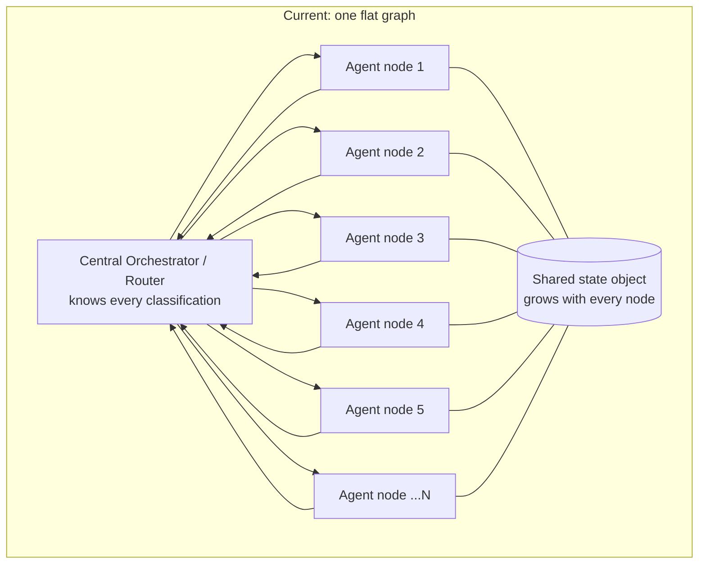

# 6.1 Why the Mega-Graph Stops Scaling

Part of [[6-correcting-the-current-langgraph-architecture|6. Correcting the Current LangGraph Architecture]].

Five specific failure mechanisms, in the order they usually bite:

1. **The router prompt grows with N.** Every new capability adds another classification the router must describe and disambiguate. Router accuracy degrades exactly where it hurts most, because a routing error wastes an entire downstream trajectory. This is the layer-5 tax being paid on decisions that mostly belong at layer 3 or 4 ([[ADR-013]]).
2. **Shared state becomes shared contamination.** One state object threaded through every node means each node sees residue from nodes it has nothing to do with. This is the opposite of the property that actually makes multi-agent work: context isolation, not persona ([[P5]]).
3. **Prompt prefixes multiply and destabilize.** Each node has its own system prompt, and the shared state that gets injected into it changes per hop. You end up with many distinct, unstable prefixes — the worst case for KV-cache reuse, and input tokens are where nearly all the cost is ([[ADR-004]]).
4. **Nodes are thin, and most of them are procedures wearing a topology costume.** Most nodes in a graph like this are one model call that classifies, reformats, or walks through a fixed sequence of steps. Each costs a full request, a prefix, latency, and a failure mode. A classifier node should not be a node at all — classification is one call at the edge ([[ADR-013]]). A fixed sequence of steps over existing tools is **a skill** ([[ADR-002b]]) — a markdown file with eval cases, not a node. The graph grew because there was no third option; now there is.
5. **Failure domains are not isolated even though the diagram looks modular.** A node in the same process with the same state and the same tool access shares blast radius with every other node. Visual modularity is not operational isolation.

The deeper diagnosis: reaching for a bigger graph is reaching for the outermost layer of the stack to fix a problem in an inner layer. Growing classification branches is usually a symptom that the **harness** (tools, memory, feedback quality) is too weak for the agent to find its own route, so humans encode the route as edges instead.
