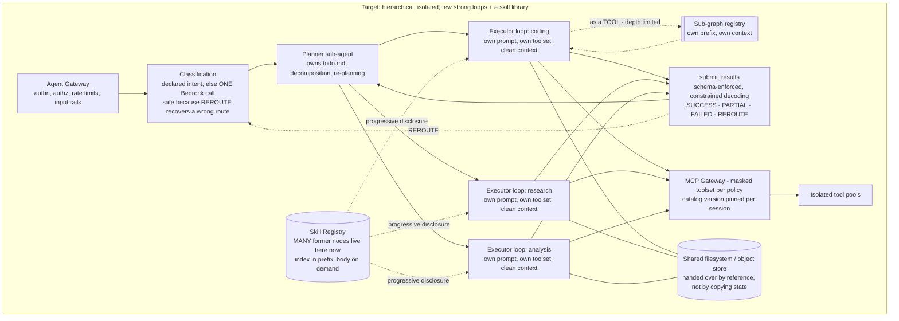

# 6.2 The Corrected Shape

Part of [[6-correcting-the-current-langgraph-architecture|6. Correcting the Current LangGraph Architecture]].

What changed, and why each change addresses a mechanism above:

| Change | Fixes |
| --- | --- |
| Classification leaves the graph entirely: one Bedrock call at the edge (or a free declared-intent short-circuit), with `REROUTE` as the recovery path ([[ADR-013]]) | Mechanism 1 — routing is no longer a node every request traverses, and the router prompt no longer grows an arm per classification. Note it does **not** fix "routing improves from traffic"; the simplified design deliberately gives that up |
| Each executor is a LangGraph loop with its **own** context window; handoffs are minimal instructions (simple) or trajectory + filesystem handle (complex) | Mechanism 2 — no shared state contamination |
| One stable prefix per agent type, append-only tail, tool definitions and skill index pinned per session and never mutated within it | Mechanism 3 — cache actually hits |
| **Thin procedural nodes become SKILLS** — markdown + eval cases, index in the prefix, body loaded on demand ([[ADR-002b]]) | Mechanism 4 — and this is the largest single collapse: many nodes stop being topology entirely |
| Remaining thin nodes collapsed into fewer, stronger loops with better tools | Mechanism 4 — fewer calls, fewer prefixes |
| Tools moved behind an MCP gateway into per-domain pools with their own breakers and network policies | Mechanism 5 — real failure isolation |
| Genuine topology needs become **sub-graphs invoked as tools**, with their own prefix and context and a depth limit of 2 ([[§2.12]].1) | Mechanism 5 — isolation *and* a parent graph that stops growing |
| Planner owns bookkeeping so executors spend their actions on the task | The ~1/3-of-actions-on-bookkeeping problem ([[ADR-002]]) |
| Retry is **scoped**: verbatim error for a step retry, distilled lesson for a fresh task attempt, summary for a re-plan ([[§2.13]]) | A failure mode the first draft of this design got wrong — attempts no longer inherit the previous attempt's wreckage |

**Skills change the shape of the migration, not just its size.** The earlier version of [[§6]] offered node-holders two destinations: keep the node, or collapse it into a loop. "Collapse into a loop" is a hard sell when the node encodes a real procedure someone depends on — it sounds like deleting the procedure. Skills give a third, much easier destination: **the procedure becomes a file.** It keeps its identity, keeps its name, gains its own version history and its own eval cases, and stops costing a model call, a prompt prefix, and a graph edge. That is a materially better migration story, and it is where a large share of the current classifier and thin procedural nodes should land.

**Keep LangGraph.** It remains the execution substrate for each loop, and it is genuinely good at the things a graph is for: durable checkpointing, interrupts for human-in-the-loop, and auditable state transitions. The change is scope — many small graphs at the sub-agent level, not one graph that is the whole platform.
