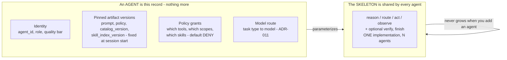
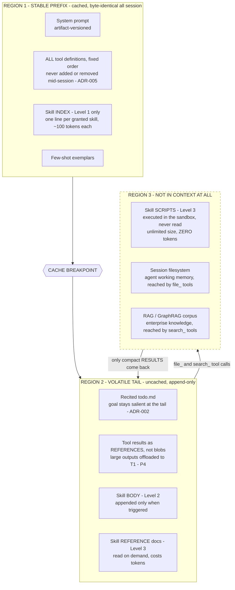
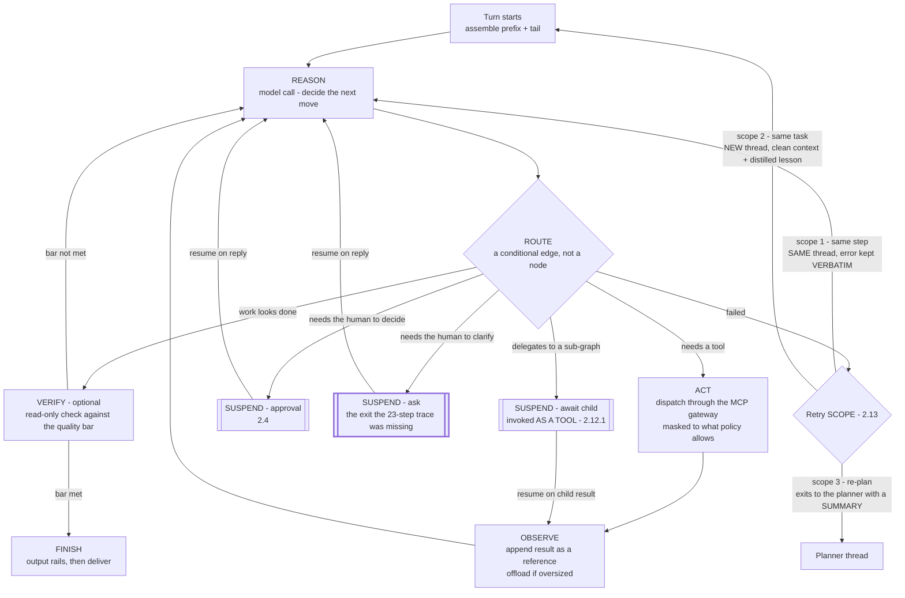
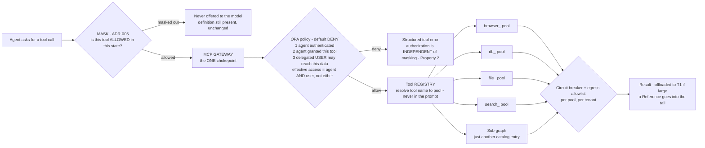
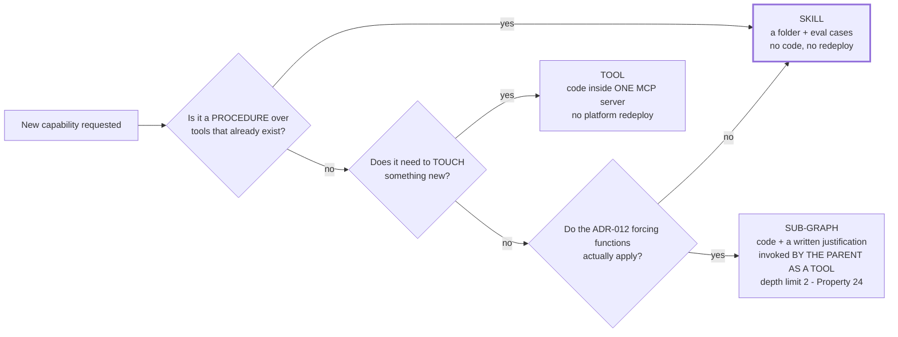

# The Anatomy of an Agent (read this before [[§2.1]])

Part of [[architecture|Architecture]].

The rest of this document is organized by *decision*, which is the right shape for review and the wrong shape for a first read. This subsection is the first read: **what an agent is, what a skill is, how either gets loaded, how execution actually runs, and where tools sit** — five things in the order they depend on each other.

One sentence per layer, and the ordering is the point:

| Layer | What it is | What it costs to add one |
| --- | --- | --- |
| **1 · Agent** | A **configuration record**, not a class. An identity, a set of pinned artifact versions, a policy grant, and a model route. | A config record and eval cases |
| **2 · Skill** | A **procedure** over tools that already exist. Markdown plus eval cases. | A folder — no code, no redeploy ([[ADR-002b]]) |
| **3 · Loading** | What of the above is **allowed into the context window**, in which region, at what token cost. | Nothing — it is a consequence of 1 and 2 |
| **4 · Execution** | A small **typed-node loop** that every agent shares. Nodes are machinery; agents are configuration. | Nothing — you do not add nodes to add an agent |
| **5 · Tool** | A **new way to touch the outside world**. Code, inside one MCP server. | Code in an MCP server ([[§3.8]]) |

The load-bearing claim, and the one everything else in this document is arranged to protect: **layers 1, 2 and 3 scale without touching layer 4.** Adding the hundredth agent and the fiftieth skill does not add a node, an edge, or a branch. That is what [[ADR-001]], [[ADR-012]] and [[ADR-002b]] are collectively buying.

#### 1 · What an agent *is*

Not a subclass and not a graph. An agent is a **record that parameterizes the shared skeleton** — which is why the platform has a handful of nodes rather than one node per agent.

Two consequences that are easy to miss:

- **A "planner" and an "executor" are the same machinery with different records** ([[ADR-002]]). The planner's record grants planning tools and a decomposition prompt; the executor's grants task tools. Neither is a distinct code path.
- **A sub-agent is invoked as a tool, not as a topology edge** ([[§2.12]].1). From the caller's side there is no difference between calling `db_query` and calling a whole sub-graph. This is what keeps the caller's graph constant.

> **Status: agreed in review, ADR pending.** The four-node skeleton and the `AgentSpec` record above were settled in design review but do not yet have their own ADR, and the state schema is still open. Listed in the open items at the end of this subsection so it is not mistaken for a closed decision.

#### 2 · What a skill *is*, and what it is not

The full table is in [[ADR-002b]]; the one-line version is the line that matters: **a skill is procedural knowledge over tools that already exist; a tool is the ability to touch something new.** Handling a refund dispute is a skill. Reaching the payments API is a tool.

Get this line wrong in either direction and one of two failures follows. Call a skill a tool and you write code for something a markdown file does. Call a tool a skill and you write prose instructing a model to do I/O it has no capability for, which fails at load (`required_tools` must resolve in the pinned catalog).

#### 3 · Loading — the three regions, and what each costs

This is the layer with the money in it. Everything the model can see lands in exactly one of three regions, and the region determines the cost, not the content.

Three rules govern the diagram, and each has a property behind it:

- **Region 1 is byte-stable within a session** ([[P2]], [[Property 4]]). No timestamps, no reordering, no mid-session tool changes. Capability is gated by **masking**, not by mutating the catalog ([[ADR-005]], [[Property 5]]).
- **Region 2 is append-only** ([[Property 6]]). Compaction *appends a cut point*; it never rewrites ([[§3.1]].11).
- **Region 3 is where scale lives.** Working memory and knowledge retrieval are **different subsystems** and are never merged ([[P11]]) — one is the agent's scratch space, the other is the enterprise corpus.

#### 4 · Execution — one loop, four nodes, five ways out

Every agent runs the same loop. What differs per agent is the record from step 1, not the topology.

Four things this diagram is trying to make unmissable:

1. **`route` is an edge, not a node.** It branches and holds no state. Anything that never branches and is deterministic from state is not a node — `assemble` fails that test, which is why it is not drawn as one.
2. **The three retry scopes are *thread* boundaries, not node boundaries** ([[P6]], [[§2.13]]). Scope 2's clean context is not something a node does; it is what a *new thread* is. [[Property 23]] is what enforces that a re-attempt carries a lesson rather than the wreckage.
3. **All three delegating exits are the same primitive: suspend.** Approval, clarification, and awaiting a child are one mechanism with three triggers. Getting this wrong is how you get **executor slot starvation** — a parent holding a worker slot while blocking on a child that needs a free slot to run. Suspension releases the slot; blocking does not.
4. **The `ask` exit was a genuine hole.** The end-to-end trace in [[§3.4]] ran 23 steps with no path for the agent to ask a question back, which is not a plausible customer-facing agent. It is drawn bold because it was found by review rather than by design.

#### 5 · Tools — one catalog, one gateway, isolated pools

Tools are the only layer that costs code, and the layer with the strictest containment.

The naming convention is not cosmetic: consistent prefixes (`browser_*`, `db_*`, `file_*`, `search_*`) mean **a whole family masks with one prefix** ([[P3]]), and the core toolset stays small — roughly under twenty atomic tools — because a large flat catalog is prefix bloat by the same arithmetic as a large skill index.

#### The extension ladder, which is the summary of all five

When someone asks for a new capability, try these **in order** and stop at the first that works ([[P15]], [[§2.12]]):

The bold box is where the overwhelming majority of requests should land. A design where most new capability arrives as a sub-graph has regressed to the mega-graph [[§6]] exists to correct.

#### Open items in this subsection

Recorded rather than glossed, because they are the parts a reader would otherwise assume are settled:

- **The typed-node skeleton has no ADR yet.** The four-node structure and the `AgentSpec` record are agreed; the ADR is not written.
- **The state schema is undecided** — what exactly travels between nodes.
- **Whether the planner shares the skeleton** or is deliberately different is open.
- **Prebuilt LangGraph components vs hand-rolled nodes** is undecided. The constraint is fixed (stay on LangGraph primitives; nothing that assembles prompts on our behalf), the choice within it is not.
- **The sub-graph lifecycle state machine** (spawn, run, return, orphan, reap) and the full set of deadlock classes are sketched in [[§2.12]].1 but not yet written as a state machine with properties attached.
