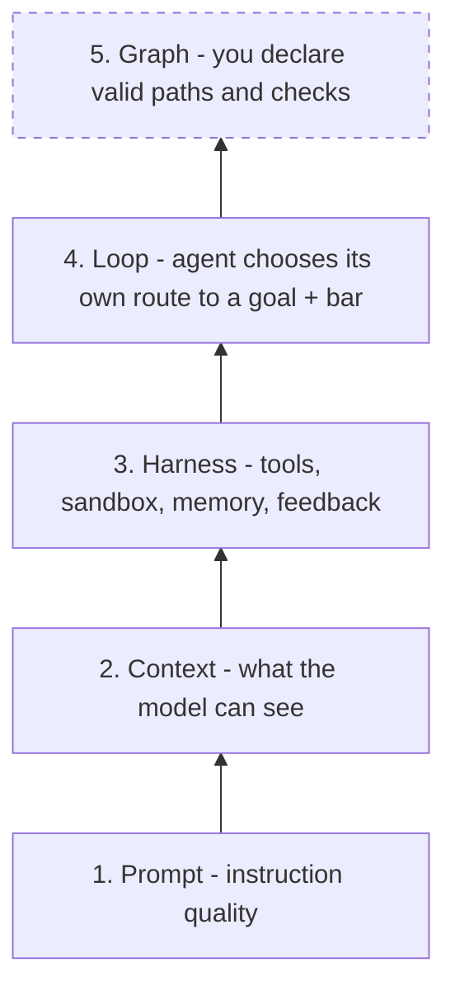

# The Five-Layer Cumulative Stack

Part of [[overview|Overview]].

Capability is added in this order, and each layer is only reached after the one below it is exhausted:

The graph layer is the **outermost** layer and the **last** one to reach for ([[P9]]). Most scaling pain that looks like "we need a bigger graph" is actually a harness or context problem one or two layers down. A useful diagnostic from the Manus write-up: swap in a stronger model — if results do not improve, the bottleneck is the harness, not the model or the topology.
